# 주요 영향 요인 시각화
주요 영향 요인을 visual 요소를 해당 드라이브에 관심이 있다면 메트릭 이해 하도록 도와줍니다. 데이터를 분석하고 중요한 요소의 순위를 정하며 이를 주요 요인으로 표시합니다. 예를 들어,는 직원 전직 률 라고도 변동 어떤 영향을 파악 하려고 합니다. 1 단계 고용 계약 길이 고 또 다른 요인은 직원의 나이 수 있습니다. 
 
## 주요 영향 요인을 사용 하는 경우 
주요 영향 요인을 시각적 개체는 탁월한 선택 하려는 경우: 
- 주는 요인을 분석 하는 메트릭을 영향을 참조 하세요.
- 이러한 요인의 상대적 중요도 대조해 보세요. 예를 들어 단기 계약은 장기 계약보다 변동에 더 큰 영향을 주나요? 

## 주요 영향 요인 요구 사항 
분석할 메트릭을 범주 또는 숫자 필드 여야 합니다 (집계 및 측정값 아직 지원 되지 않습니다).

## 주요 영향 요인 visual의 기능

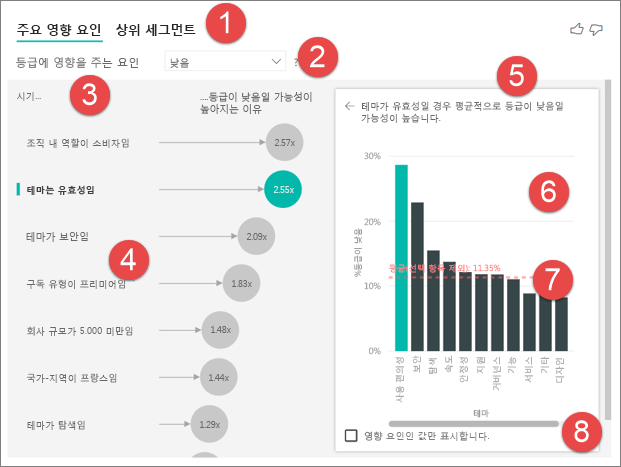

1. **탭**: 보기 간 전환을 하려면 탭을 선택 합니다. **주요 영향 요인을** 선택한 메트릭 값으로 최고의 기여자를 보여 줍니다. **세그먼트를 상위** 선택한 메트릭 값에 영향을 주는 상위 세그먼트를 보여 줍니다. *세그먼트*는 값의 조합으로 구성되어 있습니다. 예를 들어, 하나의 세그먼트 적어도 20 년 동안 고객이 되었습니다 및 서 부 지역에 거주 하는 소비자를 수 있습니다. 

2. **드롭다운 목록 상자**: 조사 중인 메트릭의 값입니다. 이 예제에서는 메트릭을 살펴봅니다 **등급**합니다. 선택한 값이 **낮은**합니다.

3. **재작성**: 왼쪽된 창에서 시각적 개체를 해석할 수 있습니다.

4. **왼쪽된 창**: 왼쪽된 창 하나의 시각적 개체를 포함 합니다. 이 경우 왼쪽된 창에는 주요 영향 요인의 상위 목록을 보여 줍니다.

5. **재작성**: 오른쪽 창에서 시각적 개체를 해석할 수 있습니다.

6. **오른쪽 창**: 오른쪽 창 하나의 시각적 개체를 포함 합니다. 세로 막대형 차트 키 영향력에 대 한 모든 값을 표시 하는 예에서 **테마** 에 왼쪽된 창에서 선택한 합니다. 특정 한 값 **유용성** 왼쪽된 창에서 녹색으로 표시 됩니다. 에 대 한 다른 모든 값 **테마** 검은색으로 표시 됩니다.

7. **평균 선**: 에 대 한 다른 모든 가능한 값의 평균을 계산 **테마** 제외한 **유용성**합니다. 따라서 계산은 검정색의 모든 값에 적용됩니다. 다른 비율도 알 **테마** 낮은 등급을 제공 합니다. 즉, 등급을 고객에 의해 지정 되 면 해당 고객의 등급에 대 한 테마를 이유도 설명 합니다. 일부 테마 사용 편의성, 속도 및 보안 됩니다. 

   **테마는 유용성** 왼쪽된 창에서 시각적 개체에 따라 낮은 등급을 두 번째로 높은 키 누구 됩니다. 다른 모든 테마 및의 등급에 대 한 해당 기여를 평균 하는 경우 **낮은**를 빨간색으로 표시 된 결과 얻을 수 있습니다. 모든 다른 테마 지정 11.35%만는 보다 높은 **유용성**합니다.

8. **확인란**: **값은 영향 요인을 표시**합니다.

## 주요 영향 요인 시각적 개체 만들기 
 
주요 영향 요인을 시각적 개체 만들기 하는 방법을 알아보려면이 비디오를 시청 하세요. 그런 다음 만들려면 다음이 단계를 수행 합니다. 

<iframe width="560" height="315" src="https://www.youtube.com/embed/fDb5zZ3xmxU" frameborder="0" allow="accelerometer; autoplay; encrypted-media; gyroscope; picture-in-picture" allowfullscreen></iframe>

제품 관리자가 클라우드 서비스에 대 한 음수 검토를 잠재 고객을 고려 하는 파악할 수 있습니다. 계속 진행하려면 Power BI Desktop에서 [고객 피드백 .PBIX 파일](https://github.com/Microsoft/powerbi-desktop-samples/blob/master/2019/customerfeedback.pbix)을 엽니다. 다운로드할 수도 있습니다는 [Power BI 서비스 또는 Power BI Desktop에 대 한 고객 피드백 Excel 파일](https://github.com/Microsoft/powerbi-desktop-samples/blob/master/2019/customerfeedback.xlsx)합니다. 

> [!NOTE]
> 고객 의견 데이터 집합에서 [Moro et al, 2014] 기반 S. Moro 고 P. Cortez, P. Rita입니다. "는 데이터 기반 접근 방식을 은행 텔 레 마케팅의 성공 여부를 예측 합니다." *지원 시스템 의사 결정*, Elsevier, 62:22-31, 2014 년 6 월. 

1. 보고서를 열고 선택 합니다 **주요 영향 요인을** 아이콘입니다. 

    

2. 조사 하려는 메트릭을 이동 합니다 **분석** 필드입니다. 합니다 **분석** 필드는 범주 또는 있습니다. noncontinuous, 변수를 지원 합니다. 고객을 이끄는 보려는 낮은 서비스 등급 선택 **Customer 테이블** > **등급**합니다. 
3. 영향을 줄 수를 생각 하는 이동 필드 **등급** 에 **에서 설명** 필드입니다. 원하는 만큼 필드를 이동할 수 있습니다. 이 경우 시작 합니다.
    - 국가-지역 
    - 조직 내 역할 
    - 구독 유형 
    - 회사 규모 
    - 테마 
1. 음수 등급에 초점을 선택 **낮은** 에 **등급 수에 영향을 줄** 드롭다운 목록 상자입니다.  

    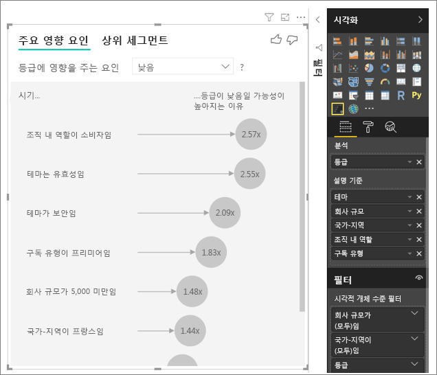

분석 분석 되는 필드의 테이블 수준에서 실행 됩니다. 이 경우에 **등급** 메트릭. 이 메트릭은 고객 수준에서 정의 됩니다. 각 고객 고득점 또는 낮은 점수를 제공 했습니다. 요소를 설명 하도록 시각적 개체에 대 한 고객 수준에서 정의 해야 사용할 합니다. 

이전 예에서 일 또는 메트릭이 포함 된 다 대 일 관계가 모든 요소를 설명 합니다. 이 경우 각 점수 연관 하나만 테마를 있습니다. 이 테마 고객 검토의 주요 테마는 했습니다. 마찬가지로, 하나의 멤버 자격 유형으로 있고 조직에서 하나의 역할만 수행 한 국가에서 고객에 게 제공 됩니다. 설명 요소는 이미 고객의 특성 및 변환 하지 않고도 필요 합니다. 시각적 개체를 즉시 사용을 가능 합니다. 

자습서의 뒷부분에 나오는 보면에 일 대 다 관계에 있는 더 복잡 한 예제입니다. 이러한 경우에 열을 먼저 집계 고객 수준까지 분석을 실행할 수 있습니다. 

측정값 및 설명 요소는 또한 테이블 수준에서 계산 되는 데 사용 되는 집계를 **분석** 메트릭. 몇 가지 예는이 문서의 뒷부분에 표시 됩니다. 

## 주요 영향 요인을 범주를 해석 합니다. 
낮은 등급에 대 한 주요 영향 요인에 살펴보겠습니다. 

### 낮은 등급의 가능성에 영향을 주는 단일 최상위 요소

이 예제에서는 조직에는 세 가지 역할이 있습니다.: 소비자, 관리자 및 게시자입니다. 소비자는 낮은 등급에 영향을 주는 상위 요소입니다. 

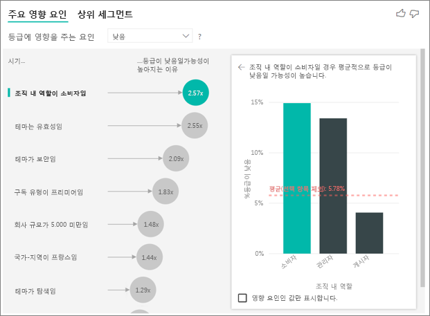

보다 정확 하 게 소비자 가능성이 2.57 시간 서비스 음수 점수를 지정 합니다. 주요 영향 요인의 목록이 차트 **조직에는 역할은 소비자** 왼쪽 목록에서 첫 번째입니다. 선택 하 여 **조직에는 역할은 소비자**, Power BI 오른쪽 창에서 추가 세부 정보를 표시 합니다. 각 역할의 비교 미치는 가능성 낮은 등급을 표시 됩니다.
  
- 소비자 14.93% 낮은 점수를 제공합니다. 
- 평균적으로 다른 모든 역할 5.78%의 시간 동안 낮은 점수를 제공합니다.
- 소비자 2.57 배 더 가능성이 다른 모든 역할에 비해 낮은 점수를 제공 합니다. 녹색 막대는 빨간색 점선으로 나누어이 확인할 수 있습니다. 

### 낮은 등급의 가능성에 영향을 주는 두 번째 단일 요소

Visual 주요 영향 요인을 비교 하 고 여러 다른 변수에서 요인의 순위를 지정 합니다. 두 번째 영향력에 관련이 **조직에서 역할**입니다. 두 번째 누구 인 목록에서 선택 **테마는 유용성**합니다. 

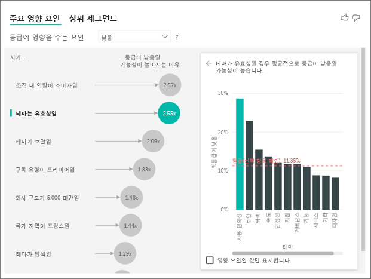

두 번째 가장 중요 한 요소는 고객의 검토의 테마 관련이 있습니다. 제품의 사용 가능성에 대 한 주석으로 처리 하는 고객 안정성, 디자인 또는 속도 같은 다른 테마에서 주석으로 처리 하는 고객에 비해 낮은 점수를 부여 하려면 2.55 배 더 가능성이 있었습니다. 

시각적 개체 간에 빨간색 점선으로 표시 되는 평균 5.78%에서 11.34%로 변경 합니다. 다른 모든 값의 평균을 기반으로 하므로 평균은 동적입니다. 첫 번째 누구에 대 한 평균 고객 역할을 제외 합니다. 두 번째 누구 유용성 테마 제외 된 합니다. 
 
선택 된 **영향 요인 값만 표시** 영향력 값만을 사용 하 여 필터링 하려면 확인란 합니다. 이 경우 낮은 점수를 구동 하는 역할 일입니다. 12 개의 테마 낮은 등급을 구동 하는 테마로 식별 된 Power BI는 네 가지도 세분화 됩니다. 

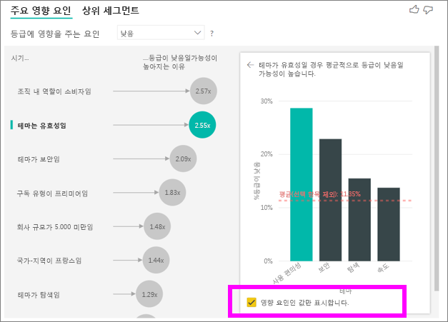

## 다른 시각적 개체 상호 작용 
 
슬라이서, 필터 또는 캔버스의 다른 시각적 개체를 선택할 때마다 visual 주요 영향 요인 분석 데이터의 새 부분에 다시 실행 합니다. 예를 들어, 이동할 수 있습니다 **회사의 규모** 보고서를 슬라이서로 사용 합니다. 사용 하 여 기업 고객에 대 한 주요 영향 요인의 보다 일반적인 모집단 서로 참조 하세요. Enterprise 회사의 규모는 50,000 직원 보다 큽니다.
 
선택 **> 50,000** 줄어들어 분석 하 고이 영향 요인의 변경 하는 것을 확인할 수 있습니다. 많은 엔터프라이즈 고객에 게 낮은 등급에 대 한 상위 누구 보안과 관련 된 테마를 있습니다. 많은 고객에 대 한 만족 스 럽 지는 특정 보안 기능이 있는 경우를 볼 조사 하려는. 

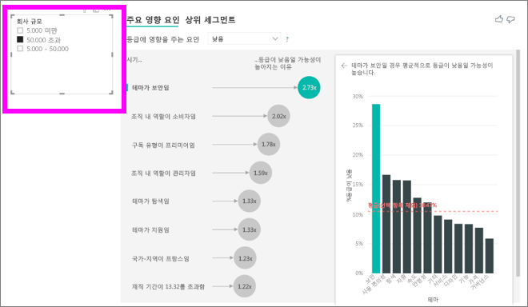

## 주요 영향 요인을 연속 해석 
 
지금까지 시각적 개체를 사용 하 여 다양 한 범주 필드를 탐색 하는 방법을 살펴봤습니다 낮은 등급에 영향을 줄. 보존 기간, 높이 및 가격 등의 연속 요소를 가질 수 이기도 합니다 **에서 설명** 필드입니다. 어떤 일이 생기 살펴보겠습니다 때 **재직** 에 customer 테이블에서 이동 **에서 설명**합니다. 재직 기간 고객을 보여 줍니다. 서비스를 사용 했습니다. 
 
재직 기간 증가, 더 낮은 등급을 받을 가능성도 증가 합니다. 이 추세 장기적인 고객 가능성이 음수 점수를 제공 하는 것을 제안 합니다. 이 정보는 흥미 고 다른 하나는 나중 수행 하는 것이 좋습니다. 
 
시각화 될 때마다 13.44 월 재직 기간 이동, 평균 가능성 낮은 등급을 증가 함을 1.23 시간별으로 보여 줍니다. 이 경우 13.44개월은 재직 기간의 표준 편차를 나타냅니다. 받게 insight 방법을 살펴봅니다 되므로 낮은 등급을 받는 가능성에 영향을 줍니다 재직 재직의 표준 편차를 표준 양만큼 증가 합니다. 
 
오른쪽 창에 산 점도 재직의 각 값에 대 한 낮은 등급의 평균 백분율을 그립니다. 기울기 추세 선 사용 하 여 강조 표시 합니다.

## 주요 영향 요인으로 측정값 및 집계를 해석 
 
분석 내부 설명 요소로 측정값 및 집계를 사용할 수 있습니다. 예를 들어, 다음 받게 고객 지원 티켓의 개수 또는 평균 기간을 열려 있는 티켓 점수에 어떤 영향을 볼 수는 것이 좋습니다. 
 
이 경우 고객에 게는 지원 티켓 번호를 제공 하는 점수에 영향을 줍니다 경우 참조 하려고 합니다. 이제가지고 **지원 티켓 ID** 지원 티켓 테이블에서. 고객 지원 티켓을 여러 개를 가질 수 있으므로 고객 수준으로 ID를 집계 합니다. 집계는 모든 드라이버 세분성 수준에서 정의 해야 하므로 고객 수준에서 실행 되는 분석 되기 때문에 중요 합니다. 
 
Id의 수를 살펴 보겠습니다. 각 고객 행에 연결 된 지원 티켓 수 있습니다. 이 경우 지원 티켓 증가 하는 경우의 개수로 되는 등급의 가능성 낮음 5.51 시간 이동합니다. 다른 지원 티켓의 평균 수를 표시 하는 오른쪽에 있는 시각적 개체 **등급** 고객 수준에서 계산한 값입니다. 

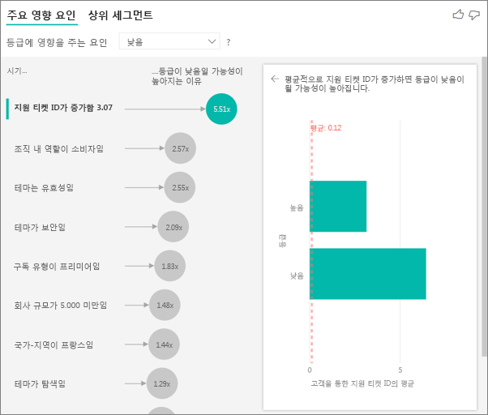

## 결과 해석 합니다. 상위 세그먼트 
 
사용할 수는 **주요 영향 요인을** 각 요소를 개별적으로 평가 하는 탭 합니다. 사용할 수도 있습니다는 **세그먼트를 상위** 요소의 조합 하는 분석 하려는 메트릭을 미치는 영향을 탭 합니다. 
 
위 세그먼트는 처음에 Power BI에서 검색 된 모든 세그먼트의 개요를 보여 줍니다. 다음 예제에서는 6 개의 세그먼트를 찾을 수 있는지 보여 줍니다. 이러한 세그먼트는 세그먼트 내의 낮은 등급 비율 순위가 지정 됩니다. 1, 세그먼트에는 예를 들어 하위에 있는 74.3% 고객 등급에 있습니다. 거품이 클수록 낮은 등급 비율이 높습니다. 거품의 크기로 세그먼트 내에 얼마나 많은 고객을 나타냅니다. 

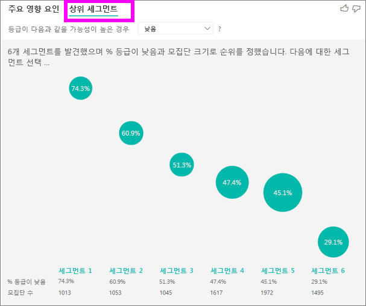

거품을 선택하면 해당 세그먼트의 세부 정보가 표시됩니다. 세그먼트 1을 선택 하면 예를 들어 찾아야는 구성 되어 있으므로 상대적으로 설정 된 고객. 개체 29 개월 동안 고객이 되었습니다 않으며 개 지원 티켓을 제공 합니다. 마지막으로 없는 것 이므로 게시자의 경우 소비자 또는 관리자가 있으므로. 
 
이 그룹에 고객의 74.3% 낮은 등급을 제공 했습니다. 평균 고객이이 세그먼트에 낮은 등급의 큰 부분을 차지 하므로 11.7%의 시간, 등급 낮은 수 있었습니다. 63 퍼센트 더 높은 것입니다. 세그먼트 1 모집단의 주소 지정이 가능한 부분을 나타내는 되므로 데이터의 약 2.2%도 포함 되어 있습니다. 

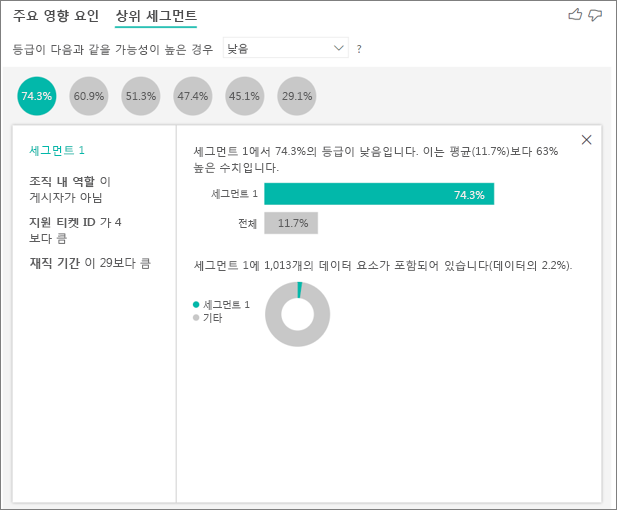

## 숫자 데이터를 사용 하 여 작업

숫자 필드를 이동 하는 경우는 **분석** 필드를 선택할 수 있습니다이 시나리오를 처리 하는 방법입니다. 로 이동 하 여 시각적 개체의 동작을 변경할 수는 **서식 지정 창** 전환 하 고 **범주 Analysis 형식** 및 **연속 분석 유형을**합니다.

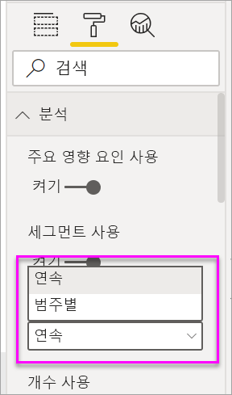

A **범주 분석 유형을** 위에서 설명한 것 처럼 동작 합니다. 예를 들어 1에서 10 까지의 설문 조사 점수, 확인 된 경우 질문할 수 있습니다 '영향을 줄 1로 설문 조사 점수?'

A **연속 분석 유형을** 연속으로 질문을 변경 합니다. 위의 예제에서는 새 질문은 '설문 조사 점수 증가/감소에 어떤 영향?'

이 구분 분석 하는 필드 고유 값 많이 있는 경우에 매우 유용 합니다. 아래 예제에서는 주택 가격에 살펴봅니다. '영향을 줄 주택 가격을 156,214?'에 게 그다지 의미가 아닙니다. 매우이 고 특정 패턴을 유추 하도록 충분 한 데이터가 가능성이 높습니다.

대신 하려는 경우 요청에서 '무엇을 늘리려면 주택 가격 영향'? 속성을 사용 하면 주택 가격 고유 값이 아닌 범위를 처리할 수 있습니다.

## 결과 해석 합니다. 주요 영향 요인 

이 시나리오에서 '무엇을 늘리려면 주택 가격 영향'에 대해 살펴봅니다. 살펴보고 있는 같은 집 가격에 영향을 줄 수 있는 설명 요소 수가 **연도 빌드된** (집 빌드된 연도), **KitchenQual** (주방 품질) 및 **YearRemodAdd** (집 리 모델링 되었을 년)입니다. 

아래 예제에서는 주방 품질 뛰어납니다 되는 우리의 상위 영향력에 살펴봅니다. 결과 매우 비슷한 몇 가지 중요 한 차이점을 사용 하 여 범주 메트릭 분석 된 것에 대해 살펴보았습니다.

- 세로 막대형 차트를 오른쪽은 백분율 보다는 평균을 찾습니다. 따라서 표시 우리는 뛰어난 주방을 사용 하 여 집의 평균 주택 가격 이란 막대 (녹색)는 뛰어난 주방 (점선) 없이 집의 평균 주택 가격에 비해
- 거품의 번호는 녹색 막대가 빨간색 점선 간의 차이점도 있지만 숫자로 표현 됩니다 ($158.49 K) 가능성을 하는 대신 (1.93 x). 평균 등에, 뛰어난 사용을 사용 하 여는 거의 $160 K 뛰어난 사용 하지 않고는 보다 더 비쌉니다.

아래 예제에서는 우리가 보고 있는 영향에 연속 요소 (집 리 모델링 되었을 년) 주택 가격에 있습니다. 범주 메트릭에 대 한 연속 영향 요인 분석 하는 방법에 비해 차이점은 다음과 같습니다.

-   오른쪽 창에 산 점도 리 모델링 하는 연도의 각 고유 값의 평균 주택 가격을 그립니다. 
-   거품 값 가격 증가 얼마나 평균 집으로 보여 줍니다 (이 경우 $2.87 k) 집 된 연도 증가 표준 편차 (이 경우 20 년) 하 여 리 모델링

마지막으로, 평균 연도 지금 보고 있는 측정값의 경우 집 구축 되었습니다. 여기에 분석은 다음과 같습니다.

-   오른쪽 창에 산 점도 테이블의 각 고유 값의 평균 주택 가격 표시
-   거품 값 가격 증가 얼마나 평균 집으로 보여 줍니다 (이 경우 $1.35 K) 평균 연도 해당 표준 편차 (이 경우 30 년)에서 증가 하는 경우

## 결과 해석 합니다. 위 세그먼트

위 세그먼트 숫자 대상 그룹 표시 집 평균 가격에 대 한는 전체 데이터 집합 보다 높습니다. 예를 들어, 아래 확인할 수 있는 **세그먼트 1** 주택의 이루어집니다 위치 **GarageCars** (자동차는 차고 들어가는 개수) 2 보다 큽니다. 및 **RoofStyle** Hip는 합니다. 이러한 특성을 사용 하 여는 경우는 평균 가격의 $355 K $180 K 하는 데이터의 전체 평균 비교

## 고려 사항 및 문제 해결 
 
**미리 보기에 대 한 제한 사항은 무엇입니까?** 
 
주요 영향 요인을 visual 현재 공개 미리 보기로 제공에서 되며 몇 가지 제한 사항이 합니다. 현재 사용할 수 없는 기능은 다음과 같습니다. 
- 측정값 또는 집계 된 메트릭을 분석 합니다.
- Power BI Embedded에서 시각적 개체를 사용 합니다.
- Power BI 모바일 앱에서 시각적 개체를 사용 합니다.
- RLS를 지원합니다.
- 직접 쿼리 지원 합니다.
- 라이브 연결 지원 합니다.

**세그먼트 없거나 영향 요인 발견 된 오류가 표시 됩니다. 왜 그런가요?** 

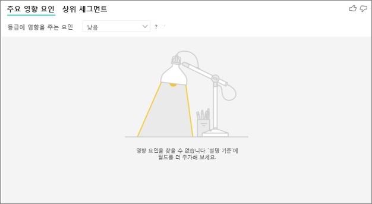

필드를 포함 하는 경우이 오류가 발생 **에서 설명** 하지만 없습니다 영향 요인 찾을 수 없습니다. 
- 분석 된 메트릭 모두에 포함 된 **분석** 하 고 **에서 설명**합니다. 제거할 **에서 설명**합니다. 
- 설명 필드에는 관찰이 거의 없는 너무 많은 범주가 있습니다. 이 이런은 요인은 영향 요인을 확인 하는 데 시각화를 어렵게 합니다. 몇 가지 관찰만 기반을 일반화 하는 것이 어렵습니다. 전환 하려는 숫자 필드를 분석 하는 경우 **범주 Analysis** 에 **연속 분석** 에 **서식 지정 창** 아래를  **분석** 카드.
- 설명에 요소를 일반화 하려면 충분 한 관찰 갖지만 시각화는 보고서에 의미 있는 상관 관계를 찾지 못했습니다.
 
**메트릭을 분석 하 고는 분석을 실행할 충분 한 데이터가 없는 오류가 발생 하는 합니다. 왜 그런가요?** 

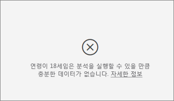

시각화를 다른 그룹에 비해 하나의 그룹에 대 한 데이터의 패턴을 확인 하 여 작동 합니다. 예를 들어, 고객에 게 높은 등급을 제공 하는 고객에 비해 낮은 등급을 지정한를 찾습니다. 모델의 데이터는 몇 가지 관찰만 있으면 패턴은 찾기 어렵습니다. 시각화 충분 한 데이터에서 의미 있는 영향 요인에 없는 경우 더 많은 데이터를 분석을 실행 하려면 필요 함을 나타냅니다. 

선택된 된 상태에 대 한 100 개 이상의 관찰 해야 하는 것이 좋습니다. 이 경우 상태가 변동 하는 고객입니다. 또한 비교를 사용 하면 상태에 대 한 최소 10 개의 관찰을 해야 합니다. 이 경우 비교 상태가 고객 이탈 하지 않습니다.

전환 하려는 숫자 필드를 분석 하는 경우 **범주 Analysis** 에 **연속 분석** 에 **서식 지정 창** 아래를  **분석** 카드.

**오류가 표시 됩니다.는 필드에 *에서 설명* 고유 하 게 분석 하 고 메트릭이 포함 된 테이블에 관련 되지 않습니다. 왜 그런가요?**
 
분석 분석 되는 필드의 테이블 수준에서 실행 됩니다. 예를 들어, 서비스에 대 한 의견을 분석할 경우 고객의 높은 등급 또는 낮은 등급을 지정한 여부를 알려 주는 있는 테이블이 있다고 합니다. 이 경우 분석 고객 테이블 수준에서 실행 중입니다. 

메트릭을 포함 하는 테이블 보다 더 세부적인 수준에서 정의 된 관련된 테이블을 해야 하는 경우이 오류가 표시 됩니다. 예제는 다음과 같습니다. 
 
- 서비스의 낮은 등급을 제공 하는 고객을 이끄는 분석할 수 있습니다.
- 고객은 서비스를 사용 하는 장치 영향을 제공 하 게 검토 하는 경우 참조 하려고 합니다.
- 고객은 여러 가지에서 서비스를 사용할 수 있습니다.
- 다음 예제에서는 10000000 고객 서비스와 상호 작용 하는 브라우저와 태블릿을 사용 합니다.

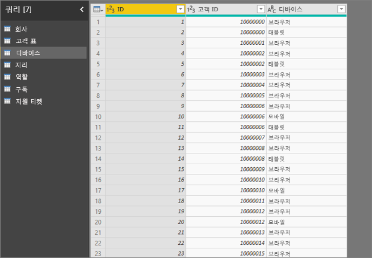

장치 열 설명 요소로 사용 하려고 하면 다음 오류가 표시 됩니다. 

이 오류는 장치는 고객 수준에서 정의 되어 있지 않은 때문에 나타납니다. 한 명의 고객이 여러 장치에서 서비스를 사용할 수 있습니다. 패턴을 찾는 시각화에 대 한 장치는 고객의 특성 이어야 합니다. 비즈니스 이해에 종속 된 솔루션을 몇 가지 있습니다. 
 
- 장치 개수를 요약을 변경할 수 있습니다. 장치 수에는 고객을 제공 하는 점수를 영향을 줄 수 있는 경우에 예를 들어, 수를 사용 합니다. 
- 장치 열 경우 특정 장치에서 서비스 사용에 영향을 줍니다 고객의 등급을 피벗할 수 있습니다.
 
이 예제에서는 데이터를 모바일 브라우저에 대 한 새 열을 만들고 태블릿 피벗 했습니다. 이제이 특정 장치에서 사용할 수 있습니다 **에서 설명**합니다. 모든 장치가 영향 요인을 것으로 판명 하 고 브라우저에 고객 점수에 대 한 가장 큰 영향입니다.

보다 정확 하 게 서비스를 사용 하 여 브라우저를 사용 하지 않는 고객 가능성이 3.79 번 수행 하는 고객 보다 낮은 점수를 제공 합니다. 역 모바일용 목록의 아래쪽 마찬가지입니다. 모바일 앱을 사용 하는 고객은 가능성이 없는 고객 보다 낮은 점수를 제공 합니다. 

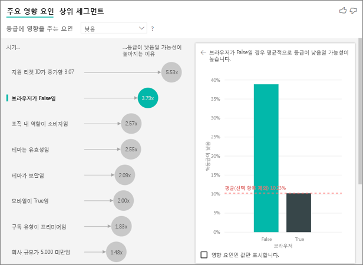

**측정값 내 분석에 포함 되지 않은 경고가 표시 됩니다. 왜 그런가요?** 

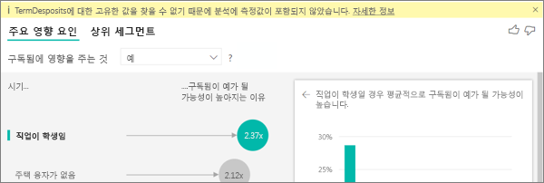

분석 분석 되는 필드의 테이블 수준에서 실행 됩니다. 고객 이탈을 분석 하는 경우에 고객 변동 인지 여부를 알려 주는 테이블을 해야 합니다. 이 경우 분석 고객 테이블 수준에서 실행 됩니다.
 
측정값 및 집계는 테이블 수준에서 분석 하는 기본적으로. 평균 월별 지출 한도 대 한 측정값 있다면 고객 테이블 수준에서 분석할 수 있습니다. 

Customer 테이블 고유 식별자가 없는 경우 측정값을 계산할 수 없습니다 및 분석에서 무시 됩니다. 이 상황을 방지 하려면 메트릭이 포함 된 테이블을 고유 식별자가 있는지 확인 합니다. 이 경우에 고객 테이블 및 고유 식별자는 고객 id입니다. 또한 파워 쿼리를 사용 하 여 인덱스 열을 추가 하는 것이 쉽습니다.
 
**이 금액 품질 분석에 영향을 줄 수는 메트릭을 분석 하 고 10 개 이상의 고유 값에 경고가 표시 됩니다. 왜 그런가요?** 

범주 필드 및 숫자 필드에 AI 시각화 분석할 수 있습니다. 범주 필드의 경우 예제는 변동 될 수 있습니다 예 또는 아니요, 고객 만족은 높음, 보통, 낮음 및 합니다. 분석 하는 범주 수를 늘리면 더 적은 관찰 범주에 따른 가지 의미 합니다. 이 경우 데이터에서 패턴을 찾는 데 시각화를 어렵게 합니다. 

범주 데이터와 같은 분석을 실행는 경우 텍스트와 같은 숫자 필드를 처리 하는 중 하나를 선택 해야 숫자 필드를 분석 하는 경우 (**범주 Analysis**). 많은 고유 값이 좋습니다 분석을 전환 **연속 분석** 처리 하는 것으로 고유 값이 아닌 경우 숫자를 늘리거나에서 유추할 수 있는 것을 의미 하는 대로 합니다. 전환할 수 있습니다 **범주 Analysis** 에 **연속 분석** 에 **서식 지정 창** 아래를 **Analysis** 카드.

강력한 영향 요인을 검색할 유사한 값을 단일 단위로 그룹화 하는 것이 좋습니다. 예를 들어, 가격에 대 한 메트릭을 경우 가능성이 높음, 중간 및 하위 범주 및 개별 4백 6십만 사용 하 여 비슷한 가격을 그룹화 하 여 더 나은 결과 가져옵니다. 

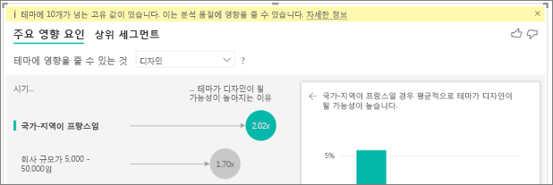

**주요 영향 요인을 것 처럼 보이는 데이터의 요인이 있습니다 있지만 사실은 그렇지만도 않습니다. 어떻게 그런 일이 발생하나요?**

다음 예제에서는 소비자가 있는 고객 하위에 있는 등급 14.93% 낮은 등급을 구동 합니다. 또한 관리자 역할 13.42%, 낮은 등급의 비율이 높을 갖지만 영향력 것으로 간주 되지 않습니다. 

이 결정에 대 한 이유는 시각화 영향 요인 찾으면도 데이터 요소의 수를 고려 하는. 다음 예제에서는 두 개 29,000 소비자와 2,900 약 10 배 적은 관리자에 있습니다. 유일한 390 낮은 등급을 제공 했습니다. 시각적 개체 관리자 등급을 사용 하 여 패턴을 찾을 수 있는지 여부를 또는 수만 있는지 확인 하려면 충분 한 데이터가 없는 찾기. 

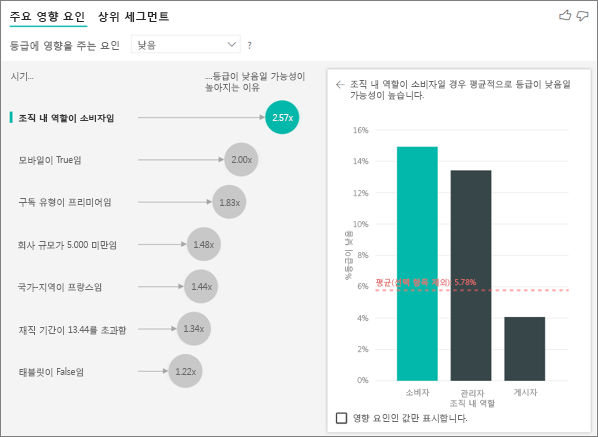

**주요 영향 요인 분석 범주에 어떻게 계산 할까요?**

AI 시각화 내부적으로 사용 하 여 [ML.NET](https://dotnet.microsoft.com/apps/machinelearning-ai/ml-dotnet) 주요 영향 요인을 계산 하는 로지스틱 회귀를 실행 합니다. 로지스틱 회귀 분석은 서로 다른 그룹을 비교하는 통계 모델입니다. 

낮은 등급을 구동 참조 하려는 경우에 로지스틱 회귀를 높은 점수를 제공 하는 고객의 낮은 점수를 제공 하는 고객 어떻게 다른 지 살펴봅니다. 높음, 보통 및 낮음 점수 등의 여러 범주에 있는 경우 낮은 등급을 지정 하지 않은 고객의 고객에 게 낮은 등급을 지정한 어떻게 다른 지 살펴봅니다. 이 예에서 수행 낮은 점수를 제공 하는 고객 어떻게 높은 등급 또는 중립 등급을 지정한 고객의? 
 
로지스틱 회귀 분석 데이터의 패턴을 검색 하 고 높은 등급을 지정한 고객의 낮은 등급을 지정한 고객 다를 수 있습니다 하는 방법을 찾습니다. 있을, 예를 들어 없거나 거의 지원 티켓을 사용 하 여 고객에 게 보다 낮은 등급의 비율이 높습니다 자세한 지원 티켓을 사용 하 여 고객에 게 제공 하는 것입니다.
 
로지스틱 회귀를 얼마나 많은 데이터 요소를 사용할 수 있는 고려 합니다. 예를 들어, 관리자 역할을 수행 하는 고객 비례적으로 음수 점수 수 있지만 잠시 관리자만는, 하는 경우이 요소 큰 영향을 주는 간주 되지 않습니다. 패턴을 유추 하는 사용 가능한 충분 한 데이터 요소가 없기 때문이 결정 됩니다. 통계 테스트를 Wald 테스트 라고 하는 요소는 영향력으로 간주 되는지를 결정 하는 데 사용 됩니다. 시각적 개체는 0.05의 p-값을 사용하여 임계값을 결정합니다. 

**주요 영향 요인 분석 숫자는 어떻게 계산 할까요?**

AI 시각화 내부적으로 사용 하 여 [ML.NET](https://dotnet.microsoft.com/apps/machinelearning-ai/ml-dotnet) 주요 영향 요인을 계산 하는 선형 회귀를 실행 합니다. 선형 회귀는 결과 분석 하는 필드를 변경 하는 방법을 보여주는 설명 요소에 기반 하는 통계 모델입니다.

예를 들어 주택 가격을 분석 하는 것 선형 회귀는 뛰어난 주방 주택 가격에 미치는 영향이 큰 살펴보겠습니다. 뛰어난 사용 하지 않고는 비교할 높거나 낮은 주택 가격은 뛰어난 사용을 사용 하 여 집에서 일반적으로 있습니까?

선형 회귀는 또한 데이터 요소의 수를 고려합니다. 예를 들어 테니스 공식적으로는 더 높은 가격 없지만 테니스 법원 있는 거의 것을 경우이 요소 큰 영향을 주는 간주 되지 않습니다. 패턴을 유추 하는 사용 가능한 충분 한 데이터 요소가 없기 때문이 결정 됩니다. 통계 테스트를 Wald 테스트 라고 하는 요소는 영향력으로 간주 되는지를 결정 하는 데 사용 됩니다. 시각적 개체는 0.05의 p-값을 사용하여 임계값을 결정합니다. 

**세그먼트는 어떻게 계산하나요?**

AI 시각화 내부적으로 사용 하 여 [ML.NET](https://dotnet.microsoft.com/apps/machinelearning-ai/ml-dotnet) 흥미로운 하위 그룹을 찾으려면 의사 결정 트리를 실행 합니다. 의사 결정 트리는 관심이 메트릭에 상대적으로 큰 데이터 요소 하위 그룹을 사용 하 여 종료 합니다. 낮은 등급을 사용 하 여 고객 또는 높은 가격을 사용 하 여 집을 수 있습니다.

의사 결정 트리 각 설명 요소를 사용 하 고 최상의 비율을 제공 하는 이유를 하려고 *분할*합니다. 예를 들어 대규모 기업 고객만 포함 하도록 데이터를 필터링 하는 경우는 분리 했습니다 듣는 낮은 등급을 비교 하는 고객? 또는 아마도 것이 더 보안에 대 한 주석 처리 된 고객만 포함 하도록 데이터를 필터링 하 시겠습니까? 

의사 결정 트리에 분할을 수행 후 데이터의 하위 그룹을 사용 하 고 해당 데이터에 대 한 다음 최적의 분할을 결정 합니다. 이 경우 하위 그룹은 보안에 주석으로 처리 하는 고객. 각 분할 후 것도 고려에서 패턴을 또는 데이터에는 실제 세그먼트가 아니라 비정상 인지 여부를 유추할 수 있을 만큼를 대표 하는이 그룹에 대 한 데이터 요소가 부족 한지 합니다. 다른 통계 테스트 0.05의 p 값을 사용 하 여 분할 조건의 통계적 중요성에 대 한 확인에 적용 됩니다. 

의사 결정 트리 실행이 완료 되 면 보안 주석 등 대규모 엔터프라이즈는 모든 분할을 사용 하 고 Power BI 필터를 만듭니다. 이 필터의 조합은 시각적 개체에서 하나의 세그먼트로 패키지됩니다. 
 
**이유 수행할 특정 요인 될 영향 요인 또는 중지 영향 요인을 더 많은 필드에 이동 되는 *에서 설명* 필드?**

시각화는 모든 설명 요소를 함께 평가합니다. 요소는 영향력 자체로 수 있지만 아닐 경우 다른 요인으로 간주 됩니다. 분석 하려는 경우 다음과 같이 방 및 설명 요소로 집 크기를 사용 하 여 높은 주택 가격을 구동 합니다.

- 자체적으로 자세한 방 높은 주택 가격에 대 한 드라이버를 수 있습니다.
- 분석에 포함 하 여 집 크기 집 크기가 그대로 유지 하는 동안 방 되나요 보면 의미 합니다.
- 기본 크기는 1,500 square feet로 고정 되어, 경우 침실 수가 증가 하는 연속 주택 가격을 상당히 길어집니다는 가능성이 아닙니다. 
- 방 되기 전과 집 크기 것으로 간주 되는 비율의 중요 일 수 없습니다. 

## 다음 단계
- [Power BI의 콤보 차트](power-bi-visualization-combo-chart.md)
- [Power BI의 시각화 유형](power-bi-visualization-types-for-reports-and-q-and-a.md)
