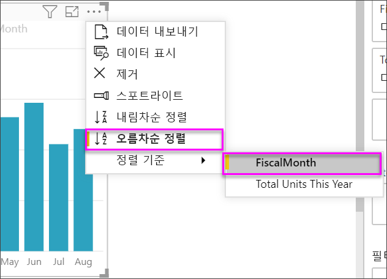

# KPI(핵심 성과 지표) 시각적 개체

[!INCLUDE [power-bi-visuals-desktop-banner](../includes/power-bi-visuals-desktop-banner.md)]

KPI(핵심 성과 지표)는 측정 가능한 목표에 대해 만든 진행률의 정도를 알리는 시각적 신호입니다. KPI에 대한 자세한 내용은 [PowerPivot의 KPI(핵심 성과 지표)](/previous-versions/sql/sql-server-2012/hh272050(v=sql.110))를 참조하세요.

Will이 단일 메트릭 시각적 개체: 계기, 카드 및 KPI를 만드는 방법을 보여 주는 과정을 봅니다.
   > [!NOTE]
   > 이 비디오에서는 이전 버전의 Power BI Desktop을 사용합니다.
   > 
   > 
<iframe width="560" height="315" src="https://www.youtube.com/embed/xmja6EpqaO0?list=PL1N57mwBHtN0JFoKSR0n-tBkUJHeMP2cP" frameborder="0" allowfullscreen></iframe>

## KPI를 사용하는 경우

다음과 같은 경우 KPI를 사용하는 것이 좋습니다.

* 진행률 측정. “앞 또는 뒤 개체 확인” 질문에 답합니다.

* 목표에 대한 거리 측정. “초과 또는 미만 정도” 질문에 답합니다.

## KPI 요구 사항

디자이너는 특정 측정값을 기반으로 KPI 시각적 개체를 생성합니다. KPI의 의도는 정의된 대상에 대해 메트릭의 현재 값 및 상태를 평가하는 데 도움을 주는 것입니다. KPI 시각적 개체는 값 및 ‘대상’ 측정값 또는 값 및 ‘임계값’이나 ‘목표’로 계산되는 ‘기본’ 측정값이 필요합니다.    

KPI 데이터 세트에는 KPI에 대한 목표 값이 포함되어야 합니다. 데이터 세트에 목표 값이 포함되어 있지 않다면 목표가 들어 있는 Excel 시트를 데이터 모델 또는 PBIX 파일에 추가함으로써 목표를 생성할 수 있습니다.

## 필수 조건

이 자습서는 [소매점 분석 샘플 PBIX 파일](https://download.microsoft.com/download/9/6/D/96DDC2FF-2568-491D-AAFA-AFDD6F763AE3/Retail%20Analysis%20Sample%20PBIX.pbix)을 사용합니다.

1. 메뉴 모음의 왼쪽 위 섹션에서 **파일** > **열기**를 선택합니다.

1. **소매점 분석 샘플 PBIX 파일**을 찾습니다.

1. 보고서 뷰에서 **소매점 분석 샘플 PBIX 파일**을 엽니다. 

1. 새 페이지를 추가하려면 **+** 를 선택하세요. 

## KPI를 만드는 방법

이 예에서는 판매 목표에 대해 만든 진행률을 측정하는 KPI를 만듭니다.

1. **필드** 창에서 **판매량 > 금년 총 단위**를 선택합니다.  이 값이 지표가 됩니다.

1. **시간 > FiscalMonth**를 추가합니다.  이 값이 추세를 나타냅니다.

1. 시각적 개체 오른쪽 위 모서리에서 줄임표를 선택하고 Power BI에서 열이 **FiscalMonth** 기준으로 오름차순 정렬되었는지 확인합니다.

    > [!IMPORTANT]
    > 시각화를 KPI로 변환하고 나면 정렬할 수 있는 옵션이 **없습니다**. 지금 올바르게 정렬해야 합니다.

    

    올바르게 정렬된 후에는 시각적 개체의 모양이 다음과 같습니다.

    

1. **시각화** 창에서 **KPI** 아이콘을 선택하여 시각적 개체를 KPI로 변환합니다.

    

1. 목표를 추가하려면 **지난해 총 단위**를 **목표 대상** 필드로 끌어옵니다.

    

1. 필요에 따라 페인트 롤러 아이콘을 선택하여 KPI의 형식을 지정하고 서식 창을 엽니다.

    * **표시기** - 표시기의 표시 단위 및 소수 자릿수를 제어합니다.

    * **추세 축** - **켜기**로 설정된 경우 추세 축이 KPI 시각적 개체의 배경으로 표시됩니다.  

    * **목표** - **켜기**로 설정된 경우 시각적 개체는 목표 및 목표에서의 거리를 백분율로 표시합니다.

    * **색 구분 > 방향** - 일부 KPI의 경우 *높은* 값이 더 낫고 일부는 *낮은* 값이 더 낫다고 간주됩니다. 예를 들어 수입 및 대기 시간이 있습니다. 일반적으로 수입 값이 높은 것은 대기 시간이 높은 것보다 더 낫습니다. **높은 값이 양호**를 선택하고 필요할 경우 색 설정을 변경합니다.

KPI는 Power BI 서비스 및 모바일 디바이스에서도 사용할 수 있습니다. 따라서, 비즈니스의 중심에 항상 연결되어 최신 상황을 확인할 수 있습니다.

## 고려 사항 및 문제 해결

KPI가 위와 다르게 표시되는 경우 **FiscalMonth**별로 정렬하지 않아서 그럴 수 있습니다. KPI에는 정렬 옵션이 없습니다. 시각화를 KPI로 변환하기 ‘전에’ 다시 시작하여 **FiscalMonth**별로 정렬해야 합니다. 

## 다음 단계

* [Power BI Map 시각화를 위한 팁과 힌트](power-bi-map-tips-and-tricks.md)

* [Power BI의 시각화 유형](power-bi-visualization-types-for-reports-and-q-and-a.md)

궁금한 점이 더 있나요? [Power BI 커뮤니티를 이용하세요.](https://community.powerbi.com/)
