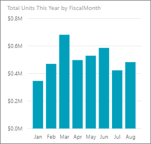
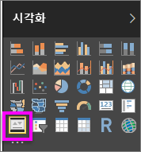
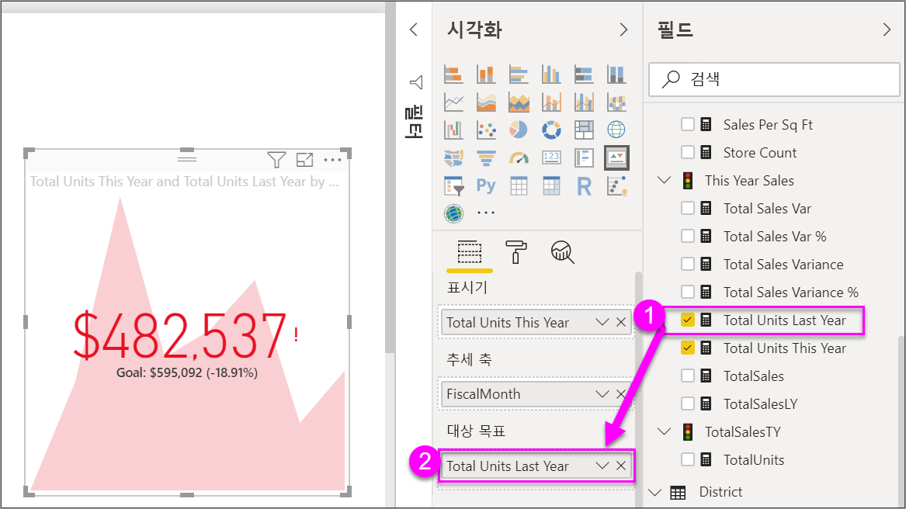

# KPI 시각적 개체
KPI(핵심 성과 지표)는 측정 가능한 목표에 대해 만든 진행률의 정도를 알리는 시각적 신호입니다. KPI에 대한 자세한 내용은 [Microsoft Developer Network](https://msdn.microsoft.com/library/hh272050)를 참조하세요.

아직 Power BI에 등록하지 않은 경우 시작하기 전에 [평가판에 등록합니다](https://app.powerbi.com/signupredirect?pbi_source=web).

## 필수 조건
* [Power BI Desktop - 무료입니다!](https://powerbi.microsoft.com/en-us/get-started/)
* [소매점 분석 샘플 PBIX 파일](http://download.microsoft.com/download/9/6/D/96DDC2FF-2568-491D-AAFA-AFDD6F763AE3/Retail%20Analysis%20Sample%20PBIX.pbix)

## KPI를 사용하는 경우
다음과 같은 경우 KPI를 사용하는 것이 좋습니다.

* 진행률 측정(앞 또는 뒤 개체 확인)
* 목표에 대한 거리 측정(초과 또는 미만 정도)   

## KPI 요구 사항
KPI(핵심 성과 지표)는 특정 측정값을 기반으로 하며 정의된 대상에 대한 현재 값 및 메트릭의 상태를 평가할 수 있도록 디자인되었습니다. 따라서 KPI 시각적 개체는 값 및 ‘대상’ 측정값 또는 값 및 ‘임계값’이나 ‘목표’로 계산되는 ‘기본’ 측정값이 필요합니다.

현재 KPI 데이터 세트에는 KPI에 대한 목표 값이 포함되어야 합니다. 데이터 세트에 포함되어 있지 않다면 목표가 들어 있는 Excel 시트를 데이터 모델 또는 PBIX 파일에 추가함으로써 목표를 생성할 수 있습니다.

## KPI를 만드는 방법
방법을 알아보려면 Power BI Desktop에서 [소매점 분석 .PBIX 파일](http://download.microsoft.com/download/9/6/D/96DDC2FF-2568-491D-AAFA-AFDD6F763AE3/Retail%20Analysis%20Sample%20PBIX.pbix)을 엽니다. 판매 목표에 대해 만든 진행률을 측정하는 KPI를 만듭니다.

또는 Will이 단일 메트릭 시각적 개체: 계기, 카드 및 KPI를 만드는 방법을 보여 주는 과정을 시청합니다.

<iframe width="560" height="315" src="https://www.youtube.com/embed/xmja6EpqaO0?list=PL1N57mwBHtN0JFoKSR0n-tBkUJHeMP2cP" frameborder="0" allowfullscreen></iframe>

1. 보고서 보기에서 보고서를 열고 노란색 탭을 선택하여 새 페이지를 추가합니다.    
2. 필드 창에서 **판매량 > 금년 총 단위**를 선택합니다.  표시기입니다.
3. **시간 > FiscalMonth**를 추가합니다.  추세를 나타냅니다.
4. 중요: 차트를 **FiscalMonth**별로 정렬합니다. 시각적 개체를 KPI로 변환하고 나면 정렬할 수 있는 옵션이 없습니다.

    
5. 시각화 창에서 KPI 아이콘을 선택하여 시각적 개체를 KPI로 변환합니다.
   
    
6. 목표를 추가합니다. 지난해 판매량을 목표로 추가합니다. **지난해 총 단위**를 **목표 대상** 필드로 끌어옵니다.
   
    
7. 필요에 따라 페인트 롤러 아이콘을 선택하여 KPI의 형식을 지정하고 서식 창을 엽니다.
   
   * **표시기** - 표시기의 표시 단위 및 소수 자릿수를 제어합니다.
   * **추세 축** - **켜기**로 설정된 경우 추세 축은 KPI 시각적 개체의 배경으로 표시됩니다.  
   * **목표** - **켜기**로 설정된 경우 시각적 개체는 목표 및 목표에서의 거리를 백분율로 표시합니다.
   * **색 구분 > 방향** - 일부 KPI는 높은 값에 *더 낫고* 일부는 낮은 값에 *더 낫다*고 간주됩니다. 예를 들어 수입 및 대기 시간이 있습니다. 일반적으로 수익의 높은 값은 대기 시간의 높은 값에 비해 더 낫습니다. **높은 값이 더 나음**을 선택하고 필요할 경우 색 설정을 변경합니다.

KPI는 Power BI 서비스 및 모바일 디바이스에서도 사용할 수 있으므로 비즈니스 하트비트에 항상 연결된 상태로 유지됩니다.

## 고려 사항 및 문제 해결
* KPI가 위와 다르게 표시되는 경우 fiscalmonth별로 정렬해야 할 수 있습니다. KPI에는 정렬 옵션이 없으므로, 시각적 개체를 KPI로 변환하기 ‘전’에 fiscalmonth별로 정렬해야 합니다.

## 다음 단계

[Power BI의 기본 맵](power-bi-map-tips-and-tricks.md)

[Power BI의 시각화 유형](power-bi-visualization-types-for-reports-and-q-and-a.md)