# Power BI 질문 및 답변 시각화 소개

[!INCLUDE [power-bi-service-new-look-include](../includes/power-bi-service-new-look-include.md)]

## 질문 및 답변 시각화란 무엇인가요?

질문 및 답변 시각적 개체를 사용하면 사용자가 자연어로 질문하고 시각적 개체 형태로 답변을 얻을 수 있습니다. 

[!INCLUDE [power-bi-visuals-desktop-banner](../includes/power-bi-visuals-desktop-banner.md)]

질문 및 답변 시각적 개체는 ‘사용자’가 답변을 데이터로 신속하게 가져올 수 있는 도구로 사용되는 동시에 ‘디자이너’가 보고서의 아무 곳이나 두 번 클릭하고 자연어를 사용하여 보고서에서 시각적 개체를 만들어 시작하는 데 사용할 수 있습니다.   다른 시각적 개체처럼 동작하기 때문에, 질문 및 답변 시각적 개체는 교차 필터링/교차 강조 표시가 가능하며 책갈피도 지원합니다. 또한 질문 및 답변 시각적 개체는 테마 및 Power BI 내에서 사용 가능한 기타 기본 서식 옵션을 지원합니다.

질문 및 답변 시각적 개체는 다음 네 가지 핵심 구성 요소로 이루어져 있습니다.

- 질문 상자. 여기에 사용자가 질문을 입력하고, 질문을 완성하는 데 도움이 되는 제안이 표시됩니다.
- 미리 채워진 제안된 질문 목록
- 질문 및 답변 시각적 개체를 표준 시각적 개체로 변환하는 아이콘 
- 디자이너가 기본 자연어 엔진을 구성할 수 있게 해주는 질문 및 답변 도구를 여는 아이콘

## 필수 조건

1. 이 자습서는 [영업 및 마케팅 샘플 PBIX 파일](https://download.microsoft.com/download/9/7/6/9767913A-29DB-40CF-8944-9AC2BC940C53/Sales%20and%20Marketing%20Sample%20PBIX.pbix)을 사용합니다. 

1. Power BI Desktop 메뉴 모음의 왼쪽 위 섹션에서 **파일** > **열기**를 선택합니다.
   
2. **영업 및 마케팅 샘플 PBIX 파일**의 복사본을 찾습니다.

1. 보고서 보기 아이콘 을 탭하여 파일을 엽니다.

1. 새 페이지를 추가하기 위해  탭을 선택합니다.

질문 및 답변 시각적 개체를 만들 때 오류가 표시되는 경우 [제한 사항](../natural-language/q-and-a-limitations.md) 섹션을 검사하여 데이터 원본 구성이 지원되는지 확인합니다.

## 제안된 질문을 사용하여 질문 및 답변 시각적 개체 만들기
이 연습에서는 제안된 질문 중 하나를 선택하여 질문 및 답변 시각적 개체를 만듭니다. 

1. 빈 보고서 페이지에서 시작하고 시각화 창에서 질문 및 답변 시각적 개체 아이콘을 선택합니다.

    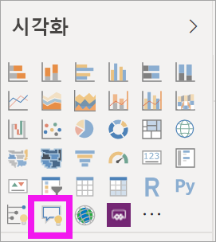

2. 테두리를 끌어 시각적 개체의 크기를 조정합니다.

    

3. 시각적 개체를 만들려면 제안된 질문 중 하나를 선택하거나 질문 상자에 입력을 시작합니다. 이 예제에서는 **top geo states by sum of revenue**를 선택했습니다. Power BI는 최선을 다해 사용할 시각적 개체 유형을 선택합니다. 이 예제에서는 지도입니다.

    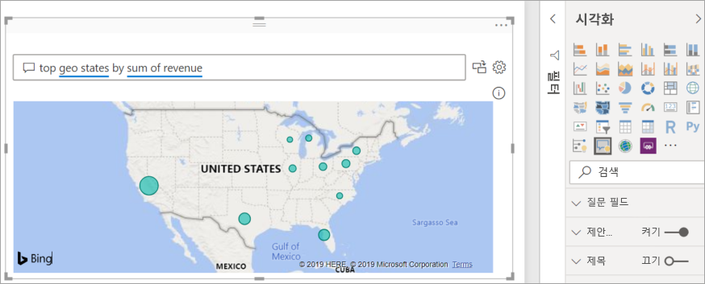

    그러나 자연어 쿼리에 추가하여 사용할 시각적 개체 유형을 Power BI에 지시할 수 있습니다. 일부 시각적 개체 유형은 데이터에서 작동하지 않거나 데이터에 적합하지 않습니다. 예를 들어 이 데이터는 의미 있는 분산형 차트를 생성하지 않고 채워진 지도로 작동합니다.

    

## 자연어 쿼리를 사용하여 질문 및 답변 시각적 개체 만들기
위 예제에서는 제안된 질문 중 하나를 선택하여 질문 및 답변 시각적 개체를 만들었습니다.  이 연습에서는 고유한 질문을 입력합니다. 질문을 입력할 때 Power BI에서 자동 완성, 제안 및 피드백으로 지원합니다.

질문 유형이나 사용할 용어를 잘 모르겠으면 **모든 제안 표시**를 펼치거나, 캔버스 오른쪽에 있는 필드 창을 살펴봅니다. 이렇게 하면 영업 및 마케팅 데이터 세트의 용어와 콘텐츠에 익숙해질 것입니다.

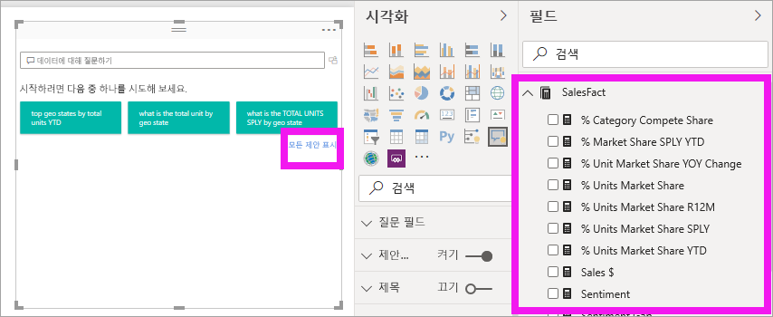

1. 질문 및 답변 필드에 질문을 입력합니다. Power BI에서 인식할 수 없는 단어에 빨간색 밑줄을 추가합니다. Power BI는 가능한 경우 항상, 인식할 수 없는 단어의 정의를 지원합니다.  아래의 첫 번째 예제에서는 제안 중 하나를 선택하는 것이 좋습니다.  

    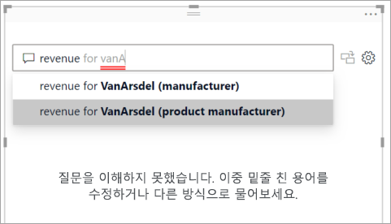

2. 질문을 더 입력하면 Power BI에서 질문을 이해할 수 없다고 알리고, 도움을 주려고 합니다. 아래 예제에서는 Power BI가 “...알고 계십니까?”라고 묻고, 데이터 세트의 용어를 사용하여 질문을 표현하는 다른 방법을 제안합니다. 

    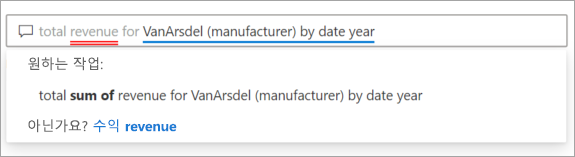

5. Power BI의 도움을 받아 인식 가능한 용어로만 이루어진 질문을 입력할 수 있었습니다. Power BI에서 결과를 꺾은선형 차트로 표시합니다. 

    

6. 시각적 개체를 세로 막대형 차트로 변경합시다. 

    

7.  보고서 페이지에 시각적 개체를 더 추가하고, Q&A 시각적 개체가 해당 페이지의 다른 시각적 개체와 상호 작용하는 방식을 확인합니다. 이 예에서 Q&A 시각적 개체는 꺾은선형 차트를 교차 필터링하고 가로 막대형 차트를 매핑하고 교차 강조 표시했습니다.

    

## 질문 및 답변 시각적 개체에 서식 지정 및 사용자 지정
서식 창을 사용하고 테마를 적용하여 질문 및 답변 시각적 개체를 사용자 지정할 수 있습니다. 

### 테마 적용
테마를 선택하면 전체 보고서 페이지에 해당 테마가 적용됩니다. 선택할 수 있는 다양한 테마가 있으므로, 원하는 모양을 얻을 때까지 시험해 볼 수 있습니다. 

1. 메뉴 모음에서 **홈** 탭을 선택한 다음, **테마 전환**을 선택합니다. 

    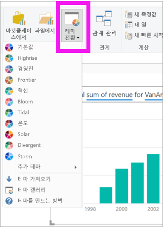

    
    
2. 이 예제에서는 **더 많은 테마** > **색맹 안전**을 선택했습니다.

    

### 질문 및 답변 시각적 개체에 서식 지정
질문 및 답변 시각적 개체, 질문 필드 및 제안 표시 방식에 서식을 지정합니다. 제목의 배경부터 인식할 수 없는 단어의 가리키기 색에 이르기까지 모든 설정을 변경할 수 있습니다. 여기서는 질문 상자에 회색 배경을 추가하고 밑줄을 노랑 및 녹색으로 변경했습니다. 제목은 가운데 맞춤으로 표시되고 노란색 배경이 있습니다. 

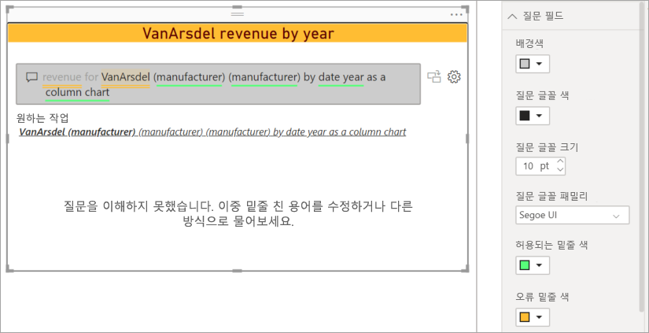

## 질문 및 답변 시각적 개체를 표준 시각적 개체로 변환
색맹 안전 세로 막대형 차트 시각적 개체에 서식을 지정하여 제목과 테두리를 추가했습니다. 이제 보고서에서 이 시각적 개체를 표준 시각적 개체로 변환하고 대시보드에 고정할 준비가 되었습니다.

 아이콘을 선택하여 **이 질문 및 답변 결과를 표준 시각적 개체로 바꿉니다**.

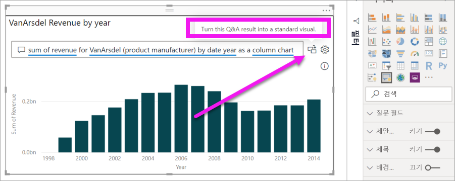

이 시각적 개체는 더 이상 질문 및 답변 시각적 개체가 아니라 표준 세로 막대형 차트이며, 대시보드에 고정할 수 있습니다. 보고서에서 이 시각적 개체는 다른 표준 시각적 개체와 동일하게 동작합니다. 시각화 창에서 질문 및 답변 시각적 개체 아이콘 대신 세로 막대형 차트 아이콘이 선택된 상태로 표시됩니다.

***Power BI 서비스***를 사용하는 경우, 이제 고정 아이콘을 선택하여 시각적 개체를 대시보드에 고정할 수 있습니다. 

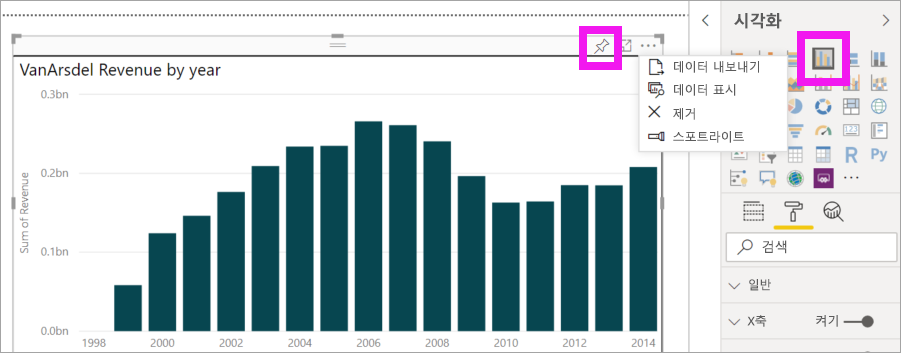

## 질문 및 답변 시각적 개체의 고급 기능
톱니 모양 아이콘을 선택하면 질문 및 답변 시각적 개체 도구 창이 열립니다. 

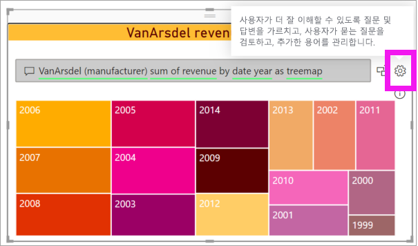

도구 창을 사용하여 질문 및 답변에 인식할 수 없는 용어를 교육하고, 해당 용어를 관리하며, 이 데이터 세트와 보고서에 대해 제안된 질문을 관리합니다. 도구 창에서 이 질문 및 답변 시각적 개체를 사용한 질문을 검토하고 사용자가 플래그를 지정한 질문을 확인할 수도 있습니다. 자세한 내용은 [질문 및 답변 도구](../natural-language/q-and-a-tooling-intro.md)를 참조하세요.

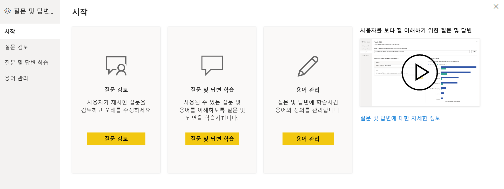

## 고려 사항 및 문제 해결
질문 및 답변 시각적 개체는 Office 및 Bing과 통합되어 인식할 수 없는 일반 단어를 데이터 세트의 필드와 일치시키려고 합니다.  

## 다음 단계

자연어를 통합하는 방법에는 여러 가지가 있습니다. 자세한 내용은 다음 문서를 참조하세요.

* [질문 및 답변 도구](../natural-language/q-and-a-tooling-intro.md)
* [질문 및 답변 모범 사례](../natural-language/q-and-a-best-practices.md)
