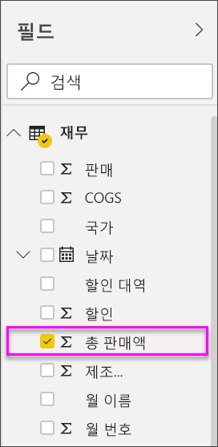
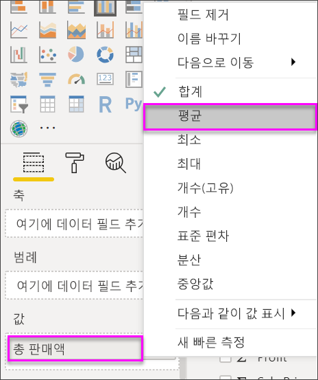
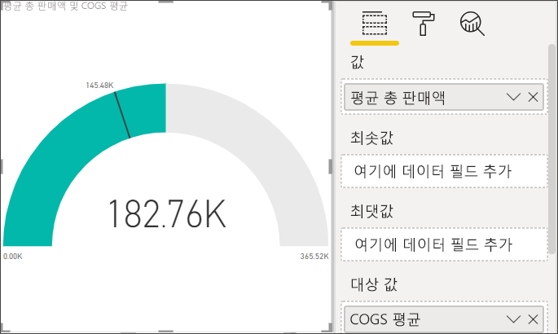
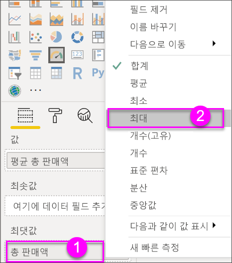
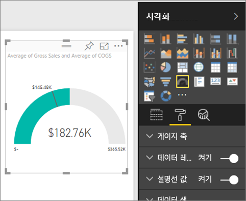
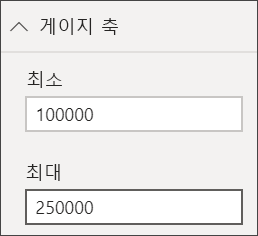
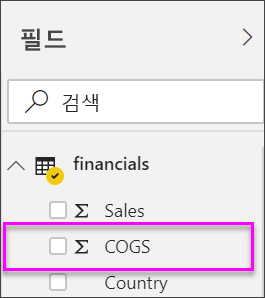
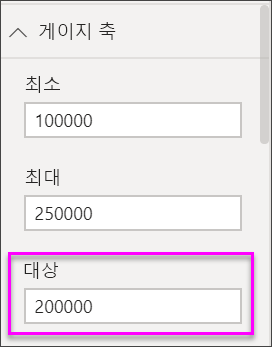
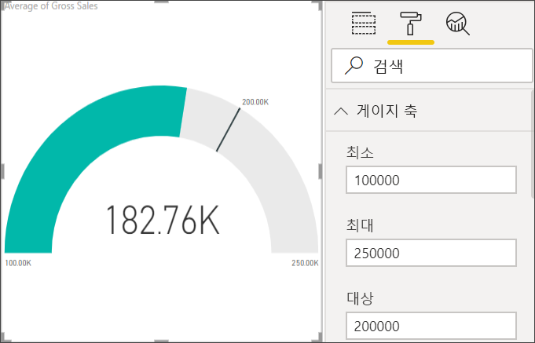

# Power BI의 방사형 계기 차트

[!INCLUDE [power-bi-visuals-desktop-banner](../includes/power-bi-visuals-desktop-banner.md)]

방사형 계기 차트는 원호 형태로 목표에 대한 진행률 또는 KPI(핵심 성과 지표)를 측정하는 단일 값을 표시합니다. 선(또는 ‘바늘’)은 목표 또는 대상 값을 나타냅니다.  음영은 목표에 대한 진행률을 나타냅니다. 호 내부의 값은 진행률 값을 나타냅니다. Power BI에서 모든 가능한 값을 최소(맨 왼쪽 값)에서 최대(맨 오른쪽 값)까지 호를 따라 균등하게 분배합니다.

이 예에서는 월별 판매 팀의 평균 판매량을 추적하는 자동차 소매업체입니다. 바늘은 140대 판매 목표를 나타냅니다. 가능한 최소 평균 판매량은 0이고 최대는 200입니다.  파란색 음영은 팀이 이번 달에 평균 약 120대를 판매한 상태임을 나타냅니다. 다행히 목표에 도달할 수 있는 또 다른 한 주가 아직 남아있습니다.

Will이 단일 메트릭 시각적 개체: 계기, 카드 및 KPI를 만드는 방법을 보여 주는 과정을 봅니다.
   > [!NOTE]
   > 이 비디오에서는 이전 버전의 Power BI Desktop을 사용합니다.
   > 
   > 
<iframe width="560" height="315" src="https://www.youtube.com/embed/xmja6EpqaO0?list=PL1N57mwBHtN0JFoKSR0n-tBkUJHeMP2cP" frameborder="0" allowfullscreen></iframe>

## 방사형 계기를 사용하는 경우

방사형 계기는 다음에 매우 적합합니다.

* 목표 진행률을 표시합니다.

* KPI와 같은 백분위수 측정값을 표시합니다.

* 단일 측정값의 상태를 표시합니다.

* 빠르게 훑어보고 이해할 수 있는 정보를 표시합니다.

## 필수 조건

이 자습서에서는 [재무 샘플 Excel 파일](https://download.microsoft.com/download/9/6/D/96DDC2FF-2568-491D-AAFA-AFDD6F763AE3/Retail%20Analysis%20Sample%20PBIX.pbix)을 사용합니다.

1. 메뉴 모음의 왼쪽 위 섹션에서 **데이터 가져오기** > **Excel**을 선택합니다.
   
2. **재무 샘플 Excel 파일**을 찾습니다.

1. **재무 샘플 Excel 파일**을 보고서 보기 아이콘 으로 엽니다.

1. **재무** 및 **Sheet1**을 선택합니다.

1. **로드**를 클릭합니다.

1. 새 페이지를 추가하기 위해 를 선택합니다.

 
## 기본 방사형 계기 만들기

### 1단계: 총 매출을 추적하는 계기 만들기

1. 빈 보고서 페이지에서 시작합니다.

1. **필드** 창에서 **총 판매액**을 선택합니다.

   

1. 집계를 **평균**으로 변경합니다.

   

1. 계기 아이콘  을 선택하여 세로 막대형 차트를 계기 차트로 변환합니다.

    

    **재무 샘플** 파일을 다운로드하는 시점에 따라 이러한 수치와 일치하지 않는 숫자가 표시될 수 있습니다.

    > [!TIP]
    > 기본적으로 Power BI는 현재 값(이 경우, **평균 총 판매액**)이 계기에 중간 지점으로 간주되는 계기 차트를 만듭니다. **평균 총 판매액** 값이 $182.76K이므로 시작 값(최소)은 0으로 설정하고 끝 값(최대)은 현재 값의 두 배로 설정됩니다.

### 3단계: 대상 값 설정

1. **필드** 창에서 **대상 값**으로 **COGS**를 끕니다.

1. 집계를 **평균**으로 변경합니다.

   Power BI가 바늘을 추가하여 대상 값이 **$145.48K**임을 나타냅니다.

   

    목표를 초과 했음을 알 수 있습니다.

   > [!NOTE]
   > 대상 값을 수동으로 입력할 수도 있습니다. [수동 서식 옵션을 사용하여 최소값, 최소값 및 대상 값 설정](#use-manual-format-options-to-set-minimum-maximum-and-target-values) 섹션을 참조하세요.

### 4단계: 최대값 설정

2단계에서 Power BI는 **값** 필드를 사용하여 최소값과 최대값을 자동으로 설정했습니다. 사용자가 스스로 최대값을 설정하려는 경우 어떻게 해야 할까요? 가능한 최대값으로 현재 값을 두 배로 사용하는 대신, 데이터 세트에서 가장 높은 총 판매액 수로 설정하는 것을 가정해 보겠습니다.

1. **필드** 창에서 **최대값** 웰로 **총 판매액**을 끕니다.

1. 집계를 **최대값**으로 변경합니다.

   

   계기는 총 판매량이 새 끝 값인 121만으로 다시 그려집니다.

   

### 5단계: 보고서 저장

1. [보고서를 저장합니다](../service-report-save.md).

## 수동 서식 옵션을 사용하여 최소값, 최대값 및 대상 값 설정

1. **최대값**에서 **최대 총 판매량**을 제거합니다.

1. 페인트 롤러 아이콘을 선택하여 **서식** 창을 엽니다.

   

1. **게이지 축**을 확장하고 **최소값** 및 **최대값**에 값을 입력합니다.

    

1. **필드** 창에서 **COGS** 옵션을 선택 취소하여 대상 값을 제거합니다.

    

1. **대상** 필드가 **게이지 축** 아래에 나타나는 경우 값을 입력합니다.

     

1. 필요에 따라 계기 차트 서식 지정을 계속합니다.

이러한 단계를 완료하면 다음과 같은 모양의 계기 차트가 나옵니다.

## 다음 단계

* [KPI(핵심 성과 지표) 시각적 개체](power-bi-visualization-kpi.md)

* [Power BI의 시각화 유형](power-bi-visualization-types-for-reports-and-q-and-a.md)

궁금한 점이 더 있나요? [Power BI 커뮤니티를 이용하세요.](https://community.powerbi.com/)
