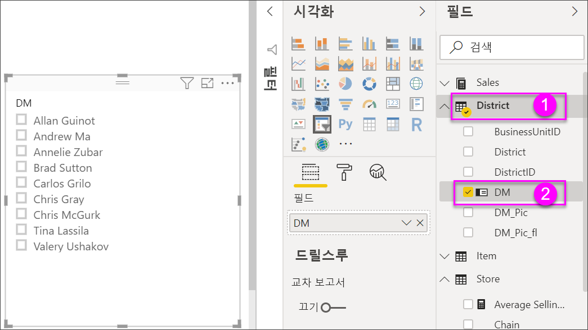
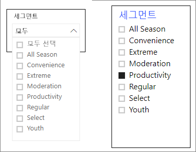
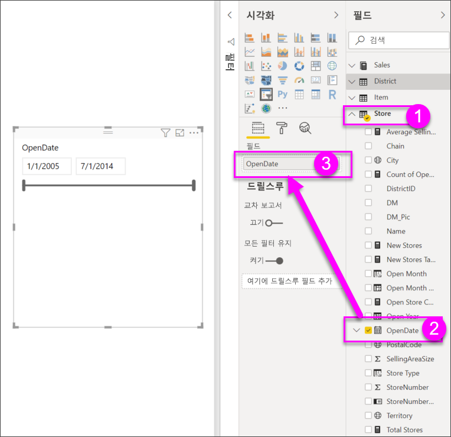
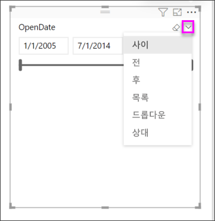
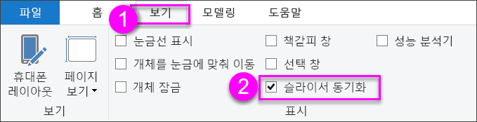
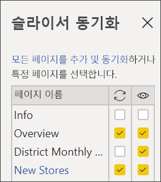

# Power BI의 슬라이서

[!INCLUDE [power-bi-visuals-desktop-banner](../includes/power-bi-visuals-desktop-banner.md)]

보고서를 보는 사람이 전체 판매액 메트릭을 확인하고 개별 구역 관리자 및 다른 시간 프레임에 대한 성과를 강조 표시할 수 있도록 하려 합니다. 별도의 보고서나 비교 차트를 만들 수 있습니다. 또는 슬라이서를 사용할 수 있습니다. 슬라이서는 보고서의 다른 시각화에 표시되는 데이터 세트의 부분을 좁히는 대체 필터링 방법입니다. 

이 자습서에서는 무료 [소매점 분석 샘플](../sample-retail-analysis.md)을 사용하여 목록 및 날짜 범위 슬라이서를 만들고, 서식을 지정하고, 이를 사용하는 방법을 안내합니다. 슬라이서의 서식을 지정하고 사용하는 방법을 재미있게 알아보세요. 

## 슬라이서를 사용하는 경우
다음과 같은 경우 슬라이서를 사용하는 것이 좋습니다.

* 보고서 캔버스에서 자주 사용되거나 중요한 필터를 표시하여 더 쉽게 액세스할 수 있게 하려는 경우
* 드롭다운 목록을 열지 않고도 현재 필터링된 상태를 더 쉽게 보려는 경우 
* 데이터 테이블에서 불필요하고 숨겨진 열을 필터링하는 경우
* 중요한 시각적 개체 옆에 슬라이서를 배치하여 더 집중된 보고서를 만드는 경우

Power BI 슬라이서는 다음을 지원하지 않습니다.

- 입력 필드
- 드릴다운

## 슬라이서 만들기

**구역 관리자별로 데이터를 필터링하는 새 슬라이서 만들기**

1. [소매점 분석 샘플 PBIX 파일](https://download.microsoft.com/download/9/6/D/96DDC2FF-2568-491D-AAFA-AFDD6F763AE3/Retail%20Analysis%20Sample%20PBIX.pbix)을 다운로드합니다.

1. Power BI Desktop 메뉴 모음에서 **파일** > **열기**를 선택합니다.
   
1. **Retail Analysis sample PBIX.pbix** 파일을 찾은 다음, **열기**를 선택합니다.

1. 왼쪽 창에서 **보고서** 아이콘 을 선택하여 보고서 보기로 파일을 엽니다.

1. **개요** 페이지에서, 보고서 캔버스에서 아무것도 선택하지 않은 상태로 **시각화** 창의 **슬라이서** 아이콘 을 선택하여 새 슬라이서를 만듭니다. 

1. 새 슬라이서를 선택한 상태로 **필드** 창에서 **구역** > **DM**을 선택하여 슬라이서를 채웁니다. 

    이제 새 슬라이서가 구역 관리자 이름 목록과 해당 선택 상자로 채워집니다.
    
    
    
1. 캔버스에서 요소의 크기를 조정하고 끌어서 슬라이서에 사용할 공간을 만듭니다. 슬라이서 크기를 너무 작게 조정하면 해당 항목이 잘립니다. 

1. 슬라이서에서 이름을 선택하고 페이지의 다른 시각화 요소에 미치는 영향을 확인합니다. 이름을 다시 선택하여 선택을 취소하고 **Ctrl** 키를 누른 채로 둘 이상의 이름을 선택합니다. 모든 이름을 선택하면 아무것도 선택하지 않은 것과 동일한 효과가 있습니다. 

1. 또는 **시각화** 창에서 **서식**(페인트 롤러 아이콘)을 선택하여 슬라이서의 서식을 지정합니다. 

   너무 많은 옵션이 있어서 여기에서 모두 설명할 수는 없습니다. 직접 실험해 보고 가장 적합한 슬라이서를 만드세요. 다음 이미지에서 첫 번째 슬라이서는 항목에 대해 색이 지정된 배경과 가로 방향을 사용합니다. 두 번째 슬라이서는 세로 방향과 색이 지정된 텍스트를 사용하여 보다 표준적인 모양을 제공합니다.

   

   >[!TIP]
   >슬라이서 목록 항목은 기본적으로 오름차순으로 정렬됩니다. 정렬 순서를 내림차순으로 바꾸려면 슬라이서의 오른쪽 위에 있는 줄임표( **...** )를 선택하고 **내림차순 정열**을 선택합니다.

**날짜 범위별로 데이터를 필터링하는 새 슬라이서 만들기**

1. 보고서의 **개요** 페이지를 선택합니다. 보고서 캔버스에서 아무것도 선택하지 않은 상태로 **필드** 창에서 **매장** >  **OpenDate**를 선택합니다.

    이렇게 하면 **시각화** 창의 **값** 상자를 채워 새 시각화를 만듭니다.

1. 보고서에서 새 시각화를 선택한 상태로 **시각화** 창에서 **슬라이서** 아이콘을 선택하여 새 시각화를 슬라이서로 변환합니다. 이 **OpenDate** 슬라이서는 날짜 범위가 채워진 슬라이더 컨트롤입니다.
    
    

1. 캔버스에서 슬라이서 및 다른 요소의 크기를 조정하고 끌어서 슬라이서에 사용할 공간을 만듭니다. 슬라이더 크기는 슬라이서 크기로 조정되지만 슬라이서 크기를 너무 작게 조정하면 해당 슬라이더가 사라지고 날짜가 잘립니다. 

1. 슬라이더로 다른 날짜 범위를 선택하거나, 날짜 필드를 선택하여 날짜를 입력하거나 더 정확한 선택을 위해 달력을 팝업으로 표시합니다. 페이지의 다른 시각화에 미치는 영향을 확인합니다.
    
    >[!NOTE]
    >숫자 및 날짜/시간 데이터 형식은 기본적으로 범위 슬라이더 슬라이서를 생성합니다. 이제 2018년 2월 Power BI 업데이트부터 정수 데이터 형식 범위 슬라이더는 소수 자릿수를 표시하지 않고 정수 값에 맞춰집니다. 

1. 슬라이서 유형을 변경하려면 슬라이서를 선택한 상태로 슬라이서의 오른쪽 위 영역을 마우스로 가리키고, 표시되는 캐럿 아이콘을 선택한 다음, **목록** 또는 **이전**과 같은 옵션 중 하나를 선택합니다. 슬라이서 모양과 선택 옵션이 어떻게 변경되는지 확인합니다. 
 
    

날짜 및 숫자 범위 슬라이서를 만드는 방법에 대한 자세한 내용은 다음 동영상을 시청하고 [Power BI Desktop에서 숫자 범위 슬라이서 사용](../desktop-slicer-numeric-range.md)을 참조하세요.
   > [!NOTE]
   > 이 비디오에서는 이전 버전의 Power BI Desktop을 사용합니다.
   > 
   > 

<iframe width="560" height="315" src="https://www.youtube.com/embed/zIZPA0UrJyA" frameborder="0" allowfullscreen></iframe> 

## 슬라이서의 영향을 받는 페이지 시각적 개체 제어
기본적으로 보고서 페이지의 슬라이서는 서로를 포함하여 해당 페이지의 다른 모든 시각화에 영향을 줍니다. 방금 만든 목록 및 날짜 슬라이더에서 값을 선택할 때 다른 시각화에 미치는 영향을 확인하세요. 필터링된 데이터는 두 슬라이서에서 선택한 값의 교차 영역입니다. 

시각적 개체 상호 작용을 사용하여 일부 페이지 시각화가 다른 시각화의 영향을 받지 않도록 제외할 수 있습니다. **개요** 페이지의 **회계 월 및 구역 관리자별 총 판매액 차이** 차트에는 항상 표시하려고 하는 월별 지역 관리자에 대한 전체 비교 데이터가 표시됩니다. 시각적 개체 상호 작용을 사용하여 슬라이서 선택 항목이 이 차트를 필터링하지 못하도록 합니다. 

1. 보고서의 **개요** 페이지로 이동한 후 이전에 만든 **DM** 슬라이서를 선택합니다.

1. Power BI Desktop 메뉴에서 **시각적 개체 도구** 아래의 **서식** 메뉴를 선택하고 **상호 작용 편집**을 선택합니다.
   
   필터 컨트롤 (각각 **필터** 및 **없음** 옵션이 있음)은 페이지의 모든 시각적 개체 위에 표시됩니다. 처음에는 모든 컨트롤에서 **필터** 옵션이 미리 선택되어 있습니다.
   
1. **회계 월 및 구역 관리자별 총 판매액 차이** 차트 위의 필터 컨트롤에서 **없음** 옵션을 선택하여 **DM** 슬라이서가 필터링하지 않도록 합니다. 

1. **OpenDate** 슬라이서를 선택한 다음, **회계 월 및 구역 관리자별 총 판매액 차이** 차트 위에 있는 **없음** 옵션을 선택하여 이 슬라이서가 필터링하지 않도록 합니다. 

   이제 슬라이서에서 이름과 날짜 범위를 선택할 때 **회계 월 및 구역 관리자별 총 판매액 차이** 차트가 변경되지 않습니다.

상호 작용 편집에 대한 자세한 내용은 [Power BI 보고서에서 시각적 개체가 조작되는 방식 변경](../service-reports-visual-interactions.md)을 참조하세요.

## 다른 페이지에서 슬라이서 동기화 및 사용
2018년 2월 Power BI 업데이트부터 보고서의 일부 또는 모든 페이지에서 슬라이서를 동기화하여 사용할 수 있습니다. 

현재 보고서에서 **구역 월별 판매액** 페이지에 **구역 관리자** 슬라이서가 있는데, 이 슬라이서를 **신규 매장** 페이지에도 포함하면 어떻게 될까요? **신규 매장** 페이지에 슬라이서가 있지만 **매장 이름** 정보만 제공합니다. **슬라이서 동기화** 창을 사용하여 **구역 관리자** 슬라이서를 이러한 페이지에 동기화할 수 있으므로 한 페이지에서 슬라이서를 선택하면 세 페이지 모두의 시각화에 영향을 줍니다.

1. Power BI Desktop **보기** 메뉴에서 **슬라이서 동기화**를 선택합니다.

    

    **슬라이서 동기화** 창은 **필터** 창과 **시각화** 창 사이에 표시됩니다.

    

1. 보고서의 **구역 월별 판매액** 페이지에서 **구역 관리자** 슬라이서를 선택합니다. 

    **개요** 페이지에서 **구역 관리자**(**DM**) 슬라이서를 이미 만들었으므로 **슬라이서 동기화** 창이 다음과 같이 표시됩니다.
    
    
    
1. **슬라이서 동기화** 창의 **동기화** 열에서 **개요**, **구역 월별 판매액** 및 **신규 매장** 페이지를 선택합니다. 

    이렇게 선택하면 **구역 월별 판매액** 슬라이서가 이러한 세 페이지에서 동기화됩니다. 
    
1. **슬라이서 동기화** 창의 **표시** 열에서 **신규 매장** 페이지를 선택합니다. 

    이렇게 선택하면 **구역 월별 판매액** 슬라이서가 이러한 세 페이지에 표시됩니다. 이제 **슬라이서 동기화** 창이 다음과 같이 표시됩니다.

    

1. 슬라이서를 동기화하여 다른 페이지에 표시되도록 설정한 결과를 관찰합니다. **구역 월별 판매액** 페이지의 **구역 관리자** 슬라이서에 **개요** 페이지와 동일한 선택 항목이 표시됩니다. 이제 **신규 매장** 페이지에서 **구역 관리자** 슬라이서가 표시되고 이 선택 항목은 **매장 이름** 슬라이서에 표시되는 선택 항목에 영향을 줍니다. 
    
    >[!TIP]
    >슬라이서는 처음에는 원래 페이지와 같은 크기 및 위치로 동기화된 페이지에 표시되지만 다양한 페이지에서 동기화된 슬라이서를 개별적으로 이동하고, 크기를 조정하고, 서식을 지정할 수 있습니다. 

    >[!NOTE]
    >슬라이서를 페이지에 동기화하지만 해당 페이지에 표시되지 않도록 설정할 경우 다른 페이지에서 선택한 슬라이서에 따라 페이지의 데이터가 필터링됩니다.
 
## 슬라이서 서식 지정
슬라이서 유형에 따라 다양한 서식 옵션을 사용할 수 있습니다. **가로** 방향, **반응형** 레이아웃 및 **항목** 색 지정을 사용하면 표준 목록 항목이 아닌 단추 또는 타일을 생성하고 슬라이서 항목 크기가 다양한 화면 크기 및 레이아웃에 맞게 조정되도록 설정할 수 있습니다.  

1. 아무 페이지에서나 **구역 관리자** 슬라이서를 선택한 상태로 **시각화** 창에서 **서식** 아이콘 을 선택하여 서식 컨트롤을 표시합니다. 
    
    
    
1. 각 범주 옆에 있는 드롭다운 화살표를 선택하여 옵션을 표시하고 편집합니다. 

### 일반 옵션
1. **서식**에서 **일반**을 선택하고 **윤곽선 색**아래에서 빨간색을 선택한 다음, **윤곽선 두께**를 *2*로 변경합니다. 

    이렇게 설정하면 머리글 및 항목 윤곽선과 밑줄의 색 및 두께가 변경됩니다.

1. **방향**의 경우 **세로**가 기본적으로 선택되어 있습니다. **가로**를 선택하여 가로로 정렬된 타일이나 단추 및 스크롤 화살표(슬라이서에 맞지 않는 항목에 액세스)가 있는 슬라이서를 생성합니다.
    
    
    
1. **반응형** 레이아웃을 **켜기**로 설정하여 보기 화면 및 슬라이서 크기에 따라 슬라이서 항목의 크기와 정렬을 변경합니다. 

    목록 슬라이서의 경우 반응형 레이아웃을 사용하면 작은 화면에서 항목이 잘리지 않습니다. 이 레이아웃은 가로 방향으로만 사용할 수 있습니다. 범위 슬라이더 슬라이서의 경우 반응형 서식에 따라 슬라이더의 스타일이 변경되고 이 서식을 사용하면 더 유연하게 크기를 조정할 수 있습니다. 두 슬라이서 유형 모두 작은 크기의 필터 아이콘이 됩니다.
    
    
    
    >[!NOTE]
    >반응형 레이아웃의 변경 내용은 사용자가 설정한 특정 제목 및 항목 서식을 재정의할 수 있습니다. 
    
1. **X 위치**, **Y 위치**, **너비** 및 **높이**에서 슬라이서 위치와 크기를 숫자 정밀도로 설정하거나 캔버스에서 직접 슬라이서를 이동하고 크기를 조정합니다. 

    다양한 항목 크기와 정렬을 사용해 보고 반응형 서식이 이에 따라 어떻게 변경되는지 확인하세요. 이러한 옵션은 가로 방향을 선택하는 경우에만 사용할 수 있습니다. 

    

가로 방향 및 반응형 레이아웃에 대한 자세한 내용은 [Power BI에서 크기를 조정할 수 있는 반응형 슬라이서 만들기](../power-bi-slicer-filter-responsive.md)를 참조하세요.

### 선택 컨트롤 옵션(목록 슬라이서만 해당)
1. **선택 컨트롤**에서 **“모두 선택” 옵션 표시**를 **켜기**로 설정하여 **모두 선택** 항목을 슬라이서에 추가합니다. 

    **“모두 선택” 옵션 표시**는 기본적으로 **끄기**로 설정되어 있습니다. 이 옵션을 사용하도록 설정한 경우 토글하면 모든 항목을 선택하거나 선택 취소합니다. 모든 항목이 선택된 경우 한 항목을 선택하면 선택이 취소되고 *is-not* 형식의 필터를 허용합니다.
    
    
    
1. **단일 선택**을 **끄기**로 설정하면 **Ctrl** 키를 누른 상태로 유지하지 않고도 여러 항목을 선택할 수 있습니다. 

    **단일 선택**은 기본적으로 **켜기**로 설정되어 있습니다. 항목을 선택하면 해당 항목이 선택되고 **Ctrl**를 누른 상태로 선택하면 여러 항목이 선택됩니다. 항목을 다시 선택하면 선택이 취소됩니다.

### 제목 옵션
**제목**는 기본적으로 **켜기**로 설정되어 있습니다. 이렇게 선택하면 슬라이서 맨 위에 데이터 필드 이름이 표시됩니다. 
- 이 자습서에서는 다음과 같이 제목 텍스트의 서식을 지정합니다. 
   - **글꼴색**: 빨강
   - **텍스트 크기**: **14pt**
   - **맞춤**: **가운데**
   - **글꼴 제품군**: **Arial 검정**

### 항목 옵션(목록 슬라이서만 해당)
1. 이 자습서에서는 다음과 같이 **항목** 옵션의 서식을 지정합니다.
    - **글꼴색**: 검정
    - **배경**: 연한 빨강
    - **텍스트 크기**: **10pt**
    - **글꼴 제품군**: **Arial**
 
1. **윤곽선**에서 **프레임**을 선택하여 **일반** 옵션에서 설정한 크기와 색으로 각 항목 둘레에 테두리를 그립니다. 
    
    
    
    >[!TIP]
    >- **일반** > **방향** > **가로**가 선택되어 있으면 선택 취소된 항목에는 선택한 텍스트 및 배경색이 표시되고, 선택한 항목은 시스템 기본값(일반적으로 검은색 배경에 흰색 텍스트)을 사용합니다.
    >- **일반** > **방향 > 세로**가 선택되어 있으면 항목에는 항상 선택한 색이 표시되고 확인란은 선택하면 항상 검은색으로 표시됩니다. 

### 날짜/숫자 입력 및 슬라이더 옵션(범위 슬라이더 슬라이서만 해당)
- 목록 슬라이서의 경우 날짜/숫자 입력 옵션은 윤곽선이나 밑줄 옵션이 없다는 점을 제외하면 **항목** 옵션과 동일합니다.
- **슬라이더** 옵션을 사용하면 범위 슬라이더의 색을 설정하거나 슬라이더를 **끄기**로 설정하여 숫자 입력만 남겨 둘 수 있습니다.

### 다른 서식 지정 옵션
다른 서식 옵션은 기본적으로 **끄기**로 설정되어 있습니다. 이러한 옵션을 **켜기**로 설정하여 제어합니다. 
- **배경**: 슬라이서에 배경색을 추가하고 투명도를 설정합니다.
- **가로 세로 비율 잠금**: 크기가 조정된 경우에도 슬라이서의 모양을 유지합니다.
- **테두리**: 슬라이서 둘레에 테두리를 추가하고 색을 설정합니다. 이 슬라이서 테두리는 **일반** 설정과 별개이며 영향을 받지 않습니다. 

## 다음 단계
자세한 내용은 다음 아티클을 참조하세요.

- [Power BI의 시각화 유형](power-bi-visualization-types-for-reports-and-q-and-a.md)

- [Power BI의 테이블](power-bi-visualization-tables.md)

