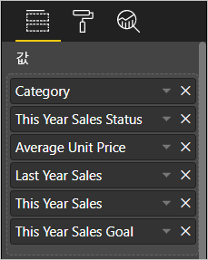
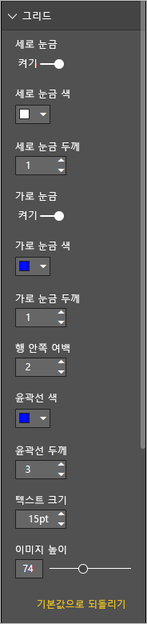
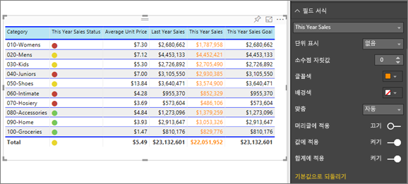
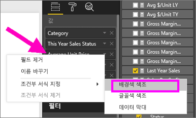
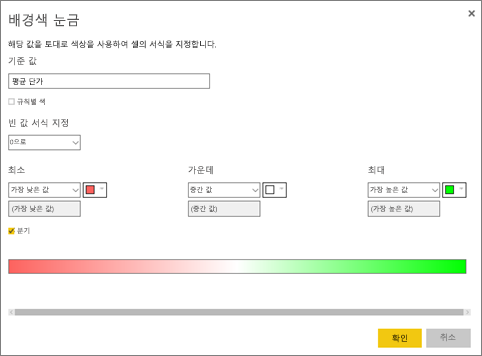
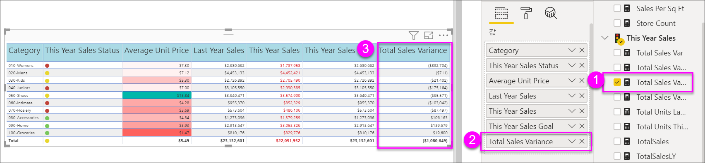
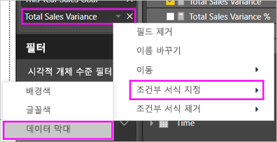
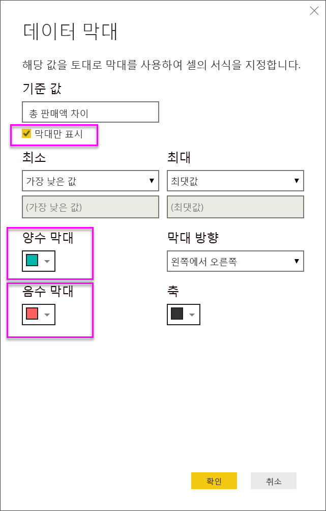
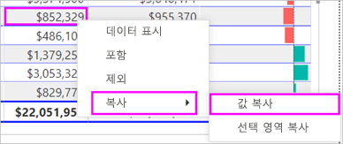
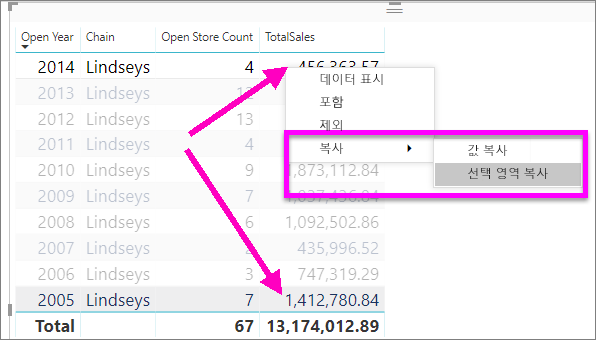

# Power BI 보고서 및 대시보드의 테이블

[!INCLUDE [power-bi-visuals-desktop-banner](../includes/power-bi-visuals-desktop-banner.md)]

테이블은 논리적으로 연속된 행과 열에서 관련된 데이터를 포함하는 표입니다. 머리글과 합계에 대한 행이 포함될 수도 있습니다. 테이블은 단일 범주에 대한 많은 값을 볼 수 있는 정량적 비교와 잘 작동합니다. 예를 들어 이 테이블은 **범주**에 대한 5개의 서로 다른 측정값을 표시합니다.

보고서에서 테이블을 만들고 동일한 보고서 페이지에서 다른 시각적 개체를 포함하는 테이블 내 요소를 상호 강조 표시합니다. 행, 열 및 개별 셀과 상호 강조 표시를 선택할 수 있습니다. 개별 셀 및 여러 셀 선택을 복사하여 다른 애플리케이션에 붙여넣을 수도 있습니다.

## 테이블을 사용하는 경우

다음과 같은 경우 테이블은 좋은 선택입니다.

* 자세한 데이터 및 정확한 값을 보고 비교(시각적 표현 대신)

* 테이블 형식으로 데이터를 표시

* 숫자 데이터를 범주별로 표시

## 필수 조건

이 자습서는 [소매점 분석 샘플 PBIX 파일](http://download.microsoft.com/download/9/6/D/96DDC2FF-2568-491D-AAFA-AFDD6F763AE3/Retail%20Analysis%20Sample%20PBIX.pbix)을 사용합니다.

1. 메뉴 모음의 왼쪽 위 섹션에서 **파일** > **열기**를 선택합니다.
   
2. **소매점 분석 샘플 PBIX 파일**을 찾습니다.

1. **소매점 분석 샘플 PBIX 파일**을 보고서 보기 으로 엽니다.

1. 선택  탭을 선택합니다.

## 테이블 만들기

문서 시작 부분의 그림에 나온 테이블을 만들어 항목 범주별로 판매 값을 표시합니다.

1. **필드** 창에서 **항목** > **범주**를 선택합니다.

    Power BI는 자동으로 모든 범주를 나열하는 테이블을 만듭니다.

    

1. **판매량 > 평균 단가** 및 **판매량 > 작년 판매액**을 선택합니다.

1. 그런 다음, **판매량 > 올해 판매액**을 선택하고 세 가지 옵션 **값**, **목표** 및 **상태**를 모두 선택합니다.

1. **시각화** 창에서 **값**을 잘 찾고 차트 열의 순서가 이 페이지의 첫 번째 이미지와 일치할 때까지 끌어서 값을 선택합니다. 필요한 경우에는 웰에 있는 값을 끌어서 놓습니다. **값** 웰은 다음과 같습니다.

    

## 테이블 서식 지정

테이블을 서식 지정하는 방법에는 여러 가지가 있습니다. 여기서는 몇 가지만 다룹니다. 다른 서식 옵션을 알아보는 좋은 방법은 **서식** 창(페인트 롤러 아이콘 )을 열고 살펴보는 것입니다.

* 테이블 그리드의 서식을 지정해 보세요. 여기에서는 파란색 세로 그리드를 추가하고, 행에 공간을 추가하고, 윤곽선과 텍스트 크기를 늘립니다.

    

    

* 열 머리글의 경우 배경색을 변경하고, 윤곽선을 추가하고, 글꼴 크기를 늘립니다.

    

    

* 개별 열 및 열 머리글에 서식을 적용할 수도 있습니다. 먼저 **필드 서식**을 확장하고 드롭다운에서 서식을 지정할 열을 선택합니다. 열 값에 따라 **필드 서식**을 사용하여 표시 단위, 글꼴 색, 소수 자릿수, 배경, 맞춤 등의 항목을 설정할 수 있습니다. 설정을 조정한 후 해당 설정을 머리글 및 합계 행에 적용할지 결정합니다.

    

    

* 몇 가지 추가 서식 지정 후 최종 테이블은 다음과 같습니다.

    

### 조건부 서식 지정

‘조건부 서식’은 형식의 한 가지 유형입니다.  Power BI는 **시각화** 창의 **값** 웰에 있는 필드에 조건부 서식을 적용합니다.

테이블에 대한 조건부 서식 지정을 사용하여 그라데이션 색 사용을 포함하는 셀 값을 기반으로 하는 사용자 지정된 셀 배경색 및 글꼴 색을 지정할 수 있습니다.

1. **시각화** 창에서 **필드** 아이콘 을 선택합니다.

1. 서식을 지정하려는 **값** 웰의 값 옆에 있는 아래쪽 화살표를 선택합니다(또는 필드를 마우스 오른쪽 단추로 클릭).

    > [!NOTE]
    > 필드에 대한 조건부 서식은 **필드**의 **값** 영역에서만 관리할 수 있습니다.

    

1. **배경색**을 선택합니다.

1. 대화 상자가 나타나면 색은 물론 **최소** 값과 **최대** 값을 구성할 수 있습니다. **분기** 옵션을 선택하면 선택적인 **가운데** 값도 구성할 수 있습니다.

    

    평균 단가 값에 사용자 지정 서식을 적용해 보겠습니다. **분기**를 선택하고 몇 가지 색을 추가하고 **확인**을 선택합니다.

    
1. 양수 및 음수 값이 있는 테이블에 새 필드를 추가합니다. **판매액 > 총 판매액 분산**을 선택합니다.

    

1. **총 판매액 분산** 옆에 있는 아래쪽 화살표를 선택하고 **조건부 서식 > 데이터 막대**를 선택하여 데이터 막대 조건부 서식을 추가합니다.

    

1. 표시되는 대화 상자에서 **양수 막대**, **음수 막대**의 색상을 설정하고 **막대만 표시** 옵션을 선택하고 원하는 다른 부분을 변경합니다.

    

1. **확인**을 선택합니다.

    테이블의 숫자 값이 데이터 막대로 바뀌므로 더 쉽게 훑어볼 수 있습니다.

    

시각화에서 조건부 서식 지정을 제거하려면 필드를 다시 마우스 오른쪽 단추로 클릭하고 **조건부 서식 제거**를 선택합니다.

> [!TIP]
> **서식** 창에서 조건부 서식을 사용할 수도 있습니다. 서식을 지정할 값을 선택한 후 **색 눈금** 또는 **데이터 막대**를 **켜짐**으로 설정하여 기본 설정을 적용하거나 설정을 사용자 지정하고 **고급 컨트롤**을 선택합니다.

## 다른 애플리케이션에서 사용하기 위해 Power BI 테이블의 값 복사

테이블 또는 행렬에는 Dynamics CRM, Excel 같은 다른 애플리케이션에서 사용하려는 콘텐츠가 포함되거나 다른 Power BI 보고서가 포함될 수도 있습니다. Power BI에서 셀 내부를 마우스 오른쪽 단추로 클릭하면 단일 셀의 데이터나 여러 셀 선택 영역을 클립보드에 복사하여 다른 애플리케이션에 붙여넣을 수 있습니다.

단일 셀의 값을 복사하려면 다음을 수행합니다.

1. 복사할 셀을 선택합니다.

1. 셀 내부를 마우스 오른쪽 단추로 클릭합니다.

1. **복사** > **값 복사**를 선택합니다.

    

    클립보드에 서식 없는 셀 값이 있으면 다른 애플리케이션에 이 값을 붙여넣을 수 있습니다.

둘 이상의 셀을 복사하려면 다음을 수행합니다.

1. 셀 범위를 선택하거나 **Ctrl** 키를 사용하여 하나 이상의 셀을 선택합니다.

1. 선택한 셀 중 하나의 내부를 마우스 오른쪽 단추로 클릭합니다.

1. **복사** > **선택 영역 복사**를 선택합니다.

    

## 테이블의 열 너비 조정

경우에 따라 Power BI는 보고서와 대시보드에 열 머리글을 자릅니다. 전체 열 이름을 표시하려면 머리글의 오른쪽으로 공간을 마우스로 가리켜 이중 화살표를 표시하고 선택하고 끕니다.

## 고려 사항 및 문제 해결

열 서식 지정을 적용할 때 다음 중에 하나의 열당 맞춤 옵션을 선택할 수 있습니다. **자동**, **왼쪽**, **가운데**, **오른쪽**. 일반적으로 열은 모두 텍스트 또는 숫자만을 포함하고 섞지 않습니다. 열에 숫자와 텍스트가 모두 포함되어 있는 경우 **자동**은 텍스트의 경우 왼쪽에 정렬하고, 번호의 경우 오른쪽에 정렬합니다. 이 동작은 왼쪽에서 오른쪽으로 읽는 언어를 지원합니다.

## 다음 단계

* [Power BI의 트리맵](power-bi-visualization-treemaps.md)

* [Power BI의 시각화 유형](power-bi-visualization-types-for-reports-and-q-and-a.md)
