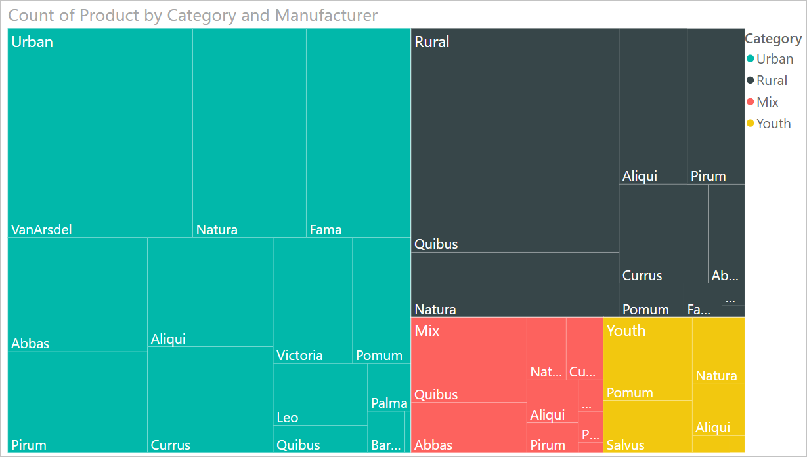
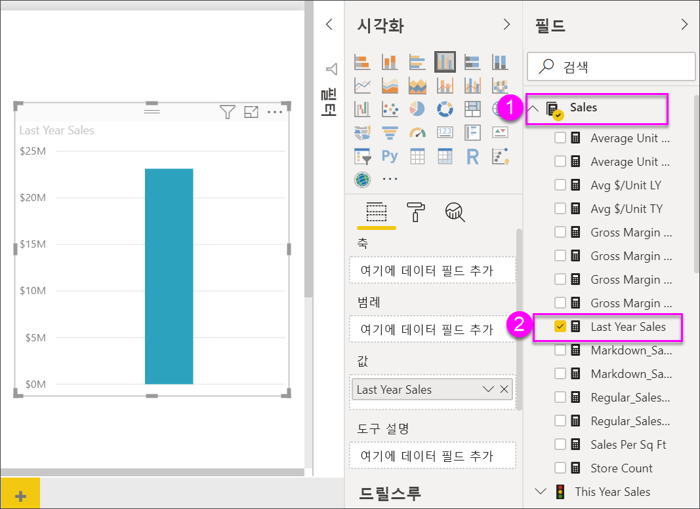

# Power BI의 트리맵

[!INCLUDE [power-bi-visuals-desktop-banner](../includes/power-bi-visuals-desktop-banner.md)]

트리맵은 계층 데이터를 중첩된 사각형의 집합으로 표시합니다. 계층의 각 수준은 더 작은 사각형(리프)을 포함하는 색이 칠해진 사각형(분기)으로 표시됩니다. Power BI는 측정된 값을 기반으로 하여 각 사각형 내에 있는 공간의 크기를 결정합니다. 사각형은 크기순으로 가장 큰 것이 왼쪽 위, 가장 작은 것이 오른쪽 아래에 정렬됩니다.

예를 들어, 판매량을 분석하는 경우 의류 범주에 대한 최상위 분기가 있을 수 있습니다. **Urban**, **Rural**, **Youth** 및 **Mix**. Power BI는 범주 내의 의류 제조업체에서 범주 사각형을 리프로 분할합니다. 이 리프는 판매 수치를 기준으로 크기가 조정되고 음영으로 표시됩니다.

위의 **Urban** 분기에서는 많은 **VanArsdel** 의류가 판매되었고 **Natura**와 **Fama**는 더 적게 판매되었습니다. 그리고 **Leo**는 몇 개만 판매되었습니다. 따라서 트리맵의 **Urban** 분기는 다음과 같이 구성됩니다.

* **VanArsdel**에 해당하는 가장 큰 사각형(왼쪽 위 모서리)

* **Natura** 및 **Fama**에 해당하는 약간 작은 사각형

* 판매된 다른 모든 의류에 해당하는 다수의 다른 사각형

* **Leo**에 해당하는 작은 사각형

각 리프 노드의 크기와 음영을 비교하여 다른 의류 범주에 걸쳐 팔린 항목의 수를 비교할 수 있습니다. 즉, 사각형이 크고 음영이 짙을수록 값이 큽니다.

다른 사람이 먼저 만든 트리맵을 시청하시겠습니까? Amanda가 트리맵을 만드는 것을 보려면 이 비디오에서 2:10초로 넘어갑니다.

   > [!NOTE]
   > 이 비디오에서는 이전 버전의 Power BI Desktop을 사용합니다.
   > 
   > 

<iframe width="560" height="315" src="https://www.youtube.com/embed/IkJda4O7oGs" frameborder="0" allowfullscreen></iframe>

## 트리맵을 사용하는 경우

다음과 같은 경우 트리맵을 사용하는 것이 좋습니다.

* 많은 양의 계층적 데이터를 표시하는 경우

* 가로 막대형 차트로는 많은 수의 값을 효과적으로 처리할 수 없는 경우

* 각 부분과 전체 간의 비율을 표시하는 경우

* 계층 구조의 각 수준의 범주에 걸쳐 측정값이 분포되는 패턴을 표시하는 경우

* 크기 및 색 구분을 사용하여 특성을 표시하는 경우

* 패턴, 이상값, 가장 중요한 기여자 및 예외를 강조하는 경우

## 필수 조건

이 자습서는 [소매점 분석 샘플 PBIX 파일](https://download.microsoft.com/download/9/6/D/96DDC2FF-2568-491D-AAFA-AFDD6F763AE3/Retail%20Analysis%20Sample%20PBIX.pbix)을 사용합니다.

1. 메뉴 모음의 왼쪽 위 섹션에서 **파일** > **열기**를 선택합니다.
   
2. **소매점 분석 샘플 PBIX 파일**을 찾습니다.

1. **소매점 분석 샘플 PBIX 파일**을 보고서 보기 아이콘 으로 엽니다.

1. 새 페이지를 추가하기 위해  탭을 선택합니다.

**소매 분석 샘플** 데이터 세트를 가져온 후 시작할 수 있습니다.

## 기본 트리맵 만들기

보고서를 만들고 기본 트리맵을 추가합니다.

1. **필드** 창에서 **판매량** > **작년 판매액** 측정값을 선택합니다.

   

1. 트리맵 아이콘  을 선택하여 차트를 트리맵으로 변환합니다.

   

1. **항목** > **범주**를 선택합니다. 이렇게 하면 **그룹** 웰에 **범주**가 추가됩니다.

    Power BI는 총 판매액을 기반으로 한 사각형의 크기와 범주를 나타내는 색으로 구성된 트리맵을 만듭니다. 기본적으로 범주별로 총 판매액의 상대 크기를 시각적으로 설명하는 계층을 만들었습니다. **Men's** 범주는 판매액이 가장 높고 **Hosiery** 범주는 가장 낮습니다.

    

1. **매장** > **체인**을 선택합니다. 이렇게 하면 **세부 정보** 웰에 **체인**이 추가되어 트리맵이 완성됩니다. 이제 범주 및 체인 별로 작년 판매액을 비교할 수 있습니다.

   

   > [!NOTE]
   > 색 채도와 세부 정보는 동시에 사용할 수 없습니다.

1. **체인** 영역을 마우스로 가리키면 **범주**의 해당 부분에 대한 도구 설명이 표시됩니다.

    예를 들어 **090-Home** 사각형에서 **Fashions Direct**를 마우스로 가리키면 Home 범주의 Fashions Direct를 보여 주는 도구 설명이 표시됩니다.

   

## 강조 표시 및 교차 필터링

트리맵에서 **범주** 또는 **세부 정보**를 강조 표시하면 보고서 페이지에 있는 다른 시각화가 교차 강조 표시 및 교차 필터링됩니다. 이를 수행하려면 일부 시각적 개체를 이 보고서 페이지에 추가하거나 이 보고서의 다른 페이지 중 하나에 트리맵을 복사하세요. 아래 그림에서는 트리맵이 **개요** 페이지로 복사되었습니다. 

1. 트리맵에서 **범주** 또는 **범주** 내에서 **체인** 중 하나를 선택합니다. 이는 페이지의 다른 시각화 요소를 상호 간에 강조 표시합니다. 예를 들어, **050-Shoes**를 선택하면 작년의 신발 판매액이 **$16,352,432**이며 **Fashions Direct**의 신발 판매액이 그중 **$2,174,185**를 차지한다는 것을 보여 줍니다.

   

1. **지난 해 체인별 판매액** 원형 차트에서 **Fashions Direct** 조각을 선택하여 트리맵을 교차 필터링합니다.
   

1. 차트를 상호 간에 강조 표시하고 필터링하는 방법을 관리하려면 [Power BI 보고서에서 시각적 개체가 조작되는 방식 변경](../service-reports-visual-interactions.md)을 참조하세요.

## 다음 단계

* [Power BI의 폭포 차트](power-bi-visualization-waterfall-charts.md)

* [Power BI의 시각화 유형](power-bi-visualization-types-for-reports-and-q-and-a.md)
