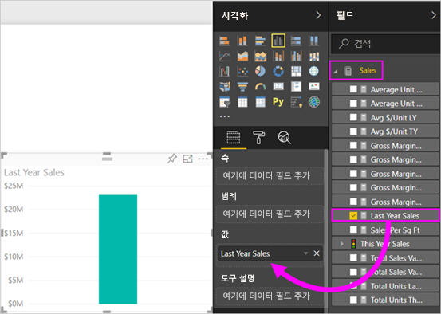
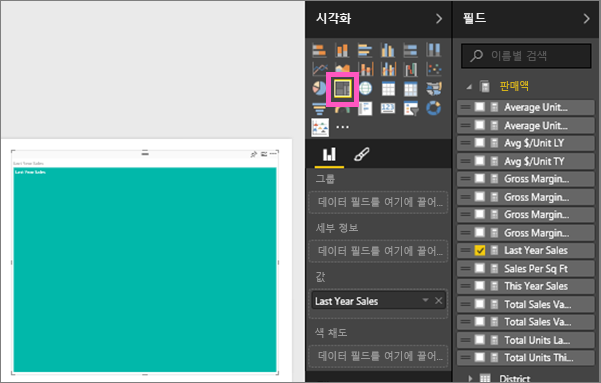
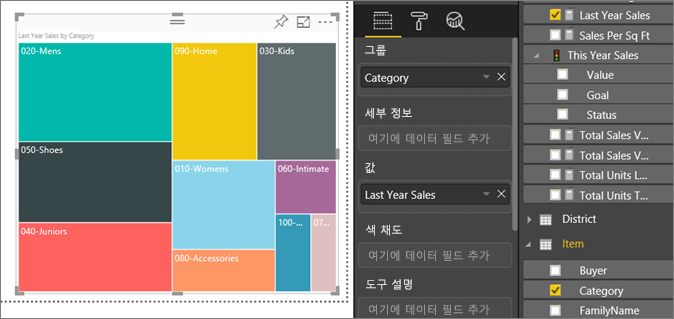
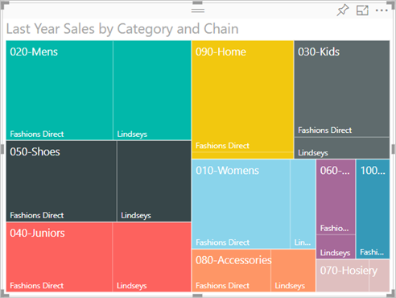
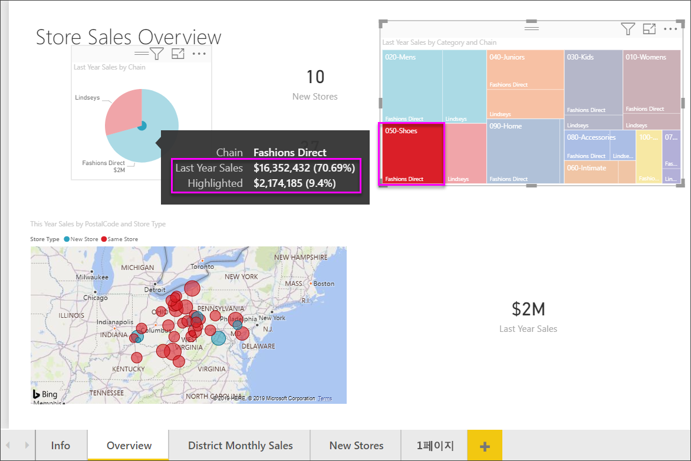

# Power BI의 트리맵
트리맵은 계층 데이터를 중첩된 사각형의 집합으로 표시합니다.  계층의 각 수준은 다른 사각형("잎")를 포함하는 색이 칠해진 사각형("가지"라고도 함)으로 표시됩니다.  각 사각형 내부의 공간은 측정되는 값을 기반으로 하여 할당됩니다. 사각형은 크기순으로 가장 큰 것이 왼쪽 위, 가장 작은 것이 오른쪽 아래에 정렬됩니다.

예를 들어, 내 판매액을 분석하고 있는 경우 **Urban**, **Rural**, **Youth** 및 **Mix** 등 의류 범주의 최상단 사각형(‘가지’라고도 함)을 가지고 있는 것입니다.  내 범주 사각형은 각 범주 내의 의류 제조업체에 해당하는 작은 사각형(‘잎’이라고도 함)으로 분할됩니다. 그리고 이 작은 사각형은 판매 수치를 기준으로 크기가 조정되고 음영으로 표시됩니다.  

위의 **Urban** 가지에서는 `Maximus` 의류가 많이 판매되었고 `Natura` 및 `Fama`는 더 적게 판매되었고 `Leo`는 거의 판매되지 않았습니다.  따라서 내 트리맵의 **Urban** 가지에는 다음과 같이 구성됩니다.
* `Maximus`에 해당하는 가장 큰 사각형(왼쪽 위 모서리)
* `Natura` 및 `Fama`에 해당하는 약간 작은 사각형
* 판매된 다른 모든 의류에 해당하는 다수의 다른 직사각형 
* `Leo`에 해당하는 작은 사각형  

각 잎 노드의 크기와 음영을 비교하여 다른 의류 범주에 걸쳐 팔린 항목의 수를 비교할 수 있습니다. 즉, 사각형이 크고 음영이 짙을수록 값이 큽니다.

## 트리맵을 사용하는 경우
다음과 같은 경우 트리맵을 사용하는 것이 좋습니다.

* 많은 양의 계층적 데이터를 표시하는 경우
* 가로 막대형 차트로는 많은 수의 값을 효과적으로 처리할 수 없는 경우
* 각 부분과 전체 간의 비율을 표시하는 경우
* 계층 구조의 각 수준의 범주에 걸쳐 측정값이 분포되는 패턴을 표시하는 경우
* 크기 및 색 구분을 사용하여 특성을 표시하는 경우
* 패턴, 이상값, 가장 중요한 요인 및 예외를 강조하는 경우

### 필수 조건
 - Power BI 서비스 또는 Power BI Desktop
 - 소매점 분석 샘플

## 기본 트리맵 만들기
다른 사람이 먼저 만든 트리맵을 시청하시겠습니까?  Amanda가 트리맵을 만드는 것을 보려면 이 비디오에서 2:10초로 넘어갑니다.

<iframe width="560" height="315" src="https://www.youtube.com/embed/IkJda4O7oGs" frameborder="0" allowfullscreen></iframe>

또는 고유한 트리맵을 만듭니다. 이 지침은 소매 분석 샘플을 사용합니다. 이를 수행하려면 Power BI 서비스에 로그인하여 **데이터 가져오기 \> 샘플 \> 소매 분석 샘플 \> 연결 \> 대시보드로 이동**을 선택합니다. 보고서에 시각화를 만들려면 데이터 집합 및 보고서에 대한 편집 권한이 필요합니다. 다행히 Power BI 샘플은 편집 가능합니다. 그러나 누군가가 사용자와 공유한 보고서에 사용자가 시각화를 추가할 수는 없습니다.  

1. “총 매장” 타일을 선택하여 소매 분석 샘플 보고서를 엽니다.    
2. [편집용 보기](../service-interact-with-a-report-in-editing-view.md)를 열고 **판매액** > **작년 판매액** 측정값을 선택합니다.   
      
3. 차트를 트리맵으로 변환합니다.  
      
4. **항목** > **범주**를 **그룹** 웰로 끌어다 놓습니다. Power BI는 총 판매액을 기반으로 한 사각형의 크기와 범주를 나타내는 색으로 구성된 트리맵을 만듭니다.  기본적으로 범주별로 총 판매액의 상대 크기를 시각적으로 설명하는 계층을 만들었습니다.  **Men's** 범주는 판매액이 가장 높고 **Hosiery** 범주는 가장 낮습니다.   
      
5. **저장소** > **체인**을 **세부 정보** 웰로 끌어다 놓아 트리맵을 완료합니다. 이제 범주 및 체인 별로 작년 판매액을 비교할 수 있습니다.   
   
   
   > [!NOTE]
   > 색 채도와 세부 정보는 동시에 사용할 수 없습니다.
   > 
   > 
5. **체인** 영역을 마우스로 가리키면 **범주**의 해당 부분에 대한 도구 설명이 표시됩니다.  예를 들어 **090-Home** 사각형에서 **Fashions Direct**를 마우스로 가리키면 Home 범주의 Fashions Direct를 보여 주는 도구 설명이 표시됩니다.  
   
6. [트리맵을 대시보드 타일로 추가합니다(시각적 개체 고정)](../service-dashboard-tiles.md). 
7. [보고서를 저장합니다](../service-report-save.md).

## 강조 표시 및 교차 필터링
필터 창 사용 방법에 대한 자세한 내용은 [보고서에 필터 추가](../power-bi-report-add-filter.md)를 참조하세요.

보고서 페이지에서 다른 시각화 요소를 상호 간에 강조 표시하고 필터링하는 트리맵에서 범주 또는 세부 정보를 강조 표시하며 그 반대의 경우도 마찬가지입니다. 이를 수행하려면 일부 시각적 개체를 이 보고서 페이지에 추가하거나 이 보고서의 공백이 아닌 다른 페이지 중 하나에 트리맵을 복사하세요.

1. 트리맵에서 범주 또는 범주 내에서 체인 중 하나를 선택합니다.  이는 페이지의 다른 시각화 요소를 상호 간에 강조 표시합니다. 예를 들어, **050-Shoes**를 선택하면 작년의 신발 판매액이 $2,174,185이며 Fashions Direct의 신발 판매액이 $3,640,471임을 보여줍니다.  
   

2. **지난 해 체인별 판매액** 원형 차트에서 **Fashions Direct** 조각을 선택하여 트리맵을 교차 필터링합니다.  
       

3. 차트를 상호 간에 강조 표시하고 필터링하는 방법을 관리하려면 [Power BI 보고서의 시각화 상호 작용](../service-reports-visual-interactions.md)을 참조하세요.

## 다음 단계

[Power BI의 폭포 차트](power-bi-visualization-waterfall-charts.md)

[Power BI의 시각화 유형](power-bi-visualization-types-for-reports-and-q-and-a.md)