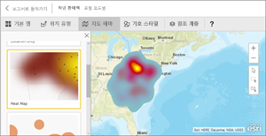
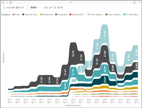
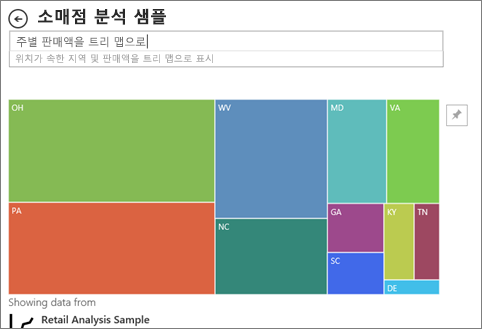

# Power BI의 시각화 유형
## Power BI 시각화
새로운 시각화를 추가할 예정이니 기대해 주세요.

[Microsoft AppSource](https://appsource.microsoft.com/marketplace/apps?product=power-bi-visuals)를 확인하면 고유한 대시보드 및 보고서에 다운로드하여 사용할 수 있는 [사용자 지정 시각적 개체](../power-bi-custom-visuals.md) 목록이 늘어나는 것을 볼 수 있습니다. 창의성이 느껴지나요? [이 커뮤니티 사이트에 고유한 시각적 개체를 만들고 추가하는 방법을 알아봅니다](../developer/office-store.md).  

## Power BI에서 사용할 수 있는 시각화 목록
이러한 시각화는 모두 Power BI 보고서에 추가하고, 질문 및 답변에서 지정하고, 대시보드에 고정할 수 있습니다.

### 영역형 차트: 기본(겹침) 및 누적

>[!TIP]
>기본 영역 차트는 축과 선 사이의 영역이 채워진 꺾은선형 차트를 기반으로 합니다.

자세한 내용은 [기본 영역 차트](power-bi-visualization-basic-area-chart.md)를 참조하세요.

### 가로 막대형 및 세로 막대형 차트

 

>[!TIP]
>여러 범주의 특정 값을 살펴보는 데는 가로 막대형 차트가 표준입니다.

### 카드: 여러 행

### 카드: 단일 숫자

자세한 내용은 [카드(큰 숫자 타일) 만들기](power-bi-visualization-card.md)를 참조하세요.

### 콤보 차트

>[!TIP]
>콤보 차트는 세로 막대형 차트와 꺾은선형 차트를 결합합니다. *꺾은선형 및 누적 세로 막대형* 과 꺾은선형 및 묶은 세로 막대형중에서 선택합니다.

자세한 내용은 [Power BI의 콤보 차트](power-bi-visualization-combo-chart.md)를 참조하세요.

### 도넛형 차트

>[!TIP]
>도넛형 차트는 원형 차트와 비슷합니다.  이 차트는 전체에 대한 부분의 관계를 보여 줍니다.

자세한 내용은 [Power BI의 도넛형 차트](power-bi-visualization-doughnut-charts.md)를 참조하세요.

### 깔대기형 차트

>[!TIP]
>깔대기형은 단계와 항목이 한 단계에서 다음 단계로 순차적으로 흐르는 프로세스를 시각화하는 데 도움이 됩니다.  잠재 고객에서 시작하여 구매 이행으로 끝나는 영업 프로세스와 같이 단계 사이에 순차적 흐름이 있는 경우 깔때기형을 사용합니다.

자세한 내용은 [Power BI의 깔때기형 차트](power-bi-visualization-funnel-charts.md)를 참조하세요.

### 계기 차트

>[!TIP]
>목표의 컨텍스트에서 현재 상태를 표시합니다.

자세한 내용은 [Power BI의 계기 차트](power-bi-visualization-radial-gauge-charts.md)를 참조하세요.

### 주요 영향 요인 차트

주요 영향 요인 차트는 선택한 결과 또는 값에 대한 주요 기여자를 표시합니다.

자세한 내용은 [Power BI의 주요 영향 요인 차트](power-bi-visualization-influencers.md)를 참조하세요.

### KPI

>[!TIP]
>측정 가능한 목표에 도달하는 진행률을 표시합니다.

자세한 내용은 [Power BI의 KPI](power-bi-visualization-kpi.md)를 참조하세요.

### 꺽은선형 차트

>[!TIP]
>일반적으로 시간에 따른 전체 값의 전체적인 모양을 강조합니다.

### 지도: 기본 지도

>[!TIP]
>공간 위치와 범주 및 정량 정보를 연결하는 데 사용됩니다.

자세한 내용은 [지도 시각 효과에 대한 팁과 트릭](power-bi-map-tips-and-tricks.md)을 참조하세요.

### 지도: ArcGIS 맵

자세한 내용은 [Power BI의 ArcGIS 지도](power-bi-visualization-arcgis.md)를 참조하세요.

### 지도: 등치 지역도

>[!TIP]
>색이 더 강할수록 값이 더 큽니다.

자세한 내용은 [Power BI의 등치 지역도](power-bi-visualization-filled-maps-choropleths.md)를 참조하세요.

### 지도: 도형 맵

>[!TIP]
>영역을 색상별로 비교합니다.

자세한 내용은 [Shape Maps in Power BI](desktop-shape-map.md)(Power BI의 도형 맵)를 참조하세요.

### 행렬

자세한 내용은 [Matrix visuals in Power BI](desktop-matrix-visual.md)(Power BI의 매트릭스 시각적 개체)를 참조하세요.

### 원형 차트

원형 차트는 전체에 대한 부분의 관계를 보여줍니다. 

### 리본 차트

리본 차트는 가장 높은 순위를 가지는 데이터 범주(가장 큰 값)를 보여줍니다. 리본 차트는 각 기간에 가장 높은 범위(값)가 항상 위쪽에 표시되어 순위 변경 내용을 효과적으로 표시합니다.

### 분산형 및 거품형 차트

>[!TIP]
>2(분산형) 또는 3(거품형) 정량 측정값 간의 관계(존재 여부, 순서 등)를 표시합니다.

자세한 내용은 [Power BI의 분산형 차트](power-bi-visualization-scatter.md)를 참조하세요.

### 분산형-고밀도

>[!TIP]
>시각적 개체에 데이터 요소가 너무 많으면 시각적 개체가 다운될 수 있으므로, 정교한 샘플링 알고리즘을 사용하여 시각화의 정확성을 보장하세요.

자세한 내용은 [High Density Scatter charts in Power BI](desktop-high-density-scatter-charts.md)(Power BI의 고밀도 분산형 차트)를 참조하세요.

### 슬라이서

자세한 내용은 [Power BI의 슬라이서](power-bi-visualization-slicers.md)를 참조하세요.

### 독립 실행형 이미지

자세한 내용은 [대시보드에 이미지 위젯 추가](../service-dashboard-add-widget.md)를 참조하세요.

### 테이블

>[!TIP]
>많은 범주가 있는 항목 간의 정량 비교에서 제대로 작동합니다.

자세한 내용은 [Power BI에서 테이블 작업](power-bi-visualization-tables.md)을 참조하세요.

### 트리맵

자세한 내용은 [Power BI의 트리 맵](power-bi-visualization-treemaps.md)을 참조하세요.

>[!TIP]
>값을 나타내는 크기와 색이 지정된 사각형으로 구성된 차트입니다.  이 차트는 사각형이 주 사각형 내에 중첩되는 계층 구조 형식일 수 있습니다.

### 폭포 차트

>[!TIP]
>폭포 차트는 값을 더하거나 뺄 때의 누계를 보여 줍니다.

자세한 내용은 [Power BI의 폭포 차트](power-bi-visualization-waterfall-charts.md)를 참조하세요.

## 질문 및 답변에 사용할 시각화 알리기
Power BI 질문 및 답변을 사용하여 자연어 쿼리를 입력할 때 쿼리에서 시각화 유형을 지정할 수 있습니다.  예:

"***시/도별 매출을 트리 맵으로***"

## 다음 단계
[Power BI 보고서의 시각화](power-bi-report-visualizations.md)    
[sqlbi.com에서 오른쪽 시각적 개체 참조](http://www.sqlbi.com/wp-content/uploads/videotrainings/dashboarddesign/visuals-reference-may2017-A3.pdf)