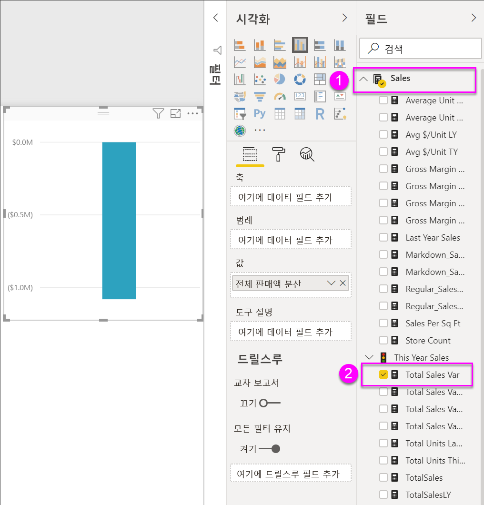
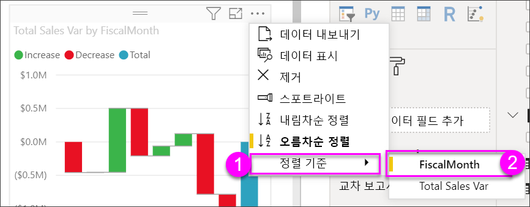

# Power BI의 폭포 차트

[!INCLUDE [power-bi-visuals-desktop-banner](../includes/power-bi-visuals-desktop-banner.md)]

폭포 차트는 Power BI가 값을 더하거나 뺄 때의 누계를 보여 줍니다. 초기 값(예: 순수입)이 일련의 양수 및 음수 변경에 어떻게 영향을 받는지 이해하는 데 유용합니다.

세로형 막대는 색으로 구분되어 증가 및 감소를 빠르게 구분할 수 있습니다. 중간 값은 부동 세로 막대인 반면, 초기 및 최종 값 세로 막대는 [가로 축에서 시작](https://support.office.com/article/Create-a-waterfall-chart-in-Office-2016-for-Windows-8de1ece4-ff21-4d37-acd7-546f5527f185#BKMK_Float "가로 축에서 시작")하는 경우가 많습니다. 이러한 스타일로 인해, 폭포 차트는 교량 차트라고도 합니다.

   > [!NOTE]
   > 이 비디오에서는 이전 버전의 Power BI Desktop을 사용합니다.
   > 
   > 

<iframe width="560" height="315" src="https://www.youtube.com/embed/qKRZPBnaUXM" frameborder="0" allow="autoplay; encrypted-media" allowfullscreen></iframe>

## 폭포 차트를 사용하는 경우

다음과 같은 경우 폭포 차트를 사용하는 것이 좋습니다.

* 시계열 또는 다른 범주에 걸쳐 측정값의 변화가 있는 경우

* 합계 값에 영향을 주는 주요 변경을 감사하는 경우

* 다양한 수익원과 총수익(또는 손실)을 표시하여 회사의 연간 수익을 그리려는 경우

* 1년 동안 회사의 시작 및 종료 인력을 나타내기 위해

* 매달 벌고 쓰는 금액이 얼마인지 그리고 계좌의 잔고가 얼마인지를 시각화하기 위해

## 필수 조건

이 자습서는 [소매점 분석 샘플 PBIX 파일](https://download.microsoft.com/download/9/6/D/96DDC2FF-2568-491D-AAFA-AFDD6F763AE3/Retail%20Analysis%20Sample%20PBIX.pbix)을 사용합니다.

1. 메뉴 모음의 왼쪽 위 섹션에서 **파일** > **열기**를 선택합니다.
   
2. **소매점 분석 샘플 PBIX 파일**을 찾습니다.

1. **소매점 분석 샘플 PBIX 파일**을 보고서 보기 으로 엽니다.

1. 선택  탭을 선택합니다.

## 폭포 차트 만들기

월별 매출 편차(실제 매출과 예상 매출의 편차)를 표시하는 폭포 차트를 만들겠습니다.

1. **필드** 창에서 **판매량** > **총판매액 차이**를 선택합니다.

   

1. 폭포 아이콘 

    

1. **시간** > **FiscalMonth**를 선택하여 **범주** 영역에 추가합니다.

    

1. Power BI에서 폭포 차트가 시간순으로 정렬되도록 합니다. 차트의 오른쪽 위에서 **추가 옵션**(...)을 선택합니다.

    이 예제에서는 **오름차순 정렬**을 선택합니다.

    **오름차순 정렬** 왼쪽 옆에 노란색 표시가 있는지 확인합니다. 이는 선택한 옵션이 적용되고 있음을 나타냅니다.

    

    다음으로, **정렬 기준**을 클릭하고 **회계 월**을 선택합니다. 앞 단계에서와 마찬가지로 선택 사항 옆의 노란색 표시는 선택한 옵션이 적용되고 있음을 나타냅니다.

    

    X축 값을 살펴보고 **1월**에서 **8월**까지 순서대로 표시할 수도 있습니다.

    조금 더 세부적으로 들어가 월간 편차의 가장 큰 요인을 살펴봅니다.

1.  **매장** > **지역**을 선택하여 **분석 결과** 버킷에 **지역**을 추가합니다.

    

    기본적으로 Power BI는 월별 증가 또는 감소에 상위 5개 요인을 추가합니다. 아래 이미지에서는 더 많은 데이터를 포함하도록 시각화 창이 확장되었습니다. 

    

    상위 2개 요인에만 관심이 있는 경우

1. **서식** 창에서 **분석 결과**를 선택하고 **최대 분석 결과**를 **2**로 설정합니다.

    

    간단히 살펴보면 오하이오 및 펜실베이니아 지역이 폭포 차트의 증감에 가장 큰 영향을 주는 지역인 것으로 보입니다.

    

## 다음 단계

* [Power BI 보고서에서 시각적 개체가 조작되는 방식 변경](../service-reports-visual-interactions.md)

* [Power BI의 시각화 유형](power-bi-visualization-types-for-reports-and-q-and-a.md)
