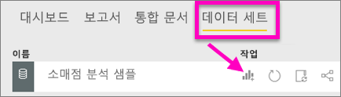
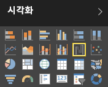
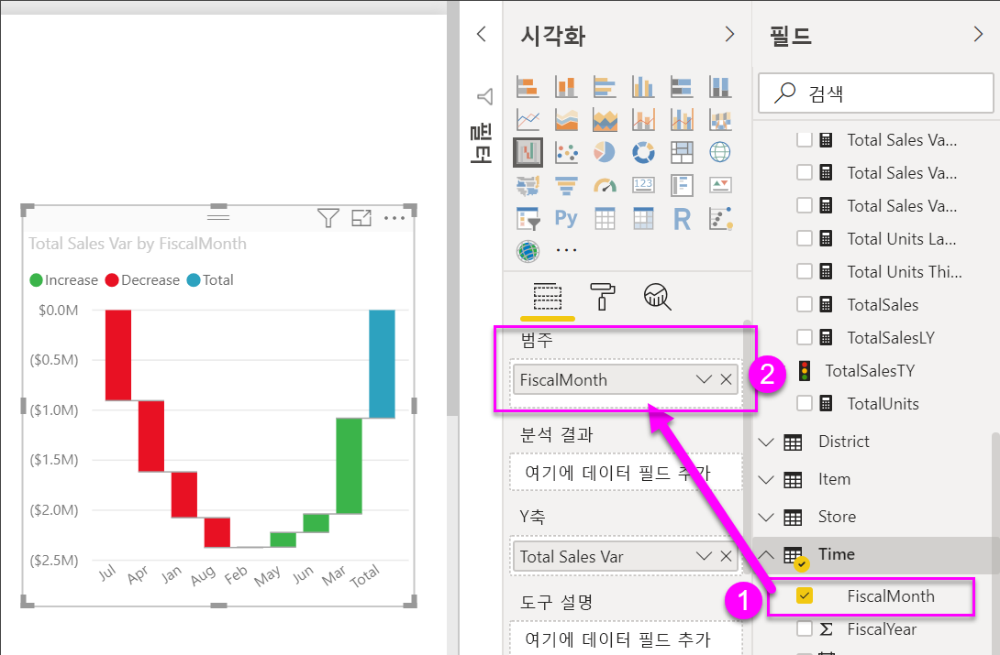
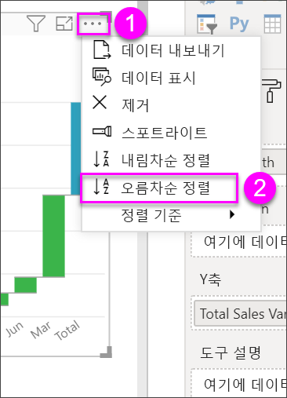
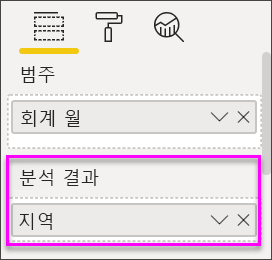
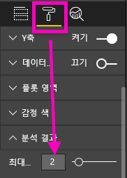

# Power BI의 폭포 차트
폭포 차트는 값을 더하거나 뺄 때의 누계를 보여줍니다. 초기 값(예: 순수입)이 일련의 양수 및 음수 변경에 어떻게 영향을 받는지 이해하는 데 유용합니다.

세로형 막대는 색으로 구분되어 증가 및 감소를 빠르게 구분할 수 있습니다. 중간 값 열이 부동 세로형 막대인 반면, 초기 및 최종 값 세로형 막대는 종종 [가로축에서 시작합니다](https://support.office.com/article/Create-a-waterfall-chart-in-Office-2016-for-Windows-8de1ece4-ff21-4d37-acd7-546f5527f185#BKMK_Float "가로축에서 시작합니다"). 이러한 "보기"로 인해, 폭포 차트는 교량 차트라고도 합니다.

<iframe width="560" height="315" src="https://www.youtube.com/embed/qKRZPBnaUXM" frameborder="0" allow="autoplay; encrypted-media" allowfullscreen></iframe>

## 폭포 차트를 사용하는 경우
다음과 같은 경우 폭포 차트를 사용하는 것이 좋습니다.

* 시계열 또는 다른 범주에 걸쳐 측정값의 변화가 있는 경우
* 합계 값에 영향을 주는 주요 변경을 감사하는 경우
* 다양한 수익원과 총 수익(또는 손실)을 표시하여 회사의 연간 수익을 계산하는 경우
* 1년 동안 회사의 시작 및 종료 인력을 나타내기 위해
* 매달 벌고 쓰는 금액이 얼마인지 그리고 계좌의 잔고가 얼마인지를 시각화하기 위해 

## 폭포 차트 만들기
월별 매출 편차(실제 매출과 예상 매출의 편차)를 표시하는 폭포 차트를 만들겠습니다. 이를 수행하려면 Power BI에 로그인하고 **데이터 가져오기 \> 샘플 \> 소매 분석 샘플**을 선택합니다. 

1. **데이터 세트** 탭을 선택하고 새로운 "소매 분석 샘플" 데이터 세트로 스크롤합니다.  **보고서 만들기** 아이콘을 선택하여 보고서 편집 보기에서 데이터 세트를 엽니다. 
   
    
2. **필드** 창에서 **판매액 \> 총 판매액 분산**을 선택합니다. 
3. 차트를 **폭포**로 변환합니다. **총 판매액 분산** 이 **Y축** 영역에 없는 경우, 그곳으로 끌어 놓습니다.
   
    
4. **시간** \> **회계 월**을 선택하여 **범주**에 추가합니다. 
   
    
5. 폭포 차트를 시간순으로 정렬합니다. 차트의 오른쪽 위 모서리에서 줄임표(...)를 선택하고 **회계 월**을 선택합니다.
   
    
   
    
6. 조금 더 세부적으로 들어가 월간 편차의 가장 큰 요인을 살펴봅니다. **매장** > **지역**을 **분석** 버킷으로 끕니다.
   
    
7. 기본적으로 Power BI는 월별 증가 또는 감소에 상위 5개 요인을 추가합니다. 하지만 상위 2개 요인에만 관심이 있는 경우  서식 지정 창에서 **분석**을 선택하고 **최대값**을 2로 설정하면 됩니다.
   
    
   
    간단히 살펴보면 오하이오 및 펜실베니아 지역이 폭포 차트의 증감에 가장 큰 영향을 주는 지역인 것으로 보입니다. 
   
    
8. 흥미로운 결과입니다. 이 두 지역의 매출이 다른 지역보다 훨씬 더 높아서 이처럼 큰 영향을 주는 것일까요?  확인해 보겠습니다. 올해와 작년의 지역별 매출을 보여 주는 지도를 만듭니다.  
   
    
   
    지도가 이 이론을 뒷받침해 주고 있습니다.  이 두 지역의 작년(거품 크기)과 올해(거품 음영) 매출이 최고값을 기록했다고 나와 있습니다.

## 강조 표시 및 교차 필터링
필터 창 사용 방법에 대한 자세한 내용은 [보고서에 필터 추가](../power-bi-report-add-filter.md)를 참조하세요.

보고서 페이지에서 다른 시각화 요소를 교차 필터링하는 폭포 차트에서 세로형 막대를 강조 표시하고 그 반대의 경우도 마찬가지입니다. 그러나 총 세로형 막대는 강조 표시를 트리거하지 않거나 교차 필터링에 응답하지 않습니다.

## 다음 단계

[시각적 개체 상호 작용](../service-reports-visual-interactions.md)

[Power BI의 시각화 유형](power-bi-visualization-types-for-reports-and-q-and-a.md)