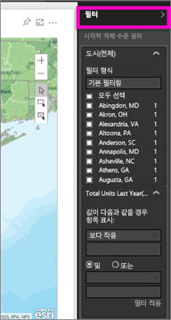
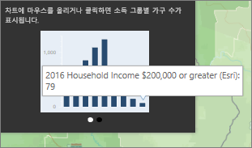
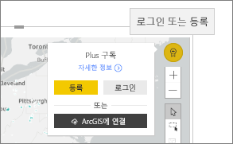

# Power BI에서 ArcGIS 지도와 상호 작용
이 토픽은 Power BI 서비스, 데스크톱 또는 모바일에서 ArcGIS 지도를 *사용하는* 사람의 관점에서 작성됩니다. 작성자가 ArcGIS 지도를 사용자와 공유하면 여러 가지 방법으로 해당 지도와 상호 작용할 수 있습니다.  ArcGIS 지도를 작성하는 방법에 대한 자세한 내용은 [Esri에서 제공하는 ArcGIS 지도](../power-bi-visualization-arcgis.md)를 참조하세요.

ArcGIS 지도와 Power BI의 조합은 지도에서 요소의 표현을 넘어서 완전히 새로운 수준으로 매핑합니다. 기본 지도, 위치 유형, 테마, 기호 스타일 및 참조 계층 등 사용 가능한 옵션으로 멋진 정보 제공용 지도 시각화를 만듭니다. 공간 분석과 지도의 신뢰할 수 있는 데이터 계층(인구 조사 데이터 등)의 조합은 시각화에서 데이터의 심도 깊은 이해를 제공합니다.

> [!TIP]
> GIS는 Geographic Information Science(지리적 정보 과학)의 약자입니다.
> 

사용하는 예제는 [Esri에서 제공하는 ArcGIS 지도](../power-bi-visualization-arcgis.md)에서 만든 ArcGIS 지도와 동일합니다. 도시별 작년 판매액을 보고, 거리 기본 지도, 크기를 나타내는 버블 기호, 평균 가구 소득에 대한 참조 계층을 사용합니다. 지도에는 3개의 핀과 한 번의 운행 시간 반경(자주색)이 있습니다.

> [!TIP]
> [Power BI의 esri 페이지](https://www.esri.com/powerbi)를 방문하여 많은 예제를 참조하고 추천서를 봅니다. 그런 다음 esri의 [Power BI용 ArcGIS 지도 시작 페이지](https://doc.arcgis.com/en/maps-for-powerbi/get-started/about-maps-for-power-bi.htm)를 참조하세요.
> 
> 

 

## 사용자 동의
동료가 사용자와 ArcGIS 지도를 처음 공유하면 Power BI는 프롬프트를 표시합니다. ArcGIS Maps for Power BI는 Esri(www.esri.com)에서 제공하고 ArcGIS Maps for Power BI 사용은 Esri의 사용 약관 및 개인 정보 보호 정책에 따릅니다. Power BI용 ArcGIS Maps 시각적 개체를 사용할 Power BI 사용자는 승인 대화 상자를 수락해야 합니다.

## 선택 도구
Power BI용 ArcGIS Maps에서는 세 가지 선택 모드를 사용할 수 있습니다. 최대 250개 데이터 요소를 한 번에 선택할 수 있습니다.

 개별 데이터 요소를 선택합니다.

 지도에 사각형을 그린 후 포함된 데이터 요소를 선택합니다. CTRL 키를 사용하여 둘 이상의 직사각형 영역을 선택합니다.

 사용할 참조 계층에 사용된 경계 또는 다각형을 통해 포함된 데이터 요소를 선택합니다.

 

## ArcGIS 지도와 상호 작용
사용 가능한 기능은 사용자가 *작성자*(지도를 만든 사람)인지 *소비자*(사용자와 ArcGIS 지도를 공유한 사람)인지에 따라 달라집니다. 소비자로서 ArcGIS 지도와 상호 작용하는 경우(즉, [읽기용 보기](../consumer/end-user-reading-view.md)), 할 수 있는 작업은 다음과 같습니다.

* ‘보기’ 권한을 가진 프리미엄 소비자는 [시각화를 만드는 데 사용되는 데이터를 보고](../consumer/end-user-show-data.md), [구독](../consumer/end-user-subscribe.md)하고, [포커스 모드 및 전체 화면 모드](../consumer/end-user-focus.md)에서 지도를 보고, [관련 콘텐츠를 보고](../consumer/end-user-related.md), ‘보고서 작성자’가 설정한 [필터를 조작](../consumer/end-user-report-filter.md)하고, [보고서를 공유](../service-share-reports.md)할 수 있습니다.

* 다른 시각화 형식과 마찬가지로 Power BI **Pro** 소비자는 프리미엄 소비자가 수행할 수 있는 모든 작업을 수행할 뿐 아니라, [기본 데이터를 내보내고](power-bi-visualization-export-data.md), [사용 메트릭](../service-usage-metrics.md)을 가져오고, 복사본을 저장하고, [웹에 게시](../service-publish-to-web.md)할 수 있습니다.

    
* 필터를 사용하여 맵을 탐색하기 위해 **필터** 창을 확장합니다.   
      
* 지도에 참조 계층이 있는 경우 도구 설명에 세부 정보를 표시할 위치를 선택합니다. 여기에서 Adams 카운티를 선택하고 작성자가 지도에 추가한 평균 가구 소득 참조 계층의 데이터를 참조합니다.
  
      
  
    이 경우 차트도 만들 수 있습니다. 차트에서 막대를 선택하여 데이터를 살펴봅니다. 여기에서 Adams 카운티의 79 가구의 소득이 200,000달러 이상이라는 것을 알 수 있습니다.
  
    
  
    화살표를 선택하여 추가 차트를 표시합니다.
* 도구 설명에 세부 정보를 표시할 기본 지도 위치 기호를 마우스로 가리킵니다.     
  
  
  > [!TIP]
  > 특정 위치를 선택하기 위해 확대해야 할 수 있습니다.  위치가 겹치는 경우 Power BI에서 한 번에 1개 이상의 도구 설명을 제공할 수 있습니다. 화살표를 선택하여 도구 설명 사이를 이동합니다.
  > 
  > 
  > 
  > 
* 작성자가 인포그래픽 계층을 ArcGIS 지도에 추가하는 경우 지도의 오른쪽 상단 모퉁이에 표시되는 추가 데이터를 볼 수 있습니다.  예를 들어, 여기에서는 지도 생성자가 "14세 이하 어린이"를 추가했습니다.
  
    

## 고려 사항 및 제한 사항
Power BI용 ArcGIS Maps는 다음과 같은 서비스 및 응용 프로그램에서 사용할 수 있습니다.

<table>
<tr><th>서비스/앱</th><th>가용성</th></tr>
<tr>
<td>Power BI Desktop</td>
<td>예</td>
</tr>
<tr>
<td>Power BI 서비스(app.powerbi.com)</td>
<td>예</td>
</tr>
<tr>
<td>Power BI 모바일 응용 프로그램</td>
<td>예</td>
</tr>
<tr>
<td>Power BI 웹에 게시</td>
<td>아니요</td>
</tr>
<tr>
<td>Power BI Embedded</td>
<td>아니요</td>
</tr>
<tr>
<td>Power BI 서비스 포함(PowerBI.com)</td>
<td>아니요</td>
</tr>
</table>

**ArcGIS Maps for Power BI를 함께 작동하는 방법**
ArcGIS Maps for Power BI는 Esri(www.esri.com)에서 제공합니다. ArcGIS Maps for Power BI의 사용은 Esri의 [사용 약관](https://go.microsoft.com/fwlink/?LinkID=8263222) 및 [개인 정보 보호 정책](https://go.microsoft.com/fwlink/?LinkID=826323)에 따릅니다. Power BI용 ArcGIS Maps 시각적 개체를 사용할 Power BI 사용자는 승인 대화 상자를 수락해야 합니다(자세한 내용은 사용자 동의 참조).  Esri의 ArcGIS Maps for Power BI를 사용하는 작업은 승인 대화 상자에 연결되어 있는 Esri의 사용 약관 및 개인 정보 보호 정책에 따릅니다. 각 사용자는 처음으로 ArcGIS Maps for Power BI를 사용하기 전에 동의해야 합니다. 사용자가 동의하면 시각적 개체에 바인딩된 데이터는 지오코딩을 위해 Esri의 서비스로 전송됩니다. 즉, 위치 정보를 맵에 표시될 수 있는 위도 및 경도 정보로 변환하는 것입니다. 데이터 시각화에 바인딩된 모든 데이터를 Esri의 서비스에 보낼 수 있다고 가정해야 합니다. Esri에서는 기본 맵, 공간 분석, 지오코딩 등와 같은 서비스를 제공합니다. ArcGIS Maps for Power BI 시각적 개체는 Esri에서 제공되고 유지 관리되는 인증서에 의해 보호되는 SSL 연결을 사용하여 이러한 서비스와 상호 작용합니다. ArcGIS Maps for Power BI에 대한 추가 정보는 Esri의 [ArcGIS Maps for Power BI 제품 페이지](https://www.esri.com/powerbi)에서 가져올 수 있습니다.

**Power BI Plus**    

사용자가 ArcGIS Maps for Power BI를 통해 Esri에서 제공된 추가 구독에 등록하는 경우 Esri와 직접 관계로 전환됩니다. Power BI는 Esri에 사용자에 대한 개인 정보를 전송하지 않습니다. 사용자가 고유한 AAD ID를 사용하여 Esri 제공 AAD 응용 프로그램에 로그인하고 트러스트합니다. 이렇게 하면 사용자는 Esri와 개인 정보를 직접 공유하게 됩니다. 사용자가 ArcGIS Maps for Power BI 시각적 개체에 추가 콘텐츠를 추가하면 다른 Power BI 사용자도 해당 콘텐츠를 보거나 편집하기 위해 Esri의 추가 구독이 필요합니다. 

Esri의 ArcGIS Maps for Power BI가 작동하는 방법에 대한 기술적인 세부 질문은 해당 지원 사이트를 통해 Esri에 문의하세요.

**ArcGIS 지도가 표시되지 않는 경우**    
Power BI용 ArcGIS Maps를 사용할 수 없는 서비스 또는 응용 프로그램에서 시각화는 빈 Power BI 로고와 함께 빈 시각적 개체로서 표시합니다.

**지도에 내 정보가 일부 표시되지 않는 경우**    
지도에 위도/경도를 지오코딩할 경우 최대 30,000개의 데이터 요소가 표시됩니다. 우편 번호 또는 거리 주소와 같은 데이터 요소를 지오코딩하면 처음 15,000개의 데이터 요소만 지오코딩됩니다. 지오코딩 장소 이름 또는 국가는 1500개 주소 제한에 적용되지 않습니다.

**Power BI용 ArcGIS Maps를 사용하는 경우 요금이 부과됩니까?**

Power BI용 ArcGIS Maps는 추가 비용 없이 모든 Power BI 사용자가 사용할 수 있습니다. **Esri**에서 제공하는 구성 요소이며, 이 문서의 앞 부분에서 설명했듯이 **Esri**의 사용 약관 및 개인 정보 보호 정책에 따라 사용할 수 있습니다. ArcGIS **Plus**를 구독하면 비용이 청구됩니다.

**내 캐시가 가득 찼다는 오류 메시지가 나타나는 경우**

이는 해결 중인 버그입니다.  오류 메시지에 나타나는 링크를 선택하여 Power BI 캐시 지우기에 대한 지침을 참조합니다.

**오프라인에서 ArcGIS 지도를 볼 수 있습니까?**

아니요, 지도를 표시하려면 Power BI는 네트워크 연결이 필요합니다.

## 다음 단계
도움말 보기: **Esri**에서는 **Power BI용 ArcGIS Maps** 기능 모음에 대한 [종합적인 설명서](https://go.microsoft.com/fwlink/?LinkID=828772)를 제공하고 있습니다.

[**Power BI용 ArcGIS Maps**와 관련된 Power BI 커뮤니티](https://go.microsoft.com/fwlink/?LinkID=828771)에서 질문하고 최신 정보를 얻고 문제를 보고하고 대답을 찾을 수 있습니다.

개선을 위해 제안할 사항이 있으면 [Power BI 아이디어 목록](https://ideas.powerbi.com)에 제출해 주십시오.

[Power BI용 ArcGIS Maps 제품 페이지](https://www.esri.com/powerbi)
