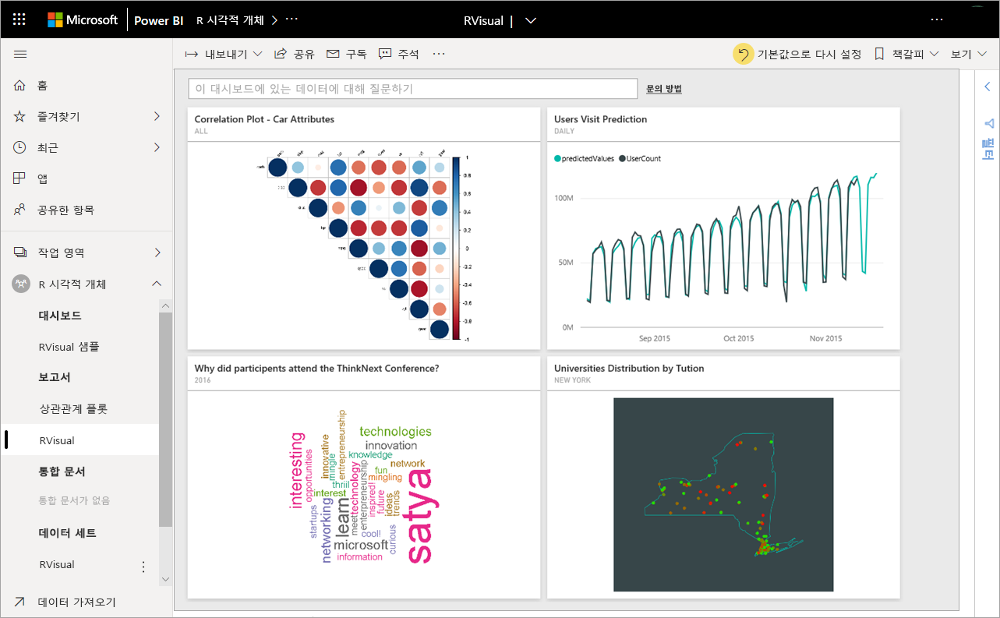
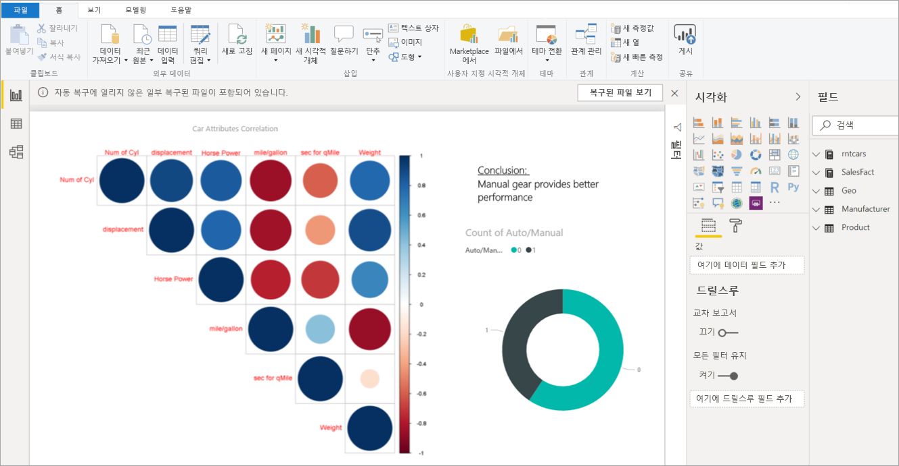
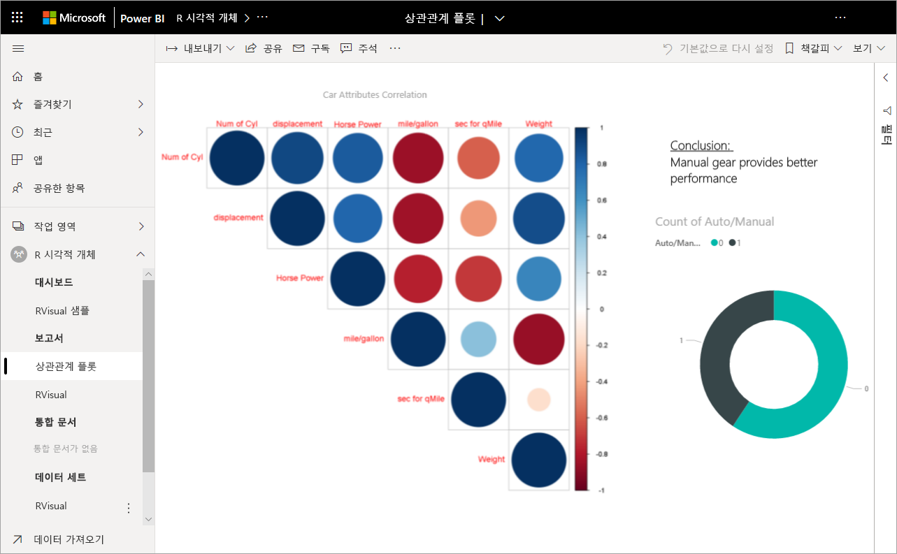
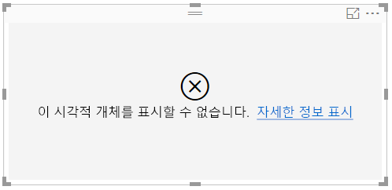

# Power BI의 R 시각적 개체
R 시각적 개체는 현재 **Power BI Desktop**에서 만든 다음 Power BI 서비스에 게시할 수 있습니다. R 시각적 개체 만들기에 대한 자세한 내용은 [R을 사용하여 Power BI 시각적 개체 만들기](../desktop-r-visuals.md)를 참조하세요.

## Power BI 서비스에서 R 시각적 개체 보기
Power BI 서비스는 R 스크립트를 사용하여 만든 시각적 개체 보기 및 상호 작용을 지원합니다. 일반적으로 *R 시각적 개체* 라고 하는 R 스크립트를 사용하여 만든 시각적 개체는 R의 풍부한 분석 및 시각화 기능을 사용하여 예측과 같은 고급 데이터 셰이핑 및 분석을 제공할 수 있습니다.

> [!NOTE]
> [R 프로그래밍 언어](https://www.r-project.org/)는 프로그래밍 언어 중 통계학자, 데이터 과학자 및 비즈니스 분석가에 의해 가장 널리 사용되는 언어입니다. R 언어는 널리 사용되는 R 사용자 그룹과 함께 7,000개 이상의 추가 기능 패키지를 제공하는 오픈 소스 커뮤니티를 보유합니다. Power BI 서비스에 배포된 R 버전은 *Microsoft R 3.4.4입니다.*
> 
> 

다음 그림은 고급 분석에 사용되는 R 시각적 개체의 컬렉션과 함께 Power BI 대시보드를 보여 줍니다.

R 시각적 개체는 다음 그림에 표시된 보고서와 같이 [Power BI Desktop 보고서](../desktop-get-the-desktop.md)에서 생성됩니다.

**Power BI Desktop**에서 보고서가 만들어지면 하나 이상의 R 시각적 개체를 포함하는 보고서를 Power BI 서비스에 게시할 수 있습니다. 

 서비스에서 R 패키지 중 일부만 지원됩니다. Power BI 서비스에서 현재 지원되는 패키지 목록은 이 문서의 끝에 지원되는 패키지를 참조하세요.

몇 가지 R 시각적 개체를 포함하는 이 [샘플 Power BI Desktop 파일](https://download.microsoft.com/download/D/9/A/D9A65269-D1FC-49F8-8EC3-1217E3A4390F/RVisual_correlation_plot_sample%20SL.pbix)(.pbix 파일)을 다운로드하여 작동 방법을 확인하고 실험할 수 있습니다.

**Power BI Desktop**에서 만들어진 다음 Power BI 서비스에 게시되는 대부분의 R 시각적 개체는 Power BI 서비스에서 다른 시각적 개체처럼 작동합니다. 상호 작용, 필터링, 분할 및 대시보드에 고정하거나 다른 사용자와 공유할 수 있습니다. 대시보드 및 시각적 개체 공유에 대한 자세한 내용은 [동료 및 다른 사용자와 대시보드 공유](../service-share-dashboards.md)를 참조하세요. 다른 시각적 개체와의 한 가지 차이점은 R 시각적 개체는 도구 설명을 표시할 수 없고 다른 시각적 개체 필터링에 사용될 수 없다는 것입니다.

다음 그림에서 볼 수 있듯이 대시보드 또는 보고서의 Power BI 서비스에서 R 시각적 개체는 크게 나타나고 다른 시각적 개체처럼 작동하며 사용자는 시각적 개체를 만든 기본 R 스크립트를 알아야 할 필요는 없습니다.

## R 스크립트 보안
R 시각적 개체는 R 스크립트에서 생성되며 보안 또는 개인 정보 위험에 대한 코드를 잠재적으로 포함할 수 있습니다.

이러한 위험은 스크립트 작성자가 사용자의 컴퓨터에서 스크립트를 실행할 때 작성 단계에서 주로 존재합니다.

Power BI 서비스는 *샌드박스* 기술을 적용하여 사용자 및 서비스를 보안 위험으로부터 보호합니다.

이 *샌드박스* 방법은 Power BI 서비스에서 실행되는 R 스크립트에서 인터넷에 액세스 또는 R 시각적 개체를 만들 필요가 없는 다른 리소스에 액세스와 같은 몇 가지 제한을 적용합니다.

## R 스크립트 오류 경험
R 스크립트에 오류가 발생하면 R 시각적 개체가 그려지지 않고 오류 메시지가 표시됩니다. 오류에 대한 자세한 내용을 보려면 다음 그림에 나와 있는 것처럼 캔버스의 R 시각적 개체 오류에서 **자세한 정보 표시** 를 선택합니다.

또 다른 예로 다음 그림은 R 스크립트가 Azure에서 R 패키지 누락으로 인해 제대로 실행되지 못했을 때 나타나는 오류 메시지를 보여 줍니다.

## 라이선싱
R 시각적 개체는 보고서, 새로 고침, 필터 및 교차 필터를 렌더링하는 데 [Power BI Pro](../service-self-service-signup-for-power-bi.md) 라이선스가 필요합니다. Power BI Pro 라이선스 및 무료 라이선스와의 차이점에 대한 자세한 내용은 [Power BI Pro 콘텐츠란?](../service-admin-purchasing-power-bi-pro.md)을 참조하세요.

Power BI의 무료 사용자만 프리미엄 작업 영역에서 다른 사용자와 공유된 타일을 사용할 수 있습니다. 자세한 내용은 [Power BI Pro 구매](../service-admin-purchasing-power-bi-pro.md)를 참조하세요.

다음 표는 라이선스를 기준으로 R 시각적 개체 기능을 설명합니다.

|  |Power BI Desktop에서 R 시각적 개체 작성  | R 시각적 개체로 PBI 서비스 보고서 만들기 |보고서의 R 시각적 개체 보기  | 대시보드의 R 타일 보기 |
|---------|---------|---------|---------|--------|
|**게스트**(Power BI embedded)     |  지원됨|  지원되지 않음      | 프리미엄/Azure 용량에서만 지원됨  | 프리미엄/Azure 용량에서만 지원됨 |
|**관리되지 않는 테넌트**(도메인 확인되지 않음) | 지원됨 | 지원되지 않음 |  지원되지 않음 |지원됨(B2B 시나리오) |
|무료 라이선스로 **관리되는 테넌트**    |  지원됨       |  지원되지 않음       |    프리미엄 용량에서만 지원됨    | 지원됨 |
Pro 라이선스로 **관리되는 테넌트**     |   지원됨      | 지원됨      | 지원됨    |지원됨|

## 알려진 제한 사항
Power BI 서비스의 R 시각적 개체에는 몇 가지 제한 사항이 있습니다.

* R 시각적 개체 지원은 [지원되는 R 패키지에 대해 알아보기](../service-r-packages-support.md)에 식별된 패키지로 제한됩니다. 현재 사용자 지정 패키지에 대한 지원이 없습니다.
* 데이터 크기 제한 – R 시각적 개체가 그리기에 사용하는 데이터가 150,000행으로 제한됩니다. 150,000개를 초과하는 행을 선택할 경우 상위 150,000개만 사용되고 이미지에 메시지가 표시됩니다.
* 계산 시간 제한 - R 시각적 개체 계산 시간이 60초를 초과하면 스크립트 시간이 초과되어 오류가 발생합니다.
* 데이터 업데이트, 필터링 및 강조 표시가 발생하면 R 시각적 개체가 새로 고쳐집니다. 그러나 이미지 자체는 대화형이 아니며 도구 설명을 지원하지 않습니다.
* 다른 시각적 개체를 강조 표시하면 R 시각적 개체가 그에 응답하지만 R 시각적 개체의 요소를 클릭하여 다른 요소를 교차 필터링할 수는 없습니다.
* *시간* 데이터 형식에 대해 R 시각적 개체는 현재 지원되지 않습니다. 날짜/시간을 대신 사용하세요.
* **웹에 게시**를 사용하는 경우 R 시각적 개체는 표시되지 않습니다.
* R 시각적 개체는 현재 대시보드 및 보고서 인쇄를 인쇄하지 않습니다.
* R 시각적 개체는 현재 Analysis Services의 DirectQuery 모드에서 지원되지 않습니다.
* R 시각적 개체는 텍스트 레이블을 그래픽 요소로 변환하는 기능을 제공합니다. Power BI 서비스에서 이 작업을 수행하려면 다음과 같은 추가 단계가 필요합니다.
  
  * R 스크립트의 시작 부분에 다음 줄을 추가합니다.
    
        powerbi_rEnableShowText =  1
* 한국어, 중국어, 일본어 글꼴이 Power BI 서비스에서 제대로 작동하려면 다음 추가 단계가 모두 필요합니다.
  
  * 먼저 R 패키지 *showtext*와 모든 종속성을 설치합니다. 다음 스크립트를 실행하면 됩니다.
    
        *install.packages("showtext")*
  * 다음으로 R 스크립트의 시작 부분에 다음 줄을 추가합니다.
    
        powerbi_rEnableShowTextForCJKLanguages =  1

## R 패키지 개요
R 패키지는 잘 정의된 형식으로 결합된 R 함수, 데이터 및 컴파일된 코드의 컬렉션입니다. R을 설치할 경우 패키지의 표준 집합과 함께 제공되며 다른 패키지를 다운로드 및 설치할 수 있습니다. 설치되면 사용할 세션으로 R 패키지를 로드해야 합니다. R 패키지의 주 원본은 CRAN([Comprehensive R Archive Network](https://cran.r-project.org/web/packages/available_packages_by_name.html))입니다.

**Power BI Desktop**은 제한 없이 모든 유형의 R 패키지를 사용할 수 있습니다. 예를 들어, [RStudio IDE](https://www.rstudio.com/)를 사용하여 **Power BI Desktop**에서 사용할 R 패키지를 직접 설치할 수 있습니다.

**Power BI 서비스**의 R 시각화 개체는 [이 문서](../service-r-packages-support.md)에 나오는 **지원 패키지** 섹션에 있는 패키지에서 지원됩니다. 지원 되는 패키지 목록에서 관심이 있는 패키지를 찾을 수 없는 경우 패키지의 지원을 요청할 수 있습니다. 지원을 요청하는 방법에 대한 내용은 [Power BI 서비스의 R 패키지](../service-r-packages-support.md)를 참조하세요.

### R 패키지의 요구 사항 및 제한 사항
R 패키지에 대한 몇 가지 요구 사항 및 제한 사항이 있습니다.

* 대부분의 경우에 Power BI 서비스에서는 GPL-2, GPL-3, MIT+ 등과 같은 무료 오픈 소스 소프트웨어 라이선스를 포함한 R 패키지를 지원합니다.
* Power BI 서비스는 CRAN에 게시된 패키지를 지원합니다. 서비스는 프라이빗 또는 사용자 지정 R 패키지를 지원하지 않습니다. 사용자가 Power BI 서비스에서 사용할 수 있는 패키지를 요청하기 전에 CRAN에서 자신의 프라이빗 패키지를 사용할 수 있도록 만드는 것이 좋습니다.
* **Power BI Desktop**에는 R 패키지에 대한 두 가지 변형이 있습니다.
  
  * R 시각적 개체의 경우 사용자 지정 R 패키지를 포함한 모든 패키지를 설치할 수 있습니다.
  * 사용자 지정 R 시각적 개체의 경우 CRAN 패키지에만 패키지의 자동 설치를 지원합니다.
* 현재 서비스에서는 보안 및 개인 정보 보호를 위해 World-Wide Web(예: RgoogleMaps)에 클라이언트 서버 쿼리를 제공하는 R 패키지를 지원하지 않습니다. 이러한 시도에 대한 네트워킹이 차단됩니다. 지원되거나 지원되지 않는 R 패키지 목록은 [Power BI 서비스의 R 패키지](../service-r-packages-support.md)를 참조하세요.
* 새 R 패키지를 포함하는 승인 프로세스에는 종속성 트리가 있습니다. 따라서 서비스에 설치되어야 하는 일부 종속성을 지원할 수 없습니다.

### 지원되는 패키지:
지원되는 R 패키지의 긴 목록은(및 지원되지 않는 패키지의 짧은 목록) 다음 문서를 참조하세요.

* [Power BI 서비스의 R 패키지](../service-r-packages-support.md)

