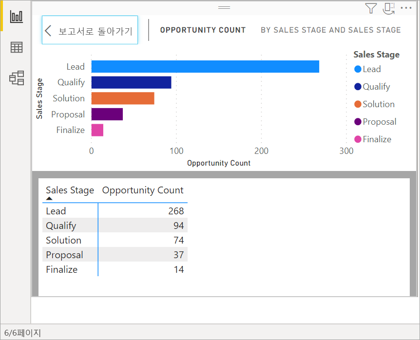
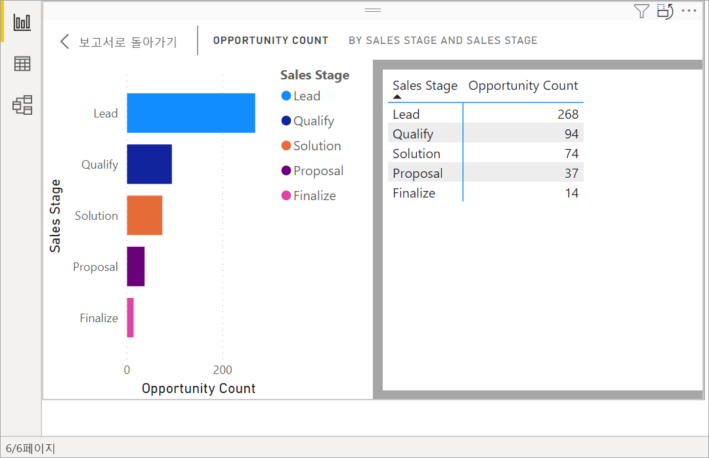
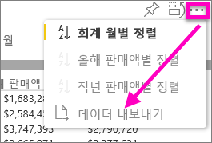
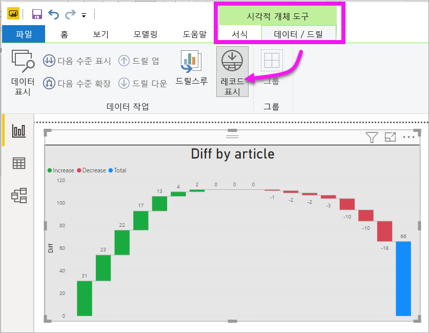
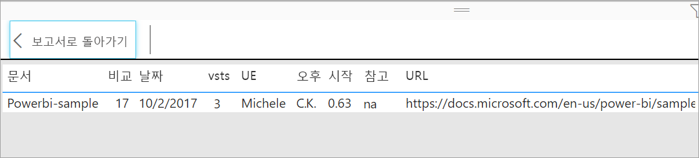

# 시각화의 기본 데이터 표시

## 데이터 표시
Power BI 시각화는 데이터 세트에서 데이터를 사용하여 구성됩니다. 숨은 기능에 관심이 있는 경우 Power BI를 사용하면 시각적 개체를 만드는 데 사용되는 데이터를 *표시*할 수 있습니다. **데이터 표시**를 선택하면 Power BI는 시각화 아래(또는 옆)에 데이터를 표시합니다.

시각화를 만드는 데 사용되는 데이터를 .xlsx 또는 .csv 파일로 내보내고 Excel에서 볼 수도 있습니다. 자세한 내용은 [Power BI 시각화에서 데이터 내보내기](power-bi-visualization-export-data.md)를 참조하세요.

> [!NOTE]
> *데이터 표시* 및 *데이터 내보내기*는 모두 Power BI 서비스 및 Power BI Desktop에서 사용할 수 있습니다. Power BI Desktop은 하나의 추가 세부 정보 계층을 제공합니다. [*레코드 표시*는 데이터 세트에서 실제 행을 표시합니다](../desktop-see-data-see-records.md).
> 
> 

## *데이터 표시* 사용 
1. Power BI Desktop에서 시각화를 선택하여 활성화합니다.

2. **기타 작업**(...)을 선택하고 **데이터 표시**를 선택합니다. 
    

3. 기본적으로 데이터는 시각적 개체 아래에 표시됩니다.
   
   

4. 방향을 변경하려면 시각화의 오른쪽 위에서 세로 레이아웃  을 선택합니다.
   
   
5. 데이터를 .csv 파일로 내보내려면 줄임표를 선택하고 **데이터 내보내기**를 선택합니다.
   
    
   
    데이터를 Excel로 내보내기에 대한 자세한 내용은 [Power BI 시각화에서 데이터 내보내기](power-bi-visualization-export-data.md)를 참조하세요.
6. 데이터를 숨기려면 **탐색** > **데이터 표시**를 선택 취소합니다.

## 레코드 표시 사용
시각화에서 하나의 데이터 레코드에 포커스를 맞추고 그 뒤의 데이터로 드릴할 수도 있습니다. 

1. **레코드 표시**를 사용하려면 시각화를 선택하여 활성화합니다. 

2. 데스크톱 리본에서 **시각적 도구** > **데이터/드릴** > **레코드 표시**를 선택합니다. 

    

3. 시각화에서 데이터 요소나 행을 선택합니다. 이 예제에서는 왼쪽에서 네 번째 열을 선택했습니다. Power BI에서 이 데이터 요소에 대한 데이터 세트 레코드를 표시합니다.

    

4. **보고서로 돌아가기**를 선택하여 Desktop 보고서 캔버스로 돌아갑니다. 

## 고려 사항 및 문제 해결

- 리본의 **레코드 표시** 단추가 사용하지 않도록 설정되어 회색으로 표시되면 선택된 시각화가 레코드 표시를 지원하지 않는 것입니다.
- 레코드 표시 보기에서 데이터를 변경하고 다시 보고서에 저장할 수 없습니다.
- 시각적 개체에서 계산된 측정값을 사용할 때는 레코드 표시를 사용할 수 없습니다.
- 라이브 MD(다차원) 모델에 연결된 경우 레코드 표시를 사용할 수 없습니다.  

## 다음 단계
[Power BI 시각화에서 데이터 내보내기](power-bi-visualization-export-data.md)    

궁금한 점이 더 있나요? [Power BI 커뮤니티를 이용하세요.](https://community.powerbi.com/)

