# Power BI의 색 서식을 위한 팁과 힌트
Power BI는 대시보드 및 보고서를 사용자 지정할 수 있는 다양한 방법을 제공합니다. 이 아티클에서는 사용자의 요구에 맞게 Power BI를 보다 매력적이고 흥미롭게 시각화하고 사용자 지정할 수 있는 팁 모음에 대해 자세히 다룹니다.

다음 팁을 제공합니다. 다른 유용한 팁이 있나요? 좋습니다! 팁을 보내주시면 이 목록에 추가하는 것을 고려해 보겠습니다.

* 단일 데이터 요소 색 변경
* 숫자 값 기준 차트 색
* 필드 값 기준 데이터 요소 색
* 색 눈금에 사용되는 색 사용자 지정
* 색 눈금 분기 사용
* Power BI에서 실행 취소 방법

변경하려면 보고서를 편집하고 있어야 합니다. 보고서를 열고 다음 그림과 같이 위쪽 메뉴 영역에서 **보고서 편집**을 선택합니다.

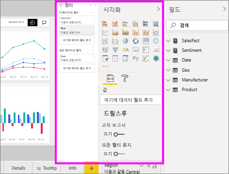

**보고서** 캔버스 오른쪽에 **시각화** 창이 나타나면 사용자 지정을 시작할 준비가 된 것입니다. 창이 표시되지 않으면 오른쪽 위 모서리의 화살표를 선택하여 창을 엽니다.

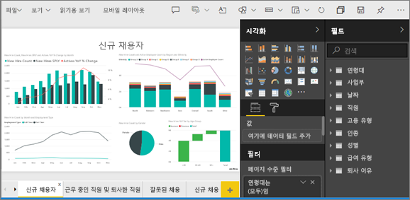

## 단일 데이터 요소 색 변경
하나의 특정 데이터 요소를 강조 표시하려는 경우가 있습니다. 아마도 신제품 출시에 대한 판매 수치 또는 새 프로그램을 시작한 후 품질 점수 증가 등을 강조 표시하려는 경우입니다. Power BI에서는 색을 변경하여 특정 데이터 요소를 강조 표시할 수 있습니다.

다음 시각화는 제품 세그먼트별로 판매된 단위의 순위를 보여 줍니다. 

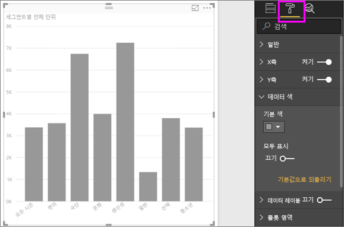

이제 색을 사용하여 이 브랜드의 새 세그먼트가 얼마나 잘 운영되는지 보여 주기 위해 **Convenience** 세그먼트를 살펴보겠습니다. 수행하는 단계는 다음과 같습니다.

**데이터 색** 섹션을 확장하고 **모두 표시**의 슬라이더를 켜기로 전환합니다. 그러면 시각화에서 각 데이터 요소에 대한 색이 표시됩니다. 데이터 요소를 마우스로 가리키면 스크롤되어 데이터 요소를 수정할 수 있습니다.

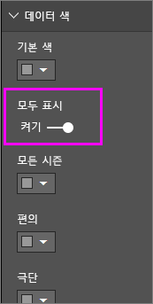

**Convenience**를 주황색으로 설정합니다. 

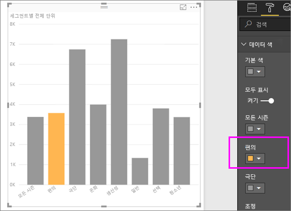

선택된 **Convenience** 데이터 요소는 멋지게 음영 표시되고 확실히 돋보입니다.

시각화 유형을 변경한 후 돌아오더라도 Power BI에서 선택 항목을 기억하고 **Convenience**를 주황색으로 유지합니다.

하나, 여러 개 또는 모든 데이터 요소(element)의 데이터 요소(point) 색을 변경할 수 있습니다. 회사 색처럼 보이는 시각적 개체가 필요할 수 있습니다. 

색으로 모든 종류의 작업을 수행할 수 있습니다. 다음 섹션에서는 그라데이션을 살펴보겠습니다.

## 숫자 값 기준 차트 색
보통 차트에서는 필드의 숫자 값을 기준으로 동적으로 색을 설정하는 기능을 활용합니다. 이렇게 하면 막대 크기에 사용한 것과 다른 값을 표시하고 단일 그래프에 두 값을 표시할 수 있습니다. 또는 이 기능을 사용하여 특정 값을 초과(또는 미만)하는 데이터 요소를 강조 표시할 수 있으며 예를 들면 수익성이 낮은 영역을 강조 표시할 수 있습니다.

다음 섹션에서는 숫자 값을 기준으로 색을 지정하는 다양한 방법을 보여줍니다.

## 값 기준 데이터 요소 색
값을 기반으로 색을 변경하려면 색의 기준으로 할 필드를 **필드** 창의 **색 채도** 영역으로 끌어옵니다. 다음 그림에서는 **%Market Share SPLY YTD**를 **색 채도**로 끌어왔습니다. 

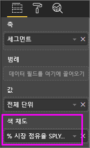

또한 [서식] 창의 **데이터 색** 아래에서 **%Market Share SPLY YTD** 값이 세로 막대형 차트의 색 및 음영을 변경하는 방식을 결정합니다. 이 예제에서는 시장 점유율이 낮을수록 연한 파란색으로 표시되고 값이 높을수록 진핸 파란색으로 표시됩니다.

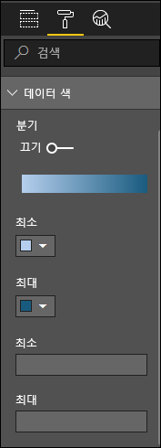

보이는 것처럼 **Productivity** 및 **Extreme**에서 둘 다 더 많은 단위를 판매했지만(해당 열이 더 높음), **Moderation**의 **%Market Share SPLY YTD**가 더 큽니다(해당 열의 색 채도가 더 큼).

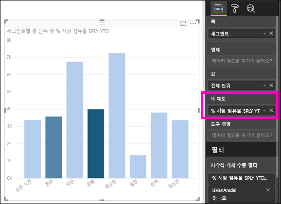

## 색 눈금에 사용되는 색 사용자 지정
색 눈금에 사용되는 색을 사용자 지정할 수도 있습니다. 기본적으로 데이터의 가장 낮은 값은 채도가 가장 적은 색에 매핑되고 가장 높은 값은 채도가 가장 높은 색에 매핑됩니다. 위의 그림에서는 파란색 그라데이션을 사용했습니다. 

**데이터 색** 을 확장하면 데이터 시각화에 사용되는 색의 그라데이션이 표시됩니다. 색 범위가 **최소** 및 **최대** 색상 값 사이의 스펙트럼을 표시하는 그라데이션 막대에 표시됩니다. 이때 **최소** 값 색은 왼쪽에, **최대** 값 색은 오른쪽에 표시됩니다.

다른 색 범위를 사용하도록 눈금을 변경하려면 **최소** 또는 **최대**옆의 색 드롭다운을 선택하고 색을 선택합니다. 다음 이미지에서는 **최대** 색이 검정색으로 변경되고 그라데이션 막대에서 **최소** 및 **최대** 사이의 새로운 색 스펙트럼을 보여 줍니다.

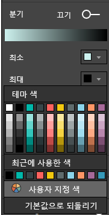

또한 값이 이러한 색에 매핑되는 방식을 변경할 수도 있습니다. 다음 이미지에서는 **최소** 및 **최대** 에 대한 색이 각각 주황색 및 녹색으로 설정됩니다.

첫 번째 이미지에서 차트의 막대가 막대에 표시된 그라데이션을 어떻게 반영하는지 확인합니다. 가장 높은 값은 녹색이고 가장 낮은 값은 주황색이며 그 사이의 각 막대는 녹색과 주황색 사이의 스펙트럼 음영으로 색이 지정됩니다.

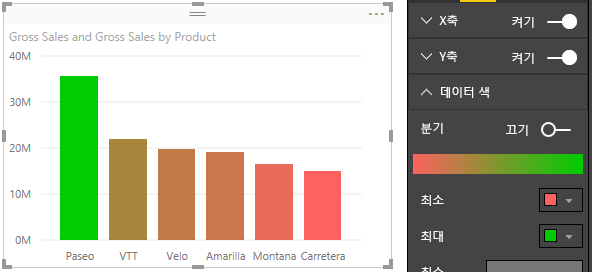

이제 **최소** 및 **최대** 색 선택기 아래에 있는 **최소** 및 **최대** 값 상자에 숫자 값을 제공하면 어떻게 되는지 살펴보겠습니다(다음 이미지에 표시됨). **최소**를 20,000,000으로, **최대**를 20,000,001로 설정해보겠습니다.

이러한 값을 설정하면 차트에서 **최소** 미만이거나 **최대**를 초과하는 값에 더 이상 그라데이션이 적용되지 않습니다. **최대** 값을 초과하는 값의 막대는 녹색으로 표시되고 **최소** 미만인 값의 막대는 빨간색으로 표시됩니다.

## 색 눈금 분기 사용
경우에 따라 데이터에 자연스럽게 분기하는 눈금이 있을 수 있습니다. 예를 들어 온도 범위에는 어는 점이 자연스런 중심이고 수익성 점수에는 자연스런 중간 지점(0)이 있습니다.

색 눈금 분기를 사용하려면 **분기** 슬라이더를 **켜기**로 밉니다. **분기** 가 켜지면 다음 이미지처럼 둘 다 **가운데**라는 추가 색 선택기 및 값 상자가 나타납니다.

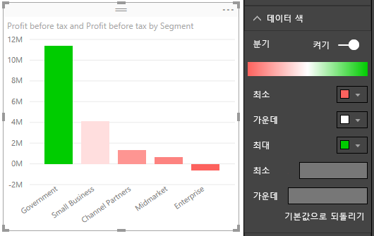

**분기** 슬라이더가 켜지면 **최소**, **최대** 및 **가운데** 에 대한 색을 개별적으로 설정할 수 있습니다. 다음 이미지에서는 **가운데** 가 1로 설정되었으므로 1을 초과하는 값의 막대는 녹색 음영으로 그라데이션 표시되고 1 미만인 막대는 빨간색 음영으로 표시됩니다.

## Power BI에서 실행 취소 방법
다른 여러 Microsoft 서비스 및 소프트웨어와 마찬가지로 Power BI는 마지막 명령을 손쉽게 실행 취소하는 방법을 제공합니다. 예를 들어, 한 개의 데이터 요소 또는 복수의 데이터 요소 색을 변경했으나 시각화에 그 색을 표시했을 때 마음에 들지 않는다고 가정해 보세요. 이전에 어떤 색이었는지 정확히 기억나지는 않지만 색을 되돌리고 싶을 수 있습니다.

마지막 작업 또는 마지막 몇 가지 작업을 **실행 취소** 하려면 다음을 수행하면 됩니다.

- CTRL+Z 입력

## 피드백
공유하고 싶은 팁이 있나요? 팁을 보내주시면 여기에 포함하는 것을 고려해 보겠습니다.

>[!NOTE]
>**서식** 아이콘을 선택하면 사용할 수 있는 이러한 색, 축 및 관련된 사용자 지정 항목을 Power BI Desktop에서도 사용할 수 있습니다.

## 다음 단계
[색 서식 지정 및 축 속성 시작](service-getting-started-with-color-formatting-and-axis-properties.md)

