# Azure Active Directory B2B를 사용하여 외부 게스트 사용자에게 Power BI 콘텐츠 배포

**요약:** 이는 Azure Active Directory B2B (Azure AD B2B)의 통합을 사용하여 조직 외부 사용자에게 콘텐츠를 배포하는 방법을 설명하는 기술 백서입니다.

**작성기** Lukasz Pawlowski, Kasper de Jonge

**기술 검토자:** Adam Wilson, Sheng Liu, Qian Liang, Sergei Gundorov, Jacob Grimm, Adam Saxton, Maya Shenhav, Nimrod Shalit, Elisabeth Olson

> [!NOTE]
> 이 백서는 브라우저에서 **인쇄**를 선택한 다음, **PDF로 저장**을 선택하여 저장하거나 인쇄할 수 있습니다.

## 소개

Power BI를 사용하면 조직에서 비즈니스를 360도로 볼 수 있으며, 이러한 조직의 모든 사용자가 데이터를 사용하여 지능적인 의사 결정을 내릴 수 있습니다. 이러한 조직 대부분은 외부 파트너, 클라이언트 및 계약자와 강력하고 신뢰할 수 있는 관계를 가집니다. 이러한 조직에서는 이러한 외부 파트너의 사용자에게 Power BI 대시보드 및 보고서에 대한 보안 액세스를 제공해야 합니다.

Power BI는 조직 외부의 게스트 사용자에게 Power BI 콘텐츠를 안전하게 배포할 수 있도록 [Azure Active Directory B2B (Azure AD B2B)](https://docs.microsoft.com/azure/active-directory/b2b/what-is-b2b)와 통합됩니다.

이 백서에서는 Power BI와 Azure Active Directory B2B의 통합을 이해하는 데 필요한 모든 세부 정보에 대해 설명합니다. 가장 일반적인 사용 사례, 설정, 라이선스 및 행 수준 보안을 다룹니다.

> [!NOTE]
> 이 백서 전체에서 Azure Active Directory를 Azure AD로, Azure Active Directory Business to Business를 Azure AD B2B로 언급합니다.

## 시나리오

Contoso는 자동차 제조업체이며, 제조 작업을 운영하는 데 필요한 모든 구성 요소, 자료 및 서비스를 제공하는 다양한 공급업체와 함께 작업합니다. Contoso는 공급망을 간소화하고 Power BI를 사용하여 공급망의 주요 성능 메트릭을 모니터링하려고 합니다. Contoso는 안전하고 관리 가능한 방식으로 외부 공급망 파트너와 분석을 공유하려고 합니다.

Contoso는 Power BI 및 Azure AD B2B를 사용하여 외부 사용자에 대해 다음과 같은 환경을 사용하도록 설정할 수 있습니다.

### 항목당 임시 공유

Contoso는 Contoso 자동차의 라디에이터를 제작하는 공급업체와 함께 작업합니다. 대부분의 경우 Contoso의 모든 자동차의 데이터를 사용하여 라디에이터의 안정성을 최적화해야 합니다. Contoso의 분석가는 Power BI을 사용하여 공급자의 엔지니어와 라디에이터 안정성 보고서를 공유합니다. 엔지니어는 보고서를 볼 수 있는 링크가 포함된 전자 메일을 받습니다.

위에서 설명한 것처럼 이 임시 공유는 비즈니스 사용자가 필요에 따라 수행합니다. Power BI에서 외부 사용자에게 보내는 링크는 Azure AD B2B 초대 링크입니다. 외부 사용자가 링크를 열면 Contoso의 Azure AD 조직에 게스트 사용자로 조인하라는 메시지가 표시됩니다. 초대가 승인되면 링크를 통해 특정 보고서나 대시보드가 열립니다. Azure Active Directory 관리자는 외부 사용자를 조직에 초대하는 권한을 위임하고, 이 문서의 거버넌스 섹션에 설명된 대로 초대를 수락하면 해당 사용자가 수행할 수 있는 작업을 선택합니다. Contoso 분석가가 게스트 사용자를 초대할 수 있는 것은 오직 Azure AD Power BI 관리자가 사용자가 Power BI 테넌트 설정에서 콘텐츠를 보도록 게스트를 초대할 수 있도록 허용했기 때문입니다.

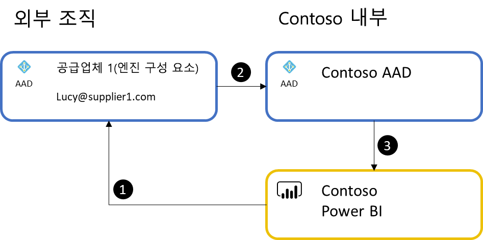

1. 이 프로세스는 외부 사용자와 대시보드 또는 보고서를 공유하는 Contoso 내부 사용자로 시작합니다. 외부 사용자가 Contoso의 Azure AD의 기존 게스트가 아닌 경우 초대됩니다. 그들의 전자 메일 주소로 Contoso의 Azure AD로의 초대를 포함하는 전자 메일이 전송됩니다.
2. 받는 사람은 Contoso의 Azure AD에 대한 초대를 수락하고 Contoso의 Azure AD에서 게스트 사용자로 추가됩니다.
3. 그러면 받는 사람이 사용자에 대한 읽기 전용 Power BI 대시보드, 보고서 또는 앱으로 리디렉션됩니다.

Contoso의 비즈니스 사용자는 비즈니스 목적에 따라 필요에 따라 초대 작업을 수행하므로 이 프로세스는 임시로 간주됩니다. 공유된 각 항목은 외부 사용자가 콘텐츠를 보기 위해 액세스할 수 있는 단일 링크입니다.

외부 사용자가 Contoso 리소스에 액세스할 수 있도록 초대된 후에는 Contoso Azure AD에서 섀도 계정을 만들 수 있으며 다시 초대하지 않아도 됩니다. Power BI 대시보드 등의 Contoso 리소스에 처음 액세스하려고 할 때 초대를 사용하는 동의 프로세스를 거칩니다. 사용자가 동의를 완료하지 않으면 Contoso의 콘텐츠는 액세스할 수 없습니다. 제공된 원래 링크를 통해 초대를 사용하는 데 문제가 있는 경우 Azure AD 관리자는 사용할 수 있도록 특정 초대 링크를 다시 보낼 수 있습니다.

### 항목당 계획된 공유

Contoso는 하도급업자와 함께 작업하여 라디에이터의 안정성 분석을 수행합니다. 하도급업자에는 Contoso의 Power BI 환경에서 데이터에 액세스해야 하는 10명으로 구성된 팀이 있습니다. Contoso Azure AD 관리자는 모든 사용자를 초대하고 하도급업자 변경 시 모든 추가/변경 내용을 처리하는 데 관여합니다. Azure AD 관리자는 하도급업자의 모든 직원에 대한 보안 그룹을 만듭니다. Contoso 직원은 보안 그룹을 사용하여 보고서에 대한 액세스를 쉽게 관리하고 모든 필수 하도급업자 직원이 필요한 모든 보고서, 대시보드 및 Power BI 앱에 액세스할 수 있도록 할 수 있습니다. Azure AD 관리자는 Contoso 또는 하도급업자에서 신뢰할 수 있는 직원에게 초대 권한을 위임하여 적시에 관리하도록 선택하여 초대 프로세스에 참여하지 않도록 할 수도 있습니다.

일부 조직에서는 외부 사용자를 추가하거나, 외부 조직의 많은 사용자나 많은 외부 조직을 초대할 때 더 많은 제어가 필요합니다. 이러한 경우 계획된 공유를 사용하여 공유 규모를 관리하고, 조직 정책을 적용하며, 신뢰할 수 있는 개인에게 외부 사용자를 초대하고 관리하는 권한을 위임할 수도 있습니다. Azure AD B2B는 단일 작업으로 사용자 집합을 초대할 수 있는 [ PowerShell을 통해 초대 관리자 API를 사용하여](https://docs.microsoft.com/azure/active-directory/b2b/customize-invitation-api) 또는 [Azure Portal에서 IT 관리자로부터](https://docs.microsoft.com/azure/active-directory/b2b/add-users-administrator) 직접 전송될 계획된 초대를 지원합니다. 조직에서는 계획된 초대 방식을 사용하여 사용자를 초대하고 승인 프로세스를 구현할 수 있는 사용자를 제어할 수 있습니다. 동적 그룹과 같은 고급 Azure AD 기능을 사용하면 보안 그룹 멤버 자격을 자동으로 쉽게 유지 관리할 수 있습니다.

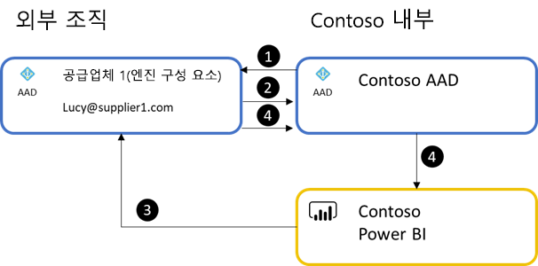

1. IT 관리자가 수동으로 또는 Azure Active Directory에서 제공하는 API를 통해 게스트 사용자를 초대하면 프로세스가 시작됩니다.
2. 사용자는 조직에 대한 초대를 수락합니다.
3. 해당 사용자가 초대를 수락하면 Power BI 사용자는 외부 사용자 또는 해당 사용자가 속한 보안 그룹과 보고서나 대시보드를 공유할 수 있습니다. Power BI에서 일반 공유와 마찬가지로 외부 사용자는 항목에 대한 링크가 포함된 전자 메일을 받습니다.
4. 외부 사용자가 링크에 액세스하면 해당 디렉터리의 해당 인증은 Contoso의 Azure AD에 전달되고 Power BI 콘텐츠에 대한 액세스 권한을 얻는 데 사용됩니다.

### Power BI 앱의 임시 또는 계획된 공유

Contoso에는 하나 이상의 공급업체와 공유해야 하는 보고서 및 대시보드 집합이 있습니다. 모든 필수 외부 사용자에게 이 콘텐츠에 대한 액세스 권한이 있도록 하기 위해 Power BI 앱으로 패키지됩니다. 외부 사용자는 앱 액세스 목록에 직접 또는 보안 그룹을 통해 추가됩니다. 그런 다음 Contoso의 누군가가 모든 외부 사용자(예: 전자 메일)에게 앱 URL을 보냅니다. 외부 사용자가 링크를 열면 쉽게 탐색할 수 있는 단일 환경에서 모든 콘텐츠를 볼 수 있습니다.

Power BI 앱을 사용하면 Contoso가 해당 공급업체에 대한 BI 포털을 쉽게 빌드할 수 있습니다. 단일 액세스 목록은 불필요한 시간을 확인하고 항목 수준 사용 권한을 설정하는 데 필요한 모든 콘텐츠에 대한 액세스를 제어합니다. Azure AD B2B는 공급자의 기본 ID를 사용하여 보안 액세스를 유지하므로 사용자가 추가 로그인 자격 증명을 필요로 하지 않습니다. 보안 그룹과 함께 계획된 초대를 사용하는 경우 직원이 프로젝트를 시작하거나 종료할 때 앱에 대한 액세스 관리가 간소화됩니다. 수동으로 또는 [동적 그룹](https://docs.microsoft.com/azure/active-directory/b2b/use-dynamic-groups)을 사용하여 보안 그룹의 구성원 자격을 사용하여 공급자의 모든 외부 사용자가 적절한 보안 그룹에 자동으로 추가되도록 합니다.

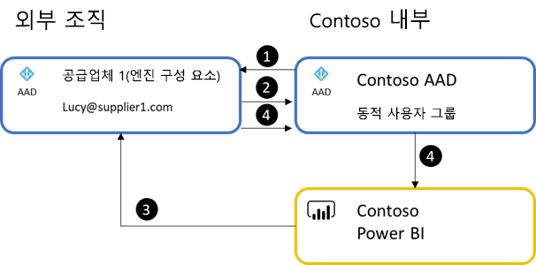

1. 사용자가 Azure Portal 또는 PowerShell을 통해 Contoso의 Azure AD 조직에 초대 하는 프로세스를 시작 합니다.
2. 사용자는 Azure AD의 사용자 그룹에 추가될 수 있습니다. 정적 또는 동적 사용자 그룹을 사용할 수 있지만 동적 그룹이 수동 작업을 줄이는 데 도움이 됩니다.
3. 외부 사용자에게는 사용자 그룹을 통해 Power BI 앱에 대한 액세스 권한이 부여됩니다. 앱 URL은 외부 사용자에게 직접 보내거나 액세스 권한이 있는 사이트에 배치해야 합니다. 앱 링크를 사용하여 외부 사용자에게 전자 메일을 보내는 것이 가장 좋지만, 멤버 자격이 변경될 수 있는 사용자 그룹을 사용하는 경우 Power BI는 사용자 그룹을 통해 관리되는 모든 외부 사용자에게 전송할 수 없습니다.
4. 외부 사용자가 Power BI 앱 URL에 액세스하면 Contoso의 Azure AD에서 인증되고, 사용자에 대해 앱이 설치되며, 사용자가 앱 내에 포함된 모든 보고서와 대시보드를 볼 수 있습니다.

앱에는 사용자가 로그인할 때 사용할 수 있도록 앱 작성자가 사용자에 대해 자동으로 응용 프로그램을 설치할 수 있도록 하는 고유한 기능이 있습니다. 이 기능은 응용 프로그램이 게시되거나 업데이트될 때 Contoso 조직에 이미 속해 있는 외부 사용자에 대해서만 자동으로 설치됩니다. 따라서 계획된 초대 방법과 함께 사용하는 것이 가장 좋지만, 사용자가 Contoso의 Azure AD에 추가된 후 앱이 게시되거나 업데이트됨에 따라 달라집니다. 외부 사용자는 항상 앱 링크를 사용하여 앱을 설치할 수 있습니다.

### 조직 간 콘텐츠 댓글 달기 및 구독

Contoso가 하도급업자 또는 공급자와 계속 작업하는 경우 외부 엔지니어가 Contoso 분석가와 긴밀하게 협력해야 합니다. Power BI는 사용자가 사용할 수 있는 콘텐츠를 전달하는 데 도움이 되는 여러 공동 작업 기능을 제공합니다. 대시보드 댓글 달기 (및 곧 보고서 댓글 달기)를 사용하여 사용자는 보고 있는 데이터 요소에 대해 논의하고 보고서 작성자와 커뮤니케이션하여 질문을 할 수 있습니다.

현재 외부 게스트 사용자는 댓글을 남기고 회신을 읽어 댓글에 참여할 수 있습니다. 그러나 내부 사용자와는 달리 게스트 사용자는 @mention 대상이 될 수 없으며 댓글을 수신했다는 알림이 수신되지 않습니다. 게스트 사용자는 작성 시 Power BI 내에서 구독 기능을 사용할 수 없습니다. 예정된 릴리스에서는 이러한 제한이 제거되고, 게스트 사용자는 댓글이 @mention될 때 또는 Power BI의 콘텐츠에 대한 링크가 포함된 구독이 전자 메일로 배달될 때 전자 메일을 받게 됩니다.

### Power BI 모바일 앱에서 콘텐츠 액세스

향후 릴리스에서 Contoso의 사용자가 외부 게스트와 보고서 또는 대시보드를 공유하는 경우 Power BI는 게스트에게 알리는 전자 메일을 보냅니다. 게스트 사용자가 모바일 장치에서 보고서 또는 대시보드에 대한 링크를 열면 네이티브 Power BI 모바일 앱이 설치된 경우 해당 장치에서 콘텐츠가 열립니다. 그러면 게스트 사용자는 외부 테넌트에서 공유된 콘텐츠 간, 그리고 해당 홈 테넌트의 자신의 콘텐츠로 다시 이동할 수 있습니다.

> [!NOTE]
> 게스트 사용자는 Power BI 모바일 앱을 열고 외부 테넌트로 바로 이동할 수 없으며, 외부 테넌트의 항목에 대한 링크로 시작해야 합니다. 일반적인 해결 방법은 이 문서의 뒷부분에 있는 [부모 조직의 Power BI 콘텐츠에 대한 링크 배포](#distributing-links-to-content-in-the-parent-organizations-power-bi) 섹션에 설명되어 있습니다.

### Power BI 콘텐츠의 조직 간 편집 및 관리

Contoso와 해당 공급자와 하도급업자는 점점 더 긴밀하게 협력하고 있습니다. 하도급 업자의 분석가가 Contoso가 공유하는 보고서에 추가 메트릭 또는 데이터 시각화를 추가해야 하는 경우가 많습니다. 데이터는 Contoso의 Power BI 테넌트에 상주해야 하지만 외부 사용자가 해당 데이터를 편집하고, 새 콘텐츠를 만들고, 해당 사용자에게 배포할 수도 있어야 합니다.

Power BI는 **외부 게스트 사용자가 조직의 콘텐츠를 편집하고 관리할 수** 있도록 하는 옵션을 제공합니다. 기본적으로 외부 사용자는 읽기 전용 사용량 지향 환경을 보유합니다. 그러나 이 새 설정을 사용하면 Power BI 관리자가 자신의 조직 내에서 콘텐츠를 편집하고 관리할 수 있는 외부 사용자를 선택할 수 있습니다. 허용되는 경우 외부 사용자는 보고서, 대시보드, 앱 게시 또는 업데이트, 작업 영역에서 작업 및 사용 권한이 있는 데이터에 연결할 수 있습니다.

## Power BI 및 Azure AD B2B를 사용하는 조직 관계

<<<<<< HEAD
## Power BI 및 Azure AD B2B를 사용하는 조직 관계
||||||| merged common ancestors
## Power BI 및 Azure AD B2B를 사용 하는 조직 관계

Power BI의 모든 사용자가 조직 내부에 있는 경우 Azure AD B2B를 사용할 필요가 없습니다. 그러나 두 개 이상의 조직이 데이터 및 통찰력에 대해 공동 작업을 수행하려는 경우 Azure AD B2B에 대한 Power BI의 지원을 활용하면 쉽고 비용 효율적으로 작업할 수 있습니다.

다음에서 일반적으로 Power BI에서 Azure AD B2B 스타일 조직 간 공동 작업에 적합한 조직 구조를 확인합니다. Azure AD B2B는 대부분의 경우에는 잘 작동하지만, 경우에 따라 이 문서의 끝에서 다룬 일반적인 대체 방법을 고려하는 것이 좋습니다.

### 사례 1: 조직 간 직접 공동 작업

Contoso와 해당 라디에이터 공급자의 관계는 조직 간 직접 공동 작업의 한 가지 예입니다. Contoso의 사용자는 비교적 적고 라디에이터 안정성 정보에 액세스해야 하는 공급자는 Azure AD B2B 기반 외부 공유를 사용하는 것이 이상적입니다. 쉽게 사용하고 관리할 수 있습니다. 이는 컨설턴트가 조직의 콘텐츠를 작성해야 하는 컨설팅 서비스의 일반적인 패턴이기도 합니다.

일반적으로 이러한 공유는 처음에 항목당 임시 공유를 사용합니다. 그러나 팀이 성장하거나 관계가 깊어지면 관리 오버헤드를 줄이기 위해 항목 별로 계획된 항목 공유 접근 방법이 선호됩니다. 또한 Power BI 앱의 임시 또는 계획된 공유, 조직 전체의 콘텐츠에 대한 댓글 달기 및 구독, 모바일 앱의 콘텐츠에 대한 액세스 및 Power BI 콘텐츠에 대한 조직 간 편집 및 관리가 가능합니다. 중요한 점은 조직의 사용자가 해당 조직에 Power BI Pro 라이선스를 보유하고 있는 경우 서로의 Power BI 환경에서 해당 Pro 라이선스를 사용할 수 있다는 것입니다. 초대하는 조직이 외부 사용자에 대한 Power BI Pro 라이선스를 지불하지 않아도 되기 때문에 이를 유용한 라이선싱을 제공합니다. 이 내용은 이 문서의 뒷부분에 나오는 라이선스 섹션에서 자세히 설명합니다.

### 사례 2: 부모 및 계열사 또는 계열사

일부 조직 구조는 부분적으로 또는 완전히 소유하는 자회사, 관련 회사 또는 관리 서비스 공급자 관계를 포함하여 더 복잡합니다. 이러한 조직에는 지주 회사와 같은 부모 조직이 있지만 기본 조직은 종종 다른 지역 요구 사항에 따라 자율적으로 작동합니다. 이로 인해 각 조직에는 자체 Azure AD 환경 및 별도의 Power BI 테넌트가 있게 됩니다.

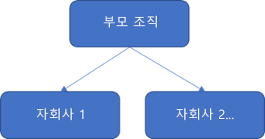

이 구조에서 부모 조직은 일반적으로 표준화된 정보를 자회사에 배포해야 합니다. 일반적으로 이러한 공유는 표준화된 권한 있는 콘텐츠를 광범위한 대상에 배포할 수 있기 때문에 다음 그림에 나와 있는 것처럼 임시 또는 계획된 Power BI 앱 방법의 공유를 사용하여 발생합니다. 실제로 이 문서의 앞부분에서 설명한 모든 시나리오의 조합이 사용됩니다.

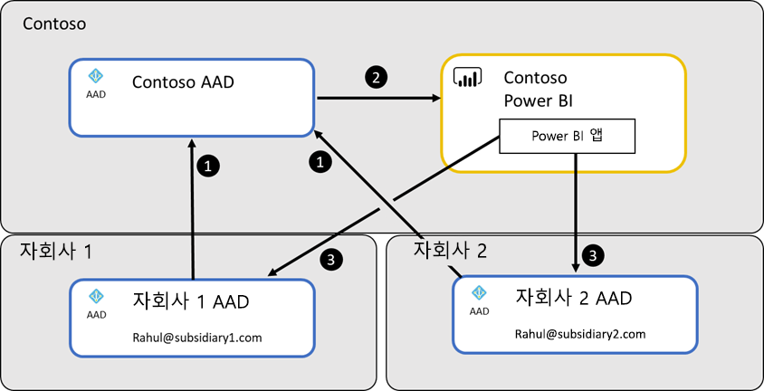

다음 프로세스를 따릅니다.

1. 각 자회사의 사용자는 Contoso의 Azure AD에 초대 됩니다.
2. 그런 다음 해당 사용자에게 필요한 데이터에 대한 액세스를 제공하기 위해 Power BI 앱이 게시됩니다.
3. 마지막으로 사용자는 보고서를 보기 위해 제공된 링크를 통해 앱을 엽니다.

이 구조에서, 조직에서는 다음과 같은 몇 가지 중요한 문제에 직면할 수 있습니다.

- 부모 조직의 Power BI 콘텐츠에 대한 링크를 배포하는 방법
- 자회사 사용자가 상위 조직에서 호스트 하는 데이터 원본에 액세스할 수 있도록 허용 하는 방법

#### 부모 조직의 Power BI 콘텐츠에 대한 링크 배포

일반적으로 콘텐츠에 대한 링크를 배포하는 데 사용되는 세 가지 방법이 있습니다. 첫 번째 및 가장 기본적인 방법은 앱에 대한 링크를 필요한 사용자에게 보내거나 해당 사용자가 열 수 있는 SharePoint Online 사이트에 추가하는 것입니다. 그러면 사용자가 브라우저에서 링크를 책갈피로 설정하여 필요한 데이터에 빠르게 액세스할 수 있습니다.

두 번째 방법은 Power BI 콘텐츠 기능의 조직 간 편집 및 관리에 의존합니다. 계열사의 사용자는 부모 조직을 통해 해당 Power BI에 액세스하고 권한을 통해 액세스할 수 있는 항목을 제어할 수 있습니다. 이를 통해 자회사의 사용자가 상위 조직의 테넌트에 있는 콘텐츠의 포괄적인 콘텐츠 목록을 볼 수 있는 Power BI 홈에 액세스할 수 있습니다. 그런 다음 부모 조직의 Power BI 환경에 대한 URL이 자회사의 사용자에게 제공됩니다.

최종 방법은 각 자회사에 대해 Power BI 테넌트 내에 생성된 Power BI 앱을 사용합니다. Power BI 앱은 [외부 링크 옵션으로 구성된 타일](https://docs.microsoft.com/power-bi/service-dashboard-edit-tile#hyperlink)이 있는 대시보드를 포함합니다. 사용자가 타일을 누르면 부모 조직의 Power BI에서 적절한 보고서, 대시보드 또는 앱으로 이동합니다. 이 접근 방식에는 자회사의 모든 사용자에 대해 앱을 자동으로 설치할 수 있으며 자신의 Power BI 환경에 로그인 할 때마다 사용할 수 있다는 추가 이점이 있습니다. 이 방법의 추가 장점은 링크를 기본적으로 열 수 있는 Power BI 모바일 앱에서 잘 작동한다는 것입니다. 또한 이를 두 번째 방법과 결합하여 Power BI 환경 간에 쉽게 전환할 수 있습니다.

#### 자회사 사용자가 상위 조직에서 호스트하는 데이터 원본에 액세스할 수 있도록 허용

자회사의 분석가는 상위 조직에서 제공하는 데이터를 사용하여 고유한 분석을 만들어야 하는 경우가 많습니다. 이 경우 일반적으로 클라우드 데이터 원본을 사용하여 문제를 해결합니다.

첫 번째 방법은 다음 이미지와 같이 부모 및 계열사에서 분석가의 요구를 충족하는 엔터프라이즈급 데이터 웨어하우스를 구축하는 [Azure Analysis Services](https://docs.microsoft.com/azure/analysis-services/analysis-services-overview)를 활용하는 것입니다. Contoso는 데이터를 호스팅하고 행 수준 보안과 같은 기능을 사용하여 각 자회사의 사용자가 자신의 데이터에만 액세스할 수 있도록 할 수 있습니다. 각 조직의 분석가는 Power BI Desktop을 통해 데이터 웨어하우스에 액세스하고 결과 분석을 해당 Power BI 테넌트에 게시할 수 있습니다.

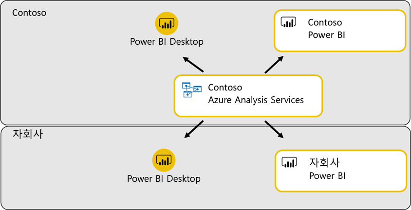

두 번째 방법은 데이터에 대한 액세스를 제공하기 위해 관계형 데이터 웨어하우스를 빌드하기 위해 [Azure SQL Database](https://azure.microsoft.com/services/sql-database/)를 활용합니다. 이 방법은 Azure Analysis Services 방법과 유사하게 작동하지만 행 수준 보안과 같은 일부 기능은 자회사에서 배포 및 유지 관리가 어려울 수 있습니다.

더 복잡한 방법도 가능하지만 위의 내용이 가장 일반적입니다.
||||||| merged common ancestors
더 복잡 한 방법도 가능 하지만 위의 내용이 가장 일반적입니다.

### 사례 3: 파트너 간 공유 환경

Contoso는 경쟁업체와 협력하여 공유 어셈블리 라인에서 자동차를 제작할 수 있지만 다른 브랜드로 또는 다른 지역에 자동차를 공급할 수 있습니다. 이를 위해서는 광범위한 공동 작업을 수행하고 조직 전체에서 데이터, 인텔리전스 및 분석을 공동 소유해야 합니다. 이 구조는 컨설턴트 팀이 클라이언트에 대한 프로젝트 기반 분석을 수행할 수 있는 컨설팅 서비스 업계에서도 일반적으로 사용됩니다.
||||||| merged common ancestors
Contoso는 경쟁 업체와 협력 하 여 공유 어셈블리 라인에 자동차를 구축할 수 있지만 다른 브랜드 또는 다른 지역에 자동차를 분산 시킬 수 있습니다. 이를 위해서는 광범위 한 공동 작업을 수행 하 고 조직 전체에서 데이터, 인텔리전스 및 분석을 공동 소유 해야 합니다. 이 구조는 컨설턴트 팀이 클라이언트에 대 한 프로젝트 기반 분석을 수행할 수 있는 컨설팅 서비스 업계 에서도 일반적으로 사용 됩니다.

실제로 이러한 구조는 다음 이미지에 표시된 것과 같이 복잡하고 직원들이 유지 관리해야 합니다. 이 구조를 효과적으로 사용하려면 조직에서 해당 Power BI 테넌트에 대해 구매한 Power BI Pro 라이선스를 다시 사용할 수 있기 때문에 Power BI 콘텐츠 기능의 조직 간 편집 및 관리에 의존합니다.
||||||| merged common ancestors
실제로 이러한 구조는 다음 이미지에 표시 된 것과 같이 복잡 하 고 직원 들이 유지 관리 해야 합니다. 이 구조를 효과적으로 사용 하려면 조직에서 Power BI 해당 하는 테 넌 트에 대해 구매한 라이선스 Power BI Pro를 다시 사용할 수 있기 때문에 Power BI 콘텐츠 기능의 조직 간 편집 및 관리에 의존 합니다.

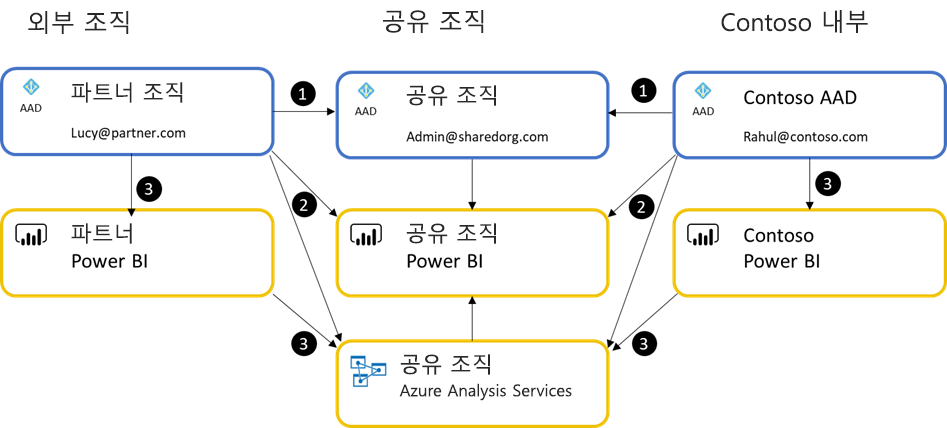

공유된 Power BI 테넌트를 설정하려면 Azure Active Directory를 만들어야 하고 해당 Active Directory의 사용자에 대해 하나 이상의 Power BI Pro 사용자 계정을 구입해야 합니다. 이 사용자는 공유 조직에 필요한 사용자를 초대합니다. 중요한 점은 이 시나리오에서 Contoso의 사용자는 공유 조직의 Power BI 내에서 작업할 때 외부 사용자로 취급됩니다.
||||||| merged common ancestors
공유 Power BI 테 넌 트를 설정 하려면 Azure Active Directory를 만들어야 하 고 해당 Active Directory의 사용자에 대해 하나 이상의 Power BI Pro 사용자 계정을 구입 해야 합니다. 이 사용자는 공유 조직에 필요한 사용자를 초대 합니다. 중요 한 점은이 시나리오에서 Contoso의 사용자는 공유 조직의 Power BI 내에서 작동할 때 외부 사용자로 취급 됩니다.

프로세스는 다음과 같습니다.

1. 공유 조직은 새 Azure Active Directory로 설정되고 새 조직에서 하나 이상의 사용자 계정이 만들어집니다. 해당 사용자에게 Power BI Pro 라이선스가 할당되어 있어야 합니다.
2. 그런 다음 이 사용자는 Power BI 테넌트를 설정하고 Contoso와 파트너 조직의 필수 사용자를 초대합니다. 또한 사용자는 Azure Analysis Services와 같은 공유 데이터 자산을 설정합니다. Contoso와 파트너 사용자는 게스트 사용자로 공유 조직의 Power BI에 액세스할 수 있습니다. Power BI에서 콘텐츠를 편집하고 관리할 수 있는 경우 외부 사용자는 Power BI 홈을 사용하고, 작업 영역을 사용하거나, 콘텐츠를 업로드하거나 편집하고, 보고서를 공유할 수 있습니다. 일반적으로 모든 공유 자산은 저장되고 공유 조직에서 액세스됩니다.
3. 당사자가 공동 작업에 동의하는 방법에 따라, 각 조직은 공유 데이터 웨어하우스 자산을 사용하여 고유한 소유 데이터 및 분석을 개발할 수 있습니다. 내부 Power BI 테넌트를 사용하여 해당 내부 사용자에게 배포할 수 있습니다.
||||||| merged common ancestors
1. 공유 조직은 새 Azure Active Directory 설정 되 고 새 조직에서 하나 이상의 사용자 계정이 만들어집니다. 해당 사용자에 게 Power BI Pro 라이선스가 할당 되어 있어야 합니다.
2. 그런 다음이 사용자는 Power BI 테 넌 트를 설정 하 고 Contoso와 파트너 조직의 필수 사용자를 초대 합니다. 또한 사용자는 Azure Analysis Services 같은 공유 데이터 자산을 설정 합니다. Contoso와 파트너 사용자는 게스트 사용자로 공유 조직의 Power BI에 액세스할 수 있습니다. Power BI에서 콘텐츠를 편집 하 고 관리할 수 있는 경우 외부 사용자는 Power BI 홈을 사용 하 고, 작업 영역을 사용 하거나, 콘텐츠를 업로드 하거나 편집 하 고, 보고서를 공유할 수 있습니다. 일반적으로 모든 공유 자산은 공유 조직에서 저장 되 고 액세스 됩니다.
3. 당사자가 공동 작업에 동의 하는 방법에 따라, 각 조직은 공유 데이터 웨어하우스 자산을 사용 하 여 고유한 소유 데이터 및 분석을 개발할 수 있습니다. 내부 Power BI 테 넌 트를 사용 하 여 해당 내부 사용자에 게 배포할 수 있습니다.

### 사례 4: 수백 또는 수천 개의 외부 파트너에 배포

Contoso는 한 공급업체에 대한 라디에이터 안정성 보고서를 만들었으므로 이제 Contoso는 수백 개의 공급업체에 대해 표준화된 보고서 집합을 만들려고 합니다. 이를 통해 Contoso는 모든 공급업체가 개선하거나 제조 결함을 수정하는 데 필요한 분석을 수행할 수 있도록 합니다.
||||||| merged common ancestors
Contoso는 한 공급 업체에 대 한 radiator 안정성 보고서를 만들었으므로 이제 Contoso는 수백 개의 공급자에 대해 표준화 된 보고서 집합을 만들려고 합니다. 이를 통해 Contoso는 모든 공급 업체가 개선 하거나 제조 결함을 수정 하는 데 필요한 분석을 수행할 수 있도록 합니다.

조직에서 표준화 된 데이터 및 정보를 많은 외부 사용자/조직에 배포 해야 하는 경우 Power BI Apps 시나리오의 임시 또는 계획 된 공유를 사용 하 여 포괄적인 개발 비용 없이 BI 포털을 신속 하 게 빌드할 수 있습니다. Power BI 앱을 사용 하 여 이러한 포털을 빌드하는 프로세스는 사례 연구에 설명 되어 있습니다. Power BI + Azure AD B2B를 사용 하 여 BI 포털 빌드 –이 문서의 뒷부분에서 단계별 지침을 참조 하세요.
||||||| merged common ancestors
조직에서 표준화 된 데이터 및 정보를 많은 외부 사용자/조직에 배포 해야 하는 경우 Power BI Apps 시나리오의 임시 또는 계획 된 공유를 사용 하 여 포괄적인 개발 비용 없이 BI 포털을 신속 하 게 빌드할 수 있습니다. Power BI 앱을 사용 하 여 이러한 포털을 빌드하는 프로세스는 사례 연구: Power BI + Azure AD B2B를 사용 하 여 BI 포털 빌드-이 문서 뒷부분에 나오는 단계별 지침을 설명 합니다.

이 경우의 일반적인 변형은 특히 Power BI와 함께 Azure B2C를 사용하려는 경우 조직이 소비자와 정보를 공유하려고 하는 경우입니다. Power BI는 기본적으로 Azure B2C을 지원하지 않습니다. 이 사례에 대한 옵션을 평가하는 경우 이 문서의 뒷부분에 나오는 일반적인 대체 방법 섹션의 대체 옵션 2를 사용하는 것이 좋습니다.
||||||| merged common ancestors
이 경우의 일반적인 변형은 특히 Power BI와 함께 Azure B2C를 사용 하려는 경우 조직이 소비자와 정보를 공유 하려고 하는 경우입니다. Power BI는 기본적으로 Azure B2C을 지원 하지 않습니다. 이 사례에 대 한 옵션을 평가 하는 경우이 문서의 뒷부분에 나오는 일반적인 대체 방법 섹션에서 대체 옵션 2를 사용 하는 것이 좋습니다.

## 사례 연구: Power BI + Azure AD B2B를 사용 하 여 BI 포털 빌드 – 단계별 지침

Azure AD B2B와의 통합을 통해 게스트 사용자에게 BI 포털에 대한 안전한 액세스를 제공하는 원활하고 안전한 방법으로 Contoso를 사용할 수 있습니다. Contoso는 세 단계로이를 설정할 수 있습니다.
||||||| merged common ancestors
Azure AD B2B와의 통합을 통해 게스트 사용자에 게 BI 포털에 대 한 안전한 액세스를 제공 하는 원활 하 고 안전한 방법으로 Contoso를 사용할 수 있습니다. Power BI Contoso는 세 단계로이를 설정할 수 있습니다.

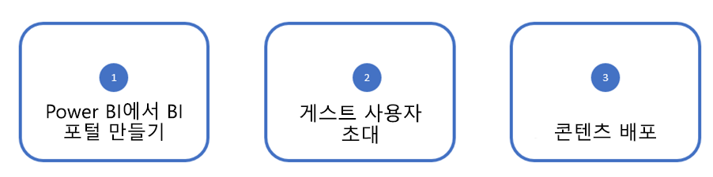

1. Power BI에서 BI 포털 만들기

    Contoso에 대한 첫 번째 작업은 Power BI에서 해당 BI 포털을 만드는 것입니다. Contoso의 BI 포털은 여러 내부 및 게스트 사용자가 사용할 수 있도록 하는 용도의 빌드된 대시보드 및 보고서의 컬렉션으로 구성됩니다. Power BI에서 이 작업을 수행하는 데 권장되는 방법은 Power BI 앱을 빌드하는 것입니다. [Power BI의 앱](https://powerbi.microsoft.com/blog/distribute-to-large-audiences-with-power-bi-apps/)에 대해 자세히 알아보세요.

- Contoso의 BI 팀은 Power BI에 작업 영역을 만듭니다.

    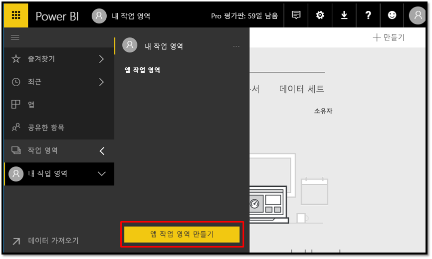
    

- 작업 영역에 다른 작성자를 추가합니다.

    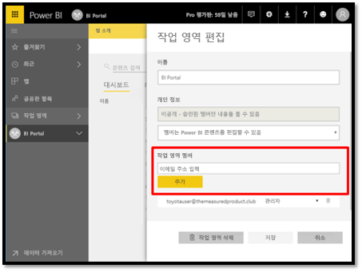

- 콘텐츠는 작업 영역 내에 생성 됩니다.

    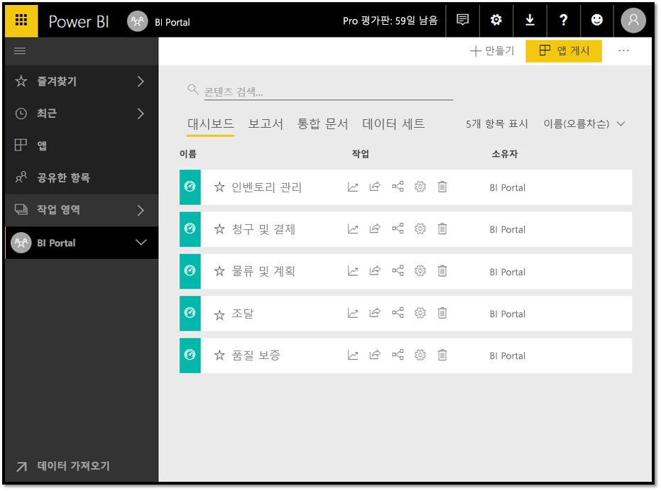

    이제 콘텐츠를 작업 영역에 만들었으므로 Contoso는 파트너 조직에서 게스트 사용자를 초대하여 이 콘텐츠를 사용할 준비가 되었습니다.

2. 게스트 사용자 초대

    Contoso는 Power BI의 BI 포털에 게스트 사용자를 초대하는 두 가지 방법이 있습니다.

    * 계획된 초대
    * 임시 초대

    **계획된 초대**

    이 방법에서는 Contoso가 게스트 사용자를 Azure AD에 미리 초대하고 Power BI 콘텐츠를 배포합니다. Contoso는 Azure Portal 또는 PowerShell을 사용하여 게스트 사용자를 초대할 수 있습니다. Azure Portal에서 게스트 사용자를 초대하는 단계는 다음과 같습니다.

    - Contoso의 Azure AD 관리자는 **Azure Portal > Azure Active Directory > 사용자 및 그룹 > 모든 사용자 > 새 게스트 사용자**로 이동합니다.

    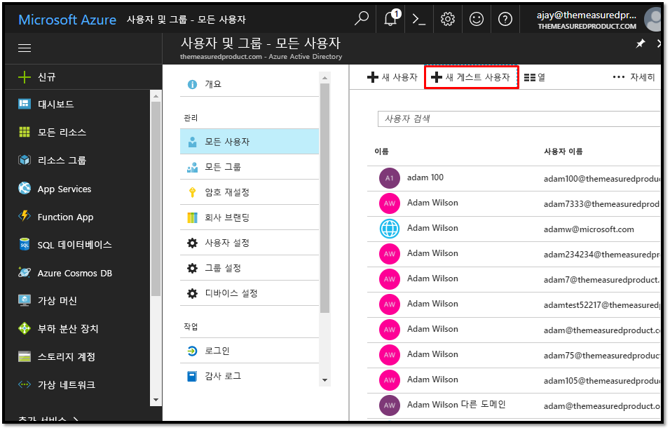

    - 게스트 사용자에 대한 초대 메시지를 추가하고 초대를 클릭합니다.

    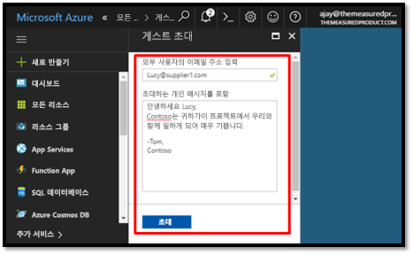

    > [!NOTE]
    > Azure Portal에서 게스트 사용자를 초대하려면 테넌트의 Azure Active Directory에 대한 관리자 권한이 필요합니다.

    Contoso에서 많은 게스트 사용자를 초대하려는 경우 PowerShell을 사용하여 이 작업을 수행할 수 있습니다. Contoso의 Azure AD 관리자는 모든 게스트 사용자의 메일 주소를 CSV 파일에 저장합니다. [Azure Active Directory B2B 공동 작업 코드 및 PowerShell 샘플](https://docs.microsoft.com/azure/active-directory/b2b/code-samples) 및 지침은 다음과 같습니다.

    초대 후에 게스트 사용자는 초대 링크를 포함하는 전자 메일을 받게 됩니다.

    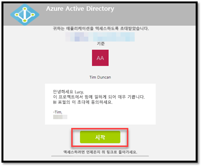

    게스트 사용자가 링크를 클릭하면 Contoso Azure AD 테넌트의 콘텐츠에 액세스할 수 있습니다.

    > [!NOTE]
    > [여기](https://docs.microsoft.com/azure/active-directory/active-directory-b2b-invitation-email)에 설명된 대로 Azure AD 브랜딩 기능을 사용하여 초대 전자 메일의 레이아웃을 변경할 수 있습니다.
||||||| merged common ancestors
    > [여기](https://docs.microsoft.com/azure/active-directory/active-directory-b2b-invitation-email)에 설명 된 대로 Azure AD 브랜딩 기능을 사용 하 여 초대 전자 메일의 레이아웃을 변경할 수 있습니다.

    **임시 초대**

    Contoso가 미리 초대하려는 게스트 사용자를 모두 알지 못하는 경우는 어떻게 되나요? 또는 BI 포털을 만든 Contoso의 분석가가 게스트 사용자에게 직접 콘텐츠를 배포하려는 경우 어떻게 되나요? Power BI에서는 임시 초대를 사용하여 이 시나리오도 지원합니다.
||||||| merged common ancestors
    Contoso가 미리 초대 하려는 게스트 사용자를 모두 알지 못하는 경우는 어떻게 되나요? 또는 BI 포털을 만든 Contoso의 분석가가 게스트 사용자에 게 콘텐츠를 배포 하려는 경우 어떻게 되나요? 또한 임시 초대와 Power BI에서이 시나리오를 지원 합니다.

    분석가가 게시할 때 앱의 액세스 목록에 외부 사용자를 추가하기만 하면 됩니다. 게스트 사용자는 초대를 받고 수락되면 자동으로 Power BI 콘텐츠로 리디렉션됩니다.
||||||| merged common ancestors
    분석가가 게시할 때 앱의 액세스 목록에 외부 사용자를 추가 하기만 하면 됩니다. 게스트 사용자는 초대를 받고 수락 되 면 자동으로 Power BI 내용으로 리디렉션됩니다.

    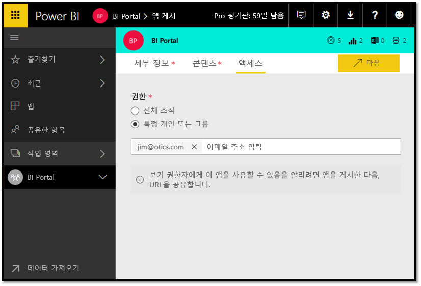

    > [!NOTE]
    > 초대는 외부 사용자를 조직에 처음 초대할 때만 필요합니다.

3. 콘텐츠 배포

    이제 Contoso의 BI 팀이 BI 포털 및 초대된 게스트 사용자를 만들었으므로 게스트 사용자에게 앱에 대한 액세스 권한을 부여하고 게시하여 최종 사용자에게 포털을 배포할 수 있습니다. Power BI 이전에 Contoso 테넌트에 추가된 게스트 사용자의 이름을 자동으로 완성합니다. 이 시점에서 다른 게스트 사용자에 대한 임시 초대를 추가할 수도 있습니다.

    > [!NOTE]
    > 보안 그룹을 사용하여 외부 사용자에 대한 앱 액세스를 관리하는 경우 계획된 초대 방법을 사용하고 액세스해야 하는 각 외부 사용자와 직접 앱 링크를 공유합니다. 그렇지 않으면 외부 사용자가 앱 내에서 콘텐츠를 설치하거나 볼 수 없습니다.

    게스트 사용자는 앱에 대한 링크가 포함된 전자 메일을 받습니다.

    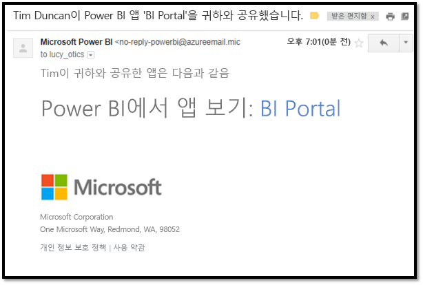

    이 링크를 클릭하면 게스트 사용자에게 자신의 조직의 ID를 사용하여 인증하라는 메시지가 표시됩니다.

    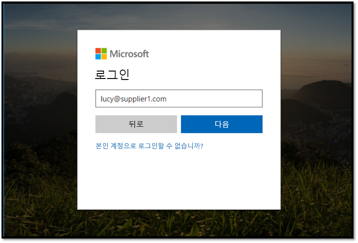

    성공적으로 인증되면 Contoso의 BI 앱으로 리디렉션됩니다.

    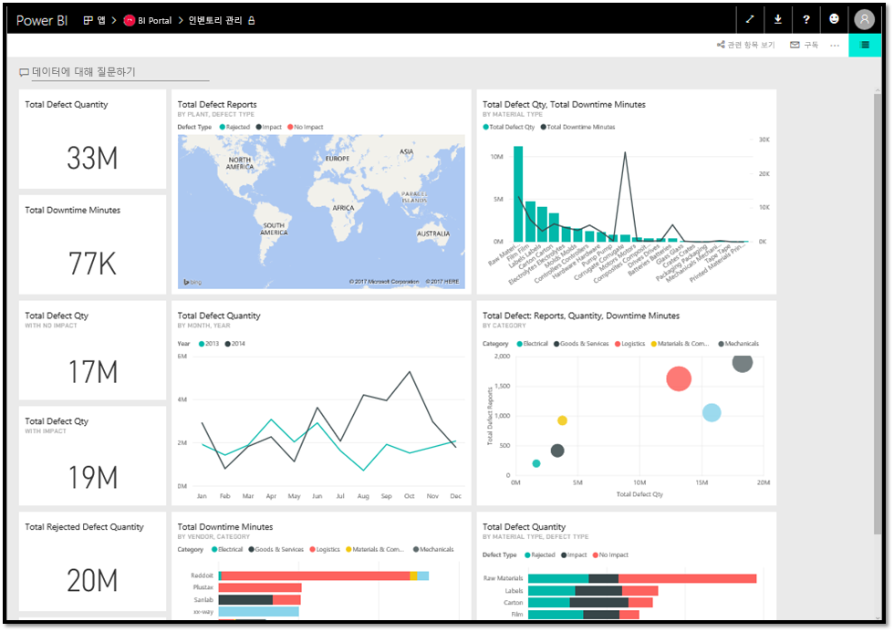

    그러면 게스트 사용자는 전자 메일의 링크를 클릭하거나 링크를 북마크하여 Contoso의 앱에 액세스할 수 있습니다. 또한 Contoso는 게스트 사용자가 이미 사용하고 있는 기존 엑스트라넷 포털에 이 링크를 추가하여 게스트 사용자가 더 쉽게 사용하게 할 수 있습니다.
||||||| merged common ancestors
    그러면 게스트 사용자는 전자 메일의 링크를 클릭 하거나 링크를 책갈피를 클릭 하 여 Contoso의 앱에 액세스할 수 있습니다. 또한 Contoso는 게스트 사용자가 이미 사용 하 고 있는 기존 엑스트라넷 포털에이 링크를 추가 하 여 게스트 사용자에 게 더 쉽게 사용할 수 있습니다.

4. 다음 단계

    Contoso는 Power BI 앱과 Azure AD B2B를 사용하여 코드를 사용하지 않는 방식으로 공급자를 위한 BI 포털을 신속하게 만들 수 있었습니다. 따라서 표준화된 분석을 필요한 모든 공급업체에 배포하는 것이 매우 간소화되었습니다.
||||||| merged common ancestors
    Contoso는 Power BI 앱과 Azure AD B2B를 사용 하 여 코드를 사용 하지 않는 방식으로 공급자를 위한 BI 포털을 신속 하 게 만들 수 있었습니다. 따라서 표준화 된 분석을 필요한 모든 공급 업체에 배포 하는 것이 매우 간소화 되었습니다.

    예제에서는 단일 공통 보고서를 공급자 간에 분산 하는 방법을 보여 주었습니다. Power BI는 훨씬 더 많은 작업이 가능 합니다. 각 파트너와 관련된 데이터만 볼 수 있도록 행 수준 보안 보고서 및 데이터 모델에 쉽게 추가할 수 있습니다. 이 문서의 뒷부분에 나오는 외부 파트너에 대한 데이터 보안 섹션에서는 이 프로세스에 대해 자세히 설명 합니다.

    종종 개별 보고서와 대시보드를 기존 포털에 포함해야 합니다. 이는 예제에 표시된 많은 기술을 다시 사용하여 수행할 수도 있습니다. 그러나 이러한 상황에서는 작업 영역에서 보고서 또는 대시보드를 직접 포함하는 것이 더 쉬울 수 있습니다. 필요한 사용자에게 보안 권한을 초대하고 할당하는 프로세스는 동일하게 유지됩니다.
||||||| merged common ancestors
    일반적으로 개별 보고서와 대시보드를 기존 포털에 포함 해야 합니다. 이를 통해 예제에 표시 된 많은 기술을 다시 사용할 수도 있습니다. 그러나 이러한 상황에서는 작업 영역에서 보고서 또는 대시보드를 직접 포함 하는 것이 더 쉬울 수 있습니다. 사용자에 게 보안 권한을 초대 하 고 할당 하는 프로세스는 동일 하 게 유지 됩니다.

## Supplier1의 Lucy는 어떻게 Contoso 테넌트의 Power BI 콘텐츠에 액세스할 수 있나요?

Contoso가 파트너 조직의 게스트 사용자에게 Power BI 콘텐츠를 원활하게 배포할 수 있는 방법을 살펴보았으므로 이제 이러한 방식이 내부적으로 작동하는 방식을 살펴보겠습니다.

Contoso가 해당 디렉터리에 [lucy@supplier1.com](mailto:lucy@supplier1.com)을 초대하면 Azure AD는 [Lucy@supplier1.com](mailto:Lucy@supplier1.com)과 Contoso Azure AD 테넌트 간에 링크를 만듭니다. 이 링크를 통해 Azure AD는 Lucy@supplier1.com가 Contoso 테넌트의 콘텐츠에 액세스할 수 있음을 알 수 있습니다.

Lucy가 Contoso의 Power BI 앱에 액세스하려고 하면 Azure AD는 Lucy가 Contoso 테넌트에 액세스할 수 있는지 확인한 다음, Azure에서 Contoso 테넌트의 콘텐츠에 액세스하도록 인증되었음을 나타내는 토큰을 Power BI에 제공합니다. Power BI는 이 토큰을 사용하여 Lucy가 Contoso의 Power BI 앱에 액세스할 수 있도록 권한을 부여하고 확인합니다.

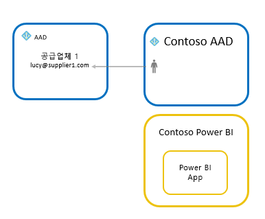

Azure AD B2B와 Power BI의 통합은 모든 비즈니스 메일 주소와 함께 작동합니다. 사용자에게 Azure AD ID가 없는 경우 계정을 만들라는 메시지가 표시될 수 있습니다. 다음 이미지는 자세한 흐름을 보여줍니다.

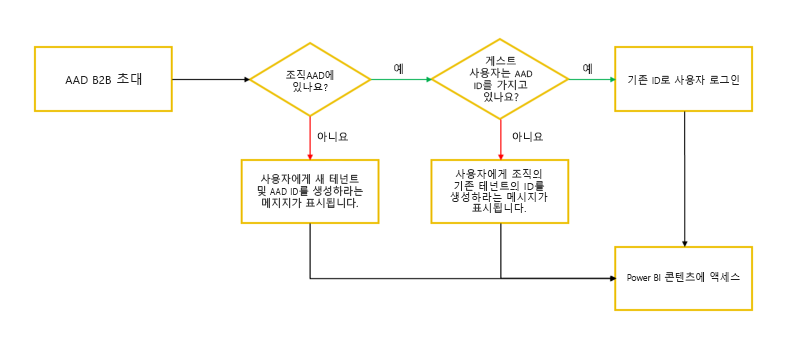

Azure AD 계정이 외부 협력업체의 Azure AD에서 사용되거나 생성되는 것을 인식하는 것이 중요합니다. 이를 통해 조직에서 Azure AD를 사용하는 경우 Lucy는 자신의 사용자 이름과 암호를 사용할 수 있으며 회사를 떠나게 되면 해당 자격 증명은 다른 테넌트에서 자동으로 작동을 중지합니다.

## 라이선싱

Contoso는 공급자 및 파트너 조직의 게스트 사용자에게 Power BI의 콘텐츠에 대한 액세스를 허가하는 세 가지 방법 중 하나를 선택할 수 있습니다.

> [!NOTE]
> Azure _Ad B2B의 무료 계층은 Azure AD B2B와 Power BI를 사용하기에 충분합니다. 동적 그룹과 같은 일부 고급 Azure AD B2B 기능을 위해서는 추가 라이선스가 필요합니다. 추가 정보는 Azure AD B2B 설명서를 참조하세요._ [ _https://docs.microsoft.com/azure/active-directory/b2b/licensing-guidance_ ](https://docs.microsoft.com/azure/active-directory/b2b/licensing-guidance)

### 방법 1: Contoso는 Power BI Premium을 사용 합니다.

이 접근 방식을 사용하여 Contoso는 Power BI Premium 용량을 구매하고 해당 BI 포털 콘텐츠를 이 용량에 할당합니다. 이렇게 하면 파트너 조직의 게스트 사용자가 Power BI 라이선스 없이 Contoso의 Power BI 앱에 액세스할 수 있습니다.

또한 외부 사용자는 Power BI Premium 내에서 콘텐츠를 사용하는 경우 Power BI의 "무료" 사용자에게 제공되는 소비 전용 환경을 사용하게 됩니다.

또한 Contoso는 새로 고침 속도, 전용 용량 및 큰 모델 크기와 같은 앱에 대한 다른 Power BI 프리미엄 기능을 활용할 수 있습니다.

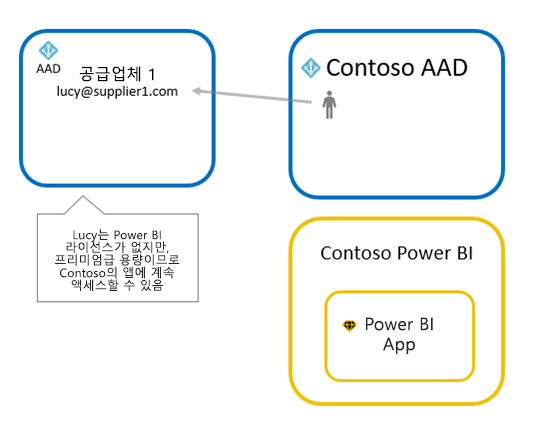

### 방법 2: Contoso에서 게스트 사용자에게 Power BI Pro 라이선스 할당

이 접근 방식을 사용하여 Contoso는 파트너 조직의 게스트 사용자에게 Pro 라이선스를 할당합니다. 이는 Contoso의 Microsoft 365 관리 센터에서 수행할 수 있습니다. 이를 통해 파트너 조직의 게스트 사용자는 라이선스를 구입하지 않고도 Contoso의 Power BI 앱에 액세스할 수 있습니다. 이는 해당 조직이 아직 Power BI를 채택하지 않은 외부 사용자와 공유하는 데 적합할 수 있습니다.

> [!NOTE]
> Contoso의 Pro 라이선스는 Contoso 테넌트의 콘텐츠에 액세스하는 경우에만 게스트 사용자에게 적용됩니다. Pro 라이선스를 사용하면 Power BI Premium 용량이 아닌 콘텐츠에 액세스할 수 있습니다. 그러나 Pro 라이선스가 있는 외부 사용자는 기본적으로 소비 전용 환경으로 제한됩니다. 이 내용은 이 문서의 뒷부분에 나오는 _외부 사용자가 Power BI에서 콘텐츠를 편집하고 관리할 수 있도록 설정_ 섹션에 설명된 방법을 사용하여 변경할 수 있습니다.

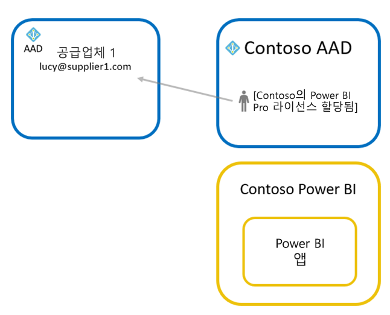

### 방법 3: 게스트 사용자가 자신의 Power BI Pro 라이선스를 이용

이 방법을 사용하는 경우 Supplier 1은 Lucy에게 Power BI Pro 라이선스를 할당합니다. 그런 다음 이 라이선스를 사용하여 Contoso의 Power BI 앱에 액세스할 수 있습니다. Lucy는 외부 Power BI 환경에 액세스할 때 자체 조직의 Pro 라이선스를 사용할 수 있기 때문에 이 접근 방식을 BYOL(_사용자 라이선스 가져오기_)이라고도 합니다. 두 조직 모두 Power BI를 사용하는 경우 전체 분석 솔루션에 대한 유용한 라이선스를 제공하며 외부 사용자에게 라이선스를 할당하는 오버헤드를 최소화합니다.

> [!NOTE]
> Supplier 1이 Lucy에게 제공하는 Pro 라이선스는 Lucy가 게스트 사용자인 모든 Power BI 테넌트에 적용됩니다. Pro 라이선스를 사용하면 Power BI Premium 용량이 아닌 콘텐츠에 액세스할 수 있습니다. 그러나 Pro 라이선스가 있는 외부 사용자는 기본적으로 소비 전용 환경으로 제한됩니다. 이 내용은 이 문서의 뒷부분에 나오는 _외부 사용자가 Power BI에서 콘텐츠를 편집하고 관리할 수 있도록 설정_ 섹션에 설명된 방법을 사용하여 변경할 수 있습니다.

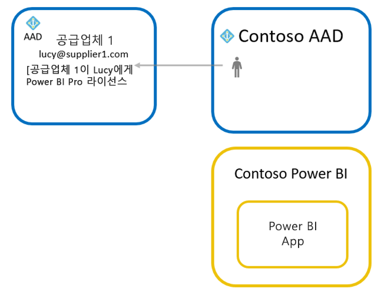

## 외부 파트너에 대한 데이터 보안

일반적으로 여러 외부 공급자를 사용하는 경우 Contoso는 각 공급자가 자체 제품에 대한 데이터만 볼 수 있도록 해야 합니다. 사용자 기반 보안 및 동적 행 수준 보안을 통해 Power BI에서 이를 쉽게 수행할 수 있습니다.

### 사용자 기반 보안

Power BI의 가장 강력한 기능 중 하나는 행 수준 보안입니다. 이 기능을 통해 Contoso는 단일 보고서 및 데이터 집합을 만들 수 있지만 각 사용자에 대해 서로 다른 보안 규칙을 적용할 수 있습니다. 자세한 설명은 [RLS (행 수준 보안)](https://powerbi.microsoft.com/documentation/powerbi-admin-rls/)를 참조 하세요.

Azure AD B2B와 Power BI 통합을 통해 Contoso는 Contoso 테넌트에 초대되는 즉시 게스트 사용자에게 행 수준 보안 규칙을 할당할 수 있습니다. 앞서 살펴본 것처럼 Contoso는 계획된 또는 임시 초대를 통해 게스트 사용자를 추가할 수 있습니다. Contoso에서 행 수준 보안을 적용하려는 경우 계획된 초대를 사용하여 게스트 사용자를 미리 추가하고 콘텐츠를 공유하기 전에 보안 역할에 할당하는 것이 좋습니다. Contoso에서 임시 초대를 대신 사용하는 경우 게스트 사용자는 잠시 데이터를 볼 수 없을 수 있습니다.

> [!NOTE]
> 임시 초대를 사용할 때 RLS에 의해 보호되는 데이터에 액세스하는 경우의 이러한 지연으로 인해 사용자가 받은 전자 메일에서 공유 링크를 열 때 보고서/대시보드가 비어 있거나 손상된 것을 보게 되므로 IT 팀에 대한 지원 요청으로 이어질 수 있습니다. 따라서 이 시나리오에서는 계획된 초대를 사용하는 것이 좋습니다.**

예제를 사용하여 이를 살펴보겠습니다.

앞서 언급했듯이 Contoso는 전 세계 공급자를 보유하고 있으며, 이들은 해당 공급자 조직의 사용자가 자신의 지역에서 데이터로부터 통찰력을 얻을 수 있도록 하고자 합니다. 하지만 Contoso의 사용자는 모든 데이터에 액세스할 수 있습니다. Contoso는 여러 다른 보고서를 만드는 대신 단일 보고서를 만들고 해당 보고서를 보는 사용자를 기준으로 데이터를 필터링합니다.

Contoso가 연결된 사용자를 기준으로 데이터를 필터링할 수 있도록 하기 위해 Power BI Desktop에서 두 개의 역할이 만들어집니다. 하나는 SalesTerritory "유럽"의 모든 데이터를 필터링하고, 다른 하나는 "북아메리카"의 모든 데이터를 필터링합니다.

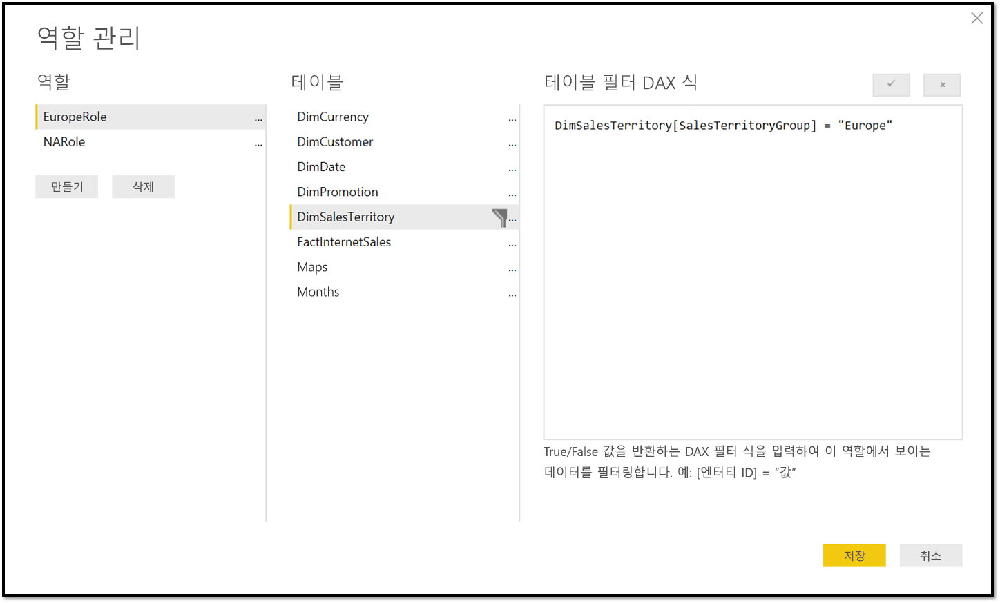

보고서에 역할이 정의될 때마다 사용자가 특정 역할에 할당되어 모든 데이터에 액세스할 수 있어야 합니다. 역할 할당은 Power BI 서비스 내에서 이루어집니다( **데이터 집합 > 보안** ).

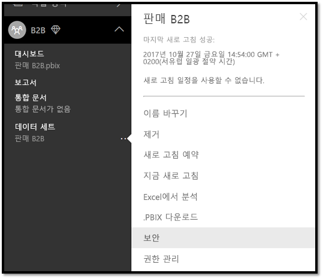

그러면 Contoso의 BI 팀에서 자신이 만든 두 역할을 볼 수 있는 페이지가 열립니다. 이제 Contoso의 BI 팀은 사용자를 역할에 할당할 수 있습니다.

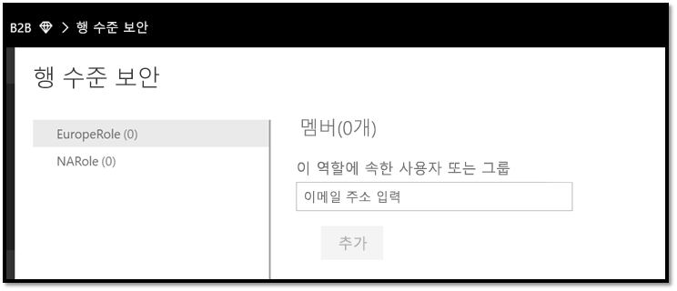

이 예에서는 Contoso가 전자 메일 주소 "[adam@themeasuredproduct.com](mailto:adam@themeasuredproduct.com)"를 사용하는 파트너 조직의 사용자를 유럽 역할에 추가합니다.

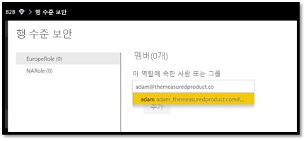

Azure AD에서 이를 확인하면 Contoso는 창에 이름이 표시되어 추가할 준비가 된 것을 볼 수 있습니다.

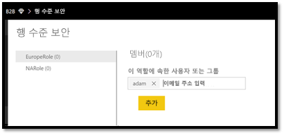

이제 이 사용자가 공유된 앱을 열면 유럽의 데이터가 포함된 보고서만 표시됩니다.

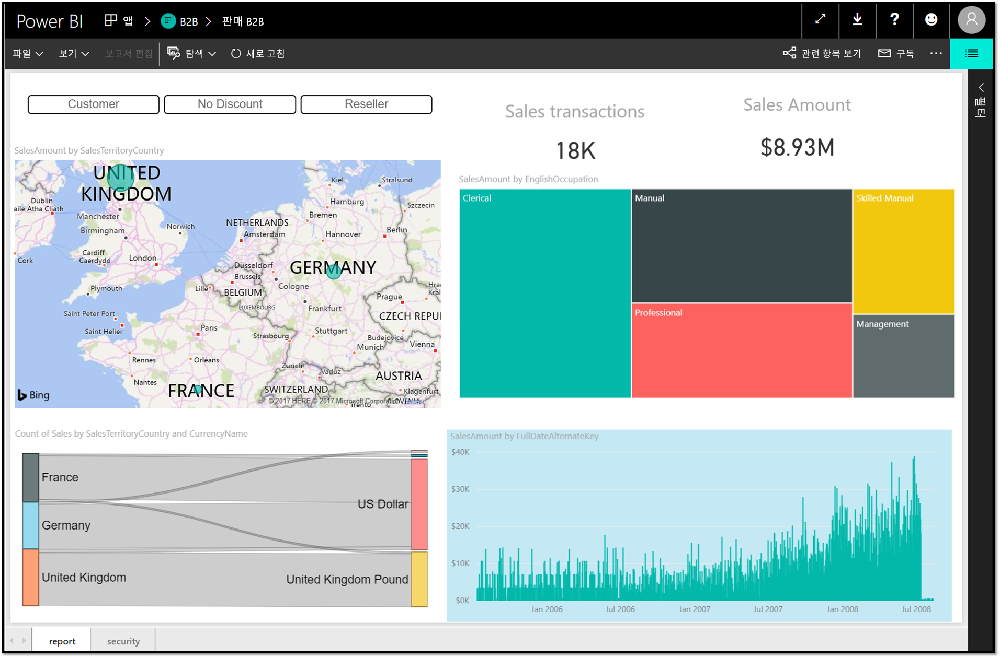

### 동적 행 수준 보안

또 다른 흥미로운 항목은 Azure AD B2B에서 RLS(동적 행 수준 보안)가 작동하는 방식을 확인하는 것입니다.

간단히 말해서 동적 행 수준 보안은 Power BI에 연결하는 사용자의 사용자 이름을 기반으로 모델의 데이터를 필터링하여 작동합니다. 사용자 그룹에 대해 여러 역할을 추가하는 대신 모델의 사용자를 정의합니다. 여기서는 패턴에 대해 자세히 설명하지 않습니다. Kasper de Jong은 [Power BI Desktop 동적 보안 참고 자료 시트](https://www.kasperonbi.com/power-bi-desktop-dynamic-security-cheat-sheet/) 및 [이 백서](https://msdn.microsoft.com/library/jj127437.aspx)에서 행 수준 보안의 모든 특성에 대한 자세한 내용을 제공합니다.

작은 예를 살펴보겠습니다. Contoso에는 그룹별 판매에 대한 간단한 보고서가 있습니다.

이제 이 보고서를 두 명의 게스트 사용자와 내부 사용자와 공유해야 합니다. 내부 사용자는 모든 항목을 볼 수 있지만 게스트 사용자는 액세스 권한이 있는 그룹만 볼 수 있습니다. 즉, 게스트 사용자에 대해서만 데이터를 필터링해야 합니다. 데이터를 적절하게 필터링하기 위해 Contoso는 백서 및 블로그 게시물에 설명된 대로 동적 RLS 패턴을 사용합니다. 즉, Contoso는 데이터 자체에 사용자 이름을 추가합니다.

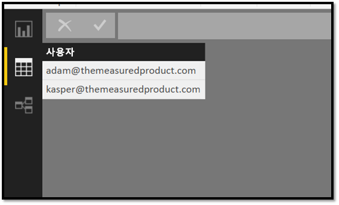

그런 다음, Contoso는 올바른 관계를 사용하여 적절한 데이터를 필터링하는 올바른 데이터 모델을 만듭니다.

로그인한 사용자에 따라 데이터를 자동으로 필터링하려면 Contoso는 연결하는 사용자에게 전달되는 역할을 만들어야 합니다. 이 경우 Contoso는 두 개의 역할을 만듭니다. 첫 번째는 Power BI에 로그인한 사용자의 현재 사용자 이름을 사용하여 사용자 테이블을 필터링하는 "securityrole"입니다. 이는 Azure AD B2B 게스트 사용자에 대해서도 작동합니다.

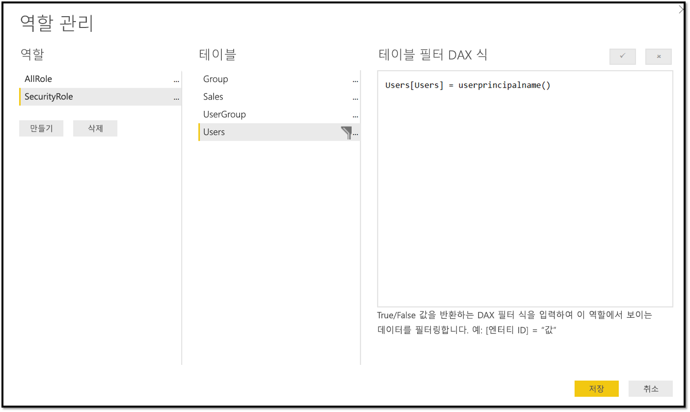

또한 Contoso는 모든 것을 볼 수 있는 내부 사용자에 대해 또 다른 "AllRole"을 만듭니다. 이 역할에는 보안 조건자가 없습니다.

서비스에 Power BI Desktop 파일을 업로드하면 Contoso는 게스트 사용자를 "SecurityRole"에 할당하고 내부 사용자를 "AllRole"에 할당할 수 있습니다.

이제 게스트 사용자가 보고서를 열 때 그룹 A의 판매액만 표시 됩니다.

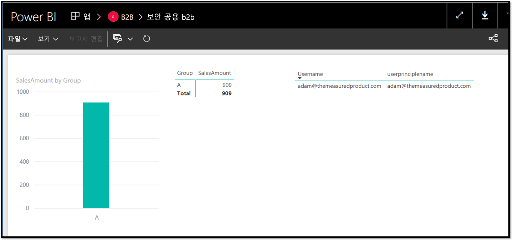

오른쪽에 있는 행렬에서 USERNAME() 및 USERPRINCIPALNAME() 함수의 결과를 볼 수 있습니다. 이는 모두 게스트 사용자 전자 메일 주소를 반환 합니다.

이제 내부 사용자는 모든 데이터를 볼 수 있습니다.

여기에서 볼 수 있듯이 동적 RLS는 내부 또는 게스트 사용자와 함께 작동합니다.

> [!NOTE]
> 이 시나리오는 Azure Analysis Services에서 모델을 사용 하는 경우에도 작동 합니다. 일반적으로 Azure Analysis Service는 Power BI와 동일한 Azure AD에 연결 되어 있습니다. 이 경우, Azure Analysis Services는 또한 Azure AD B2B를 통해 초대된 게스트 사용자를 알고 있습니다.

## 온-프레미스 데이터 원본에 연결

Power BI는 Contoso에서 [온-프레미스 데이터 게이트웨이](https://powerbi.microsoft.com/documentation/powerbi-gateway-onprem/)를 통해 [SQL Server Analysis Services](https://powerbi.microsoft.com/documentation/powerbi-gateway-enterprise-manage-ssas/) 또는 [SQL Server](https://powerbi.microsoft.com/documentation/powerbi-gateway-kerberos-for-sso-pbi-to-on-premises-data/)와 같은 온-프레미스 데이터 원본을 활용할 수 있는 기능을 제공합니다. Power BI에 사용하는 것과 동일한 자격 증명을 사용하여 해당 데이터 원본에 로그온할 수도 있습니다.

> [!NOTE]
> 게이트웨이를 설치하여 Power BI 테넌트에 연결하는 경우 테넌트 내에서 만든 사용자를 사용해야 합니다. 외부 사용자는 게이트웨이를 설치하고 테넌트에 연결할 수 없습니다.

외부 사용자의 경우 외부 사용자가 일반적으로 온-프레미스 AD에 알려지지 않기 때문에이 방법이 더 복잡할 수 있습니다. 이에 대 한 해결 방법은 [데이터 원본 관리-Analysis Services](https://powerbi.microsoft.com/documentation/powerbi-gateway-enterprise-manage-ssas/)에 설명 된 대로 Contoso 관리자가 외부 사용자 이름을 내부 사용자 이름에 매핑하는 것을 허용 하 여 해결 방법을 제공 합니다. Power BI 예를 들어 [lucy@supplier1.com](mailto:lucy@supplier1.com) [\_supplier1\_com #EXT@contoso.com](mailto:lucy_supplier1_com)에 매핑될 수 있습니다.

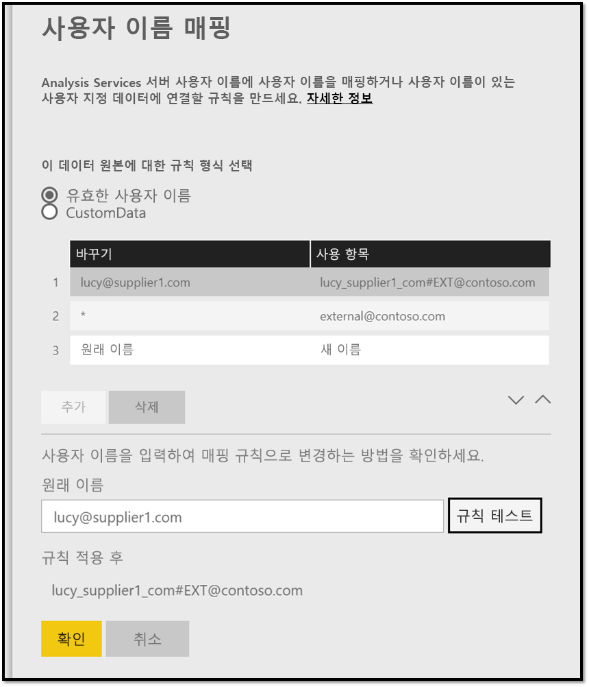

이 방법은 Contoso에 소수의 사용자만 있거나 Contoso가 모든 외부 사용자를 단일 내부 계정에 매핑할 수 있는 경우에 적합 합니다. 각 사용자가 자신의 자격 증명을 요구하는 보다 복잡한 시나리오의 경우 [데이터 원본 관리-Analysis Services](https://powerbi.microsoft.com/documentation/powerbi-gateway-enterprise-manage-ssas/)에 설명된 대로 [사용자 지정 AD 특성](https://technet.microsoft.com/library/cc961737.aspx)을 사용하여 매핑을 수행 하는 고급 방법이 있습니다. 이를 통해 Contoso 관리자는 Azure AD의 모든 사용자 (외부 B2B 사용자)에 대한 매핑을 정의할 수 있습니다.  이러한 특성은 스크립트 또는 코드를 사용하여 AD 개체 모델을 통해 설정할 수 있으므로 Contoso에서 초대 또는 예약된 흐름에 대한 매핑을 완전히 자동화할 수 있습니다.

## 외부 사용자가 Power BI 내에서 콘텐츠를 편집하고 관리할 수 있도록 설정

Contoso는 Power BI 콘텐츠를 조직 간 편집 및 관리 섹션에서 이전에 설명한 대로 외부 사용자가 조직 내에서 콘텐츠를 제공할 수 있도록 허용할 수 있습니다.

> [!NOTE]
> 조직의 Power BI 내에서 콘텐츠를 편집하고 관리하려면 사용자는 내 작업 영역 이외의 작업 영역에서 Power BI Pro 라이선스를 보유해야 합니다. 사용자는 이 문서의 _라이선스_ 섹션에서 설명하는 대로 Pro 라이선스를 얻을 수 있습니다.

Power BI 관리 포털은 테 넌 트 설정에서 **외부 게스트 사용자가 조직에서 콘텐츠를 편집 하 고 관리할 수 있도록 허용** 설정을 제공 합니다. 기본적으로이 설정은 사용 안 함으로 설정 됩니다. 즉, 외부 사용자는 기본적으로 제한 된 읽기 전용 환경을 가져옵니다. 이 설정은 Azure AD에서 UserType가 게스트로 설정 된 사용자에 게 적용 됩니다. 다음 표에서는 UserType에 따라 사용자가 경험 하는 동작과 설정을 구성 하는 방법에 대해 설명 합니다.

| **Azure AD의 사용자 유형** | **외부 게스트 사용자가 콘텐츠를 편집 및 관리 하도록 허용 설정** | **동작** |
| --- | --- | --- |
| 게스트 | 사용자에 대해 사용 안 함(기본값) | 항목 소비 전용 보기입니다. 게스트 사용자에게 전송된 URL을 통해 볼 때 보고서, 대시보드 및 앱에 대한 읽기 전용 액세스를 허용합니다. Power BI Mobile 앱은 게스트 사용자에게 읽기 전용 보기를 제공합니다. |
| 게스트 | 사용자에 대해 사용 | 외부 사용자는 일부 기능을 사용할 수 없지만 전체 Power BI 환경에 액세스할 수 있습니다. 외부 사용자는 포함 된 테 넌 트 정보와 함께 Power BI 서비스 URL을 사용 하 여 Power BI에 로그인 해야 합니다. 사용자는 홈 환경, 내 작업 영역 및 사용 권한을 기반으로 콘텐츠를 검색 하 고, 보고, 만들 수 있습니다.    Power BI Mobile 앱은 게스트 사용자에게 읽기 전용 보기를 제공합니다. |

> [!NOTE]
> Azure AD의 외부 사용자는 UserType Member로도 설정할 수 있습니다. 이 기능은 현재 Power BI에서 지원되지 않습니다.

Power BI 관리 포털에서 설정은 다음 그림과 같이 표시됩니다.

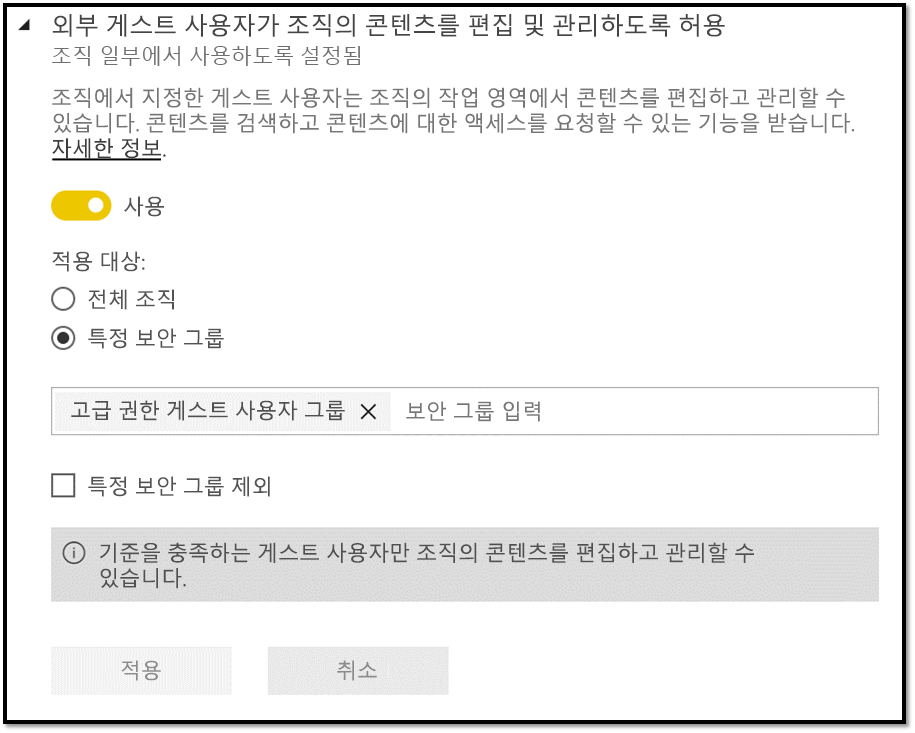

게스트 사용자는 읽기 전용 기본 환경을 가져오고 콘텐츠를 편집 및 관리할 수 있습니다. 기본값은 사용 안 함입니다. 즉, 모든 게스트 사용자에 게 읽기 전용 환경이 있습니다. Power BI 관리자는 조직의 모든 게스트 사용자 또는 Azure AD에 정의 된 특정 보안 그룹에 대 한 설정을 사용 하도록 설정할 수 있습니다. 다음 이미지에서 Contoso Power BI 관리자는 Azure AD에서 보안 그룹을 만들어 Contoso 테 넌 트의 콘텐츠를 편집 하 고 관리할 수 있는 외부 사용자를 관리 합니다.

이러한 사용자가 Power BI에 로그인할 수 있도록 테넌트 URL을 제공합니다. 테넌트 URL을 찾으려면 이 단계를 수행합니다.

1. Power BI 서비스의 상단 메뉴에서 **도움말을 선택** 합니다. )를 **Power BI**합니다.
2. **테넌트 URL** 옆에 있는 값을 찾습니다. 게스트 사용자와 공유할 수 있는 테넌트 URL입니다.

    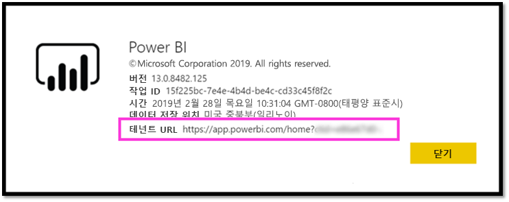

외부 게스트 사용자가 조직에서 콘텐츠를 편집하고 관리할 수 있도록 허용을 사용하는 경우 지정된 게스트 사용자는 조직의 Power BI에 대한 액세스 권한을 얻고 권한이 있는 모든 콘텐츠를 볼 수 있습니다. 홈에 액세스하고, 콘텐츠를 검색 및 작업 영역에 추가하고, 액세스 목록에 있는 위치에 앱을 설치하고, 내 작업 영역을 만들 수 있습니다. 또 새로운 작업 영역 환경을 사용하는 작업 영역의 관리자를 만들거나 관리자가 될 수 있습니다.

> [!NOTE]
> 이 옵션을 사용 하는 경우 기본 Azure AD 설정으로 인해 게스트 사용자가 사용자 선택기와 같은 특정 기능을 사용 하 여 환경이 축소 될 수 있으므로이 문서의 거 버 넌 스 섹션을 검토 해야 합니다. * *

외부 게스트 사용자가 조직의 테넌트 설정에서 콘텐츠를 편집하고 관리할 수 있도록 허용을 통해 설정된 게스트 사용자의 경우 일부 환경을 사용할 수 없습니다. 보고서를 업데이트하거나 게시하려면 게스트 사용자가 데이터 가져오기를 포함하여 Power BI Desktop 파일을 업로드하는 Power BI 서비스 웹 UI를 사용해야 합니다. 다음 환경은 지원되지 않습니다.

- Power BI Desktop에서 Power BI 서비스에 직접 게시
- 게스트 사용자는 Power BI Desktop를 사용하여 Power BI 서비스의 서비스 데이터 세트에 연결할 수 없습니다.
- Office 365 그룹에 연결된 클래식 작업 영역: 게스트 사용자는 이들 작업 영역의 관리자를 만들거나 관리자가 될 수 없습니다. 이들은 구성원이 될 수 있습니다.
- 작업 영역 액세스 목록 임시 초대 전송이 지원되지 않습니다.
- 게스트 사용자에게는 Power BI Publisher for Excel이 지원되지 않습니다.
- 게스트 사용자는 Power BI Gateway를 설치하여 조직에 연결할 수 없습니다.
- 게스트 사용자는 전체 조직에 게시된 앱을 설치할 수 없습니다.
- 게스트 사용자는 조직 콘텐츠 팩을 사용, 생성, 업데이트 또는 설치할 수 없습니다.
- 게스트 사용자는 Excel의 분석을 사용할 수 없습니다.
- 게스트 사용자는 주석으로 @mentioned 수 없습니다 .이 기능은 예정 된 릴리스에 추가 될 예정입니다.
- 게스트 사용자는 구독을 사용할 수 없습니다 .이 기능은 예정 된 릴리스에 추가 될 예정입니다.
- 이 기능을 사용하는 게스트 사용자는 회사 또는 학교 계정이 있어야 합니다. 개인 계정을 사용하는 게스트 사용자에게는 로그인 제한으로 인해 더 많은 제한이 발생합니다.

## 거버넌스

### Azure AD B2B와 관련 Power BI의 환경에 영향을 주는 추가 Azure AD 설정

Azure AD B2B 공유를 사용 하는 경우 Azure Active Directory 관리자는 외부 사용자 환경의 측면을 제어 합니다. 이러한 설정은 테 넌 트에 대 한 Azure Active Directory 설정 내의 외부 공동 작업 설정 페이지에서 제어 됩니다.

설정에 대 한 세부 정보는 여기에서 확인할 수 있습니다.

[https://docs.microsoft.com/azure/active-directory/b2b/delegate-invitations](https://docs.microsoft.com/azure/active-directory/b2b/delegate-invitations)

> [!NOTE]
> 기본적으로 게스트 사용자 권한은 제한 됨 옵션을 예로 설정 하므로, Power BI 내의 게스트 사용자는 이러한 사용자에 대 한 사용자 선택 Ui가 작동 하지 않는 경우 특히 서라운드 공유가 제한 됩니다. 적절 한 환경을 보장 하려면 아래와 같이 Azure AD 관리자와 협력 하 여이를 아니요로 설정 하는 것이 중요 합니다. * *

### 게스트 초대 제어

Power BI 관리자는 Power BI 관리 포털을 방문 하 여 Power BI에 대 한 외부 공유만 제어할 수 있습니다. 그러나 테 넌 트 관리자는 다양 한 Azure AD 정책을 통해 외부 공유를 제어할 수도 있습니다.  이러한 정책을 사용 하면 테 넌 트 관리자가

- 최종 사용자의 초대 해제
- 관리자 및 게스트 초대자 역할의 사용자만 초대할 수 있습니다.
- 관리자, 게스트 초대자 역할 및 구성원은 초대할 수 있습니다.
- 게스트를 비롯 한 모든 사용자가 초대할 수 있습니다.

이러한 정책에 대 한 자세한 내용은 [Azure Active Directory B2B 공동 작업을 위한 대리인 초대](https://docs.microsoft.com/azure/active-directory/active-directory-b2b-delegate-invitations)에서 확인할 수 있습니다.

외부 사용자의 모든 Power BI 작업은 [감사 포털 에서도 감사](https://powerbi.microsoft.com/documentation/powerbi-admin-auditing/)됩니다.

### 게스트 사용자에 대 한 조건부 액세스 정책

Contoso는 Contoso 테 넌 트의 콘텐츠에 액세스 하는 게스트 사용자에 대 한 조건부 액세스 정책을 적용할 수 있습니다. [B2B 공동 작업 사용자에 대 한 조건부 액세스](https://docs.microsoft.com/azure/active-directory/active-directory-b2b-mfa-instructions)에서 자세한 지침을 찾을 수 있습니다.

## 일반적인 대체 방법

Azure AD B2B를 사용 하면 조직 전체에서 데이터와 보고서를 쉽게 공유할 수 있지만, 일반적으로 사용 되는 다른 몇 가지 방법이 있으며 특정 한 경우에 더 많을 수 있습니다.

### 대체 옵션 1: 파트너 사용자에 대 한 중복 id 만들기

이 옵션을 사용 하는 경우 Contoso는 다음 이미지와 같이 Contoso 테 넌 트의 각 파트너 사용자에 대해 중복 id를 수동으로 만들어야 했습니다. 그런 다음 Power BI 내에서 Contoso는 적절 한 보고서, 대시보드 또는 앱의 할당 된 id를 공유할 수 있습니다.

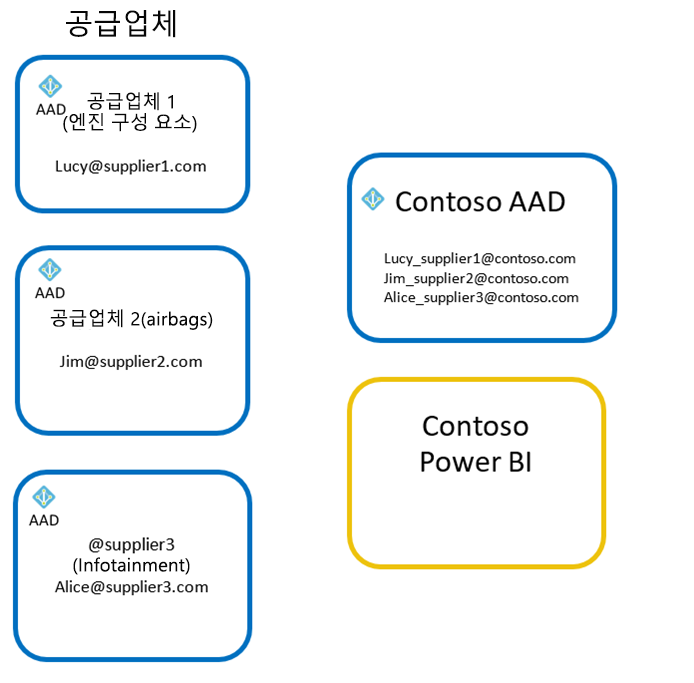

이 대안을 선택 하는 이유:

- 사용자의 id가 조직에 의해 제어 되므로 전자 메일, SharePoint 등의 관련 서비스도 조직의 제어에 있습니다. IT 관리자는 암호를 재설정 하거나, 계정에 대 한 액세스를 사용 하지 않도록 설정 하거나, 이러한 서비스의 작업을 감사할 수 있습니다.
- 비즈니스에 개인 계정을 사용 하는 사용자는 종종 특정 서비스에 액세스 하지 못하도록 제한 되므로 조직 계정이 필요할 수 있습니다.
- 일부 서비스는 조직의 사용자만 사용할 수 있습니다. 예를 들어 Intune을 사용 하 여 Azure B2B를 사용 하는 외부 사용자의 개인/모바일 장치에서 콘텐츠를 관리 하는 것은 불가능 합니다.

이 대안을 선택 하지 않는 이유는 다음과 같습니다.

- 파트너 조직의 사용자는 두 가지 자격 증명 집합을 명심 해야 합니다. 하나는 자체 조직의 콘텐츠에 액세스 하 고 다른 하나는 Contoso의 콘텐츠에 액세스 하는 데 사용 됩니다. 이러한 게스트 사용자에 게는이 환경에서 많은 게스트 사용자가 혼란 스 러 울 수 있습니다.
- Contoso는 사용자 단위 라이선스를 구매 하 여 이러한 사용자에 게 할당 해야 합니다. 사용자가 전자 메일을 받거나 office 응용 프로그램을 사용 해야 하는 경우 Power BI에서 콘텐츠를 편집 하 고 공유 Power BI Pro를 포함 하 여 적절 한 라이선스가 필요 합니다.
- Contoso는 내부 사용자와 비교 하 여 외부 사용자에 게 보다 엄격한 권한 부여 및 거 버 넌 스 정책을 적용 하려고 할 수 있습니다. 이를 위해 Contoso는 외부 사용자를 위한 사내 명명법을 만들어야 하며 모든 Contoso 사용자는이 명명법에 대해 교육을 받아야 합니다.
- 사용자가 조직을 떠날 때 Contoso 관리자가 수동으로 계정을 삭제할 때까지 Contoso의 리소스에 계속 액세스할 수 있습니다.
- Contoso 관리자는 생성, 암호 다시 설정 등을 비롯 하 여 게스트에 대 한 id를 관리 해야 합니다.

### 대체 옵션 2: 사용자 지정 인증을 사용 하 여 사용자 지정 Power BI Embedded 응용 프로그램 만들기

Contoso의 또 다른 옵션은 사용자 지정 인증 ([' 앱 소유 데이터 '](https://docs.microsoft.com/power-bi/developer/embed-sample-for-customers))을 사용 하 여 고유한 사용자 지정 포함 Power BI 응용 프로그램을 빌드하는 것입니다. 많은 조직에서는 사용자 지정 응용 프로그램을 만들어 외부 파트너에 게 Power BI 콘텐츠를 배포 하는 데 필요한 시간 또는 리소스를 갖지 않지만, 일부 조직에서는이 방법이 가장 적합 하 고 심각한 고려 사항이 있습니다.

조직에는 파트너에 대 한 모든 조직 리소스에 대 한 액세스를 중앙 집중화 하 고, 내부 조직 리소스에서 격리를 제공 하 고, 파트너가 많은 파트너를 지원할 수 있는 간소화 된 환경을 제공 하는 기존 파트너 포털이 있습니다. 개별 사용자입니다.

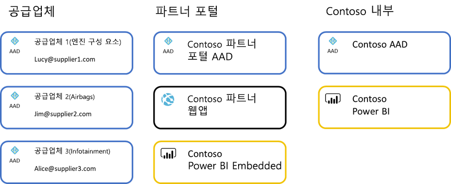

위의 예제에서 각 공급자 로그인의 사용자는 AAD를 id 공급자로 사용 하는 Contoso의 파트너 포털에 로그인 합니다. AAD B2B, Azure B2C, 네이티브 id를 사용 하거나 원하는 수의 다른 id 공급자와 페더레이션 할 수 있습니다. 사용자가 로그인 하 고 Azure 웹 앱 또는 유사한 인프라를 사용 하 여 파트너 포털 빌드에 액세스 합니다.

웹 앱 내에서 Power BI 보고서는 Power BI Embedded 배포에서 포함 됩니다. 웹 앱은 공급자가 Contoso와 쉽게 상호 작용할 수 있도록 하는 긴밀 한 환경에서 보고서 및 관련 서비스에 대 한 액세스를 간소화 합니다. 이 포털 환경은 Contoso 내부 AAD 및 Contoso의 내부 Power BI 환경에서 격리 되어 공급자가 해당 리소스에 액세스할 수 없도록 합니다. 일반적으로 데이터는 데이터의 격리를 보장 하기 위해 별도의 파트너 데이터 웨어하우스에 저장 됩니다. 이러한 격리는 외부 사용자의 수를 조직의 데이터에 직접 액세스 하 여 외부 사용자가 사용할 수 있는 데이터를 제한 하 고 외부 사용자와의 실수로 인 한 공유를 제한 하기 때문에 이점이 있습니다.

포털은 Power BI Embedded를 사용 하 여 앱 토큰 또는 Azure 모델에서 구매한 프리미엄 용량을 사용 하 여 앱 토큰 또는 마스터 사용자를 사용 하 여 장점 라이선스를 활용할 수 있습니다 .이는 최종 사용자에 게 라이선스를 할당 하는 것과 관련 된 문제를 간소화 하 고 예상 되는 파트너가 파트너의 모든 요구를 염두에 두어야 하는 단일 포털에 액세스 하므로, 포털은 전반적으로 높은 품질과 일관 된 환경을 제공할 수 있습니다. 마지막으로 Power BI Embedded 기반 솔루션은 일반적으로 다중 테 넌 트를 사용 하도록 설계 되었으므로 파트너 조직 간에 격리를 더욱 쉽게 보장할 수 있습니다.

이 대안을 선택 하는 이유:

- 파트너 조직 수가 증가 함에 따라 보다 쉽게 관리할 수 있습니다. 파트너는 Contoso의 내부 AAD 디렉터리와 분리 된 별도의 디렉터리에 추가 되기 때문에 관리 업무를 간소화 하 고 외부 사용자에 게 내부 데이터를 실수로 공유 하는 것을 방지 합니다.
- 일반적인 파트너 포털은 파트너 간에 일관 된 환경을 갖춘 많은 경험을가지고 있으며 일반적인 파트너의 요구를 충족 하도록 간소화 되었습니다. 따라서 Contoso는 필요한 모든 서비스를 단일 포털에 통합 하 여 파트너에 게 더 나은 전반적인 환경을 제공할 수 있습니다.
- Power BI Embedded 내에서 콘텐츠 편집과 같은 고급 시나리오에 대 한 라이선스 비용은 Azure 구매한 Power BI Premium에 포함 되며 해당 사용자에 게 Power BI Pro 라이선스를 할당할 필요가 없습니다.
- 다중 테 넌 트 솔루션으로 설계 된 경우 파트너 간에 더 나은 격리를 제공 합니다.
- 파트너 포털에는 Power BI 보고서, 대시보드 및 앱 이외의 파트너를 위한 다른 도구가 포함 되어 있는 경우가 많습니다.

이 대안을 선택 하지 않는 이유는 다음과 같습니다.

- 이러한 포털을 빌드, 운영 및 유지 관리 하 여 리소스와 시간에 상당한 투자를 수행 하려면 상당한 노력이 필요 합니다.
- 여러 작업 흐름을 신중 하 게 계획 하 고 실행 해야 하므로 솔루션에 대 한 시간은 B2B 공유를 사용 하는 것 보다 훨씬 깁니다.
- 파트너가 적은 수의 경우이 대안에 필요한 노력이 너무 높을 수 있습니다.
- 임시 공유와의 공동 작업은 조직에서 직면 하는 주요 시나리오입니다.
- 보고서와 대시보드는 파트너 마다 다릅니다. 이 대안은 파트너와 직접 공유 하는 것 외에 관리 오버 헤드를 소개 합니다.

## FAQ

**Contoso가 자동으로 사용 되는 초대를 보낼 수 있으므로 사용자는 "준비 완료"만 될 수 있습니다. 또는 사용자가 상환 URL을 항상 클릭 해야 하나요?**

최종 사용자는 콘텐츠에 액세스 하기 전에 항상 동의 경험을 클릭 해야 합니다.

여러 게스트 사용자를 초대 하는 경우 [리소스 조직의 게스트 초대자 역할에 사용자를 추가](https://docs.microsoft.com/azure/active-directory/active-directory-b2b-add-guest-to-role)하 여 핵심 Azure AD 관리자에서이를 위임 하는 것이 좋습니다. 이 사용자는 로그인 UI, PowerShell 스크립트 또는 Api를 사용 하 여 파트너 조직의 다른 사용자를 초대할 수 있습니다. 이렇게 하면 Azure AD 관리자에서 파트너 조직의 사용자에 게 초대를 초대 하거나 다시 보낼 때의 관리 부담을 줄일 수 있습니다.

**Contoso에서 multi-factor authentication을 사용할 수 없는 경우 게스트 사용자에 대해 multi-factor authentication을 강제 적용할 수 있나요?**

예. 자세한 내용은 [B2B 공동 작업 사용자에 대 한 조건부 액세스](https://docs.microsoft.com/azure/active-directory/active-directory-b2b-mfa-instructions)를 참조 하세요.

**초대 받은 파트너가 페더레이션을 사용 하 여 자신의 온-프레미스 인증을 추가 하는 경우 B2B 공동 작업은 어떻게 작동 하나요?**

파트너에 게 온-프레미스 인증 인프라로 페더레이션된 Azure AD 테 넌 트가 있는 경우 온-프레미스 SSO (Single Sign-On)가 자동으로 실현 됩니다. 파트너에 게 Azure AD 테 넌 트가 없는 경우 새 사용자에 대해 Azure AD 계정을 만들 수 있습니다.

**게스트 사용자를 소비자 전자 메일 계정으로 초대할 수 있나요?**

게스트 사용자를 소비자 전자 메일 계정에 초대 하는 것은 Power BI에서 지원 됩니다. 여기에는 hotmail.com, outlook.com 및 gmail.com와 같은 도메인이 포함 됩니다. 그러나 이러한 사용자는 회사 또는 학교 계정이 있는 사용자의 제한을 초과 하는 경우에 발생할 수 있습니다.
