# Power BI Premium 용량 배포 및 관리

**요약:** Power BI Premium는 조직의 모든 사용자에 게 보다 일관 된 성능을 제공 하 고, 대용량 데이터 볼륨을 지원 하 고, 통합 셀프 서비스 및 엔터프라이즈 BI 플랫폼의 유연성을 제공 합니다. 이 수준 300 기술 백서는 Power BI 관리자와 콘텐츠 작성자 및 게시자를 위해 특별히 작성 되었습니다. 이를 통해 Power BI Premium의 잠재력을 이해 하 고 확장 가능한 솔루션을 디자인, 배포, 모니터링 및 문제 해결 하는 방법을 설명할 수 있습니다.

**작성자:** [Peter Myers](https://www.linkedin.com/in/peterjsmyers) (데이터 플랫폼 MVP 및 독립적인 BI 전문가 (비트 솔루션 포함))

**기술 검토자:** Adam Saxton, Akshai Mirchandani, Bhavik 판매자, David Magar, Josh Caplan, Michael Blythe, Nimrod Shalit, Olivier Matrat, 스와티어 Gupta

**적용 대상:** Power BI 서비스, Power BI Premium 및 Azure Power BI Embedded 용량

> [!NOTE]
> 이 백서는 브라우저에서 **인쇄**를 선택한 다음, **PDF로 저장**을 선택하여 저장하거나 인쇄할 수 있습니다.

## Power BI 소개

Power BI은 신속한 의사 결정을 내릴 수 있는 통찰력을 제공 하도록 설계 된 비즈니스 분석 서비스입니다. 2015에서 해당 릴리스는 가장 많이 사용 되는 기업에 가장 작은 규모의 조직에 대 한 솔루션을 제공 하는 데 사용 되는 인기 있는 서비스가 됩니다.

클라우드 서비스와 **Power BI Report Server**이라는 온-프레미스 보고 솔루션의 두 가지 방법으로 사용할 수 있습니다. \[[1](#endnote-01)\]

클라우드 서비스로 Power BI SaaS (Software as a Service) \[[2](#endnote-02)\]입니다. 조직에서 비즈니스를 모니터링 하는 솔루션을 개발, 배포, 관리, 공유할 수 있도록 하는 서비스 및 응용 프로그램 집합을 나타냅니다.

이 백서에서는 Power BI 서비스에 대 한 포괄적인 설명을 제공 하지 않습니다. 대신 Power BI Premium의 주체와 관련 된 항목에 중점을 둘 수 있습니다. Power BI에 대 한 일반 정보는 포괄적인 [Power BI 설명서](service-admin-premium-multi-geo.md)를 참조 하세요. 잘 작동 하는 엔터프라이즈 배포를 달성 하는 데 초점을 맞춘 Power BI 서비스에 대 한 자세한 설명은 엔터프라이즈 배포에 대 한 종합적인 [계획 Power BI](https://aka.ms/pbienterprisedeploy) 을 참조 하세요.

이 백서의 주제 내에서이 섹션에서는 용량, Power BI 콘텐츠 형식, 모델 저장소 모드 및 라이선스를 소개 하 고 설명 합니다. 이러한 항목에 대 한 이해는 Power BI Premium 성공적으로 배포 하 고 관리 하는 데 필요 합니다.

### 용량

**용량은** Power BI 콘텐츠를 호스팅하고 전달 하는 데 사용 되는 리소스 (저장소, 프로세서 및 메모리) 집합을 나타내는 핵심 Power BI 개념입니다. 용량은 공유 또는 전용입니다. **공유 용량**은 다른 Microsoft 고객과 공유되는 반면, **전용 용량**은 한 명의 고객에게만 전적으로 사용됩니다. 전용 용량은 [프리미엄 용량](#premium-capacities) 항목에서 도입 되었습니다.

공유 용량에서는 워크로드가 다른 고객과 공유된 계산 리소스에서 실행됩니다. 용량이 리소스를 공유 해야 하므로 최대 모델 크기 (1gb) 및 최대 일별 새로 고침 빈도 (하루 8 회)와 같이 "공평 재생"을 보장 하기 위해 제한이 적용 됩니다.

### 작업 영역

Power BI 작업 영역은 용량 내에 있으며 보안, 공동 작업 및 배포 컨테이너를 나타냅니다. 각 Power BI 사용자는 **내 작업 영역**이라는 개인 작업 영역을 갖습니다. 공동 작업 및 배포를 가능 하 게 하는 추가 작업 영역을 만들 수 있으며 이러한 작업 **영역을 작업 영역**이라고 합니다. 기본적으로 개인 작업 영역을 포함 하는 작업 영역은 공유 용량에 생성 됩니다.

### Power BI 콘텐츠 형식

Power BI Premium 항목을 소개 하려면 기본 콘텐츠 형식을 비롯 한 Power BI 아키텍처에 대해 자세히 설명 하는 것이 중요 합니다.

모든 Power BI 콘텐츠는 Power BI 콘텐츠에 대 한 컨테이너인 작업 영역 내에 저장 되 고 관리 됩니다. 각 Power BI 사용자는 자신의 개인 작업 영역을가지고 있지만 일반적인 모범 사례는 작업 영역을 만드는 것입니다. 작업 영역에서 콘텐츠 공동 소유권 및 콘텐츠 공동 작업 기능을 사용할 수 있습니다. 또한 콘텐츠를 스테이징 하 고 앱으로 다양 한 대상에 배포 하는 기능을 제공 합니다.

다음 Power BI 콘텐츠는 작업 영역에 저장 됩니다.

- 데이터 흐름
- 데이터 세트
- 통합 문서
- 보고서
- 대시보드

#### 데이터 흐름

Power BI 데이터 흐름를 통해 서로 다른 원본의 데이터를 통합할 수 있습니다. 모델에 사용 하기 위해 데이터를 준비 하 고 준비 하는 것으로 간주할 수 있지만 보고의 원본으로 직접 사용할 수는 없습니다. Microsoft 데이터 커넥터의 광범위 한 컬렉션을 활용 하 여 온-프레미스 및 클라우드 기반 데이터 원본에서 데이터를 수집할 수 있도록 합니다.

데이터 흐름는 작업 영역 에서만 만들고 관리할 수 있으며 Azure Data Lake Storage Gen2의 CDM (Common Data Model)에 엔터티로 저장 됩니다. 일반적으로 최신 데이터를 저장 하기 위해 반복적으로 새로 고치도록 예약 됩니다.

자세한 내용은 [Power BI (미리 보기) 문서에서 셀프 서비스 데이터 준비](service-dataflows-overview.md) 를 참조 하세요.

#### 데이터 세트

Power BI 데이터 집합은 보고 및 시각화를 위해 준비 된 데이터 원본을 나타냅니다. 에서 만든 데이터 집합에는 다음과 같은 여러 가지 형식이 있습니다.

- Power BI 용량에서 호스팅되지 않는 기존 데이터 모델에 연결
- 모델을 포함 하는 Power BI Desktop 파일 업로드
- 하나 이상의 Excel 테이블 및/또는 통합 문서 데이터 모델을 포함 하는 Excel 통합 문서를 업로드 하거나 CSV (쉼표로 구분 된 값) 파일을 업로드 합니다.
- Power BI 서비스를 사용 하 여 푸시, 스트리밍 또는 하이브리드 스트리밍 데이터 집합 만들기

스트리밍 데이터 집합 \[[3](#endnote-03)\]를 제외 하 고, 데이터 집합은 Analysis Services의 완성 된 모델링 기술을 활용 하는 데이터 모델을 나타냅니다.

설명서에서는 용어 데이터 집합 및 모델을 서로 바꿔 사용할 수 있습니다. 일반적으로 Power BI 서비스 관점에서 **데이터 집합** 이라고 하며, 개발 관점에서 **모델**이라고 합니다. 이 백서의 컨텍스트에서는 거의 동일한 것을 의미 합니다.

##### 외부에서 호스트 된 모델

외부적으로 호스트 된 모델에 연결 하려면 온-프레미스 [데이터 게이트웨이](service-gateway-onprem.md) 를 설치 하 여 온-프레미스 또는 VM에서 호스트 되는 (IaaS) Infrastructure (Infrastructure As a Service)에 있든 관계 없이 SQL Server Analysis Services에 연결 해야 합니다. Azure Analysis Services에는 게이트웨이가 필요 하지 않습니다. 이 시나리오는 일반적으로 EDW (엔터프라이즈 데이터 웨어하우스)의 일부를 형성 하는 기존 모델 투자가 존재 하는 경우에 유용 합니다. 이를 통해 Power BI는 **라이브 연결** (LC)을 Analysis Services 하 고 Power BI 보고서 사용자의 id를 사용 하 여 데이터 권한을 적용 하 여 수행할 수 있습니다. SQL Server Analysis Services의 경우 다차원 모델 (큐브) 및 테이블 형식 모델이 모두 지원 됩니다. 다음 그림에 표시 된 것 처럼 라이브 연결 데이터 집합은 외부에서 호스트 된 모델에 대 한 쿼리를 전달 합니다.

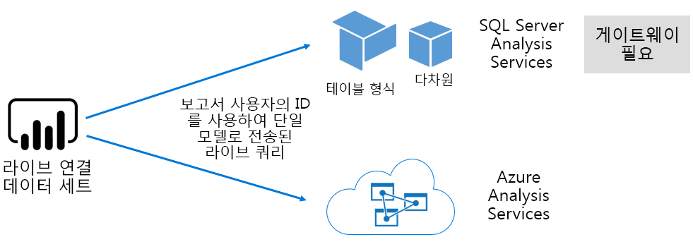

##### Power BI Desktop 개발 된 모델

Power BI Desktop-Power BI 개발을 위한 클라이언트 응용 프로그램-Analysis Services 테이블 형식 모델을 개발 하는 데 사용할 수 있습니다. 모델은 데이터 흐름에서 데이터를 가져와 개발할 수 있습니다. 그러면 다른 데이터 원본과 통합할 수 있습니다. 모델링을 구현 하는 방법에 대 한 자세한 내용은이 백서에서 다루지 않지만 Power BI Desktop를 사용 하 여 개발할 수 있는 모델에는 세 가지 유형이 있습니다. 이러한 모드는 데이터를 모델로 가져올지 아니면 데이터 원본에 유지할지를 결정 합니다. 가져오기, DirectQuery 및 복합의 세 가지 모드가 있습니다. 각 모드에 대 한 자세한 설명은 [모델 저장소 모드](#model-storage-modes) 항목에서 다룹니다.

Power BI desktop에서 개발 된 외부적으로 호스트 된 모델 및 모델은 RLS (행 수준 보안)를 적용 하 여 특정 사용자에 대해 검색할 수 있는 데이터를 제한할 수 있습니다. 예를 들어 영업 사원의 보안 그룹에 할당 된 사용자는 자신이 할당 된 판매 지역에 대 한 보고서 데이터만 볼 수 있습니다. RLS 역할은 동적 이거나 정적일 수 있습니다. **동적 역할** 은 보고서 사용자에 의해 필터링 되는 반면 **정적 역할** 은 역할에 할당 된 모든 사용자에 대해 동일한 필터를 적용 합니다.

##### Excel 통합 문서 모델

Excel 통합 문서 또는 CSV 파일을 기반으로 데이터 집합을 만들면 모델이 자동으로 만들어집니다. Excel 통합 문서 데이터 모델은 모델 테이블을 만들기 위해 가져오게 되 고 Excel 통합 문서 데이터 모델은 Power BI 모델을 만들기 위해 바뀔 수 있습니다. 모든 경우에서 파일 데이터를 모델로 가져옵니다.

그런 다음 모델을 나타내는 Power BI 데이터 집합에 대해 다음을 수행할 수 있습니다.

- Power BI 서비스에서 호스트 되거나에서 외부적으로 호스트 됩니다 Analysis Services
- 이러한 사용자는 가져온 데이터를 저장 하거나, 기본 데이터 원본에 대 한 통과 쿼리 요청을 발급 하거나, 두 가지 모두를 함께 사용할 수 있습니다.

다음은 모델을 나타내는 Power BI 데이터 집합에 대 한 중요 한 팩트의 요약입니다.

- 호스트 된 모델 SQL Server Analysis Services LC 쿼리를 수행 하려면 게이트웨이가 필요 합니다.
- 데이터를 가져오는 Power BI 호스트 된 모델
  - 쿼리할 수 있도록 메모리에 완전히 로드 해야 합니다.
  - 데이터를 최신 상태로 유지 하려면 새로 고쳐야 하며, 원본 데이터를 인터넷을 통해 직접 액세스할 수 없는 경우 게이트웨이를 포함 해야 합니다.
- DirectQuery (DQ) 저장소 모드를 사용 하는 Power BI 호스팅 모델은 원본 데이터에 연결 해야 합니다. 모델을 쿼리하면 Power BI은 원본 데이터에 대 한 쿼리를 실행 하 여 현재 데이터를 검색 합니다. 원본 데이터가 인터넷을 통해 직접 액세스할 수 없는 경우이 모드에는 게이트웨이가 포함 되어야 합니다.
- 모델은 RLS 규칙을 적용 하 여 특정 사용자에 게 데이터 액세스를 제한 하는 필터를 적용할 수 있습니다.

Power BI Premium를 성공적으로 배포 하 고 관리 하려면 모델이 호스트 되는 위치, 저장소 모드, 게이트웨이의 종속성, 가져온 데이터 크기 및 새로 고침 유형과 빈도를 이해 해야 합니다. 이는 Power BI Premium 리소스에 상당한 영향을 미칠 수 있습니다. 또한 데이터 준비 쿼리 및 계산을 포함 하 여 모델 디자인 자체가 고려 사항에 추가 될 수 있습니다.

Power BI 호스트 된 가져오기 모델은 예약에 따라 새로 고치거 나 Power BI 서비스 사용자가 요청 시 트리거될 수 있음을 이해 하는 것도 중요 합니다.

최적화 된 모델 디자인은 [모델 최적화](#optimizing-models) 항목의이 기술 문서 뒷부분에서 설명 합니다.

#### 통합 문서

Power BI 통합 문서는 [4](#endnote-04)\]\[Power BI 내용 유형입니다. Power BI 서비스에 업로드 된 Excel 통합 문서 이며, 데이터 집합 (모델)을 만드는 업로드 된 Excel 통합 문서와 혼동 해서는 안 됩니다. 통합 문서 콘텐츠 형식은 통합 문서에 대 한 연결을 나타냅니다 .이 통합 문서는 Power BI 서비스 업로드 하거나 OneDrive 또는 SharePoint Online의 클라우드 저장소에 유지할 수 있습니다.

이 콘텐츠 형식은 Power BI 데이터 시각화를 위한 데이터 원본으로 사용할 수 없다는 것을 이해 하는 것이 중요 합니다. 대신 Excel Online을 사용 하 여 Power BI 서비스에서 통합 문서로 열 수 있습니다. 이 콘텐츠 형식의 주된 목적은 Power BI 서비스 내에서 레거시 Excel 통합 문서 보고서에 액세스할 수 있도록 하 고 데이터 시각화를 Power BI 대시보드에 고정 하는 것입니다.

자세한 내용은 [Excel 통합 문서 파일에서 데이터 가져오기](service-excel-workbook-files.md) 문서를 참조 하세요.

#### 보고서

보고서에는 Power BI 보고서와 페이지가 매겨진 보고서가 있습니다.

**Power BI 보고서** 는 단일 데이터 집합에만 연결 되는 대화형 데이터 시각화 환경을 제공 합니다. 보고서는 일반적으로 필터링, 조각화, 교차 필터링 및 강조 표시, 드릴업, 드릴 다운, 드릴스루, Q & 자연을 비롯 한 다양 한 기능 배열과 상호 작용할 수 있도록 하는 사용자 참여를 장려 하도록 설계 되었습니다. 언어 보장, 포커스, 페이지 탐색, spotlighting, 책갈피 보기 등

이 백서의 컨텍스트에서는 Power BI 아키텍처가 Power BI 보고서 디자인 및 사용자 상호 작용이 Power BI 서비스 리소스에 영향을 미칠 수 있는 방식을 이해 하는 것이 중요 합니다.

- 가져오기 모델을 기반으로 보고서를 로드 하 고 상호 작용 하려면 모델을 메모리에 완전히 로드 해야 합니다 (Power BI 서비스에서 호스팅 되는지 외부에서 호스트 되는지 여부).
- 각 보고서 시각적 개체는 모델을 쿼리하여 데이터를 검색 하는 쿼리를 실행 합니다.
- 일반적으로 필터 및 슬라이서 상호 작용에는 모델 쿼리가 포함 됩니다. 예를 들어 슬라이서 선택을 변경 하는 것은 기본적으로-페이지에서 각 시각적 개체를 다시 로드 해야 \[[5](#endnote-05)\]
- Power BI 보고서는 현재 데이터를 표시 하는 것을 보장 하지 않으며 보고서 페이지와 해당 시각적 개체를 다시 로드 하려면 사용자가 보고서를 새로 고쳐야 할 수도 있습니다.
- 사용자는 질문 & 자연어 기능을 사용 하 여 질문 하 고, 보고서 디자인에서이를 허용 하는 Power BI를 제공 하 고, 데이터 집합은 Power BI 호스팅 데이터 가져오기 모델 또는 Q &를 사용 하도록 구성 된 LC 데이터 집합을 나타낼 수 있습니다.

**페이지를 매긴 보고서** 는 SQL SERVER REPORTING SERVICES (SSRS) 보고서의 게시 및 렌더링을 허용 합니다 (\*.rdl 형식). 이름에서 알 수 있듯이 페이지가 매겨진 보고서는 고정 된 페이지 크기로 인쇄 해야 할 필요가 있거나 완전히 확장 되어야 하는 데이터의 변수 목록이 있는 경우 일반적으로 사용 됩니다. 예를 들어, 시각적 개체 내에서 스크롤하고 인쇄 하지 않고 다중 페이지 렌더링을 위해 디자인 된 청구서입니다.

지원 되는 두 가지 보고서 유형은 보고서 작성자에 게 선택 항목을 제공 하 여 요구 사항 및 의도 된 용도에 따라 유형을 선택할 수 있습니다. 일반적으로 Power BI 보고서는 사용자가 데이터에서 정보를 탐색 하 고 검색할 수 있도록 하는 대화형 환경에 적합 하며, 페이지를 매긴 보고서는 매개 변수 기반 페이지 레이아웃에 보다 적합 합니다.

보고서 유형과 관계 없이 응답성이 뛰어난 보고서 로드 및 데이터 업데이트 (필터 또는 매개 변수가 변경 되는 경우)는 안정적이 고 잘 작동 하는 사용자 환경을 제공 하는 데 필수적입니다.

#### 대시보드

Power BI 대시보드는 모니터링 환경을 제공 하기 위한 것 이며 개념적으로는 Power BI 보고서와 매우 다릅니다. 대시보드는 타일에서 값 및 데이터 시각화를 표현할 수 있도록 단일 창에 표시 하도록 디자인 되었습니다. 일반적으로 대시보드는 Power BI 보고서 보다 더 낮은 상호 작용 환경을 제공 하며 일부 대시보드 디자인은 상호 작용이 필요 하지 않습니다. 예를 들어 무인 대시보드가 서버 방에 있는 비 터치 스크린에 표시 됩니다. 또 다른 중요 한 차이점은 대시보드는 여러 데이터 집합의 데이터를 원본으로 사용 하는 타일을 제공할 수 있는 반면 Power BI 보고서는 단일 데이터 집합을 기반으로 할 수 있습니다.

대시보드는 항상 신속 하 게 로드 하 고 최신 데이터를 표현할 수 있도록 설계 되었습니다 (Power BI 서비스로 알려짐). 타일 쿼리 결과를 캐시 하 여이를 달성 하 고 각 대시보드에 대해이를 수행 합니다. 실제로 동적 RLS를 적용 하는 모델을 기반으로 하는 대시보드에 액세스할 수 있는 각 사용자에 대해이 작업을 수행 해야 합니다.

Power BI 서비스는 Power BI 호스팅된 가져오기 모델을 새로 고치는 즉시 대시보드 쿼리 캐시를 자동으로 업데이트 합니다. LC 및 DQ 모델의 경우 데이터 집합 소유자는 Power BI 서비스 캐시를 업데이트 하는 빈도를 제어 합니다 .이는 15 분 간격으로 자주 구성 하거나 일주일에 한 번만 구성할 수 있습니다. LC 쿼리 캐시 업데이트는 먼저 모델 메타 데이터를 쿼리하여 마지막 캐시 업데이트 후에 모델 새로 고침이 수행 되었는지 여부를 확인 하 고 새로 고침이 발생 하지 않은 경우에는 캐시 업데이트를 계속 진행 하지 않습니다. 이 검사는 DQ 모델에 대해 불가능 하므로 원본 데이터가 변경 되었는지 여부에 관계 없이 캐시 업데이트가 수행 됩니다.

DQ 및 LC 모델을 기반으로 하는 대시보드 쿼리 캐시 업데이트는 Power BI 서비스 리소스 및 외부 데이터 원본에 상당한 영향을 줄 수 있습니다. 동적 RLS를 적용 하 고 매시간 새로 고쳐지고이 대시보드가 100 사용자와 공유 되는 Azure Analysis Services 모델을 기반으로 하는 20 개의 타일이 있는 대시보드를 고려 합니다. 1 시간 마다 새로 고치도록 구성 된 데이터 집합의 경우 2000 (20 x 100) LC 쿼리가 발생 합니다. 이로 인해 Power BI 서비스 및 외부 데이터 원본에 대해 상당한 부하가 발생 하 고 사용 가능한 리소스에 적용 되는 제한을 초과할 수도 있습니다. 용량 리소스 및 제한은 [용량 노드](#capacity-nodes) 항목에 설명 되어 있습니다.

사용자는 Power BI 서비스 리소스를 필요로 하는 다양 한 방법으로 대시보드를 조작할 수 있습니다. 특히 다음을 수행할 수 있습니다.

- 대시보드 타일 새로 고침 트리거-관련 된 모든 Power BI 호스팅 데이터 가져오기 모델의 주문형 새로 고침이 발생할 수 있습니다.
- 질문 & 자연어 기능을 사용 하 여 질문 하기 (대시보드 디자인을 통해이를 허용 하 고, 데이터 집합이 Power BI 호스팅 데이터 가져오기 모델 이거나 Q & A를 사용 하도록 구성 된 LC 데이터 집합입니다.)
- 빠른 인사이트 기능을 사용 하 여 기본 데이터 집합에서 통찰력을 Power BI 검색 하 고 표시 하 고 설명 하는 시각적 개체를 사용 하 여 응답 합니다 (타일이 Power BI 호스트 된 데이터 가져오기 모델을 기반으로 하는 데이터 집합을 기반으로 하는 경우).
- 대시보드 타일에 대 한 경고를 구성 하 Power BI 서비스 여, 시간을 시간 단위로 비교 하 고 임계값을 초과할 때 사용자에 게 알릴 수 있습니다. 즉, 타일에 단일 숫자 값이 표시 되 고 Power BI 호스팅된 데이터 가져오기 모델) 데이터 집합

### 모델 저장소 모드

3 가지 모드 중 하나로 모델을 개발할 수 Power BI Desktop. 각 데이터 모델 저장소 모드의 근거와 Power BI 서비스 리소스에 대 한 영향을 이해 하는 것이 중요 합니다. 이 섹션에서는 세 가지 모드를 모두 소개 합니다. 이러한 정보는 나중에 모델 최적화 항목의이 백서에 자세히 설명 되어 있습니다.

#### 가져오기 모드

가져오기 모드는 메모리 내 쿼리와 관련 된 매우 빠른 성능, 모델러에 게 제공 되는 디자인 유연성 및 특정 Power BI 서비스 기능에 대 한 지원 (Q & A, 빠른 인사이트를 사용 하 여 모델을 개발 하는 데 가장 일반적으로 사용 되는 모드입니다. , 등). 새 Power BI Desktop 솔루션을 만들 때 기본 모드입니다.

가져온 데이터는 항상 디스크에 저장 되 고 쿼리 또는 새로 고치기 위해 메모리에 완전히 로드 되어야 한다는 것을 이해 하는 것이 중요 합니다. 메모리에 있으면 가져오기 모델은 짧으며 빠른 쿼리 결과를 얻습니다. 또한 메모리에 부분적으로 로드 되는 가져오기 모델의 개념은 없다는 것을 이해 하는 것이 중요 합니다.

데이터를 새로 고치면 데이터를 압축 하 고 최적화 한 다음 VertiPaq 저장소 엔진에 의해 디스크에 저장 됩니다. 디스크에서 메모리로 로드할 때 10 배 압축을 볼 수 있으므로 10gb의 원본 데이터가 크기의 약 1gb로 압축 될 수 있다고 예상 하는 것이 합리적입니다. 디스크의 저장소 크기는이를 기반으로 20% 줄일 수 있습니다. \[[6](#endnote-06)\]

디자인 유연성은 세 가지 방법으로 구현할 수 있습니다. 데이터 모델러는 다음을 수행할 수 있습니다.

- 데이터 원본 유형 및 형식에 관계 없이 여러 데이터 원본의 데이터를 캐시 하 여 데이터 통합
- 데이터 준비 쿼리를 만들 때 파워 쿼리 수식 언어의 전체 집합 (M) 함수를 활용 합니다.
- 비즈니스 논리를 사용 하 여 모델을 향상 시키고 계산 열, 계산 된 테이블 및 측정값을 사용 하 여 모델을 향상 시킬 때 전체 DAX (Data Analysis Expressions) 함수 집합 활용

다음 그림에 표시 된 것 처럼 가져오기 모델은 지원 되는 데이터 원본 유형의 데이터를 개수에 관계 없이 통합할 수 있습니다.

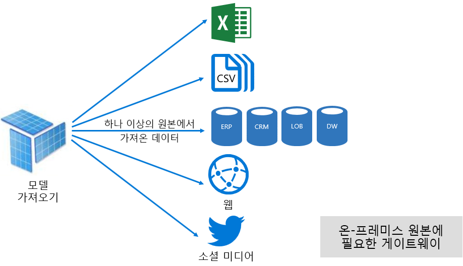

그러나 가져오기 모델과 관련 된 이점이 매우 장점 이지만 다음과 같은 단점이 있습니다.

- 모델을 쿼리 Power BI 하기 전에 전체 모델을 메모리에 로드 해야 합니다. 그러면 모델의 수와 크기가 증가 함에 따라 사용 가능한 리소스에 대 한 압력을 수 있습니다.
- 모델 데이터는 최신 새로 고침 만큼 최신 으로만 사용할 수 있으므로 일정에 따라 가져오기 모델을 새로 고쳐야 합니다.
- 전체 새로 고침은 모든 테이블에서 모든 데이터를 제거 하 고 데이터 원본에서 다시 로드 합니다. 이는 Power BI 서비스 및 데이터 원본에 대 한 시간과 리소스가 매우 비쌉니다. Power BI는 전체 테이블을 자르고 다시 로드 하지 않을 수 있는 증분 새로 고침을 지원 합니다 .이에 대해서는 [Power BI 호스트 된 모델 최적화](#optimizing-power-bi-hosted-models) 항목에서 다룹니다.

Power BI 서비스 리소스 관점에서 가져오기 모델에는 다음이 필요 합니다.

- 쿼리 하거나 새로 고칠 때 모델을 로드 하는 데 충분 한 메모리
- 데이터를 새로 고칠 수 있도록 리소스 및 추가 메모리 리소스 처리

#### DirectQuery 모드

DirectQuery (DQ) 모드로 개발 된 모델은 데이터를 가져오지 않습니다. 대신 쿼리 시 기본 데이터 원본에 대 한 기본 쿼리를 실행 하는 메타 데이터로만 구성 됩니다.

DQ 모델 개발을 고려해 야 하는 두 가지 주요 이유는 다음과 같습니다. 첫 번째 이유는 데이터 볼륨이 너무 커서 데이터 축소 방법이 적용 되는 경우, 즉 모델에 로드 하거나 거의 새로 고치는 것입니다. 두 번째 이유는 보고서와 대시보드가 예약 된 새로 고침 제한 (전용 용량의 경우 48 회) 내에서 수행할 수 있는 것 외에도 "거의 실시간" 데이터를 제공 해야 하는 경우입니다.

DQ 모델과 관련 하 여 다음과 같은 여러 가지 이점이 있습니다.

- 모델 크기 제한 가져오기는 적용 되지 않습니다.
- 모델은 새로 고침이 필요 하지 않습니다.
- 보고서 사용자는 보고서 필터 및 슬라이서와 상호 작용할 때 최신 데이터를 볼 수 있으며, 전체 보고서를 새로 고쳐 현재 데이터를 검색할 수 있습니다.
- DQ 모델을 기반으로 하는 대시보드 타일은 15 분 마다 자동으로 업데이트 될 수 있습니다.

그러나 DQ 모델과 관련 된 다양 한 단점 및 제한 사항이 있습니다.

- 모델은 지원 되는 단일 데이터 원본을 기반으로 해야 하므로 데이터 원본에서 데이터 통합이 이미 수행 되어야 합니다. 지원 되는 데이터 원본은 \[[7](#endnote-07)\]의 인기 있는 많은 데이터 저장소를 지 원하는 관계형 및 분석 시스템입니다.
- 성능이 저하 되 고 잠재적으로 Power BI 서비스에 부정적인 영향을 미칠 수 있습니다 (쿼리는 CPU 사용량이 매우 클 수 있음) 및 데이터 원본 (분석 쿼리에 최적화 되지 않을 수 있음).
- 파워 쿼리 쿼리는 너무 복잡할 수 없으며, M 식 및 데이터 원본에서 인식 하는 네이티브 쿼리로 바뀔 수 있는 함수로 제한 됩니다.
- DAX 함수는 데이터 원본에서 인식 하는 네이티브 쿼리로 바뀔 수 있는 것으로 제한 되며 계산 테이블이 나 기본 제공 시간 인텔리전스 기능을 지원 하지 않습니다.
- 기본적으로 100만 개 이상의 행을 검색 해야 하는 모델 쿼리는 실패 합니다.
- 여러 시각적 개체가 포함 된 보고서 및 대시보드는 데이터 원본이 일시적 인 경우 일관 되지 않은 결과를 표시할 수 있습니다.
- Q & A 및 빠른 인사이트은 지원 되지 않습니다.

Power BI 서비스 리소스 관점에서 DQ 모델에는 다음이 필요 합니다.

- 쿼리 시 모델을 로드 하는 최소 메모리 (메타 데이터에만 해당)
- 경우에 따라 데이터 원본에 전송 된 쿼리를 생성 하 고 처리 하는 중요 한 프로세서 리소스가 있습니다.

자세한 내용은 [Power BI Desktop에서 직접 쿼리 사용](desktop-use-directquery.md) 문서를 참조 하세요.

#### 복합 모드

복합 모드에서 개발 된 모델은 개별 모델 테이블에 대해 저장 모드를 구성 하는 데 사용할 수 있습니다. 따라서 가져오기 및 DQ 테이블을 혼합 하 여 지원 합니다. 또한 계산 된 테이블 (DAX로 정의 됨) 및 여러 DQ 데이터 원본을 지원 합니다.

테이블 저장소 모드를 가져오기, DirectQuery 또는 이중으로 구성할 수 있습니다. 이중 저장소 모드로 구성 된 테이블은 가져오기와 DirectQuery 모두 이며이를 통해 Power BI 서비스는 쿼리를 통해 쿼리에 사용할 가장 효율적인 모드를 결정할 수 있습니다.

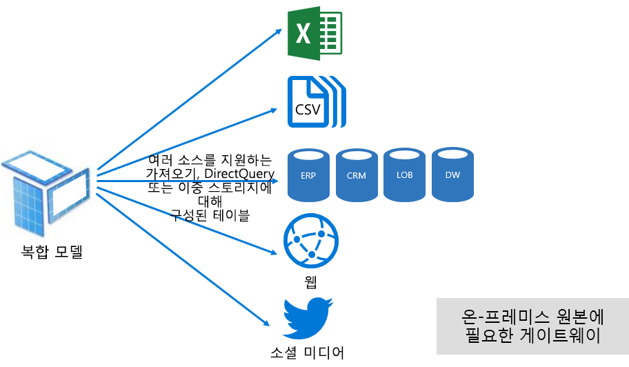

복합 모델은 가장 적합 한 가져오기 및 DirectQuery 모드를 제공 합니다. 적절 하 게 구성 하면 메모리 내 모델의 높은 쿼리 성능을 데이터 원본에서 거의 실시간 데이터를 검색할 수 있는 기능과 결합할 수 있습니다.

복합 모델을 개발 하는 데이터 모델러는 DirectQuery 모드의 가져오기 또는 이중 저장소 모드와 팩트 유형 테이블에서 차원 유형 테이블을 구성할 수 있습니다. 예를 들어 이중 모드의 제품 차원 유형 테이블과 DirectQuery 모드의 판매 팩트 유형 테이블을 포함 하는 모델이 있다고 가정 합니다. Product 테이블은 메모리 내에서 효율적이 고 신속 하 게 쿼리하여 보고서 슬라이서를 렌더링할 수 있습니다. 그런 다음 관련 제품 테이블에 조인 된 DirectQuery 모드에서 Sales 테이블을 쿼리할 수 있습니다. 후자 쿼리를 사용 하면 단일 효율적인 기본 쿼리를 생성 하 여 제품 및 판매 테이블을 조인 하 고 슬라이서 값을 기준으로 필터링 할 수 있습니다.

일반적으로 각 모델 모드와 관련 된 장점과 단점은 복합 모델의 테이블 저장소 모드에 적용 되는 것으로 간주할 수 있습니다.

자세한 내용은 [Power BI Desktop에서 복합 모델 사용](desktop-composite-models.md) 문서를 참조 하세요.

### 라이선싱

Power BI에는 세 개의 라이선스가 있습니다.

- Power BI 무료
- Power BI Pro
- Power BI 프리미엄

**Power BI 무료** 라이선스를 사용 하면 개별 사용자가 Power BI 서비스에 로그인 하 고 모델 및 보고서를 게시 하 여 개인 작업 영역 내에서 작업을 수행할 수 있습니다. 이 라이선스를 사용 하 여 Power BI 콘텐츠를 공유할 수 없다는 것을 이해 하는 것이 중요 합니다. 이름에서 알 수 있듯이이 라이선스는 무료입니다.

**Power BI Pro** 라이선스는 개인이 작업 영역 내에서 만들고 공동 작업 하 고 Power BI 콘텐츠를 공유 및 배포할 수 있도록 합니다. 또한 온-프레미스 데이터 원본을 포함 하 여 데이터를 최신 상태로 유지 하도록 데이터 집합에 대 한 새로 고침을 구성할 수 있습니다. 또한 데이터에 액세스 하 고 사용 하는 방법을 감사 하 고 제어할 수 있습니다. 사용자가 전용 용량 Power BI Premium 연결 되어 있지 않으면이 라이선스는 다른 사용자의 공유 콘텐츠를 수신 하는 데 필요 합니다.

**Power BI Premium** 라이선스는 테 넌 트 수준 라이선스 이며 [소개 Power BI Premium](#introducing-power-bi-premium) 섹션에 설명 되어 있습니다.

Power BI 라이선스에 대 한 자세한 내용은 [Power BI 가격 책정](https://powerbi.microsoft.com/pricing/) 페이지를 참조 하세요.

## Power BI Premium 소개

Power BI Premium는 규모, 신뢰할 가능성이 있는 성능 및 예측 가능한 비용으로 통합 된 셀프 서비스 및 엔터프라이즈 BI 플랫폼을 제공 합니다. 주로 조직에 대 한 Power BI 서비스를 실행 하는 전용 리소스를 제공 하 여이를 달성 합니다.

또한 Power BI Premium에서는 많은 엔터프라이즈 기능을 제공 합니다.

- 비용 효율적인 콘텐츠 배포. 외부 사용자를 포함 하 여 Power BI 콘텐츠를 무제한 Power BI 무료 사용자에 게 공유할 수 있도록 합니다.
- 더 큰 데이터 집합 크기 지원 \[[8](#endnote-08)\]
- 데이터 흐름 및 데이터 집합의 새로 고침 속도 향상 (하루 최대 48 회)
- 데이터 흐름 및 데이터 집합의 증분 새로 고침
- 데이터 흐름 연결 된 엔터티 및 변환의 병렬 실행
- 페이지를 매긴 보고서
- 온-프레미스 보고를 위한 Power BI Report Server
- 앱 사용자를 대신 하 여 앱에 콘텐츠를 포함 하는 기능 (PaaS)

이러한 기능 중 대부분은 효율적이 고 확장 가능한 엔터프라이즈 솔루션을 제공 하는 데 활용할 수 있으며 [프리미엄 용량 최적화](#optimizing-premium-capacities) 섹션에서 다룹니다.

### 구독 및 라이선스

Power BI Premium은 두 개의 SKU(Stock-Keeping Unit) 제품군에서 사용할 수 있는 테넌트 수준 Office 365 구독입니다.

- **EM** Sku (EM1-EM3) (포함), 연간 약정 요구, 매월 청구
- **P** Sku (P1-P3) 포함 및 엔터프라이즈 기능의 경우 월별 또는 연간 약정을 요구 하 고 매월 청구 되며 온-프레미스 Power BI Report Server를 설치할 수 있는 라이선스를 포함 합니다.

또 다른 방법은 포함 및 용량 테스트 목적 으로만 sku (A1-A6)를 포함 하는 Azure Power BI Embedded 구독을 구매 하는 것 **입니다.**

모든 Sku는 v 코어를 제공 하 \[[9](#endnote-09)\]용량을 만들지만 EM sku는 작은 규모의 포함을 위해 제한 됩니다. 이 백서에 집중 하는 것은 P Sku에 대 한 것 이지만 설명 된 많은 내용이 Sku에도 관련이 있습니다.

프리미엄 구독 SKU와 달리 Azure SKU는 시간 약정 없이 시간당 청구됩니다. 크기 확장, 크기 축소, 일시 중지, 다시 시작 및 삭제를 가능하게 하는 완벽한 탄력성을 제공합니다.

Azure Power BI Embedded는이 백서에서 주로 다루지 않지만 테스트 방법 항목에서 작업을 테스트 하 고 측정 하는 실용적인 경제적인 옵션으로 설명 합니다.

Azure Sku에 대 한 자세한 내용은 [azure Power BI Embedded 설명서](/azure/power-bi-embedded/)를 참조 하세요.

Power BI Premium 구독은 Microsoft 365 관리 센터에서 관리자가 구입합니다. 특히 Office 365 전역 관리자 또는 대금 청구 관리자만 Sku를 구매할 수 있습니다.

구매한 후 테 넌 트는 용량에 할당할 v 코어의 해당 수를 수신 합니다 .이를 **v 코어 풀링**이라고 합니다. 예를 들어 P3 SKU를 구매하면 32 V 코어의 테넌트를 제공합니다.

자세한 내용은 [Power BI Premium 구매 방법](service-admin-premium-purchase.md) 문서를 참조 하세요.

### 프리미엄 용량

다른 고객과 공유 하는 계산 리소스에서 작업을 실행 하는 공유 용량과 달리 **전용 용량은** 조직에서 독점적으로 사용 하는 것입니다. 호스팅된 콘텐츠를 신뢰할 수 있고 일관 된 성능을 제공 하는 전용 계산 리소스로 격리 됩니다.

이 백서는 **프리미엄 용량** 입니다. 즉 EM 또는 P sku와 연결 됩니다.

#### 용량 노드

구독 및 라이선스 항목에 설명 된 대로 두 Power BI Premium 가지 SKU 제품군 인 EM 및 P가 있습니다. 모든 Power BI Premium Sku는 프로세서, 메모리 및 저장소로 구성 된 리소스의 집합 양을 나타내는 용량 노드로 사용할 수 있습니다. 리소스 외에도 각 SKU는 초당 DirectQuery (DQ) 및 라이브 연결 (LC) 연결 수 및 병렬 모델 새로 고침 수에 대 한 작업 제한을 갖습니다.

프로세싱은 백 엔드와 프런트 엔드 간에 균등하게 나누어진 v 코어의 세트 수에 의해 이루어집니다.

**백 엔드 V 코어**는 쿼리 처리, 캐시 관리, R 서비스 실행, 모델 새로 고침, 자연어 처리(Q&A), 보고서 및 이미지의 서버 쪽 렌더링 비롯한 핵심 Power BI 기능을 담당합니다. 백 엔드 v 코어에는 활성 데이터 집합이 라고도 하는 모델을 호스트 하는 데 주로 사용 되는 고정 된 양의 메모리가 할당 됩니다.

**프런트 엔드 v 코어** 는 웹 서비스, 대시보드 및 보고서 문서 관리, 액세스 권한 관리, 예약, api, 업로드 및 다운로드, 일반적으로 사용자 환경에 관련 된 모든 항목에 대 한 책임이 있습니다.

저장소는 용량 노드당 100 TB로 설정 됩니다.

다음 표에서는 각 프리미엄 SKU의 리소스와 제한 (및 그와 유사한 크기)에 대해 설명 합니다.

| 용량 노드 | 총 V 코어 | 백 엔드 V 코어 | RAM(GB) | 프런트 엔드 V 코어 | DQ/LC (초당) | 모델 새로 고침 병렬 처리 |
| --- | --- | --- | --- | --- | --- | --- |
| EM1/A1 | 1 | 0.5 | 3 | 0.5 | 3.75 | 1 |
| EM2/A2 | 2 | 1 | 5 | 1 | 7.5 | 2 |
| EM3/A3 | 4 | 2 | 10 | 2 | 15 | 3 |
| P1/A4 | 8 | 4 | 25 | 4 | 30 | 6 |
| P2/A5 | 16 | 8 | 50 | 8 | 60 | 12 |
| P3/A6 | 32 | 16 | 100 | 16 | 120 | 24 |
| | | | | | | |

#### 용량 워크 로드

용량 워크로드는 사용자가 사용할 수 있도록 만든 서비스입니다. 기본적으로 Premium 및 Azure 용량은 사용 하지 않도록 설정할 수 없는 실행 중인 Power BI 쿼리와 관련 된 데이터 집합 작업을 지원 합니다.

페이지를 매긴 보고서, 데이터 흐름 및 AI에 대 한 추가 작업을 활성화할 수 있습니다. 각 추가 작업에는 작업에서 사용할 수 있는 최대 메모리 (총 사용 가능한 메모리의 백분율)를 구성 해야 합니다.

#### 용량 함수

언제 든 지 Power BI 서비스는 용량 리소스를 최대한 활용 하는 동시에 용량에 적용 되는 제한을 초과 하지 않습니다.

용량 작업은 대화형 또는 배경으로 분류 됩니다. 대화형 작업에는 요청 렌더링 및 사용자 상호 작용(필터링, Q&A 쿼리 등)에 대한 응답이 포함됩니다. 일반적으로 모델 가져오기 쿼리는 메모리 리소스를 많이 사용 하지만 LC/DQ 모델을 쿼리 하는 데는 CPU를 많이 사용 합니다. 백그라운드 작업에는 데이터 흐름, 가져오기 모델 새로 고침 및 대시보드 쿼리 캐싱이 포함됩니다.

가능한 최상의 사용자 환경을 보장 하기 위해 대화형 작업은 백그라운드 작업 보다 항상 우선 순위가 지정 된다는 점을 이해 해야 합니다. 리소스가 부족한 경우 백그라운드 작업은 리소스가 비어 있을 때 처리하기 위해 큐에 추가됩니다. 데이터 집합 새로 고침 및 AI 함수와 같은 백그라운드 작업은 Power BI 서비스에서 처리를 중지 하 고 큐에 추가할 수 있습니다.

가져오기 모델을 쿼리하거나 새로 고칠 수 있도록 메모리에 완전히 로드 해야 합니다. Power BI 서비스는 사용 가능한 메모리의 최대 사용을 보장 하기 위해 정교한 알고리즘을 사용 하 여 메모리 사용을 관리 하 고 용량을 과도 하 게 커밋하는 것이 가능 합니다. 하지만 용량이 많은 가져오기 모델을 저장할 수 있습니다 (프리미엄 용량 당 최대 100 TB). 결합 된 디스크 저장소가 지원 되는 메모리를 초과 하는 경우 (쿼리 및 새로 고침을 위해 추가 메모리가 필요 함) 모두 동시에 메모리에 로드할 수 없습니다.

따라서 가져오기 모델은 사용에 따라 메모리에서 로드 되 고 제거 됩니다. 가져오기 모델은 쿼리 (대화형 작업) 되 고 아직 메모리에 있지 않은 경우 또는 새로 고쳐질 때 (백그라운드 작업) 로드 됩니다.

메모리에서 모델을 제거 하는 것을 제거 라고 **하며,이** 작업은 모델의 크기에 따라 Power BI 빠르게 수행할 수 있는 작업입니다. 용량에 메모리 압력이 없을 경우 모델은 메모리에 로드되어 그대로 남아 있습니다. [10](#endnote-10)\] \[모델을 로드 하는 데 사용할 수 있는 메모리가 부족 한 경우 Power BI 서비스 먼저 메모리를 확보 해야 합니다. 지난 3 분 \[[11](#endnote-11)\]에 사용 되지 않은 모델을 검색 한 후 제거 하 여 비활성화 된 모델을 검색 하 여 메모리를 확보 합니다. 제거할 비활성 모델이 없는 경우 Power BI 서비스는 백그라운드 작업을 위해 로드된 모델을 제거하려고 시도합니다. 여기에는 AI 워크 로드와 같은 백그라운드 워크 로드의 제거도 포함 될 수 있습니다. 마지막 방법은 [11](#endnote-11)\]\[실패 한 30 초 후에 대화형 작업을 실패 하는 것입니다. 이 경우 보고서 사용자는 잠시 후 다시 시도 하는 제안에 대 한 실패를 알려 줍니다.

데이터 집합 제거는 정상 및 예상 동작입니다. 결합된 크기가 사용 가능한 메모리를 초과할 수 있는 모델을 로드 및 언로드하여 메모리 사용량을 극대화하려고 노력합니다. 이는 의도적인 것으로 사용자를 보고하는 것은 완전히 투명합니다. 높은 제거율이 반드시 용량이 충분하지 않다는 것을 의미하지는 않습니다. 그러나 높은 제거율로 인해 쿼리 또는 새로 고침 응답성이 저하되면 문제가 발생할 수 있습니다.

모델을 메모리에 로드 하 고 처리를 위해 추가 메모리가 필요 하므로 가져오기 모델의 새로 고침은 항상 메모리를 사용 합니다. 전체 새로 고침은 모델에 필요한 메모리 양의 약 두 배를 사용할 수 있습니다. 이렇게 하면 처리 중인 경우에도 모델을 쿼리할 수 있습니다. 즉, 새로 고침이 완료 되 고 새 모델 데이터를 사용할 수 있을 때까지 쿼리를 기존 모델로 보냅니다. 증분 새로 고침은 메모리를 더 많이 필요로 하 고 더 빠르게 완료 될 수 있으므로 용량 리소스에 대 한 압력을 크게 줄일 수 있습니다. 새로 고침은 모델, 특히 복잡한 Power Query 변환이 있는 복잡하거나 큰 테이블을 기반으로 계산된 테이블/열에 대해 CPU가 많이 사용될 수 있습니다.

새로 고침-유사한 쿼리-모델을 메모리에 로드 해야 합니다. 메모리가 부족한 경우 Power BI 서비스는 비활성 모델을 제거하려고 시도하며, 이것이 불가능한 경우(모든 모델이 활성 상태이므로) 새로 고침 작업이 대기합니다. 새로 고침은 일반적으로 쿼리 보다 CPU를 많이 사용 합니다. 이러한 이유로 동시 새로 고침 수에 대한 용량 제한이 있으며 백 엔드 v 코어 수를 1.5를 곱하고 반올림해서 설정합니다. 동시 새로 고침이 너무 많으면 예약된 새로 고침이 대기합니다. 이러한 상황이 발생하면 새로 고침을 완료하는 데 시간이 오래 걸립니다. 요청 시 새로 고침 (사용자 요청 또는 API 호출에 의해 트리거됨)은 [11](#endnote-11)\]\[3 번 다시 시도 하 고 리소스가 충분 하지 않으면 실패 합니다.

## Power BI Premium 관리

구독을 구매 하 고 프리미엄 용량을 생성, 관리 및 모니터링 하는 Power BI Premium 관리 합니다.

### 용량 만들기 및 관리

**Power BI 관리** 포털의 **용량 설정** 페이지에는 구입 및 사용 가능한 v 코어 수 (즉, 아직 용량에 할당 되지 않음)가 표시 되 고 프리미엄 용량이 나열 됩니다. 이 페이지에서는 Office 365 전역 관리자 또는 Power BI 서비스 관리자가 사용 가능한 v 코어에서 프리미엄 용량을 만들거나 기존 프리미엄 용량을 수정할 수 있습니다.

프리미엄 용량을 만들 때 관리자는 다음을 정의 해야 합니다.

- 용량 이름 (테 넌 트 내에서 고유)
- 용량 관리자
- 용량 크기
- 데이터 상주에 대 한 지역 \[[12](#endnote-12)\]

용량 관리자를 하나 이상 할당해야 합니다. 용량 관리자로 할당된 사용자는 다음을 수행할 수 있습니다.

- 용량에 작업 영역 할당
- 사용자 권한 관리-할당 권한이 있는 용량 관리자 또는 사용자를 추가 하 여 작업 영역을 용량에 할당할 수 있도록 합니다.
- 작업을 관리 하 여 페이지를 매긴 보고서 및 데이터 흐름 작업에 대 한 최대 메모리 사용량 구성
- 시스템 오버 로드가 [13](#endnote-13) \[경우 모든 작업을 다시 설정 하려면 용량을 다시 시작\]

작업 영역 권한이 명시적으로 할당 되지 않은 경우 용량 관리자는 작업 영역 콘텐츠에 액세스할 수 없으며, 사용 메트릭, 감사 로그 또는 테 넌 트 설정과 같은 모든 Power BI 관리 영역 (명시적으로 할당 되지 않은 경우)에 액세스할 수 없습니다. 중요한 것은 용량 관리자에게 새 용량을 만들거나 기존 용량을 확장할 수 있는 권한이 없다는 것입니다. 또한 할당 된 용량을 확인 하 고 관리할 수 있도록 보장 하기 위해 용량 기준에 따라 할당 됩니다.

풀에서 사용 가능한 v 코어 수에 의해 제한 되는 사용 가능한 SKU 옵션 목록에서 용량 크기를 선택 해야 합니다. 하나 이상의 구매한 Sku에서 원본으로 사용할 수 있는 풀에서 여러 용량을 만들 수 있습니다. 예를 들어 P3 SKU(V 코어 32개)를 사용하여 3개의 용량을 만들 수 있습니다. 1개는 P2(V 코어 16개)이고, 2개는 P1(V 코어 8개씩 2개)입니다. 더 작은 크기의 용량을 만들어 성능 및 확장성을 향상 시킬 수 있습니다 .이 항목은 [프리미엄 용량 최적화](#optimizing-premium-capacities) 섹션에 설명 되어 있습니다. 다음 이미지는 포함 하는 각 작업 영역과 공유 용량의 여러 작업 영역으로 5 개의 프리미엄 용량 (3 x P1 및 2 x P3)으로 구성 된 가상의 Contoso 조직에 대 한 설정 예를 보여 줍니다.

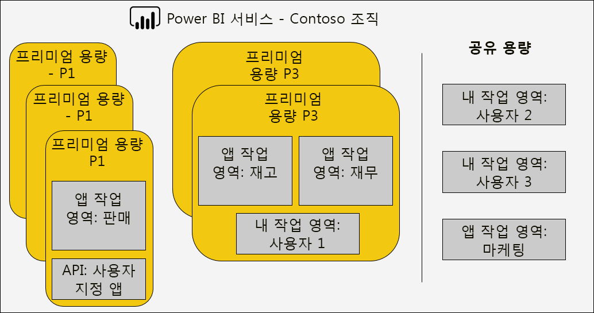

프리미엄 용량은 Power BI 테 넌 트의 홈 지역이 아닌 지역에 할당 될 수 있으며, 정의 된 지리적 Power BI 지역 내에서 콘텐츠가 상주 하는 데이터 센터에 대 한 관리 제어를 제공 합니다. \[[12](#endnote-12)\]

Power BI 서비스 관리자와 Office 365 전역 관리자는 Premium 용량을 수정할 수 있습니다. 특히 다음을 수행할 수 있습니다.

- 용량 크기를 변경 하 여 리소스를 확장 하거나 축소 합니다. 그러나 P SKU를 EM SKU로 다운 그레이드 하거나 그 반대로 업그레이드할 수는 없습니다.
- 용량 관리자 추가 또는 제거
- 할당 권한이 있는 사용자 추가 또는 제거
- 추가 작업 추가 또는 제거
- 지역 변경

할당 권한은 특정 Premium 용량에 작업 영역을 할당하는 데 필요합니다. 이 권한은 전체 조직, 특정 사용자 또는 그룹에 게 부여할 수 있습니다.

기본적으로 Premium 용량은 Power BI 쿼리 실행과 관련된 워크로드를 지원합니다. 또한 **페이지가 매겨진 보고서**, **데이터 흐름**및 **AI**의 세 가지 추가 작업을 지원 합니다. 각 워크로드마다 워크로드에서 사용할 수 있는 최대 메모리(사용 가능한 총 메모리의 백분율)를 구성해야 합니다. 최대 메모리 할당 증가가 호스트할 수 있는 활성 모델 수와 새로 고침 처리량에 영향을 줄 수 있다는 것을 이해 하는 것이 중요 합니다.

메모리는 데이터 흐름에는 동적으로 할당되지만 페이지를 매긴 보고서에는 정적으로 할당됩니다. 최대 메모리를 정적으로 할당하는 이유는 페이지를 매긴 보고서가 용량의 제한된 보안 공간 내에서 실행되기 때문입니다. 모델을 로드하는 데 사용할 수 있는 메모리가 줄어들기 때문에 페이지를 매긴 보고서 메모리를 설정할 때는 주의해야 합니다.

|                     | EM3                      | P1                       | P2                      | P3                       |
|---------------------|--------------------------|--------------------------|-------------------------|--------------------------|
| 페이지를 매긴 보고서 | 해당 없음 | 기본값 20%, 최소값 10% | 기본값 20%, 최솟값 5% | 기본값 20%, 최솟값 2.5% |
| 데이터 흐름 | 기본값 20%, 최솟값 8%  | 기본값 20%, 최솟값 4%  | 기본값 20%, 최솟값 2% | 기본값 20%, 최솟값 1%  |
| AI | 해당 없음 | 기본값 20%, 최소값 20%  | 기본값 20%, 최소값 10% | 기본값 20%, 최솟값 5%  |
| | | | | |

프리미엄 용량을 삭제 하는 것은 가능 하며 작업 영역 및 콘텐츠가 삭제 되지 않습니다. 대신 할당 된 작업 영역을 공유 용량으로 이동 합니다. 프리미엄 용량이 다른 지역에 생성 되 면 작업 영역이 홈 지역의 공유 용량으로 이동 됩니다.

### 용량에 작업 영역 할당

작업 영역 **은 작업 영역 창의** **Power BI 관리** **포털** 또는 작업 영역에 대 한 프리미엄 용량에 할당할 수 있습니다.

용량 관리자는 물론 Office 365 전역 관리자 또는 Power BI 서비스 관리자는 **Power BI 관리**  **포털**에서 작업 영역을 대량으로 할당할 수 있습니다. 대량 할당은 다음에 적용될 수 있습니다.

- **사용자 별 작업 영역** : 개인 작업 영역을 포함 하 여 해당 사용자가 소유 하는 모든 작업 영역이 프리미엄 용량에 할당 됩니다. 이 작업 영역에는 이미 다른 프리미엄 용량에 할당 된 경우 작업 영역을 다시 할당 하는 작업이 포함 됩니다. 또한 사용자에게 작업 영역 할당 권한도 할당됩니다.

- **특정 작업 영역**
- **전체 조직의 작업 영역** : 개인 작업 영역을 비롯 한 모든 작업 영역이 프리미엄 용량에 할당 됩니다. 또한 모든 현재 및 미래의 사용자에 게 작업 영역 할당 권한이 할당 됩니다. \[[14](#endnote-14)\]

사용자가 작업 영역 관리자이고 할당 권한이 있는 경우 **작업 공간** 창을 사용하여 작업 영역을 Premium 용량에 추가할 수 있습니다.

작업 영역 관리자는 할당 권한이 없어도 작업 영역을 용량에서 (공유 용량으로) 제거할 수 있습니다. 전용 용량에서 작업 영역을 제거하면 작업 영역이 공유 용량에 유효하게 재배치됩니다. Premium 용량에서 작업 영역을 제거하면 부정적인 결과가 발생할 수 있습니다. 예를 들어, Power BI 무료 라이선스 사용자가 공유 콘텐츠를 사용할 수 없게 되거나 공유 용량에서 지원하는 허용량을 초과하는 경우 예약된 새로 고침이 일시 중단될 수 있습니다.

Power BI 서비스에서 Premium 용량에 할당된 작업 영역은 작업 영역 이름을 장식하는 다이아몬드 아이콘으로 쉽게 식별할 수 있습니다.

### 용량 모니터링

Premium 용량 모니터링을 통해 관리자는 용량의 작동 방식을 이해할 수 있습니다. [용량 Power BI Premium 용량 메트릭 앱](service-admin-premium-monitor-capacity.md) 또는 [Power BI 관리 포털](service-admin-premium-monitor-portal.md)을 사용 하 여 모니터링할 수 있습니다.

#### 메트릭 해석

리소스 사용 및 워크로드 활동에 대한 기준선을 이해하려면 메트릭을 모니터링해야 합니다. 용량이 느려지는 경우 모니터링할 메트릭과 수행할 수 있는 결론을 이해하는 것이 중요합니다.

쿼리를 1초 이내에 완료하여 보고서 사용자에게 응답성이 뛰어난 환경을 제공하고 더 높은 쿼리 처리량을 사용하는 것이 이상적입니다. 일반적으로 백그라운드 프로세스(새로 고침 포함)를 완료하는 데 시간이 더 오래 걸린다면 문제는 덜 심각한 것입니다.

일반적으로 보고서가 느리게 표시되는 것은 용량이 과열되고 있다는 징후일 수 있습니다. 보고서를 로드하지 못한다면 이는 용량이 과열되었음을 나타냅니다. 어느 경우든 근본 원인은 다음을 비롯한 다양한 요인으로 인해 발생할 수 있습니다.

- **실패한 쿼리**는 메모리 부족 때문에 모델을 메모리에 로드하지 못한 것을 확실히 나타냅니다. Power BI 서비스는 실패하기 전에 30초 동안 모델을 로드하려고 시도합니다.

- **과도한 쿼리 대기 시간**은 여러 가지 이유로 발생할 수 있습니다.
  - Power BI 서비스 먼저 모델을 제거 하 고 쿼리 가능한 모델을 로드 해야 합니다. 메모리 스 래 싱을 나타내는 긴 쿼리 대기 시간이 수반 되지 않는 한 데이터 집합 제거 속도 만으로는 더 높은 데이터 집합 제거 속도 만으로는 용량 스트레스를 나타내지는 않습니다.
  - 모델 로드 시간 (특히 많은 모델을 메모리로 로드 하기 위한 대기)
  - 장기 실행 쿼리
  - LC\DQ 연결이 너무 많음 (용량 제한 초과)
  - CPU 포화
  - 페이지에 너무 많은 시각적 개체를 포함 하는 복잡 한 보고서 디자인 (각 시각적 개체는 쿼리 됨)
- **긴 쿼리 기간**은 모델 디자인이 최적화되지 않았음을 나타낼 수 있습니다. 특히 한 용량 내에서 여러 데이터 세트가 활성화되고 하나의 데이터 세트만 긴 쿼리 기간을 보이는 경우에 해당합니다. 이는 용량이 충분한 리소스를 갖고 있으며 문제의 데이터 세트가 최적화되지 않았거나 속도가 느리다는 것을 암시합니다. 장기 실행 쿼리는 다른 프로세스에 필요한 리소스에 대한 액세스를 차단할 수 있으므로 문제가 될 수 있습니다.
- **긴 새로 고침 대기 시간 또는 AI 호출 대기 시간은** 메모리를 소비 하는 여러 활성 모델 때문에 메모리가 부족 하거나, 문제가 있는 새로 고침이 다른 새로 고침을 차단 하는 것을 의미 합니다 (병렬 새로 고침 제한 초과).

메트릭을 사용 하는 방법에 대 한 자세한 설명은 [프리미엄 용량 최적화](#optimizing-premium-capacities) 섹션의 다음에 설명 되어 있습니다.

## 프리미엄 용량 최적화

프리미엄 용량 성능 문제가 발생 하는 경우 일반적인 첫 번째 방법은 이미 배포 된 솔루션을 최적화 하거나 조정 하 여 허용 되는 응답 시간을 복원 하는 것입니다. 재정의 하는 이유는 정당화 될 수 없는 경우 추가 프리미엄 용량을 구매 하지 않도록 하기 위한 것입니다.

추가 프리미엄 용량이 필요한 경우이 섹션의 뒷부분에서 설명 하는 두 가지 옵션이 있습니다.

- 프리미엄 용량 강화
- 새 프리미엄 용량 추가

마지막으로 테스트 방법 및 프리미엄 용량 크기 조정에서이 섹션을 마칩니다.

### 일반적인 모범 사례

최상의 사용률 및 성능을 얻기 웹사이트 때 보드에서 일반적인 권장 사항으로 수행할 수 있는 몇 가지 모범 사례가 있습니다. 내용은 다음과 같습니다.

- 개인 작업 영역 대신 작업 영역 사용
- 중요 비즈니스용 SSBI (셀프 서비스 BI)를 다른 용량으로 분리

  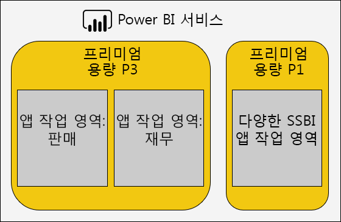

- 콘텐츠를 Power BI Pro 사용자와만 공유 하는 경우 전용 용량에 콘텐츠를 저장할 필요가 없을 수 있습니다.
- 특정 한 새로 고침 시간을 얻기 위해 또는 특정 기능이 필요한 경우 (예: 대량 데이터 집합 또는 페이지가 매겨진 보고)에 전용 용량을 사용 합니다.

### 일반적인 질문 해결

Power BI Premium 배포를 최적화 하는 것은 워크 로드 요구 사항, 사용 가능한 리소스 및 효과적인 사용을 이해 하는 데 관련 된 복잡 한 항목입니다.

이 항목에서는 가능한 문제 및 설명과이를 식별 하 고 해결 하는 방법에 대 한 정보를 설명 하는 7 가지 일반적인 지원 질문을 다룹니다.

#### 용량이 느린 이유와 수행할 수 있는 작업은 무엇인가요?

느린 프리미엄 용량에 영향을 주는 여러 가지 이유가 있습니다. 이 질문에는 느리다는 의미를 파악하기 위한 추가 정보가 필요합니다. 보고서가 느리게 로드되나요? 또는 보고서가 로드되지 않나요? 사용자가 보고서를 조작할 때 보고서 시각적 개체가 느리게 로드 또는 업데이트되나요? 새로 고침이 예상 보다 더 오래 걸리거나 이전에 경험이 있나요?

이유를 이해한 후에 조사를 시작할 수 있습니다. 다음 6가지 질문에 답하면 보다 구체적인 문제를 해결하는 데 도움이 됩니다.

#### 용량을 사용하는 콘텐츠는 무엇인가요?

**Power BI Premium 용량 메트릭** 앱을 사용하여 용량을 기준으로 필터링한 다음, 작업 영역 콘텐츠의 성능 메트릭을 검토할 수 있습니다. 프리미엄 용량 내에 저장 된 모든 콘텐츠에 대해 지난 7 일간의 시간별 성능 메트릭 및 리소스 사용량을 검토할 수 있습니다. 이는 프리미엄 용량 성능에 대 한 일반적인 문제를 해결할 때 첫 번째로 수행 해야 하는 단계입니다.

모니터링할 주요 메트릭은 다음과 같습니다.

- 평균 CPU 및 높은 사용률 수
- 특정 데이터 집합, 데이터 흐름 및 페이지를 매긴 보고서의 평균 메모리 및 높은 사용률 개수, 메모리 사용량
- 메모리에 로드 된 활성 데이터 집합
- 평균 및 최대 쿼리 기간
- 평균 쿼리 대기 시간
- 평균 데이터 집합 및 데이터 흐름 새로 고침 시간
- 평균 AI 호출 시간 및 대기 시간

또한 Power BI Premium 용량 메트릭 앱에서 활성 메모리는 지난 3 분 동안 사용 중 이므로 제거할 수 없는 보고서에 할당 된 총 메모리 양을 보여 줍니다. 새로 고침 대기 시간 급증은 큰 데이터 세트 및/또는 활성 데이터 세트와 연관 지을 수 있습니다.

"평균 기간별 상위 5 개" 차트는 상위 5 개 데이터 집합, 페이지를 매긴 보고서, 데이터 흐름 및 AI 호출을 소비 하는 용량 리소스를 강조 표시 합니다. 상위 5 개 목록의 콘텐츠는 조사 및 가능한 최적화 후보입니다.

#### 보고서가 느리게 표시되는 이유는 무엇인가요?

다음 표에서는 가능한 문제와 이러한 문제를 확인 및 처리하는 방법을 보여 줍니다.

##### 용량 리소스 부족

| 가능한 설명 | 확인 방법 | 해결 방법 |
| --- | --- | --- |
| 높은 총 활성 메모리 (모델을 지난 3 분 동안 사용 중이기 때문에 제거할 수 없음)   쿼리 대기 시간에 대 한 여러 개의 높은 급증   새로 고침 대기 시간에 대 한 여러 개의 높은 급증 | 메모리 메트릭 \[[18](#endnote-18)\]및 제거 횟수 \[[19](#endnote-19) 를 모니터링\] | 모델 크기를 줄이거나 DirectQuery 모드로 전환 합니다 .이 섹션의 [모델 최적화](#optimizing-models) 항목을 참조 하세요.   용량 강화   다른 용량에 콘텐츠 할당 |

##### 비효율적인 보고서 디자인

| 가능한 설명 | 확인 방법 | 해결 방법 |
| --- | --- | --- |
| 보고서 페이지에 많은 시각적 개체가 포함 되어 있습니다. 대화형 필터링은 시각적 개체 당 하나 이상의 쿼리를 트리거할 수 있습니다.   시각적 개체가 필요한 것 보다 많은 데이터를 검색 합니다. | 보고서 디자인 검토   인터뷰 보고서 사용자가 보고서와 상호 작용 하는 방식을 이해 합니다.   데이터 집합 쿼리 메트릭 \[[20](#endnote-20)\] 모니터링 | 페이지당 시각적 개체가 많지 않은 보고서 다시 디자인 |

##### 데이터 집합 느림 (특히 보고서를 이전에 잘 수행 했을 때)

| 가능한 설명 | 확인 방법 | 해결 방법 |
| --- | --- | --- |
| 점점 더 많은 양의 데이터 가져오기   RLS 역할을 포함 하 여 복잡 하거나 비효율적인 계산 논리   모델이 완전히 최적화 되지 않았습니다.   (DQ/LC) 게이트웨이 대기 시간   저속 DQ 원본 쿼리 응답 시간 | 모델 디자인 검토   게이트웨이 성능 카운터 모니터링 | 이 단원의 [모델 최적화](#optimizing-models) 항목을 참조 하세요. |

##### 높은 동시 보고서 사용량

| 가능한 설명 | 확인 방법 | 해결 방법 |
| --- | --- | --- |
| 높은 쿼리 대기 시간   CPU 포화   DQ/LC 연결 제한을 초과 했습니다. | [21](#endnote-21)\], 쿼리 대기 시간, DQ/LC 사용률 \[[22](#endnote-22)\] 메트릭 + 쿼리 기간 \[모니터링 (변동이 동시성 문제를 나타낼 수 있는 경우) | 용량을 확장 하거나 다른 용량에 콘텐츠를 할당 합니다.   페이지당 시각적 개체가 많지 않은 보고서 다시 디자인 |

#### 보고서가 로드되지 않는 이유는 무엇인가요?

보고서를 로드 하지 못하는 경우에는 최악의 시나리오 이며, 용량에 메모리가 부족 하 여 과도 하 게 열 수 있습니다. 이 문제는 로드된 모든 모델이 적극적으로 쿼리되고 있으므로 제거할 수 없고 새로 고침 작업이 일시 중지되었거나 지연된 경우에 발생할 수 있습니다. Power BI 서비스는 30초 동안 데이터 세트를 로드하려고 시도하며, 잠시 후에 다시 시도하라는 제안과 함께 사용자에게 오류를 정상적으로 알립니다.

현재, 보고서 로드 실패를 모니터링할 메트릭은 없습니다. 시스템 메모리, 특히 최고 사용률과 최고 사용률 시간을 모니터링하여 이 문제의 발생 가능성을 확인할 수 있습니다. 높은 데이터 세트 제거 및 긴 데이터 세트 새로 고침 평균 대기 시간도 이 문제가 발생할 것을 나타낼 수 있습니다.

이 문제가 매우 가끔씩만 발생하는 경우 우선 순위 문제로 간주되지 않을 수 있습니다. 보고서 사용자는 서비스가 사용 중이며 잠시 후 다시 시도하라는 알림을 받습니다. 이 문제가 자주 발생하는 경우 프리미엄 용량을 확장하거나 콘텐츠를 다른 용량에 할당하여 문제를 해결할 수 있습니다.

용량 관리자(및 Power BI 서비스 관리자)는 **쿼리 실패** 메트릭을 모니터링하여 이 문제가 발생하는 경우를 확인할 수 있습니다. 시스템 오버로드의 경우 용량을 다시 시작하여 모든 작업을 다시 설정할 수도 있습니다.

#### 새로 고침이 일정에 따라 시작되지 않는 이유는 무엇인가요?

예약된 새로 고침 시작 시간은 보장되지 않습니다. Power BI 서비스는 항상 백그라운드 작업보다 대화형 작업을 우선한다는 점을 기억하세요. 새로 고침은 다음 두 조건이 충족될 때 발생할 수 있는 백그라운드 작업입니다.

- 메모리가 충분합니다.
- 프리미엄 용량에 대해 지원되는 동시 새로 고침 수를 초과하지 않았습니다.

조건이 충족되지 않으면 조건이 개선될 때까지 새로 고침이 큐에 대기됩니다.

전체 새로 고침을 수행하려면 현재 데이터 세트 메모리 크기의 두 배 이상이 필요하다는 점을 기억하세요. 충분한 메모리를 사용할 수 없는 경우 모델 제거를 통해 메모리가 확보될 때까지 새로 고침을 시작할 수 없습니다. 즉, 하나 이상의 데이터 세트가 비활성화되어 제거할 수 있을 때까지 지연됩니다.

지원되는 최대 동시 새로 고침 수는 백 엔드 v 코어 수의 1.5배를 올림한 값으로 설정된다는 점을 기억하세요.

다음 예약된 새로 고침의 시작 시간 전에 예약된 새로 고침을 시작할 수 없으면 실패합니다. UI에서 수동으로 트리거된 주문형 새로 고침은 실패하기까지 최대 3번 실행을 시도합니다.

용량 관리자(및 Power BI 서비스 관리자)는 **평균 새로 고침 대기 시간(분)** 메트릭을 모니터링하여 예약된 시간과 작업 시작 사이의 평균 지연을 확인할 수 있습니다.

일반적으로 관리 우선 순위는 아니지만, 정시 데이터 새로 고침을 위해 충분한 메모리를 사용할 수 있도록 합니다. 여 목적을 위해 데이터 세트를 알려진 충분한 리소스가 있는 용량으로 격리할 수도 있습니다. 또한 관리자가 데이터 집합 소유자와 조정 하 여 충돌을 최소화 하기 위해 예약 된 데이터 새로 고침 시간을 줄이거나 줄일 수 있습니다. 관리자가 새로 고침 큐를 보거나 데이터 집합 일정을 검색 하는 것은 불가능 합니다.

#### 새로 고침이 느린 이유는 무엇인가요?

이전의 일반적인 질문처럼 새로 고침은 느리거나 느리게 인식될 수 있습니다.

새로 고침이 실제로 느린 경우 다음과 같은 몇 가지 이유 때문일 수 있습니다.

- CPU 부족 (새로 고침은 CPU를 많이 사용 하는 경우)
- 메모리가 부족 하 여 새로 고침이 일시 중지 됩니다 (조건이 recommence에 이익이 되는 경우 새로 고침을 시작 해야 함).
- 데이터 원본 시스템 응답성, 네트워크 대기 시간, 잘못 된 권한 또는 게이트웨이 처리량을 포함 하 여 용량이 없는 이유
- 데이터 볼륨-아래에 설명 된 대로 증분 새로 고침을 구성 하는 좋은 이유

용량 관리자(및 Power BI 서비스 관리자)는 **평균 새로 고침 기간(분)** 메트릭을 모니터링하여 시간별 비교를 위한 벤치마크를 확인하고, **평균 새로 고침 대기 시간(분)** 메트릭을 모니터링하여 예약된 시간과 작업 시작 사이의 평균 지연을 확인할 수 있습니다.

증분 새로 고침은 특히 큰 모델 테이블의 데이터 새로 고침 기간을 크게 줄일 수 있습니다. 증분 새로 고침과 관련된 네 가지 혜택은 다음과 같습니다.

- **새로 고침은 더 빠릅니다** . 테이블의 하위 집합만 로드를 요구 하 고, CPU 및 메모리 사용량을 줄이고, 여러 파티션을 새로 고칠 때 병렬 처리가 더 높아질 수 있습니다.
- **새로 고침은 필요한 경우에만 발생** 합니다. 증분 새로 고침 정책은 데이터가 변경 될 때만 로드 되도록 구성할 수 있습니다.
- **새로 고침은 더 안정적** 입니다. 휘발성 데이터 원본 시스템에 대 한 실행 시간이 짧으면 연결이 끊어질 가능성이 낮습니다.
- **모델은 트리밍** 상태를 유지 합니다. 시간 초과 기간을 초과 하는 기록을 자동으로 제거 하도록 증분 새로 고침 정책을 구성할 수 있습니다.

자세한 내용은 [Power BI Premium 문서의 증분 새로 고침](service-premium-incremental-refresh.md) 을 참조 하세요.

#### 데이터 새로 고침이 완료되지 않는 이유는 무엇인가요?

데이터 새로 고침이 시작되지만 완료되지 않는 경우 다음과 같은 몇 가지 이유 때문일 수 있습니다.

- 프리미엄 용량에 모델이 하나만 있는 경우 (예: 모델 크기가 매우 큼)에도 메모리가 부족 합니다.
- 데이터 원본 시스템 연결 끊기, 잘못 된 권한 또는 게이트웨이 오류를 비롯 한 용량이 아닌 이유

용량 관리자(및 Power BI 서비스 관리자)는 **메모리 부족으로 인한 새로 고침 실패** 메트릭을 모니터링할 수 있습니다.

#### AI 호출이 실패 하는 이유는 무엇 인가요?

AI 호출은 여러 가지 이유로 실패할 수 있습니다. AI 작업을 시작 하는 데 필요한 최소 메모리는 5gb 이지만 일부 입력 데이터 집합에는 충분 하지 않을 수 있습니다. 예를 들어 자동화 된 기계 학습 모델 학습에는 적어도 두 번 이상 입력 데이터 집합 크기를 여러 번 사용 해야 합니다. 또한, AI 호출은 완료 하는 데 2 시간 이상 소요 되는 경우에 종료 됩니다. 2 시간 내에 완료 되지 않는 자동화 된 기계 학습 모델 학습 호출은 두 시간 동안 발견 된 최상의 모델을 반환 합니다.  AI 호출은 대화형 요청에 의해 중단 될 수도 있으며,이는 우선적으로 적용 됩니다.

관리자는 AI 대기 시간을 모니터링 하 여 다른 요청에 대 한 서명을 우선적으로 적용 해야 합니다. 또한 관리자는 입력 데이터 크기를 기준으로 AI 워크 로드에 대해 충분 한 메모리를 사용할 수 있는지 확인할 수 있습니다. 여기에는 AI 워크 로드를 충분 한 리소스를 보유 하는 것으로 알려진 용량으로 격리할 수 있습니다. 또한 관리자는 데이터 흐름 소유자와 조정 하 여 충돌을 최소화 하기 위해 데이터 흐름 새로 고침 시간을 줄이거나 줄일 수 있습니다. 관리자는 AI 통화 큐를 볼 수 없습니다.

### 모델 최적화

최적의 모델 디자인은 효율적이고 확장 가능한 솔루션을 제공하는 데 매우 중요합니다. 그러나 전체 토론을 제공 하기 위해이 백서에서는 다루지 않습니다. 대신, 이 섹션에서는 모델을 최적화할 때 고려해야 할 주요 영역을 살펴보겠습니다.

#### Power BI 호스트 된 모델 최적화

프리미엄 용량에서 호스트 되는 모델을 최적화 하는 것은 데이터 원본 및 모델 계층에서 수행할 수 있습니다.

가져오기 모델의 최적화 가능성을 고려합니다.

데이터 원본 계층에서 다음을 수행 합니다.

- 관계형 데이터 원본을 최적화 하 여 데이터를 미리 통합 하 고, 적절 한 인덱스를 적용 하 고, 증분 새로 고침 기간에 맞게 테이블 파티션을 정의 하 고, 계산을 구체화 (계산 됨) 하 여 가장 빠른 새로 고침을 수행할 수 있습니다. 모델 테이블 및 열) 또는 뷰에 계산 논리 추가
- 비관계형 데이터 원본은 관계형 저장소와 미리 통합 될 수 있습니다.
- 게이트웨이가 가급적 전용 머신에서 충분한 리소스를 사용할 수 있고 네트워크 대역폭이 충분하며 데이터 원본에 근접한 곳에 있는지 확인합니다.

모델 계층:

- 파워 쿼리의 쿼리 디자인은 복잡한 변환과 특히 여러 데이터 원본을 병합하는 변환을 최소화하거나 제거할 수 있습니다(데이터 웨어하우스는 추출-변환-로드 단계를 통해 이 작업을 수행함). 또한 적절 한 데이터 원본 개인 정보 수준이 설정 되었는지 확인 하면 전체 결과를 로드 하 여 쿼리 간에 결합 된 결과를 생성 하는 Power BI 필요 하지 않을 수 있습니다.
- 모델 구조는 로드할 데이터를 결정하며 모델 크기에 직접적인 영향을 줍니다. 열을 제거하거나, 행(특히 기록 데이터)을 제거하거나, 자세한 데이터를 로드하는 대신 요약 데이터를 로드하여 불필요한 데이터 로드를 방지하도록 디자인할 수 있습니다. 매우 효율적으로 저장하거나 압축하지 않는 높은 카디널리티 열(특히 텍스트 열)을 제거하면 크기를 대폭 줄일 수 있습니다.
- 양방향 필터링을 허용해야 하는 타당한 이유가 없을 경우 단방향 관계를 구성하면 모델 쿼리 성능을 향상할 수 있습니다. 양방향 필터링 대신 CROSSFILTER 함수를 사용 하는 것도 고려 합니다.
- 집계 테이블은 미리 요약된 데이터를 로드하여 빠른 쿼리 응답을 구현할 수 있지만, 이로 인해 모델 크기가 증가하고 새로 고침 시간이 길어집니다. 일반적으로 집계 테이블은 매우 큰 모델이나 복합 모델 디자인에만 사용해야 합니다.
- 계산 테이블 및 열을 사용하면 모델 크기가 증가하고 새로 고침 시간이 길어집니다. 일반적으로 데이터 원본에서 데이터를 구체화 하거나 계산 하는 경우 더 작은 저장소 크기와 빠른 새로 고침 시간을 얻을 수 있습니다. 이 조건이 불가능하면, 파워 쿼리 사용자 지정 열을 사용하여 향상된 스토리지 압축을 제공할 수 있습니다.
- 측정값과 RLS 규칙의 DAX 식을 조정할 수 있습니다. 예를 들어 논리를 다시 작성하여 비용이 많이 드는 수식을 방지할 수 있습니다.
- 증분 새로 고침은 새로 고침 시간을 대폭 줄이고 메모리와 CPU를 절약할 수 있습니다. 또한 기록 데이터를 제거하여 모델 크기 자르기를 유지하도록 증분 새로 고침을 구성할 수 있습니다.
- 서로 다르고 충돌하는 쿼리 패턴이 있는 경우 모델을 두 개의 모델로 다시 디자인할 수 있습니다. 예를 들어 일부 보고서는 모든 기록의 개략적인 집계를 제공하며, 24시간의 대기 시간을 허용할 수 있습니다. 다른 보고서는 오늘 데이터가 중요하며 개별 트랜잭션에 대한 세분화된 액세스가 필요합니다. 모든 보고서를 충족하는 단일 모델을 디자인하는 대신 각 요구 사항에 최적화된 두 개의 모델을 만듭니다.

DirectQuery 모델의 최적화 가능성을 고려합니다. 모델은 기본 데이터 원본에 대 한 쿼리 요청을 실행 하므로 응답성이 뛰어난 모델 쿼리를 제공 하는 데에는 데이터 원본 최적화가 중요 합니다.

 

데이터 원본 계층에서 다음을 수행 합니다.

- 데이터 원본을 최적화 하 여 데이터를 미리 통합 하 여 (모델 계층에서 가능 하지 않음), 적절 한 인덱스를 적용 하 고, 테이블 파티션을 정의 하 고, 요약 된 데이터 (인덱싱된 뷰 사용)를 구체화 하 여 가장 빠른 쿼리를 수행할 수 있습니다. 계산의 양을 최소화 합니다. 통과 쿼리는 인덱싱된 테이블이 나 뷰 간에 내부 조인을 필터링 하 고 수행 해야 하는 경우 최상의 환경을 얻을 수 있습니다.
- 게이트웨이는 네트워크 대역폭이 충분 하 고 데이터 원본에 근접 하 게 가까운 전용 컴퓨터에 충분 한 리소스를 보유 하 고 있는지 확인 합니다.

모델 계층:

- 파워 쿼리 쿼리 디자인은 변환을 전혀 적용 하지 않을 수 있습니다. 그렇지 않으면 변환을 절대 최소값으로 유지 하려고 시도 합니다.
- 양방향 필터링을 허용해야 하는 타당한 이유가 없을 경우 단방향 관계를 구성하면 모델 쿼리 성능을 향상할 수 있습니다. 또한 참조 무결성이 적용 되는 것으로 가정 하 고 (이 경우) 외부 조인 대신 더 효율적인 내부 조인을 사용 하 여 데이터 원본 쿼리를 생성 하도록 모델 관계를 구성 해야 합니다.
- 파워 쿼리 쿼리 사용자 지정 열 또는 모델 계산 열 생성 안 됨-가능 하면 데이터 원본에서 이러한 열을 구체화 합니다.
- 측정값과 RLS 규칙의 DAX 식을 조정할 수 있습니다. 예를 들어 논리를 다시 작성하여 비용이 많이 드는 수식을 방지할 수 있습니다.

복합 모델의 최적화 가능성을 고려합니다. 복합 모델에서는 가져오기 및 DirectQuery 테이블을 함께 사용할 수 있습니다.

- 일반적으로 가져오기 및 DirectQuery 모델에 대 한 최적화 항목은 이러한 저장소 모드를 사용 하는 복합 모델 테이블에 적용 됩니다.
- 대체로, 차원 유형 테이블(비즈니스 엔터티를 나타냄)을 이중 스토리지 모드로 구성하고, 팩트 유형 테이블(종종 작업 팩트를 나타내는 큰 테이블)을 DirectQuery 스토리지 모드로 구성하여 균형 있는 디자인을 구현합니다. 이중 저장소 모드는 가져오기 및 DirectQuery 저장소 모드를 모두 의미 하며,이를 통해 Power BI 서비스는 통과를 위한 기본 쿼리를 생성할 때 사용할 가장 효율적인 저장소 모드를 결정할 수 있습니다.
- 게이트웨이가 가급적 전용 머신에서 충분한 리소스를 사용할 수 있고 네트워크 대역폭이 충분하며 데이터 원본에 근접한 곳에 있는지 확인합니다.
- 가져오기 스토리지 모드로 구성된 집계 테이블은 DirectQuery 스토리지 모드 팩트 유형 테이블을 요약하는 데 사용될 때 뛰어난 쿼리 성능 향상을 제공할 수 있습니다. 이 경우 집계 테이블로 인해 모델 크기가 증가하고 새로 고침 시간이 길어지지만 빠른 쿼리를 위한 댓가로 허용되는 경우가 많습니다.

#### 외부적으로 호스트 된 모델 최적화

[Power BI 호스 티 드 모델 최적화](#optimizing-power-bi-hosted-models) 항목에서 설명 하는 많은 최적화 가능성은 Azure Analysis Services 및 SQL Server Analysis Services를 사용 하 여 개발 된 모델에도 적용 됩니다. 명백한 예외는 복합 모델과 집계 테이블을 포함하여 현재 지원되지 않는 특정 기능입니다.

외부에 호스트된 데이터 세트와 관련해서 추가로 고려할 사항은 Power BI 서비스와 관련된 데이터베이스 호스팅입니다. Azure Analysis Services의 경우 Power BI 테넌트(홈 지역)와 동일한 지역에 Azure 리소스를 만들어야 함을 의미합니다. SQL Server Analysis Services에서 IaaS의 경우 동일한 지역에 VM을 호스트해야 함을 의미하고, 온-프레미스의 경우 효율적인 게이트웨이 설정을 의미합니다.

그 밖에도 Azure Analysis Services 데이터베이스와 SQL Server Analysis Services 테이블 형식 데이터베이스를 사용하려면 해당 모델이 메모리에 완전히 로드되어야 하고, 쿼리를 지원하기 위해 항상 메모리에 유지되어야 한다는 점에 유의합니다. Power BI 서비스와 마찬가지로 새로 고치는 동안 모델이 온라인 상태로 유지되어야 하는 경우 새로 고침을 위한 충분한 메모리가 필요합니다. Power BI 서비스와 달리 모델이 사용량에 따라 메모리 내부 및 외부에서 자동으로 에이징되는 개념이 없습니다. 따라서 Power BI Premium을 사용하면 낮은 메모리 사용량으로 모델 쿼리를 보다 효율적으로 최대화할 수 있습니다.

### 용량 계획

프리미엄 용량 크기에 따라 사용 가능한 메모리 및 프로세서 리소스와 용량에 적용되는 한도가 결정됩니다. 여러 개의 프리미엄 용량을 만들면 워크로드를 서로 격리하는 데 도움이 될 수 있으므로 프리미엄 용량 수도 고려해야 합니다. 스토리지는 용량 노드당 100TB이며, 모든 워크로드에 충분한 수준 이상일 것입니다.

특히 만드는 초기 용량과 관련해서 프리미엄 용량 크기와 개수를 결정하는 것은 어려울 수 있습니다. 용량 크기를 조정할 때 첫 번째 단계는 예상 일일 사용량을 나타내는 평균 워크로드를 파악하는 것입니다. 모든 작업이 동일 하지는 않는다는 것을 이해 하는 것이 중요 합니다. 예를 들어 한쪽 극단에서는 단일 시각적 개체를 포함하는 단일 보고서 페이지에 액세스하는 동시 사용자 100명은 쉽게 지원할 수 있습니다. 하지만 반대쪽 극단에서는 각각 보고서 페이지에 시각적 개체 100개를 포함하는 서로 다른 보고서 100개에 액세스하는 동시 사용자 100명을 지원하기 위해 막대한 용량 리소스가 필요합니다.

따라서 용량 관리자는 환경, 콘텐츠 및 예상 사용량과 관련하여 여러 가지 요인을 고려해야 합니다. 재정의 목표는 일관성 있는 쿼리 시간, 허용되는 대기 시간 및 제거 비율을 제공하면서 용량 사용률을 최대화하는 것입니다. 고려해야 할 요인은 다음과 같습니다.

- **모델 크기 및 데이터 특성** : 쿼리 또는 새로 고침을 허용 하려면 가져오기 모델을 메모리로 완전히 로드 해야 합니다. LC/DQ 데이터 세트는 복잡한 측정값 또는 RLS 규칙을 평가하는 데 상당한 프로세서 시간과 많은 메모리가 필요할 수 있습니다. 메모리 및 프로세서 크기와 LC/DQ 쿼리 처리량은 용량 크기로 제한됩니다.
- **동시 활성 모델** : 다른 가져오기 모델의 동시 쿼리는 메모리에 유지 되는 경우 최상의 응답성과 성능을 제공 합니다. 자주 쿼리되는 모든 모델을 호스트하는 데 충분한 메모리와 새로 고침에 사용할 추가 메모리가 있어야 합니다.
- **모델 새로 고침 가져오기** : 파워 쿼리 쿼리 및 계산 된 테이블/열 논리의 새로 고침 유형 (전체 또는 증분), 기간 및 복잡도는 메모리 및 특히 프로세서 사용에 영향을 줄 수 있습니다. 동시 새로 고침은 용량 크기(1.5 x 백 엔드 v 코어 수, 올림)로 제한됩니다.
- **동시 쿼리** : 프로세서 또는 LC/DQ 연결이 용량 제한을 초과 하는 경우 많은 동시 쿼리가 많은 보고서에서 응답 하지 않을 수 있습니다. 이 문제는 특히 많은 시각적 개체를 포함하는 보고서 페이지에서 발생합니다.
- **데이터 흐름, 페이지를 매긴 보고서 및 ai 함수** : 데이터 흐름, 페이지를 매긴 보고서 및 ai 기능을 지원 하도록 용량을 구성할 수 있으며 각 구성에는 최대 용량 메모리 백분율이 필요 합니다. 메모리가 데이터 흐름에 동적으로 할당 되지만 페이지가 매겨진 보고서와 AI 작업에 정적으로 할당 됩니다.

용량 관리자는 이러한 요인 외에도 여러 개의 용량 생성을 고려할 수 있습니다. 여러 개의 용량을 사용하면 워크로드를 격리할 수 있으며, 우선 순위 워크로드에 리소스가 보장되도록 구성할 수 있습니다. 예를 들어 두 개의 용량을 만들어 중요 비즈니스용 워크로드와 SSBI(셀프 서비스 BI) 워크로드를 구분할 수 있습니다. 중요 비즈니스용 용량은 큰 회사 모델을 격리하여 보장된 리소스를 제공하고 IT 부서에만 작성 권한을 부여하는 데 사용할 수 있습니다. SSBI 용량은 증가하는 개수의 작은 모델을 호스트하고 비즈니스 분석가에게 액세스 권한을 부여하는 데 사용할 수 있습니다. SSBI 용량에서는 때때로 허용되는 수준의 쿼리 또는 새로 고침 대기가 발생할 수 있습니다.

시간이 지남에 따라 용량 관리자는 작업 영역 간에 콘텐츠를 이동하거나 용량 간에 작업 영역을 이동하고 용량을 확장 또는 축소하여 용량의 작업 영역 균형을 맞출 수 있습니다. 일반적으로 확장 하는 대규모 모델을 호스트 하 고 더 높은 동시성을 위해 규모 확장 합니다.

라이선스를 구매하면 테넌트에 v 코어가 제공됩니다. **P3** 구독을 구매하면 프리미엄 용량 1~4개(즉, 1 x P3, 2 x P2 또는 4 x P1)를 만들 수 있습니다. 또한 P2 용량을 P3 용량으로 업사이징하기 전에 v 코어를 분할하여 두 개의 P1 용량을 만드는 것이 좋습니다.

### 테스트 방법

용량 크기를 결정한 후 제어된 환경을 만들어 테스트할 수 있습니다. 실용적이고 경제적인 옵션은 Azure(A SKU) 용량을 만들어 P1 용량이 A4 용량과 동일한 크기이고, P2 및 P3 용량이 각각 A5 및 A6 용량과 동일한 크기인지 확인하는 것입니다. Azure 용량은 빠르게 만들 수 있으며 시간 단위로 요금이 청구됩니다. 따라서 테스트가 완료되면 비용 발생을 중지하기 위해 쉽게 삭제할 수 있습니다.

Azure 용량에 생성된 작업 영역에 테스트 콘텐츠를 추가하고, 단일 사용자로 보고서를 실행하여 현실적인 대표 쿼리 워크로드를 생성할 수 있습니다. 가져오기 모델이 있는 경우 각 모델의 새로 고침도 수행해야 합니다. 그런 다음, 모니터링 도구를 통해 모든 메트릭을 검토하여 리소스 사용률을 파악할 수 있습니다.

테스트를 반복 하는 것이 중요 합니다. 테스트는 여러 번 실행 해야 하며 매번 동일한 결과를 제공 해야 합니다. 이러한 결과의 평균을 사용하여 실제 프로덕션 조건에서의 워크로드를 추정하고 예측할 수 있습니다.

부하 테스트를 수행하려는 보고서와 용량이 이미 있는 경우 [PowerShell 부하 생성 도구](https://aka.ms/PowerBILoadTestingTool)를 사용하여 부하 테스트를 빠르게 생성합니다. 이 도구를 사용하면 용량에서 시간당 실행할 수 있는 각 보고서의 인스턴스 수를 예측할 수 있습니다. 이 도구를 사용하여 용량의 개별 보고서 렌더링 기능이나 여러 다른 보고서의 병렬 렌더링 기능을 평가할 수 있습니다. 자세한 내용은 [Microsoft Power BI: 프리미엄 용량](https://www.youtube.com/watch?time_continue=1860&v=C6vk6wk9dcw)비디오를 참조 하세요.

더 복잡한 테스트를 생성하려면 실제 워크로드를 시뮬레이트하는 부하 테스트 애플리케이션을 개발하는 것이 좋습니다. 자세한 내용은 웨비나 [Load Testing Power BI Applications with Visual Studio Load Test](https://www.youtube.com/watch?v=UFbCh5TaR4w)(Visual Studio 부하 테스트를 사용하여 Power BI 애플리케이션 부하 테스트)를 참조하세요.

## 실제 시나리오 살펴보기

이 섹션에서는 일반적인 문제 또는 문제를 설명 하 고, 이러한 시나리오를 식별 하 고, 해결 하는 방법을 설명 하기 위해 몇 가지 실제 시나리오를 소개 합니다.

- [데이터 집합을 최신 상태로 유지](#keeping-datasets-up-to-date)
- [저속 응답 데이터 집합 식별](#identifying-slow-responding-datasets)
- [산발적으로 느리게 응답 하는 데이터 집합의 원인 파악](#identifying-causes-for-sporadically-slow-responding-datasets)
- [충분 한 메모리가 있는지 확인](#determining-whether-there-is-enough-memory)
- [CPU가 충분 한지 확인](#determining-whether-there-is-enough-cpu)

이러한 단계는 차트 및 테이블 예제와 함께 Power BI 관리자가 액세스할 수 있는 **Power BI Premium 용량 메트릭 앱** (앱)에서 가져온 것입니다.

### 데이터 집합을 최신 상태로 유지

이 시나리오에서는 사용자가 보고서 데이터를 오래 된 경우 또는 "오래 된" 것으로 complained 때 조사가 트리거됩니다.

앱에서 관리자는 **새로 고침** 시각적 개체와 상호 작용 하 여 **최대 대기 시간** 통계를 기준으로 데이터 집합을 내림차순으로 정렬 합니다. 이렇게 하면 대기 시간이 가장 긴 데이터 집합을 작업 영역 이름별로 그룹화 하 여 표시할 수 있습니다.

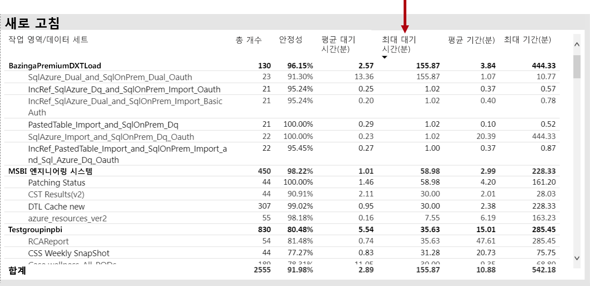

또한 **시간당 평균 새로 고침 대기 시간** 시각적 개체에는 매일 4PM이 지속적으로 유지 됩니다.

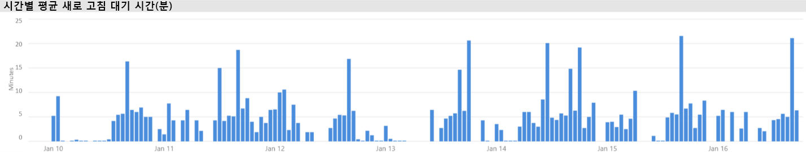

이러한 결과에 대 한 몇 가지 가능한 설명이 있습니다.

- 용량 노드에 의해 적용 되는 한도를 초과 하 여 여러 새로 고침 시도를 동시에 수행할 수 있습니다 (기본 메모리 할당을 사용 하는 P1의 동시 새로 고침 6 개).

- 새로 고칠 데이터 집합이 너무 커서 사용 가능한 메모리에 맞지 않을 수 있습니다 (전체 새로 고침에 필요한 메모리를 2 배 이상 요구 함).
- 비효율적인 파워 쿼리 논리는 데이터 집합을 새로 고치는 동안 메모리 사용 스파이크가 발생할 수 있습니다. 사용 중인 용량의 경우에 따라 실제 한도에 도달 하 여 새로 고침을 실패 하 고 해당 용량에 대 한 다른 보고서 보기 작업에 영향을 줄 수 있습니다.
- 메모리를 유지 해야 하는 자주 쿼리 되는 데이터 집합은 사용 가능한 제한 된 메모리로 인해 새로 고칠 수 있는 다른 데이터 집합의 기능에 영향을 줄 수 있습니다.

이를 조사 하기 위해 Power BI 관리자는 다음을 찾을 수 있습니다.

- 데이터 새로 고침 시 사용 가능한 메모리가 부족 합니다. 사용 가능한 메모리가 새로 고칠 데이터 집합의 크기 보다 작습니다.
- 새로 고쳐지지 않고 새로 고침을 수행 하기 전에 메모리에 없는 데이터 집합 이지만, 많은 새로 고침 시간 동안 대화형 트래픽을 표시 하기 시작 했습니다. 언제 든 지 메모리에 로드 된 데이터 집합을 확인 하기 위해 Power BI 관리자는 앱 **의 데이터 집합 탭의** 데이터 집합 영역을 확인 하 고 **매시간 로드 된 데이터 집합**수의 막대 중 하나를 클릭 하 여 지정 된 시간으로 교차 필터링 할 수 있습니다. 로컬 스파이크 (아래 이미지에 표시 됨)는 여러 데이터 집합이 메모리로 로드 된 시간을 나타내며,이로 인해 예약 된 새로 고침의 시작이 지연 될 수 있습니다.
- 데이터 새로 고침이 시작 될 때 발생 하는 데이터 집합 제거는 새로 고침 시간 전에 너무 많은 대화형 보고서를 제공 하 여 발생 하는 높은 메모리 압력을 나타냅니다. **시간별 데이터 집합 제거 및 메모리 소비** 시각적 개체는 제거의 스파이크를 명확 하 게 나타낼 수 있습니다.

다음 이미지는 로드 된 데이터 집합의 로컬 스파이크를 보여 주며, 지연 된 새로 고침 시작의 대화형 쿼리를 제안 합니다. **시간별 로드 된 데이터 집합** 에서 기간을 선택 하면 시각적 개체는 **데이터 집합 크기** 시각적 개체를 교차 필터링 합니다.

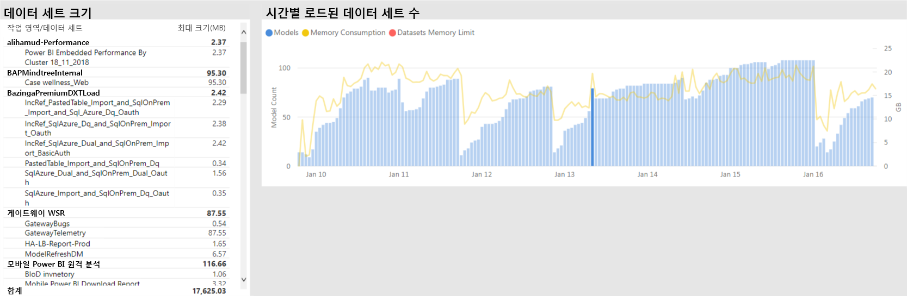

Power BI 관리자는 데이터 새로 고침이 시작 될 때까지 충분 한 메모리를 사용할 수 있는지 확인 하는 단계를 수행 하 여 문제를 해결할 수 있습니다.

- 데이터 집합 소유자에 게 연락 하 여 데이터 새로 고침 일정을 엇갈리게 그리고 공간 확장 하도록 요청
- 불필요 한 대시보드 또는 대시보드 타일, 특히 행 수준 보안을 적용 하는 타일을 제거 하 여 데이터 집합 쿼리 로드를 줄입니다.
- 파워 쿼리 논리를 최적화 하 고, 계산 된 열 또는 테이블을 모델링 하 고, 데이터 집합 크기를 줄이거나, 증분 데이터 새로 고침을 수행 하기 위해 큰 데이터 집합을 구성 하는 방법

### 저속 응답 데이터 집합 식별

이 시나리오에서는 사용자가 특정 보고서를 여는 데 오랜 시간이 걸려 complained 때 조사가 트리거됩니다.

앱에서 Power BI 관리자는 **쿼리 기간** 시각적 개체를 사용 하 여 **평균 기간**을 기준으로 데이터 집합을 정렬 하 여 가장 최악의 데이터 집합을 확인할 수 있습니다. 또한이 시각적 개체는 데이터 집합 쿼리 수를 보여 주기 때문에 데이터 집합을 쿼리 하는 빈도를 확인할 수 있습니다.

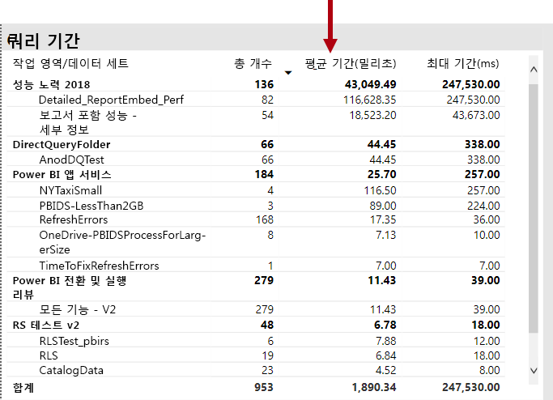

Power BI 관리자는 필터링 된 기간에 대 한 버킷 팅 쿼리 성능 (< = 30ms, 100ms 등)의 전체 분포를 보여 주는 **쿼리 기간 분포** 시각적 개체를 참조할 수 있습니다. 일반적으로 1 초이 하를 사용 하는 쿼리는 대부분의 사용자가 응답 하는 것으로 간주 됩니다. 쿼리가 더 오래 걸리는 것은 잘못 된 성능의 인식을 만드는 경향이 있습니다.

**시간별 쿼리 기간 배포** 시각적 개체를 사용 하면 Power BI 관리자가 용량 성능이 저하 된 것으로 인식 될 수 있는 경우 1 시간 동안 식별할 수 있습니다. 1 초 넘게 쿼리 기간을 나타내는 막대 세그먼트가 클수록 사용자의 성능이 저하 될 위험이 커집니다.

시각적 개체는 대화형 이며, 막대의 세그먼트를 선택 하면 보고서 페이지의 해당 **쿼리 기간** 테이블 시각적 개체는 해당 테이블에 표시 되는 데이터 집합을 표시 하도록 교차 필터링 됩니다. 이 교차 필터링을 통해 Power BI 관리자는 느리게 응답 하는 데이터 집합을 쉽게 식별할 수 있습니다.

다음 이미지는 1 시간 버킷의 가장 최악의 데이터 집합에 초점을 맞춘 **시간별 쿼리 기간 분포**를 기준으로 필터링 된 시각적 개체를 보여 줍니다. 

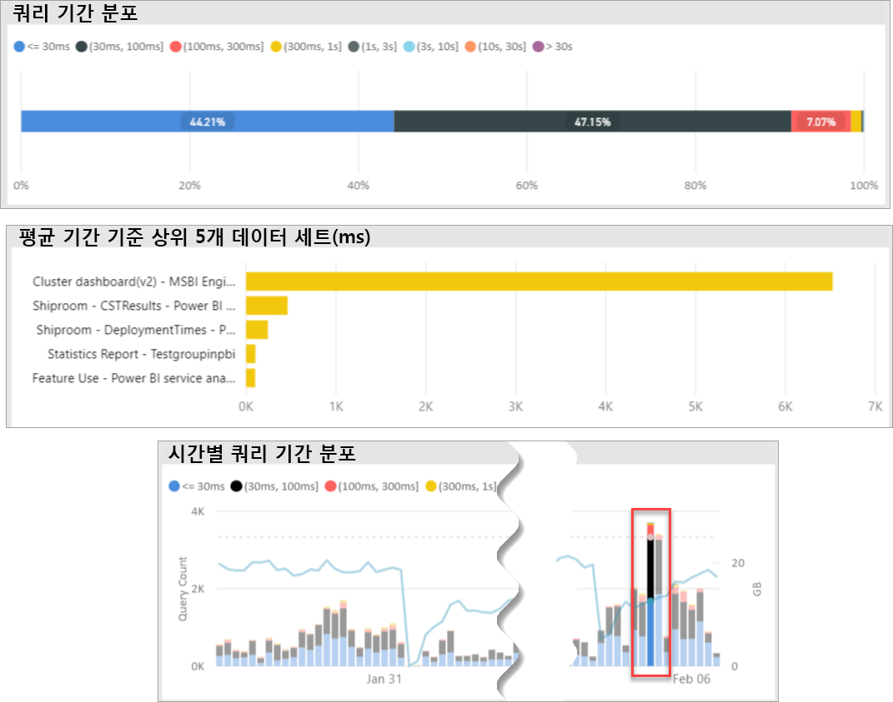

특정 1 시간 timespan에서 성능이 저하 된 데이터 집합을 식별 한 후 Power BI 관리자는 오버 로드 된 용량으로 인해 성능이 저하 되었는지 아니면 데이터 집합 또는 보고서가 잘못 디자인 되었기 때문 인지 조사할 수 있습니다. 이를 위해 **쿼리 대기 시간** 시각적 개체를 참조 하 고 평균 쿼리 대기 시간을 기준으로 데이터 집합을 정렬할 수 있습니다. 많은 쿼리를 대기 중인 경우 데이터 집합에 대 한 높은 요구가 많은 쿼리 대기의 원인일 수 있습니다. 평균 쿼리 대기 시간이 상당한 경우 (> 100ms) 데이터 집합 및 보고서를 검토 하 여 최적화를 수행할 수 있는지 확인 하는 것이 가치가 있을 수 있습니다. 예를 들어 지정 된 보고서 페이지 또는 DAX 식 최적화에 대 한 시각적 개체의 수를 줄일 수 있습니다.

데이터 집합에서 쿼리 대기 시간을 작성 하는 몇 가지 가능한 이유는 다음과 같습니다.

- 낮은 수준의 CPU를 사용 하는 장기 실행 쿼리에 기여할 수 있는 모든 상황을 포함 하는 매우 최적화 된 모델 디자인, 측정값 식 또는 보고서 디자인. 그러면 CPU 스레드를 사용할 수 있게 될 때까지 새 쿼리가 대기 하 고, 최대 업무 시간 동안 일반적으로 표시 되는 호위 (교통 트래픽 걸림)를 만들 수 있습니다. **쿼리 대기** 페이지는 데이터 집합에 평균 쿼리 대기 시간이 있는지 여부를 확인 하기 위한 기본 리소스가 됩니다.
- 동일한 보고서 또는 데이터 집합을 많이 사용 하는 많은 동시 용량 사용자 (수백 ~ 1000 개) 잘 디자인 된 데이터 집합도 동시성 임계값을 초과 하 여 수행할 수 있습니다. 이는 일반적으로 다른 데이터 집합에 표시 되는 것 보다 많은 쿼리 < 수 값을 보여 주는 단일 데이터 집합으로 표시 됩니다. 즉, 한 데이터 집합에 대 한 제한은 30만 개의 쿼리는 다른 모든 데이터 집합에 대 한 30K 쿼리와 비교 합니다. 특정 시점에 쿼리는이 데이터 집합이 스 태거 되기 시작 하 고 **쿼리 기간** 시각적 개체에 표시 됩니다.
- 여러 개의 서로 다른 데이터 집합을 동시에 쿼리 하 여 데이터 집합이 메모리 내 및 메모리 부족으로 인해 자주 발생 하지 않습니다. 이로 인해 사용자가 데이터 집합을 메모리에 로드 하는 경우 성능이 저하 됩니다. 이를 확인 하기 위해 Power BI 관리자는 **시간별 데이터 집합 제거 및 메모리 소비** 시각적 개체를 참조할 수 있습니다 .이 시각적 개체는 메모리에 로드 된 많은 데이터 집합을 반복적으로 제거 하 고 있음을 나타낼 수 있습니다.

### 산발적으로 느리게 응답 하는 데이터 집합의 원인 파악

이 시나리오에서는 시각적 개체를 설명 하는 사용자가 응답 하는 데 느리게 응답 하거나 응답 하지 않을 수 있지만 그에 따라 만족 스럽게 반응 하는 경우 조사가 트리거됩니다.

앱 내에서 **쿼리 기간** 섹션은 다음과 같은 방법으로 원인 데이터 집합을 찾는 데 사용 되었습니다.

- **쿼리 기간** 에서 관리자는 데이터 집합을 기준으로 필터링 된 데이터 집합을 필터링 하 여 (가장 많이 쿼리 된 데이터 집합에서 시작) **시간별 쿼리 배포** 시각적 개체에서 교차 필터링 된 막대를 검사 합니다.
- 단일 한 시간 막대가 모든 쿼리 기간 그룹과 해당 데이터 집합에 대 한 1 시간 막대 (즉, 색 간의 비율이 크게 변경 됨)의 비율이 크게 변경 된 경우이 데이터 집합은이 데이터 집합을 통해 성능도.
- 성능 저하 쿼리의 불규칙 한 부분을 보여 주는 1 시간 동안 다른 데이터 집합의 작업으로 인 한 데이터 집합이 잡음이 많은 환경 효과의 영향을 받은 timespan을 나타냅니다.

아래 이미지는 1 월 30 일에 한 시간을 보여 줍니다 .이 경우 데이터 집합의 성능에 대 한 중요 한 setback은 "(3, 10 초]" 실행 기간 버킷의 크기로 표시 됩니다. 1 시간 표시줄을 클릭 하면 해당 시간 동안 메모리에 로드 된 모든 데이터 집합이 표시 되므로 잡음이 있는 환경 효과를 발생 시키는 데이터 집합의 원인을 나타냅니다.

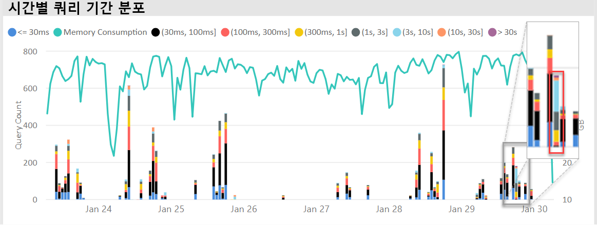

문제가 있는 timespan (즉, 위의 이미지에서 1 월 30 일 동안)을 식별 한 후에는 Power BI 관리자가 모든 데이터 집합 필터를 제거한 다음 해당 timespan 으로만 필터링 하 여이 시간 동안 적극적으로 쿼리 된 데이터 집합을 확인할 수 있습니다. 잡음이 있는 환경 효과에 대 한 원인 데이터 집합은 일반적으로 쿼리 된 상위 데이터 집합 이거나 평균 쿼리 기간이 가장 긴 데이터 집합입니다.

이 문제에 대 한 해결 방법은 다른 프리미엄 용량의 작업 영역에 원인 데이터 집합을 배포 하거나 데이터 집합 크기, 소비 요구 사항 및 데이터 새로 고침 패턴이 지원 되는 경우 공유 용량에 배포 하는 것일 수 있습니다.

반대의 경우에도 마찬가지입니다. Power BI 관리자는 데이터 집합 쿼리 성능이 크게 향상 되는 시간을 확인 한 다음 없어진 항목을 찾을 수 있습니다. 해당 시점에 특정 정보가 누락 되 면 문제를 일으키는 문제를 해결 하는 데 도움이 될 수 있습니다.

### 충분 한 메모리가 있는지 확인

작업 부하를 완료 하기 위한 용량이 충분 한 메모리가 있는지 확인 하기 위해 Power BI 관리자는 앱의 **데이터 집합** 탭에서 **사용 된 메모리 백분율** 시각적 개체를 참조할 수 있습니다. **모든** (전체) 메모리는 현재 쿼리 또는 처리 여부에 관계 없이 메모리에 로드 된 데이터 집합에서 사용 되는 메모리를 나타냅니다. **활성** 메모리는 현재 처리 중인 데이터 집합에 사용 되는 메모리를 나타냅니다.

정상 용량의 경우 시각적 개체는 다음과 같습니다. 모든 (전체)와 활성 메모리 사이의 간격이 표시 됩니다.

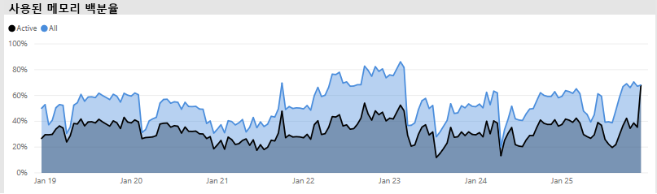

메모리가 부족 한 용량의 경우 동일한 시각적 개체는 활성 메모리와 총 메모리를 명확 하 게 보여 줍니다. 즉, 해당 시점에 메모리에 추가 데이터 집합을 로드할 수 없습니다. 이 경우 Power BI 관리자는 관리 포털의 용량 설정 영역에 있는 **고급 옵션** 에서 **용량 다시 시작** 을 클릭할 수 있습니다. 용량을 다시 시작 하면 모든 데이터 집합이 메모리에서 플러시되고 필요한 경우 쿼리 또는 데이터 새로 고침에 의해 메모리로 다시 로드 될 수 있습니다.

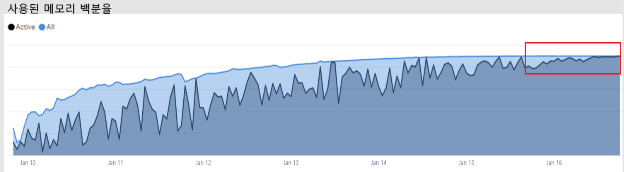

### CPU가 충분 한지 확인

일반적으로 용량의 평균 CPU 사용률은 80% 미만으로 유지 되어야 합니다. 이 값을 초과 하면 용량이 CPU 포화에 근접 하 고 있음을 의미 합니다.

CPU 포화 효과는 모든 작업을 처리 하려고 할 때 많은 CPU 컨텍스트 전환 작업을 수행 하는 것 보다 시간이 오래 걸리는 작업으로 표현 됩니다. 동시 쿼리가 많은 프리미엄 용량에서이는 높은 쿼리 대기 시간으로 표시 됩니다. 쿼리 대기 시간이 높으면 일반적으로 응답성이 저하 됩니다. Power BI 관리자는 **시간별 쿼리 대기 시간 분포** 시각적 개체를 확인 하 여 CPU의 포화 상태를 쉽게 식별할 수 있습니다. 최대 쿼리 대기 시간 수는 잠재적 CPU 포화를 표시 합니다.

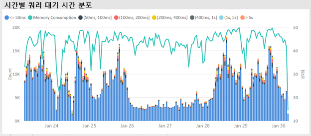

유사한 패턴은 CPU 포화에 영향을 주는 경우 백그라운드 작업에서 검색 될 수 있습니다. Power BI 관리자는 특정 데이터 집합에 대 한 새로 고침 시간에 정기적으로 스파이크를 검색할 수 있습니다 .이 경우에는 CPU 포화 시간 (기타 지속적인 데이터 집합 새로 고침 및/또는 대화형 쿼리)이 표시 될 수 있습니다. 이 경우 앱의 **시스템** 뷰를 참조 하는 것은 CPU가 100% 임을 나타낼 수 있습니다. **시스템** 뷰는 시간당 평균을 표시 하지만 CPU는 대기 시간에 급증 하는 것으로 표시 되는 여러 작업 중 몇 분 동안 포화 상태가 될 수 있습니다.

CPU 포화의 영향을 확인 하는 것이 더 미묘한 차이. 대기 하는 쿼리 수가 중요 하지만 쿼리 대기 시간은 항상 띄는 성능 저하를 발생 시 키 지 않고 일부 범위에 발생 합니다. 일부 데이터 집합 (복잡성 또는 크기를 나타내는 긴 평균 쿼리 시간 사용)은 다른 데이터 집합 보다 CPU 포화의 영향을 받기 쉽습니다. 이러한 데이터 집합을 쉽게 식별 하기 위해 Power BI 관리자는 **시간별 대기 시간 분포** 시각적 개체에서 막대의 색 컴퍼지션에 대 한 변경 내용을 찾을 수 있습니다. 이상 값 막대를 발견 한 후에는 해당 시간 동안 쿼리가 대기 하는 데이터 집합을 검색 하 고 평균 쿼리 기간과 비교 하 여 평균 쿼리 대기 시간을 확인할 수 있습니다. 이러한 두 메트릭이 동일한 크기이 고 데이터 집합에 대 한 쿼리 작업이 그리 중요 하지 않은 경우 데이터 집합이 CPU 부족으로 영향을 받을 수 있습니다.

이 효과는 데이터 집합이 여러 사용자에의 한 자주 발생 하는 쿼리 (예: 학습 세션)의 짧은 버스트에서 사용 되는 경우에 특히 발생 합니다. 이 경우이 데이터 집합에 대 한 상당한 쿼리 대기 시간이 발생 하 고 용량의 다른 데이터 집합에 영향을 줄 수 있습니다 (잡음이 많은 환경 효과).

경우에 따라 Power BI 관리자는 보고서 대신 대시보드 (캐시 된 타일에 대 한 데이터 집합 새로 고침을 사용 하 여 주기적으로 쿼리)를 만들어 데이터 집합 소유자가 비교적 휘발성 쿼리 작업을 만들도록 요청할 수 있습니다. 이렇게 하면 대시보드가 로드 될 때 스파이크를 방지할 수 있습니다. 이 솔루션은 지정 된 비즈니스 요구 사항에 대해 항상 가능 하지는 않지만 데이터 집합을 변경 하지 않고도 CPU 포화를 방지 하는 효과적인 방법이 될 수 있습니다.

## 결론

Power BI Premium는 조직의 모든 사용자에 게 보다 일관 된 성능을 제공 하 고, 대용량 데이터 볼륨을 지원 하 고, 통합 셀프 서비스 및 엔터프라이즈 BI 플랫폼의 유연성을 제공 합니다. 이 수준 300 기술 백서는 Power BI 관리자와 콘텐츠 작성자 및 게시자를 위해 특별히 작성 되었습니다. 이를 통해 Power BI Premium의 잠재력을 이해 하 고 확장 가능한 솔루션을 디자인, 배포, 모니터링 및 문제 해결 하는 방법을 설명할 수 있습니다.

Power BI Premium 용량을 배포 하 고 관리 하기 위해 관리자 및 모델 개발자는 용량 기능, 해당 기능을 관리 및 모니터링 하는 방법, 적절 한 응답을 위해 모델을 최적화할 수 있는 방법에 대해 잘 알고 있어야 합니다. 성능 문제 및 병목 현상이 발생 해야 합니다.

## 끝 메모

\[1\]이 기술 문서에서는 Power BI 클라우드 서비스 에서만 지원 되는 Power BI Premium에 대해 설명 하므로 Power BI Report Server을 설치 하는 데 필요한 라이선스는에 포함 되어 있다는 점을 제외 하 고는 범위에 포함 되지 않습니다. 일부 Power BI Premium Sku입니다.

\[2\] 응용 프로그램 사용자를 대신 하 여 콘텐츠를 포함 하는 데 사용 되는 클라우드 서비스로 Power BI PaaS (Platform as a Service)입니다. 이러한 유형의 포함은 다른 두 제품을 사용 하 여 구현할 수 있으며, 그 중 하나는 Power BI Premium입니다.

\[3\] 푸시, 스트리밍 및 하이브리드 데이터 집합은 프리미엄 용량에 저장 되지 않으므로 프리미엄 용량을 배포, 관리 및 모니터링할 때 고려 하지 않습니다.

\[4 Power BI 콘텐츠 형식으로 Excel 통합 문서\] 프리미엄 용량에 저장 되지 않으므로 프리미엄 용량을 배포, 관리 또는 모니터링할 때 고려 되지 않습니다.

\[5\] 시각적 개체는 슬라이서 상호 작용을 무시 하도록 구성할 수 있습니다. 자세한 내용은 [Power BI 보고서 문서의 시각화 상호 작용](service-reports-visual-interactions.md) 을 참조 하세요.

\[6\] 파일에 대해를 사용 하 여 Power BI Desktop 파일 크기를 작업 관리자 메모리와 비교 하 여 크기 차이를 확인할 수 있습니다.

\[7\] Microsoft 데이터 원본에 대 한 지원에는 SQL Server, Azure Data Brick, Azure HDInsight Spark (베타), Azure SQL Database 및 Azure SQL Data Warehouse가 포함 됩니다. 추가 소스에 대 한 자세한 내용은 Power BI 문서 [에서 직접 쿼리를 통해 지원 되는 데이터 원본](desktop-directquery-data-sources.md) 을 참조 하세요.

\[8\] Power BI Premium는 최대 10gb 크기의 Power BI Desktop (.pbix) 파일 업로드를 지원 합니다. 업로드 되 면 데이터 집합은 새로 고침의 결과로 크기가 최대 12gb까지 증가할 수 있습니다. 최대 업로드 크기는 SKU에 따라 다릅니다. 자세한 내용은 [대량 데이터 집합에 대 한 Power BI Premium 지원](service-premium-large-datasets.md) 문서를 참조 하세요.

4 개 미만의 \[9\] Sku는 전용 인프라에서 실행 되지 않습니다. 여기에는 EM1, EM2, A1 및 A2 Sku가 포함 됩니다.

\[10\] 드물기는 하지만 서비스 작업으로 인해 모델이 메모리에서 언로드될 수 있습니다.

\[11\] 이러한 타이밍은 언제 든 지 변경 될 수 있습니다.

\[12\] 현재는 미리 보기로 제공 됩니다. 다중 지역 배포에 대한 이론적 원리는 일반적으로 성능 및 확장성이 아니라 회사 또는 정부 규정 준수를 위한 것입니다. 보고서 및 대시보드 로드에는 여전히 홈 지역에 대한 메타데이터 요청이 포함됩니다. 자세한 내용은 [Power BI Premium (미리 보기)에 대 한 다중 지역 지원](service-admin-premium-multi-geo.md) 문서를 참조 하세요.

\[13\] 작업으로 Power BI 서비스을 오버 로드 하 고 과도 하 게 복잡 한 쿼리를 작성 하 고 순환 참조를 만들어 성능 문제를 일으킬 수 있습니다.

\[14\] 전체 조직의 작업 영역을 할당 하는 옵션을 사용 하지 않는 것이 좋으며, 보다 구체적인 방법이 선호 됩니다. 일반적으로 프로덕션 콘텐츠에는 개인 작업 영역을 사용 하지 않는 것이 좋습니다.

\[15\] 앱 또는 Azure Portal에서 Sku를 모니터링할 수 있지만 Power BI 관리 포털에서는 모니터링할 수 없습니다. Sku를 모니터링 하려면 앱이 리소스의 판독기 역할에 추가 되지 않은 경우 보고서 새로 고침이 실패 합니다. 자세한 내용은 [모니터 Power BI Premium 및 Power BI Embedded 용량](service-admin-premium-monitor-capacity.md) 문서를 참조 하세요.

\[16\] 새로 고침은 시작할 수 있는 CPU 또는 메모리가 부족 한 경우 대기 합니다.

\[17\] 메모리의 데이터 집합 크기는 디스크의 크기 (최대 20%) 보다 클 수 있습니다.

\[18\] 평균 메모리 사용량 (GB) 및 최고 메모리 사용량 (GB)

\[19\] 데이터 집합 제거

\[20\] 데이터 집합 쿼리, 데이터 집합 평균 쿼리 기간 (밀리초), 데이터 집합 대기 횟수 및 데이터 집합 평균 대기 시간 (밀리초)

\[21\] CPU 사용률이 가장 높은 최대 CPU 시간 (지난 7 일간)

\[22\] DQ/LC 높은 사용률 수 및 최고 사용률의 DQ/LC 시간 (지난 7 일)
