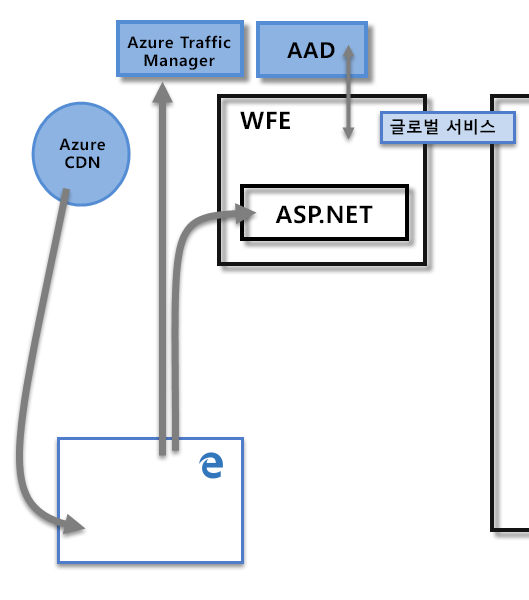
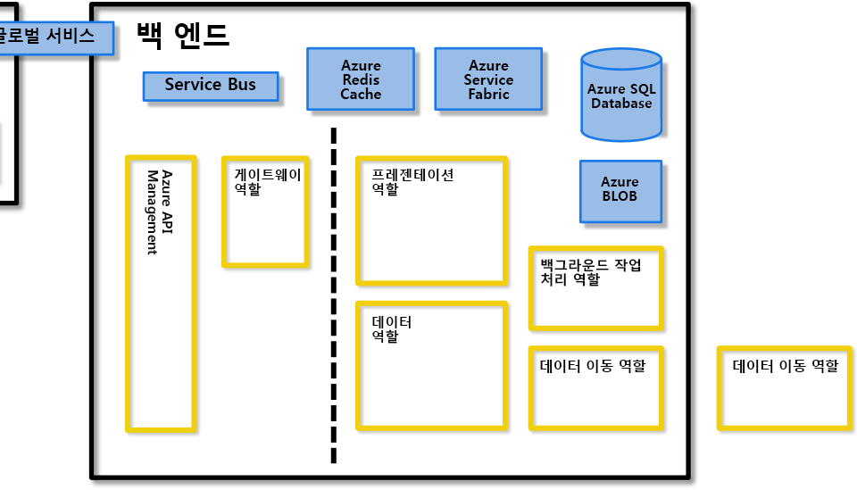
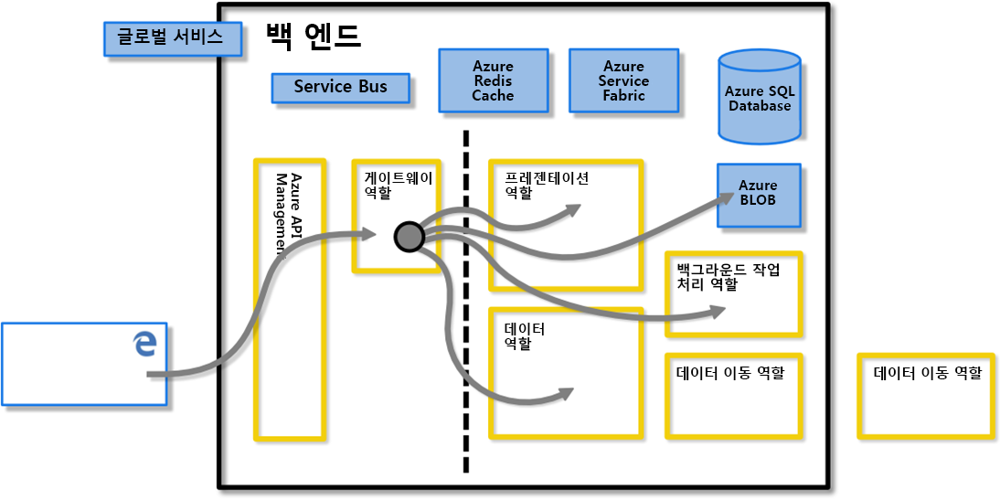
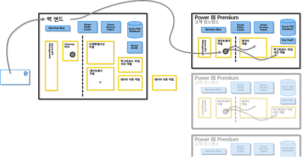
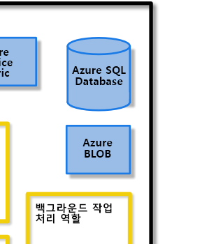
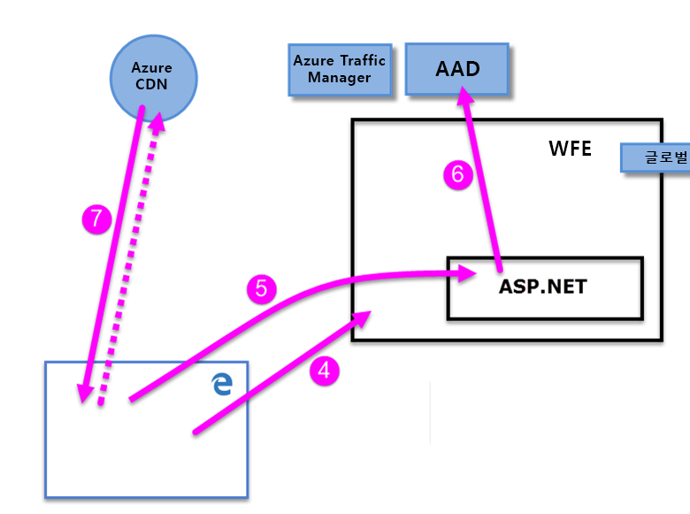
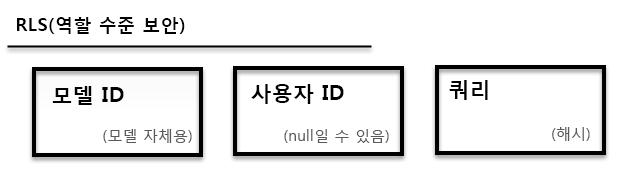

# Power BI 보안 백서

**요약:** Power BI는 Microsoft에서 제공 하는*SaaS (SaaS*) 또는 SaaS (software As a service) 제품으로, 셀프 서비스 비즈니스 인텔리전스 대시보드, 보고서, 데이터 집합 및 시각화를 쉽고 빠르게 만들 수 있습니다. Power BI를 사용하면 다양한 데이터 원본에 연결하고, 이러한 연결에서 데이터를 결합하고 구체화한 다음, 다른 사용자와 공유할 수 있는 보고서와 대시보드를 만들 수 있습니다.

**기록기:** David Iseminger

**기술 검토자:** Pedram Rezaei, Cristian Petculescu, Siva Harinath, Tod Manning, Haydn Richardson, Adam Wilson, 이혜준 Childs, Robert Bruckner, Sergei Gundorov, Kasper de Jonge

**적용 대상:** Power BI SaaS, Power BI Desktop, Power BI Embedded, Power BI Premium

> [!NOTE]
> 이 백서는 브라우저에서 **인쇄**를 선택한 다음, **PDF로 저장**을 선택하여 저장하거나 인쇄할 수 있습니다.

## 소개

**Power BI**는 Microsoft에서 제공하는 온라인 소프트웨어 서비스(_SaaS_ 또는 Software as a Service)로서 셀프 서비스 비즈니스 인텔리전스 대시보드, 보고서, 데이터 세트 및 시각화를 쉽고 빠르게 만들 수 있습니다. Power BI를 사용하면 다양한 데이터 원본에 연결하고, 이러한 연결에서 데이터를 결합하고 구체화한 다음, 다른 사용자와 공유할 수 있는 보고서와 대시보드를 만들 수 있습니다.

Power BI 서비스에는 [Microsoft Online Services 사용 약관](https://www.microsoftvolumelicensing.com/DocumentSearch.aspx?Mode=3&amp;DocumentTypeId=31) 및 [Microsoft Enterprise 개인정보처리방침](https://www.microsoft.com/privacystatement/OnlineServices/Default.aspx)이 적용됩니다. 데이터 처리 위치는 Microsoft Online Services 사용 약관의 데이터 처리 조항에 나오는 위치를 참조하세요. 규정 준수 정보와 관련하여 [Microsoft Trust Center](https://www.microsoft.com/trustcenter)는 Power BI에 대한 기본 리소스입니다. Power BI 팀은 고객에게 최신의 혁신과 생산성을 제공하기 위해 열심히 노력하고 있습니다. Power BI 현재 [Office 365 준수 프레임 워크](https://go.microsoft.com/fwlink/p/?LinkID=618494)의 계층 D에 있습니다.

이 문서에서는 Power BI 보안과 관련하여 Power BI 아키텍처를 설명하고, Power BI 에서 사용자를 인증하고 데이터 연결을 설정하는 방법을 설명한 다음, Power BI에서 서비스를 통해 데이터를 저장하고 이동하는 방법에 대해 설명합니다. 마지막 섹션에서는 보안 관련 질문을 전적으로 다루고, 각 질문에 대한 답변을 제공하고 있습니다.

## Power BI 아키텍처

**Power BI** 서비스는 Microsoft의 [클라우드 컴퓨팅 플랫폼](https://azure.microsoft.com/overview/what-is-azure/)인 **Azure**를 기반으로 합니다. Power BI는 현재 전 세계의 많은 데이터 센터에 구축되어 있습니다. 이러한 데이터 센터에서 제공하여 지역의 고객이 사용할 수 있는 여러 활성 배포와 각 활성 배포에 대한 백업 역할을 하는 동일한 수의 수동 배포가 있습니다.

각각의 Power BI 배포는 **WFE(웹 프런트 엔드)** 클러스터와 **백엔드** 클러스터 등, 두 클러스터로 구성됩니다. 다음 이미지에서 보여 주는 이러한 두 클러스터는 이 문서의 나머지 부분에 대한 배경을 제공합니다. 

Power BI는 계정 인증 및 관리에 **AAD**(Azure Active Directory)를 사용합니다. 또한 Power BI는 **ATM(Azure Traffic Manager)** 을 사용하여 인증 프로세스를 위해 연결하고 정적 콘텐츠와 파일을 다운로드하려고 시도하는 클라이언트의 DNS 레코드로 결정된 가장 가까운 데이터 센터로 사용자 트래픽을 전달합니다. Power BI는 지리적으로 가장 가까운 WFE를 사용하여 필요한 정적 콘텐츠와 파일을 사용자에게 효율적으로 배포합니다. 단, 사용자 지정 시각적 개체는 **Azure CDN(콘텐츠 배달 네트워크)** 을 사용하여 배달됩니다.

### WFE 클러스터

**WFE** 클러스터는 Power BI에 대한 최초 연결과 인증 프로세스를 관리하며, AAD를 사용하여 클라이언트를 인증하고 이후 Power BI 서비스에 대한 클라이언트 연결을 위해 토큰을 제공합니다.

사용자가 Power BI 서비스에 연결하려고 하면 클라이언트의 DNS 서비스에서 **Azure Traffic Manager**와 통신하여 Power BI 배포와 가장 가까운 데이터 센터를 찾을 수 있습니다. 이 프로세스에 대한 자세한 내용은 [Azure Traffic Manager에 대한 성능 트래픽 라우팅 방법](https://azure.microsoft.com/documentation/articles/traffic-manager-routing-methods/#performance-traffic-routing-method)을 참조하세요.

사용자와 가장 가까운 WFE 클러스터는 로그인 및 인증 순서(이 문서의 뒷부분에서 설명함)를 관리하고, 인증이 성공하면 사용자에게 AAD 토큰을 제공합니다. WFE 클러스터 내의 ASP.NET 구성 요소는 요청을 구문 분석하여 사용자가 속한 조직을 확인한 다음, Power BI **글로벌 서비스**에 문의합니다. 글로벌 서비스는 사용자와 고객 조직을 Power BI 테넌트가 있는 데이터 센터에 매핑하는 전 세계의 모든 WFE 및 백 엔드 클러스터 간에 공유되는 단일 Azure 테이블입니다. WFE는 백 엔드 클러스터에 조직의 테넌트가 있는 브라우저를 지정합니다. 사용자가 인증되면 WFE에서 이러한 요청을 중개하지 않고 백 엔드 클러스터에서 후속 클라이언트 상호 작용이 직접 수행됩니다.

### Power BI 백 엔드 클러스터

**백엔드** 클러스터는 인증된 클라이언트가 Power BI 서비스와 상호 작용하는 방식입니다. **백엔드** 클러스터는 시각화, 사용자 대시보드, 데이터 세트, 보고서, 데이터 스토리지, 데이터 연결, 데이터 새로 고침 및 기타 Power BI 서비스의 상호 작용 측면을 관리합니다.

**게이트웨이 역할** 은 사용자 요청과 Power BI 서비스 간의 게이트웨이로 작동합니다. 사용자는 게이트웨이 역할 이외의 다른 역할과 직접 상호 작용하지 않습니다.

**중요:** Azure API Management (**Apim**) 및 게이트웨이 (**GW**) 역할만 공용 _인터넷을 통해_ 액세스할 수 있습니다. 이 역할은 인증, 권한 부여, DDoS 방지, 조정, 부하 분산, 라우팅 및 기타 기능을 제공합니다.

위의 **백 엔드** 클러스터 이미지에서 점선은 사용자가 액세스할 수 있는 두 역할과(점선 왼쪽) 시스템에서만 액세스할 수 있는 역할 간의 경계를 명확히 합니다. 인증된 사용자가 Power BI 서비스에 연결하면 클라이언트의 연결과 요청은 **게이트웨이 역할** 및 **Azure API Management**에서 수락 및 관리되며, 이후 사용자를 대신하여 Power BI 서비스의 나머지 부분과 상호 작용합니다. 예를 들어, 클라이언트가 대시보드 보기를 시도할 때 **게이트웨이 역할** 이 해당 요청을 수락한 다음 개별적으로 **프레젠테이션 역할** 에 요청을 보내 대시보드 렌더링을 위해 브라우저에서 필요한 데이터를 검색합니다.

### Power BI 프리미엄

**Power BI Premium**은 Power BI 활동에 전용 리소스가 필요한 구독자에게 프로비전되고 분할된 전용 서비스 작업 영역을 제공합니다. 고객이 Power BI Premium 구독에 등록하면 프리미엄 용량이 **Azure Resource Manager**를 통해 만들어집니다. 이 구독을 롤아웃하면 해당 Power BI 테넌트가 호스팅되어(이 문서의 뒷부분에서 설명한 대로 다중 지역 환경 제외) **Azure Service Fabric** 배포로 시작되는 데이터 센터에서 구독 수준에 맞는 가상 머신 세트가 할당됩니다.

만들어진 Premium 클러스터와의 모든 통신은 클라이언트의 전용 **Power BI Premium** 구독 가상 머신에 대한 연결이 설정된 Power BI 백 엔드 클러스터를 통해 라우팅됩니다.

### 데이터 스토리지 아키텍처

Power BI는 데이터를 저장하고 관리하는 데 두 개의 주 스토리지를 사용합니다. 사용자로부터 업로드되는 데이터는 일반적으로 **Azure Blob** 스토리지로 보내지며, 시스템 자체의 모든 메타데이터와 아티팩트는 **Azure SQL Database**의 방화벽 뒤에 저장됩니다.

예를 들어 사용자가 Excel 통합 문서를 Power BI 서비스로 가져오면, 메모리 내 Analysis Services 테이블 형식 데이터베이스가 만들어지고 데이터는 최대 1시간 동안(또는 시스템에서 메모리 부족이 발생할 때까지) 메모리에 저장됩니다. 또한 데이터는 **Azure Blob** 스토리지로도 보내집니다.

사용자의 Power BI 구독에 대한 메타데이터(예: 대시보드, 보고서, 최근 데이터 원본, 작업 영역, 조직 정보, 테넌트 정보 및 시스템에 대한 기타 메타데이터)는 **Azure SQL Database**에 저장되고 업데이트됩니다. Azure SQL Database에 저장된 모든 정보는 [Azure SQL TDE(투명한 데이터 암호화)](https://msdn.microsoft.com/library/dn948096.aspx) 기술을 사용하여 완전히 암호화됩니다. 또한 Azure Blob 스토리지에 저장된 데이터도 모두 암호화됩니다. 데이터의 로드, 스토리지 및 이동 프로세스에 대한 자세한 내용은 **데이터 스토리지 및 이동** 섹션을 참조하세요.

## 테넌트 만들기

테넌트는 Azure, Microsoft Intune, Power BI 또는 Office 365와 같은 Microsoft 클라우드 서비스에 등록할 때 조직에서 수신하고 소유하는 Azure AD 서비스의 전용 인스턴스입니다. 각 Azure AD 테넌트는 고유하며 다른 Azure AD 테넌트와 별개입니다.

테넌트는 회사의 사용자 및 관련 정보(암호, 사용자 프로필 데이터, 권한 등)를 저장합니다. 또한 조직및 보안과 관련된 그룹, 애플리케이션 및 기타 정보도 포함하고 있습니다. 자세한 내용은 [Azure AD 테넌트란?](https://msdn.microsoft.com/library/azure/jj573650.aspx#BKMK_WhatIsAnAzureADTenant)을 참조하세요.

Power BI 테넌트는 국가(또는 지역)와 가장 가까운 것으로 간주되는 데이터 센터에 만들어지며, Office 365 또는 Power BI 서비스가 처음 프로비전되었을 때 제공된 Azure Active Directory의 테넌트에 제공된 상태 정보입니다. Power BI 테넌트는 현재 해당 데이터 센터 위치에서 이동하지 않습니다.

### 여러 지리적 위치(다중 지역)

일부 조직에서는 비즈니스 요구 사항에 따라 여러 지리적 위치 또는 지역에 Power BI가 있어야 합니다. 예를 들어 비즈니스에는 미국의 Power BI 테넌트가 있지만 오스트레일리아와 같은 다른 지역에서 비즈니스를 수행할 수 있으며, 지역 규정을 준수하기 위해 해당 원격 지역에서 특정 Power BI 데이터를 유지해야 할 수도 있습니다. 2018년 하반기 시작부터, 한 지역에 홈 테넌트가 있는 조직은 또한 다른 지역에 위치한 Power BI 리소스를 프로비저닝하고 액세스할 수 있습니다. 이 기능은 편의상 이 문서 전체에서 참조하기 위해 **다중 지역**이라고 합니다.

다중 지역 정보에 대한 최신 및 기본 문서는 [Power BI Premium에 대한 다중 지역 지원 구성](service-admin-premium-multi-geo.md) 문서를 참조하세요. 

서로 다른 지역에서 작업할 때 지역 법률 및 규정의 맥락에서 평가 해야 하는 기술 세부 정보는 여러 가지가 있습니다. 이러한 세부 정보는 다음과 같습니다.

- 원격 쿼리 실행 계층은 원격 용량 지역에서 호스트되어 데이터 모델, 캐시 및 대부분의 데이터 처리가 원격 용량 지역에 남아 있도록 합니다. [Power BI Premium에 대한 다중 지역](service-admin-premium-multi-geo.md) 문서에 자세히 설명된 몇 가지 예외가 있습니다.
- 캐시된 쿼리 텍스트와 원격 지역에 저장된 해당 결과는 미사용 지역에 그대로 남아 있지만 전송 중인 다른 데이터는 여러 지역 간에 이동할 수 있습니다.
- Power BI 서비스 다중 지역 용량에 게시(업로드)된 .PBIX 또는 .XLSX 파일은 복사본이 Power BI의 테넌트 지역에 있는 Azure Blob storage에 일시적으로 저장될 수 있습니다. 이러한 상황에서 데이터는 SSE(Azure Storage 서비스 암호화)를 사용하여 암호화되고, 파일 콘텐츠 처리 및 원격 지역으로의 전송이 완료되는 즉시 가비지 수집을 위해 복사본이 예약됩니다.
- 다중 지역 환경의 지역 간에 데이터를 이동 하는 경우 원본 지역의 데이터 인스턴스가 7-30 일 이내에 삭제 됩니다. 

### 데이터 센터 및 로캘

Power BI는 지역 데이터 센터에서 Power BI 클러스터를 배포하는 위치에 따라 특정 지역에서 제공됩니다. Microsoft는 Power BI 인프라를 추가 데이터 센터로 확장할 계획입니다.

Azure 데이터 센터에 대한 추가 정보를 제공하는 링크는 다음과 같습니다.

- [Azure 지역](https://azure.microsoft.com/regions/) – 전 세계에 걸쳐 있는 Azure의 위치에 대한 정보
- [지역별 Azure 서비스](https://azure.microsoft.com/regions/#services) – 각 지역의 Microsoft에서 제공하는 Azure 서비스(인프라 서비스 및 플랫폼 서비스 모두)에 대한 전체 목록

현재는 [Microsoft 보안 센터](https://www.microsoft.com/TrustCenter/CloudServices/business-application-platform/data-location)에 설명된 대로 데이터 센터에서 서비스되는 특정 지역에서 Power BI 서비스를 사용할 수 있습니다. 다음 링크는 Power BI 데이터 센터의 맵을 보여주며, 지역을 마우스로 가리키면 해당 지역의 데이터를 볼 수 있습니다.

* [Power BI 데이터 센터](https://www.microsoft.com/TrustCenter/CloudServices/business-application-platform/data-location)

또한 Microsoft는 주권국을 위한 데이터 센터도 제공합니다. 내셔널 클라우드의 Power BI 서비스 가용성에 대한 자세한 내용은 [Power BI 내셔널 클라우드](https://powerbi.microsoft.com/clouds/)를 참조하세요.

데이터의 저장 위치와 사용 방법에 대한 자세한 내용은 [Microsoft Trust Center](https://www.microsoft.com/TrustCenter/Transparency/default.aspx#_You_know_where)를 참조하세요. 고객 저장 데이터의 위치에 대한 약정은 [Microsoft Online Services 사용 약관](https://www.microsoftvolumelicensing.com/DocumentSearch.aspx?Mode=3&amp;DocumentTypeId=31)의 **데이터 처리 조항**에 명시되어 있습니다.

## 사용자 인증

Power BI 서비스에 대한 사용자 인증은 사용자의 브라우저와 Power BI 서비스 또는 Power BI에서 사용하는 Azure 서비스 간의 일련의 요청, 응답 및 리디렉션으로 구성됩니다. 이 순서는 Power BI에서 사용자 인증 프로세스를 설명합니다. 조직의 사용자 인증 모델(로그인 모델) 옵션에 대한 자세한 내용은 [Office 365에 대한 로그인 모델 선택](https://blogs.office.com/2014/05/13/choosing-a-sign-in-model-for-office-365/)을 참조하세요.

### 인증 순서

Power BI 서비스에 대한 사용자 인증 순서는 다음 단계에서 설명한 대로 수행되며, 다음 이미지에 나와 있습니다.

1. 사용자가 주소 표시줄에서 Power BI 주소(예: https://app.powerbi.com) 를 입력하거나 Power BI 방문 페이지(https://powerbi.microsoft.com) 에서 _로그인_을 선택하여 브라우저에서 Power BI 서비스에 대한 연결을 시작합니다. 연결은 TLS 1.2 및 HTTPS를 사용하여 설정되며, 이후 브라우저와 Power BI 서비스 간의 모든 통신에서 HTTPS를 사용합니다. 요청은 **Azure Traffic Manager**로 보내집니다.

2. **Azure Traffic Manager**는 사용자의 DNS 레코드를 확인하여 Power BI가 배포되는 가장 가까운 데이터 센터를 확인하고 사용자를 보내야 하는 WFE 클러스터의 IP 주소를 사용하여 DNS에 응답합니다.

3. 다음으로, WFE에서 사용자를 Microsoft Online Services 로그인 페이지로 리디렉션합니다.

    

1. 사용자가 인증되면 로그인 페이지에서 사용자가 이전에 결정된 가장 가까운 Power BI 서비스 **WFE 클러스터**로 리디렉션됩니다.

2. 브라우저에서 Microsoft Online Services에 성공적으로 로그인하여 가져온 쿠키를 제출합니다. 쿠키는 **WFE 클러스터** 내의 **ASP.NET 서비스**에서 검사합니다.

3. WFE 클러스터는 **AAD**(**Azure Active Directory**) 서비스에서 사용자의 Power BI 서비스 구독을 인증하고 AAD 보안 토큰을 가져오는지 확인합니다. AAD에서 사용자의 성공적인 인증과 AAD 보안 토큰이 반환되면, WFE 클러스터는 테넌트 및 해당 Power BI 백 엔드 클러스터 위치의 목록을 유지 관리하는 **Power BI**** 글로벌 서비스**를 참조하고 사용자의 테넌트가 포함된 Power BI 서비스 클러스터를 결정합니다. 다음으로, WFE 클러스터에서 사용자를 테넌트가 있는 Power BI 클러스터로 리디렉션하고 다음과 같은 항목 컬렉션을 사용자의 브라우저에 반환합니다.

      - **AAD 보안 토큰**
      - **세션 정보**
      - 사용자가 통신하고 상호 작용할 수 있는 **백 엔드** 클러스터의 웹 주소

1. 다음으로, 사용자의 브라우저에서 지정된 Azure CDN 또는 일부 WFE 파일에 연결하여 브라우저와 Power BI 서비스의 상호 작용을 사용하도록 설정하는 데 필요한 지정된 공용 파일의 컬렉션을 다운로드합니다. 그런 다음, Power BI 서비스 브라우저의 세션 기간 동안 AAD 토큰, 세션 정보, 연결된 백 엔드 클러스터의 위치, Azure CDN 및 WFE 클러스터에서 다운로드한 파일 컬렉션이 브라우저 페이지에 포함됩니다.

이러한 항목이 완성되면 브라우저에서 지정된 백 엔드 클러스터와의 연결을 시작하고 사용자와 Power BI 서비스의 상호 작용이 시작됩니다. 이 시점부터 Power BI 서비스에 대한 모든 호출은 지정된 백 엔드 클러스터를 사용하고, 모든 호출에는 사용자의 AAD 토큰이 포함됩니다. AAD 토큰의 시간 제한은 1시간이며, 액세스를 유지하기 위해 사용자의 세션이 열린 채로 유지되는 경우 WFE에서 토큰을 정기적으로 새로 고칩니다.

## 데이터 스토리지 및 이동

Power BI 서비스에서 데이터는 _저장_ 데이터(현재 사용하고 있지 않지만 Power BI 사용자가 사용할 수 있는 데이터) 또는 _처리 중_ 데이터(예: 실행 중인 쿼리, 작동 중인 데이터 연결 및 모델, Power BI 서비스에 업로드 중인 데이터 및/또는 모델, 사용자 또는 Power BI 서비스에서 활발하게 액세스 또는 업데이트 중인 데이터에 대해 수행할 수 있는 기타 작업)입니다 처리 중에 있는 데이터를 _처리 중 데이터_라고 합니다. Power BI의 저장 데이터는 암호화됩니다. Power BI 서비스에서 보내거나 받는 데이터인 전송 중 데이터도 암호화됩니다.

또한 Power BI 서비스는 데이터가 **DirectQuery**를 사용하여 액세스하는지 또는 가져올지에 따라 데이터를 다르게 관리합니다. 따라서 Power BI의 사용자 데이터에는 DirectQuery에서 액세스하는 데이터와 DirectQuery에서 액세스하지 않는 데이터의 두 가지 범주가 있습니다.

**DirectQuery**는 Power BI 사용자의 쿼리가 Microsoft DAX(데이터 분석 식) 언어에서 변환된 쿼리입니다. 이 언어는 Power BI 및 다른 Microsoft 제품에서 쿼리를 만들 때 데이터 원본의 기본 데이터 언어로 사용하는 언어(예: T-SQL 또는 기타 기본 데이터베이스 언어)입니다. DirectQuery와 연결된 데이터는 참조로만 저장됩니다. 즉, DirectQuery가 활성화되어 있지 않으면 원본 데이터가 Power BI에 저장되지 않습니다(아래의 _처리 중 데이터(데이터 이동)_ 섹션에서 설명한 대로 대시보드 및 보고서를 표시하는 데 사용되는 시각화 데이터는 제외). 대신, DirectQuery가 실행될 때 해당 데이터에 액세스할 수 있도록 하는 DirectQuery 데이터에 대한 참조가 저장됩니다. DirectQuery에는 데이터 원본에 액세스하는 데 사용되는 연결 문자열과 자격 증명을 포함하여 쿼리를 실행하는 데 필요한 모든 정보가 포함되어 있으므로 DirectQuery에서 포함된 데이터 원본에 연결하여 자동으로 새로 고칠 수 있습니다. DirectQuery를 사용하면 기본 데이터 모델 정보가 DirectQuery에 통합됩니다.

가져오기 데이터 세트에 대한 쿼리는 기본 데이터 원본의 기본 언어로 직접 변환되지 _않는_ DAX 쿼리의 컬렉션으로 구성됩니다. 가져오기 쿼리에는 기본 데이터에 대한 자격 증명이 포함되지 않으며, [Power BI Gateway](service-gateway-onprem.md)를 통해 액세스되는 온-프레미스 데이터가 아닌 경우 기본 데이터는 Power BI 서비스에 로드됩니다. 이 경우 쿼리는 온-프레미스 데이터에 대한 참조만 저장합니다.

다음 표에서는 사용 중인 쿼리 형식을 기반으로 하는 Power BI 데이터를 설명합니다. **X**는 연결된 쿼리 형식을 사용할 때 Power BI 데이터가 있음을 표시합니다.

|  |가져오기  |DirectQuery  |라이브 연결  |
|---------|---------|---------|---------|
|스키마     |     X    |    X     |         |
|행 데이터     |    X     |         |         |
|시각적 개체 데이터 캐싱     |    X     |     X    |    X     |

DirectQuery와 다른 쿼리의 차이점은 Power BI 서비스에서 저장 데이터를 처리하는 방법과 쿼리 자체가 암호화되는지 여부를 결정합니다. 다음 섹션에서는 저장/이동 중 데이터, 데이터 처리에 대한 암호화, 위치 및 프로세스에 대해 설명합니다.

### 저장 데이터

저장 데이터인 경우 Power BI 서비스는 데이터 세트, 보고서 및 대시보드 타일을 다음 하위 섹션에서 설명하는 방식으로 저장합니다. 앞에서 설명한 대로 Power BI의 저장 데이터는 암호화됩니다. 다음 섹션에서 ETL은 추출, 변환 및 로드를 나타냅니다.

#### 암호화 키

- Azure Blob 키에 대한 암호화 키는 암호화되어 Azure Key Vault에 저장됩니다.
- Azure SQL Database TDE 기술에 대한 암호화 키는 Azure SQL 자체에서 관리합니다.
- 데이터 이동 서비스 및 온-프레미스 데이터 게이트웨이에 대한 암호화 키가 저장되는 위치는 다음과 같습니다.
  - 고객의 인프라에 있는 온-프레미스 데이터 게이트웨이 - 온-프레미스 데이터 원본용
  - 데이터 이동 역할 – 클라우드 기반 데이터 원본용

Windows Azure Blob Storage를 암호화하는 데 사용되는 CEK(콘텐츠 암호화 키)는 임의로 생성된 256비트 키입니다. CEK에서 콘텐츠를 암호화하는 데 사용하는 알고리즘은 AES\_CBC\_256입니다.

CEK를 암호화하는 데 사용되는 KEK(키 암호화 키)는 미리 정의된 256비트 키입니다. CEK를 암호화하는 KEK의 알고리즘은 A256KW입니다.

복구 키를 기반으로 하는 게이트웨이 암호화 키는 온-프레미스 인프라를 벗어나지 않습니다. Power BI는 암호화된 온-프레미스 자격 증명 값에 액세스할 수 없으며 이러한 자격 증명을 가로챌 수 없습니다. 웹 클라이언트는 통신하는 특정 게이트웨이와 연결된 공개 키를 사용하여 자격 증명을 암호화합니다.

클라우드 기반 데이터 원본의 경우 데이터 이동 역할은 [Always Encrypted](https://msdn.microsoft.com/library/mt163865.aspx) 방법을 사용하여 암호화 키를 암호화합니다. 자세한 내용은 [Always Encrypted 데이터베이스 기능](https://msdn.microsoft.com/library/mt163865.aspx)을 참조하세요.

#### 데이터 세트

1. 메타데이터(테이블, 열, 측정값, 계산, 연결 문자열 등)

    a. 온-프레미스 Analysis Services의 경우 Azure SQL에서 저장되고 암호화된 데이터베이스에 대한 참조를 제외하고는 서비스에 아무 것도 저장되지 않습니다.

    b. ETL, DirectQuery 및 푸시 데이터에 대한 다른 모든 메타데이터는 Azure Blob 스토리지에서 암호화되어 저장됩니다.

1. 원래 데이터 원본에 대한 자격 증명
  
      a. 온-프레미스 Analysis Services – 자격 증명이 필요하지 않으므로 자격 증명이 저장되지 않습니다.

      b. DirectQuery – 서비스에서 모델이 직접 만들어져 연결 문자열에 저장되고 Azure Blob에서 암호화되는지 여부 또는 Power BI Desktop에서 모델을 가져오는 경우 자격 증명이 데이터 이동의 Azure SQL Database에 암호화되는지 여부에 따라 달라집니다. 암호화 키는 고객의 인프라에서 게이트웨이를 실행하는 머신에 저장됩니다.

      c. 푸시된 데이터 – 해당 없음

      d. ETL

      - **Salesforce** 또는 **OneDrive**의 경우 - 새로 고침 토큰이 Power BI 서비스의 Azure SQL Database에서 암호화되어 저장됩니다.
      - 그렇지 않은 경우
        - 데이터 세트를 새로 고치도록 설정된 경우 자격 증명이 데이터 이동의 Azure SQL Database에서 암호화되어 저장됩니다. 암호화 키는 고객의 인프라에서 게이트웨이를 실행하는 머신에 저장됩니다.
        - 데이터 세트를 새로 고치도록 설정되지 않은 경우 데이터 원본에 대한 자격 증명이 저장되지 않습니다.

1. 보기

    a. 온-프레미스 및 DirectQuery Analysis Services - Power BI 서비스에 아무 것도 저장되지 않습니다.

    b. ETL – Azure Blob 스토리지에서 암호화되지만, 현재 Power BI 서비스의 Azure Blob 스토리지에 있는 모든 데이터에서 서버 쪽 암호화라고도 하는 [Azure SSE(스토리지 서비스 암호화)](https://docs.microsoft.com/azure/storage/common/storage-service-encryption)를 사용합니다. 다중 지역에서도 SSE를 사용합니다.

    c. 푸시 데이터 v1 – Azure Blob 스토리지에서 암호화되어 저장되지만, 현재 Power BI 서비스의 Azure Blob 스토리지에 있는 모든 데이터에서 서버 쪽 암호화라고도 하는 [Azure SSE(스토리지 서비스 암호화)](https://docs.microsoft.com/azure/storage/common/storage-service-encryption)를 사용합니다. 다중 지역에서도 SSE를 사용합니다. 푸시 데이터 v1은 2016년부터 중단되었습니다. 

    d. 푸시 데이터 v2 – Azure SQL에서 암호화되어 저장됩니다.

Power BI는 클라이언트 쪽 암호화 방식(AES(Advanced Encryption Standard)을 통한 CBC(암호화 블록 체인) 모드 사용)을 사용하여 Azure Blob 스토리지를 암호화합니다. 자세한 내용은 [클라이언트 쪽 암호화](https://azure.microsoft.com/documentation/articles/storage-client-side-encryption/)를 참조하세요.

Power BI에서 데이터 무결성 모니터링을 제공하는 방법은 다음과 같습니다.

* Azure SQL에 있는 저장 데이터의 경우 Power BI는 SQL 기본 제공의 일부로 dbcc, TDE 및 고정 페이지 체크섬을 사용합니다.

* Azure Blob 스토리지에 있는 저장 데이터의 경우 Power BI는 클라이언트 쪽 암호화 및 HTTPS를 사용하여 데이터를 검색하는 동안 무결성 검사를 수행하는 스토리지로 데이터를 전송합니다. 자세한 내용은 [Azure Blob 스토리지 보안](https://azure.microsoft.com/documentation/articles/storage-security-guide/)을 참조하세요.

#### 보고서

1. 메타데이터(보고서 정의)

   a. 보고서는 Office 365용 Excel 보고서 또는 Power BI 보고서일 수 있습니다. 보고서 유형에 따라 메타데이터에 대해 다음과 같이 적용합니다.
        
    &ensp; &ensp; a. Excel 보고서 메타데이터는 암호화되어 SQL Azure에 저장됩니다. 메타데이터는 Office 365에도 저장됩니다.

    &ensp; &ensp; b. Power BI 보고서는 암호화되어 Azure SQL 데이터베이스에 저장됩니다.

2. 정적 데이터

   정적 데이터에는 배경 이미지 및 사용자 지정 시각적 개체와 같은 아티팩트가 포함됩니다.

    &ensp; &ensp; a. Office 365용 Excel로 작성된 보고서의 경우 아무 것도 저장되지 않습니다.

    &ensp; &ensp; b. Power BI 보고서의 경우 정적 데이터는 Azure Blob 스토리지에서 암호화되어 저장됩니다.

3. 캐시

    &ensp; &ensp; a. Office 365용 Excel로 만든 보고서의 경우 아무 것도 캐시되지 않습니다.

    &ensp; &ensp; b. Power BI 보고서의 경우 표시된 시각적 개체 데이터는 캐시되어 Azure SQL Database에서 암호화됩니다.
 

4. Power BI에 게시된 원래 Power BI Desktop(.pbix) 또는 Excel(.xlsx) 파일

    .xlsx 또는 .pbix 파일의 복사본 또는 섀도 복사본이 Power BI의 Azure Blob 스토리지에 저장되는 경우가 있으며, 이 경우 데이터가 암호화됩니다. Power BI 서비스의 Azure Blob 스토리지에 저장된 이러한 모든 보고서는 서버 쪽 암호화라고도 하는 [Azure SSE(스토리지 서비스 암호화)](https://docs.microsoft.com/azure/storage/common/storage-service-encryption)를 사용합니다. 다중 지역에서도 SSE를 사용합니다.

#### 대시보드 및 대시보드 타일

1. 캐시 – 대시보드의 시각적 개체에 필요한 데이터는 일반적으로 캐시되고 Azure SQL Database에서 암호화되어 저장됩니다. Excel 또는 SSRS(SQL Server Reporting Services)의 고정된 시각적 개체와 같은 다른 타일은 Azure Blob에서 이미지로 저장되고 암호화됩니다.

2. 정적 데이터 – Azure Blob 스토리지에서 암호화되어 저장된 배경 이미지 및 사용자 지정 시각적 개체와 같은 아티팩트가 포함됩니다.

사용되는 암호화 방법에 관계없이 Microsoft는 고객을 대신하여 비밀 저장소 또는 Azure Key Vault에서 키 암호화를 관리합니다.

### 비휘발성 디바이스에 일시적으로 저장된 데이터

비휘발성 디바이스는 일정 전력 없이도 지속되는 메모리가 있는 디바이스입니다. 비휘발성 디바이스에 일시적으로 저장된 데이터는 다음과 같이 설명됩니다. 

#### 데이터 세트

1. 메타데이터(테이블, 열, 측정값, 계산, 연결 문자열 등)

2. 일부 스키마 관련 아티팩트는 제한된 기간 동안 컴퓨팅 노드의 디스크에 저장할 수 있습니다. 또한 일부 아티팩트는 제한된 기간 동안 Azure REDIS Cache에 암호화되지 않은 상태로 저장할 수도 있습니다.

3. 원래 데이터 원본에 대한 자격 증명

    a. 온-프레미스 Analysis Services – 아무 것도 저장되지 않음

    b. DirectQuery – 서비스에서 직접 만든 모델이 암호화된 정보와 함께 동일한 위치에 일반 텍스트로 저장된 암호화 키를 사용하여 암호화된 형식으로 연결 문자열에 저장되는지 여부 또는 Power BI Desktop에서 모델을 가져오는 경우 자격 증명이 비휘발성 디바이스에 저장되는지 여부에 따라 달라집니다.

    > [!NOTE]
    > 서비스 쪽 모델 생성 기능은 2017년부터 중단되었습니다.

    c. 푸시된 데이터 – 없음(해당 없음)

    d. ETL – 없음(컴퓨팅 노드에 아무 것도 저장되지 않고 위의 **저장 데이터** 섹션에서 설명한 것과 같음)
4. 보기

    일부 데이터 아티팩트는 제한된 기간 동안 컴퓨팅 노드의 디스크에 저장할 수 있습니다.

### 처리 중 데이터

사용자가 적극적으로 사용하거나 액세스하고 있는 경우 데이터는 처리 중에 있습니다. 예를 들어 사용자가 데이터 세트에 액세스하거나 대시보드 또는 보고서를 수정하는 경우, 새로 고침이 발생하는 경우 또는 발생할 수 있는 기타 데이터 액세스 활동이 수행되는 경우 데이터는 처리 중에 있습니다. 이러한 이벤트가 발생하여 데이터가 처리 중 상태가 되면 Power BI 서비스의 **데이터 역할**에서 메모리 내 AS(Analysis Services) 데이터베이스를 만들고 데이터 세트가 해당 메모리 내 AS 데이터베이스에 로드됩니다. 데이터 세트가 DirectQuery에 기반하는지 여부에 관계없이 AS 데이터베이스에 로드된 데이터는 **데이터 역할**에서 액세스할 수 있도록 암호화되지 않으며, Power BI 서비스에서 데이터 세트가 더 이상 필요하지 않을 때까지 추가 액세스를 위해 메모리에서 유지됩니다. Power BI Premium 구독이 있는 고객의 경우 Power BI는 고객이 별도로 프로비전한 Power BI 가상 머신의 컬렉션에 메모리 내 AS 데이터베이스를 만듭니다.

처음에는 Power BI에 데이터를 로드하는 작업을 포함한 데이터 작업이 수행되면 데이터 세트가 DirectQuery를 기반으로 하는지 여부에 관계없이 Power BI 서비스에서 시각화 데이터를 암호화된 **Azure SQL Database**에 캐시할 수 있습니다.

처리 중 데이터에 대한 데이터 무결성을 모니터링하기 위해 Power BI는 HTTPS, TCP/IP 및 TLS를 사용하여 전송 중에 데이터가 암호화되고 무결성을 유지하도록 합니다.

## 데이터 원본에 대한 사용자 인증

각 데이터 원본을 사용 하 여 사용자는 로그인을 기반으로 연결을 설정 하 고 해당 자격 증명을 사용 하 여 데이터에 액세스 합니다. 그러면 사용자가 기본 데이터를 기반으로 하여 쿼리, 대시보드 및 보고서를 만들 수 있습니다.

사용자가 쿼리, 대시보드, 보고서 또는 시각화를 공유하면 해당 데이터 및 이러한 시각화에 대한 액세스는 기본 데이터 원본의 RLS(역할 수준 보안) 지원 여부에 따라 달라집니다.

기본 데이터 원본에서 **Power BI의 **** RLS(역할 수준 보안)** 를 지원할 수 있는 경우, Power BI 서비스는 해당 역할 수준 보안을 적용할 수 있고, 기본 데이터(대시보드, 보고서 또는 기타 데이터 아티팩트에 사용되는 쿼리일 수 있음)에 액세스하는 데 충분한 자격 증명이 없는 사용자는 사용자에게 충분한 권한이 없는 데이터를 볼 수 없습니다. 사용자가 기본 데이터에 액세스할 수 있는 권한이 대시보드 또는 보고서를 만든 사용자와 다른 경우 시각화 및 기타 아티팩트는 사용자가 데이터에 액세스할 수 있는 수준에 기반한 데이터만 표시합니다.

데이터 원본에서 RLS를 적용하지 **않으면** Power BI 로그인 자격 증명이 기본 데이터 원본에 적용되거나 연결 중에 제공된 다른 자격 증명이 적용됩니다. 사용자가 데이터를 비 RLS 데이터 원본에서 Power BI 서비스로 로드하는 경우 이 문서의 **데이터 스토리지 및 이동** 섹션에서 설명한 대로 데이터가 Power BI에 저장됩니다. 비 RLS 데이터 원본의 경우 다른 사용자와 데이터를 공유하거나(예: 대시보드 또는 보고서를 통해) 데이터를 새로 고치는 경우 원래 자격 증명을 사용하여 데이터에 액세스하거나 데이터를 표시합니다.

RLS 및 비 RLS의 데이터 원본을 비교하는 간단한 예를 보여 주기 위해 Sam이 보고서와 대시보드를 만든 다음, Abby 및 Ralph와 공유한다고 가정해 보겠습니다. 보고서와 대시보드에 사용된 데이터 원본이 RLS를 지원하지 **않는** 데이터 원본에 있는 경우 Sam이 대시보드에 포함한 데이터(Power BI 서비스에 업로드된 데이터)가 Abby와 Ralph 모두에게 표시될 수 있으며, 둘 다 해당 데이터와 상호 작용할 수 있습니다. 반대로, Sam이 RLS를 지원하는 데이터 원본에서 보고서와 대시보드를 만든 다음, Abby 및 Ralph와 공유하면 Abby가 대시보드를 보려고 할 때 다음과 같은 상황이 발생합니다.

1. 대시보드가 RLS 데이터 원본에 있으므로 대시보드 시각화에 &quot;로드 중&quot; 메시지가 잠시 표시되지만, Power BI 서비스에서 데이터 원본을 쿼리하여 대시보드의 기본 쿼리와 연결된 연결 문자열에 지정된 현재 데이터 세트를 검색합니다.

2. 데이터는 Abby의 자격 증명 및 역할에 따라 액세스 및 검색되며, Abby에게 충분한 권한이 부여된 데이터만 대시보드 및 보고서에 로드됩니다.

3. 대시보드 및 보고서의 시각화는 Abby의 역할 수준에 따라 표시됩니다.

Ralph가 공유 대시보드 또는 보고서에 액세스하는 경우 해당 역할 수준에 따라 동일한 순서가 수행됩니다.

## Power BI Mobile

Power BI Mobile는 Android, iOS 및 Windows Mobile의 세 가지 기본 모바일 플랫폼용으로 설계 된 앱의 모음입니다. Power BI Mobile 앱에 대한 보안 고려 사항은 다음 두 가지 범주로 구분됩니다.

* 디바이스 통신
* 디바이스의 애플리케이션 및 데이터

**디바이스 통신**의 경우 모든 Power BI Mobile 애플리케이션은 Power BI 서비스와 통신하며, 브라우저에서 사용하는 것과 동일한 연결 및 인증 순서를 사용합니다. 자세한 내용은 이 백서의 앞부분에서 설명하고 있습니다. iOS 및 Android Power BI 모바일 애플리케이션은 애플리케이션 자체 내에서 브라우저 세션을 가져오고, Windows 모바일 애플리케이션은 broker를 가져와서 Power BI와의 통신 채널을 설정합니다.

다음 표에는 모바일 디바이스 플랫폼을 기반으로 하는 Power BI Mobile에 대한 CBA(인증서 기반 인증) 지원이 나와 있습니다.

| **CBA 지원** | **iOS** | **Android** | **Windows** |
| --- | --- | --- | --- |
| **Power BI**(서비스에 로그인) | 지원됨 | 지원됨 | 지원되지 않음 |
| **SSRS ADFS**(SSRS 서버에 연결) | 지원되지 않음 | 지원됨 | 지원되지 않음 |

Power BI Mobile 앱은 Power BI 서비스와 적극적으로 통신합니다. 원격 분석은 모바일 앱 사용량 통계 및 비슷한 데이터를 수집하는 데 사용되며, 사용량 및 활동을 모니터링하는 서비스로 전송됩니다. 개인 데이터는 원격 분석 데이터와 함께 전송되지 않습니다.

**디바이스의 Power BI 애플리케이션**은 앱을 쉽게 사용할 수 있게 하는 디바이스에 데이터를 저장합니다.

* Azure Active Directory 및 새로 고침 토큰은 업계 표준 보안 수단을 사용하여 디바이스의 보안 메커니즘에 저장됩니다.

* 데이터는 디바이스의 스토리지에 캐시되며, 애플리케이션 자체에서 직접 암호화되지 않습니다.

* 설정은 암호화되지 않은 상태로도 디바이스에 저장되지만, 실제 사용자 데이터는 저장되지 않습니다.

Power BI Mobile의 데이터 캐시는 2주 동안 또는 앱이 제거되거나 사용자가 Power BI Mobile에서 로그아웃하거나 사용자가 로그인하는 데 실패할(예: 토큰 만료 이벤트 또는 암호 변경) 때까지 디바이스에 남아 있습니다. 데이터 캐시에는 이전에 Power BI Mobile 앱에서 액세스한 대시보드와 보고서가 포함됩니다.

Power BI Mobile 애플리케이션에는 디바이스의 폴더가 표시되지 않습니다. 

Power BI Mobile을 사용할 수 있는 세 가지 플랫폼은 모두 모바일 디바이스와 애플리케이션 관리를 제공하는 소프트웨어 서비스인 Microsoft Intune을 지원합니다. Intune을 사용하도록 설정하고 구성하면 모바일 디바이스의 데이터가 암호화되며 Power BI 애플리케이션 자체는 SD 카드에 설치할 수 없습니다. [Microsoft Intune에 대해 자세히 알아보세요](https://www.microsoft.com/cloud-platform/microsoft-intune).

## Power BI 보안 질문 및 답변

Power BI에 대한 일반적인 보안 질문 및 답변은 다음과 같습니다. 이 백서가 업데이트되면 새로운 질문과 답변을 빠르게 찾을 수 있도록 이 백서에 추가된 시점을 기준으로 구성되어 있습니다. 가장 최근의 질문이 이 목록의 끝에 추가됩니다.

**Power BI를 사용하는 동안 사용자가 데이터 원본에 연결하고 데이터에 액세스하려면 어떻게 해야 하나요?**

* **Power BI 자격 증명 및 도메인 자격 증명:** 사용자가 전자 메일 주소를 사용 하 여 Power BI에 로그인 사용자가 데이터 리소스에 연결 하려고 하면 Power BI Power BI 로그인 전자 메일 주소를 자격 증명으로 전달 합니다. 도메인 연결 리소스(온-프레미스 또는 클라우드 기반)의 경우 디렉터리 서비스에서 로그인 이메일을 [UPN](https://msdn.microsoft.com/library/windows/desktop/aa380525(v=vs.85).aspx)(_사용자 계정 이름_)과 대조하여 액세스를 허용할 만큼 충분한 자격 증명이 있는지 확인합니다. 작업 기반 이메일 주소( _david@contoso.com_ 과 같은 작업 리소스에 로그인하는 데 사용하는 것과 동일한 이메일 주소)를 사용하여 Power BI에 로그인하는 조직의 경우 매핑이 원활하게 수행될 수 있습니다. 작업 기반 이메일 주소(예: _david@contoso.onmicrosoft.com_ )를 사용하지 않은 조직의 경우 Power BI 로그인 자격 증명을 사용하여 온-프레미스 리소스에 액세스할 수 있도록 디렉터리 매핑을 설정해야 합니다.

* **SQL Server Analysis Services 및 Power BI:** 온-프레미스 SQL Server Analysis Services를 사용 하는 조직의 경우 Power BI Power BI은 온-프레미스 데이터 게이트웨이 (이전 섹션에서 참조 된 **게이트웨이**)를 제공 합니다.  Power BI 온-프레미스 데이터 게이트웨이는 RLS(역할 수준 보안)를 데이터 원본에 적용할 수 있습니다. RLS에 대한 자세한 내용은 이 문서의 앞부분에 있는 **데이터 원본에 대한 사용자 인증**을 참조하세요. 게이트웨이에 대 한 자세한 내용은 [온-프레미스 데이터 게이트웨이](service-gateway-onprem.md)를 참조 하세요.

  또한 조직에서 Kerberos를 **SSO(Single Sign-On)** 에 사용하고 Power BI에서 SQL Server, SAP HANA 및 Teradata와 같은 온-프레미스 데이터 원본에 원활하게 연결할 수 있습니다. 자세한 내용과 특정 구성 요구 사항은 [**Power BI에서 온-프레미스 데이터 원본으로의 SSO에 Kerberos 사용**](https://docs.microsoft.com/power-bi/service-gateway-kerberos-for-sso-pbi-to-on-premises-data)을 참조하세요.

* **도메인에 연결**되지 않음: 도메인에 가입 되지 않고 RLS (역할 수준 보안)를 지원 하지 않는 데이터 연결의 경우, 사용자는 연결 시퀀스 중에 자격 증명을 제공 해야 합니다 .이 경우 데이터 원본에 전달 하 여 데이터 원본에 연결 하 Power BI 다음을 설정 합니다. 연결. 권한이 충분하면 데이터가 데이터 원본에서 Power BI 서비스로 로드됩니다.

**데이터를 Power BI에 전송하려면 어떻게 하나요?**

* Power BI에서 요청하고 전송한 모든 데이터는 HTTPS를 사용하여 전송 중에 암호화되어 데이터 원본에서 Power BI 서비스로 연결됩니다. 데이터 공급자와의 보안 연결이 설정되고, 연결이 설정되면 데이터가 네트워크를 트래버스합니다.

**Power BI에서 데이터, 대시보드 또는 모델 데이터를 캐시하려면 어떻게 하나요? 안전한가요?**

* 데이터 원본에 액세스할 때 Power BI 서비스는 이 문서의 앞부분에 있는 **데이터 스토리지 및 이동** 섹션에서 설명한 프로세스를 따릅니다.

**클라이언트에서 웹 페이지 데이터를 로컬로 캐시하나요?**

* 브라우저 클라이언트에서 Power BI에 액세스하는 경우 Power BI 웹 서버는 _Cache-Control_ 지시문을 _no-store_로 설정합니다. _no-store_ 지시문은 브라우저에서 사용자가 보고 있는 웹 페이지를 캐시하지 않고 클라이언트의 캐시 폴더에 웹 페이지를 저장하지 않도록 지시합니다.

**역할 기반 보안, 보고서 또는 대시보드 공유 및 데이터 연결에 대 한 정보 데이터 액세스, 대시보드 보기, 보고서 액세스 또는 새로 고침 측면에서 어떻게 작동 하나요?**

* **비 RLS(역할 수준 보안)** 를 사용하도록 설정된 데이터 원본의 경우 Power BI를 통해 대시보드, 보고서 또는 데이터 모델을 다른 사용자와 공유하면 데이터를 보고 상호 작용하기 위해 공유되는 사용자가 해당 데이터를 사용할 수 있습니다. Power BI는 데이터의 원래 원본에 대해 사용자를 다시 인증하지 *않습니다*. 데이터가 Power BI에 업로드되면 원본 데이터에 대해 인증된 사용자가 데이터를 볼 수 있는 다른 사용자와 그룹을 관리해야 합니다.

  데이터가 **RLS** 지원 데이터 원본(예: Analysis Services 데이터 원본)에 연결되면 대시보드 데이터만 Power BI에 캐시됩니다. Power BI에서 RLS 지원 데이터 원본의 데이터를 사용하는 보고서 또는 데이터 세트를 보거나 액세스할 때마다 Power BI 서비스는 데이터 원본에 액세스하여 사용자의 자격 증명에 따라 데이터를 가져옵니다. 충분한 권한이 있으면 데이터가 해당 사용자의 보고서 또는 데이터 모델에 로드됩니다. 인증에 실패하면 사용자에게 오류가 표시됩니다.

  자세한 내용은 이 문서의 앞부분에 있는 **데이터 원본에 대한 사용자 인증** 섹션을 참조하세요.

**사용자는 항상 동일한 데이터 원본에 연결 하며, 그 중 일부는 도메인 자격 증명과 다른 자격 증명이 필요 합니다. 데이터 연결을 만들 때마다 이러한 자격 증명을 입력 하지 않아도 되는 이유는 무엇 인가요?**

* Power BI는 [Power BI Personal Gateway](https://support.powerbi.com/knowledgebase/articles/649846)를 제공합니다. 이 게이트웨이는 사용자가 서로 다른 여러 데이터 원본에 대한 자격 증명을 만든 다음, 이후에 이러한 각 데이터 원본에 액세스할 때 해당 자격 증명을 자동으로 사용할 수 있게 합니다. 자세한 내용은 [Power BI Personal Gateway](https://support.powerbi.com/knowledgebase/articles/649846)를 참조하세요.

**Power BI 그룹은 어떻게 작동하나요?**

* Power BI 그룹을 사용하면 설정된 팀 내에서 대시보드, 보고서 및 데이터 모델을 만드는 작업을 빠르고 쉽게 공동 작업할 수 있습니다. 예를 들어 소속 팀의 모든 구성원이 포함된 Power BI 그룹이 있는 경우 Power BI 내에서 해당 그룹을 선택하여 팀의 모든 구성원과 쉽게 공동 작업할 수 있습니다. Power BI 그룹은 Office 365 유니버설 그룹과 동일하며([학습](https://support.office.com/Article/Find-help-about-Groups-in-Office-365-7a9b321f-b76a-4d53-b98b-a2b0b7946de1), [만들기](https://support.office.com/Article/View-create-and-delete-Groups-in-the-Office-365-admin-center-a6360120-2fc4-46af-b105-6a04dc5461c7) 및 [관리](https://support.office.com/Article/Manage-Group-membership-in-the-Office-365-admin-center-e186d224-a324-4afa-8300-0e4fc0c3000a) 작업을 수행할 수 있음), Azure Active Directory에서 사용되는 것과 동일한 인증 메커니즘을 사용하여 데이터를 보호합니다. [Power BI에서 그룹을 만들거나](https://support.powerbi.com/knowledgebase/articles/654250) Microsoft 365 관리 센터에서 유니버설 그룹을 만들 수 있습니다. 이 경우 Power BI의 그룹 만들기와 동일한 결과를 보여줍니다.

  Power BI 그룹과 공유되는 데이터는 Power BI의 공유 데이터와 동일한 보안 고려 사항을 따릅니다. **비 RLS** 데이터 원본의 경우 Power BI는 데이터의 원래 원본에 대해 사용자를 다시 인증하지 **않습니다**. 데이터가 Power BI에 업로드되면 원본 데이터에 대해 인증된 사용자가 데이터를 볼 수 있는 다른 사용자와 그룹을 관리해야 합니다. 자세한 내용은 이 문서의 앞부분에 있는 **데이터 원본에 대한 사용자 인증** 섹션을 참조하세요.

  [Power BI의 그룹](https://support.powerbi.com/knowledgebase/articles/654247)에 대한 자세한 정보를 얻을 수 있습니다.

**온-프레미스 데이터 게이트웨이 및 개인 게이트웨이에서 사용 되는 포트는 무엇 인가요? 연결 목적으로 허용 해야 하는 도메인 이름이 있나요?**

* 이 질문에 대 한 자세한 대답은 다음 링크에서 확인할 수 있습니다. [게이트웨이 포트](/data-integration/gateway/service-gateway-communication#ports)

**온-프레미스 데이터 게이트웨이로 작업할 때 복구 키를 사용 하는 방법과 저장 위치는 어떻게 되나요? 보안 자격 증명 관리에 대 한 정보**

* 게이트웨이 설치 및 구성 중에 관리자가 게이트웨이 **복구 키**를 입력합니다. 이 **복구 키는** 강력한 **AES** 대칭 키를 생성 하는 데 사용 됩니다. **RSA** 비대칭 키도 동시에 생성 됩니다.

    생성된 키(**RSA** 및 **AES**)는 로컬 머신에 있는 파일에 저장됩니다. 이 파일도 암호화됩니다. 파일의 내용은 특정 Windows 머신에서만 암호 해독할 수 있으며, 특정 게이트웨이 서비스 계정에서만 해독할 수 있습니다.

    사용자가 Power BI 서비스 UI에서 데이터 원본 자격 증명을 입력하면 자격 증명이 브라우저의 공개 키를 사용하여 암호화됩니다. 게이트웨이는 RSA 개인 키를 사용 하 여 자격 증명을 해독 하 고 데이터를 Power BI 서비스에 저장 하기 전에 AES 대칭 키로 다시 암호화 합니다. 이 프로세스를 통해 Power BI 서비스는 암호화되지 않은 데이터에 액세스할 수 없게 됩니다.

**온-프레미스 데이터 게이트웨이에서 사용하는 통신 프로토콜은 무엇이며, 어떻게 보호되나요?**

* 게이트웨이는 다음 두 개의 통신 프로토콜을 지원합니다.

  - **Amqp 1.0 – TCP + TLS**:이 프로토콜을 사용 하려면 송신 통신에 대해 포트 443, 5671-5672 및 9350-9354을 열어야 합니다. 통신 오버헤드가 낮으므로 이 프로토콜이 선호됩니다.

  - **Https – https + TLS를 통한 websocket**:이 프로토콜은 포트 443만 사용 합니다. WebSocket은 단일 HTTP CONNECT 메시지를 통해 시작됩니다. 채널이 설정되면 통신은 기본적으로 TCP + TLS입니다. [온-프레미스 게이트웨이 문서](/data-integration/gateway/service-gateway-communication#force-https-communication-with-azure-service-bus)에 설명 된 설정을 수정 하 여 게이트웨이가이 프로토콜을 사용 하도록 강제할 수 있습니다.

**Power BI에서 Azure CDN의 역할은 무엇인가요?**

* 앞에서 설명한 대로 Power BI는 **Azure CDN(Content Delivery Network)** 을 사용하여 지리적 로캘에 따라 필요한 정적 콘텐츠와 파일을 사용자에게 효율적으로 배포합니다. 더 자세히 설명하면, Power BI 서비스에서 여러 개의 **CDN**을 사용하여 공용 인터넷을 통해 필요한 정적 콘텐츠와 파일을 사용자에게 효율적으로 배포합니다. 이러한 정적 파일에는 제품(예: **Power BI Desktop**, **온-프레미스 데이터 게이트웨이** 또는 다양한 독립 서비스 공급자의 Power BI 앱) 다운로드, Power BI 서비스와의 후속 연결을 시작하고 설정하는 데 사용되는 브라우저 구성 파일 및 초기 보안 Power BI 로그인 페이지가 포함됩니다.

  Power BI 서비스에 대한 초기 연결 중에 제공된 정보를 기반으로, 사용자의 브라우저에서 지정된 Azure **CDN**(또는 일부 파일의 경우 **WFE**)에 연결하여 브라우저와 Power BI 서비스의 상호 작용을 사용하도록 설정하는 데 필요한 지정된 공용 파일의 컬렉션을 다운로드합니다. 그런 다음, Power BI 서비스 브라우저의 세션 기간 동안 AAD 토큰, 세션 정보, 연결된 **백 엔드** 클러스터의 위치, Azure **CDN** 및 **WFE** 클러스터에서 다운로드한 파일 컬렉션이 브라우저 페이지에 포함됩니다.

**사용자 지정 시각적 개체의 경우 항목을 갤러리에 게시하기 전에 Microsoft에서 사용자 지정 시각적 개체 코드에 대한 보안 또는 개인 정보 보호 평가를 수행하나요?**

* 아니요. 고객이 사용자 지정 시각적 개체 코드를 사용해야 하는지 여부를 검토하고 결정해야 합니다. 모든 사용자 지정 시각적 개체 코드는 샌드박스 환경에서 작동하므로 사용자 지정 시각적 개체의 잘못된 코드가 나머지 Power BI 서비스의 나머지 부분에 부정적인 영향을 주지 않습니다.

**정보를 고객 네트워크 외부로 전송하는 다른 Power BI 시각적 개체가 있나요?**

* 예. Bing Maps 및 ESRI 시각적 개체는 Power BI 서비스에서 해당 서비스를 사용하는 시각적 개체에 대한 데이터를 전송합니다.

**템플릿 앱의 경우 Microsoft에서 항목을 갤러리에 게시하기 전에 템플릿 앱의 보안 또는 개인 정보 보호 평가를 수행하나요?**
* 아니요. 콘텐츠는 앱 게시자의 책임이고, 템플릿 앱 게시자를 검토하고 신뢰할지 여부를 결정하는 것은 고객의 책임입니다. 

**고객 네트워크 외부로 정보를 보낼 수 있는 템플릿 앱이 있나요?**
* 예. 게시자의 개인정보처리방침을 검토하고 테넌트에 템플릿 앱을 설치할지 여부를 결정하는 것은 고객의 책임입니다. 또한 게시자는 앱의 동작과 기능에 대해 알릴 책임이 있습니다.

**데이터 주권 무엇 인가요? 특정 지리적 위치에 있는 데이터 센터에 테 넌 트를 프로 비전 할 수 있나요?**

* 특정 지역의 일부 고객에게는 데이터 스토리지 및 처리가 다른 모든 데이터 센터와 별도로 유지되는 내셔널 클라우드에 테넌트를 만들 수 있는 옵션이 제공됩니다. 별도의 데이터 수탁자가 Microsoft를 대신하여 내셔널 클라우드 Power BI 서비스를 운영하므로 내셔널 클라우드의 보안 유형은 약간 다릅니다.

  또는 고객이 특정 지역에 테넌트를 설정할 수도 있지만 이러한 테넌트에는 별도의 Microsoft 데이터 수탁자가 없습니다. 내셔널 클라우드의 가격 책정은 일반적으로 사용할 수 있는 상용 Power BI 서비스와 다릅니다. 내셔널 클라우드의 Power BI 서비스 가용성에 대한 자세한 내용은 [Power BI 내셔널 클라우드](https://powerbi.microsoft.com/clouds/)를 참조하세요.

**Microsoft에서 구독을 Power BI Premium 있는 고객에 대 한 연결을 어떻게 처리 하나요? 비 프리미엄 Power BI 서비스에 대해 설정 된 연결과 다른 연결 인가요?**

* Power BI Premium 구독을 사용하는 고객에 대해 설정된 연결은 Azure AD(Active Directory)를 통해 액세스 제어 및 권한 부여를 사용하도록 설정하는 [Azure B2B(Business-to-Business)](https://docs.microsoft.com/azure/active-directory/active-directory-b2b-what-is-azure-ad-b2b) 권한 부여 프로세스를 구현합니다. Power BI는 다른 Azure AD 사용자와 마찬가지로 Power BI Premium 구독자에서 Power BI Premium 리소스로의 연결을 처리합니다.

## 결론

Power BI 서비스 아키텍처는 WFE(웹 프런트 엔드) 클러스터 및 백 엔드 클러스터의 두 가지 클러스터를 기반으로 합니다. WFE 클러스터는 Power BI 서비스에 대한 최초 연결과 인증을 담당하며 인증 후에는 백엔드가 이후의 모든 사용자 상호 작용을 처리합니다. Power BI는 AAD(Azure Active Directory)를 사용하여 사용자 ID를 저장 및 관리하고, Azure Blob과 Azure SQL Database를 개별적으로 사용하여 데이터와 메타데이터의 스토리지을 관리합니다.

Power BI의 데이터 스토리지 및 처리는 DirectQuery를 사용하여 데이터에 액세스하는지 여부에 따라 달라지며, 데이터 원본이 클라우드 또는 온-프레미스에 있는지 여부에 따라서도 달라집니다. 또한 Power BI는 RLS(역할 수준 보안) 적용을 지원할 수 있으며, 온-프레미스 데이터에 대한 액세스를 제공하는 게이트웨이와 상호 작용합니다.

## 피드백 및 제안

여러분의 피드백에 감사드립니다. 이 백서 또는 Power BI와 관련된 다른 콘텐츠에 대한 개선, 추가 또는 설명에 대한 제안에 관심이 있습니다. 제안 사항은 [pbidocfeedback@microsoft.com](mailto:pbidocfeedback@microsoft.com)으로 보내주세요.

## 추가 리소스

Power BI에 대한 자세한 내용은 다음 리소스를 참조하세요.

- [Power BI의 그룹](https://support.powerbi.com/knowledgebase/articles/654247)
- [Power BI Desktop 시작](https://support.powerbi.com/knowledgebase/articles/471664)
- [Power BI REST API - 개요](https://msdn.microsoft.com/library/dn877544.aspx)
- [Power BI API 참조](https://msdn.microsoft.com/library/mt147898.aspx)
- [On-premises data gateway (온-프레미스 데이터 게이트웨이)](service-gateway-onprem.md)
- [Power BI 내셔널 클라우드](https://powerbi.microsoft.com/clouds/)
- [Power BI 프리미엄](https://aka.ms/pbipremiumwhitepaper)
- [Power BI에서 온-프레미스 데이터 원본으로의 SSO에 Kerberos 사용](service-gateway-sso-overview.md)
